# Matemática — ITA 2017

> 30 questões. Q01–Q20 múltipla escolha; Q21–Q30 discursivas.

## Q01
**Assunto:** funções
**Competências:** bijeção, função injetora, função sobrejetora, cardinalidade de conjuntos finitos, contagem de funções
**Tipo:** múltipla escolha

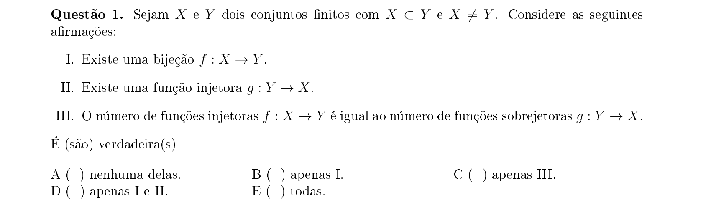

## Q02
**Assunto:** trigonometria
**Competências:** equações trigonométricas, secante, cossecante, domínio em intervalo fechado
**Tipo:** múltipla escolha

## Q03
**Assunto:** progressões
**Competências:** progressão geométrica, progressão aritmética, sistemas com PG e PA, manipulação algébrica
**Tipo:** múltipla escolha

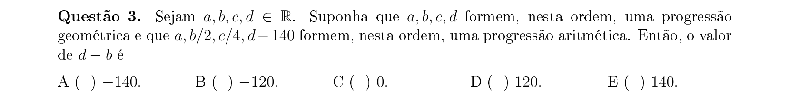

## Q04
**Assunto:** trigonometria
**Competências:** arco-metade, arco seno, tangente, fórmulas de meio-ângulo
**Tipo:** múltipla escolha

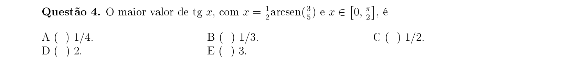

## Q05
**Assunto:** geometria analítica
**Competências:** retas no plano, distância ponto-reta, propriedades do quadrado, área
**Tipo:** múltipla escolha

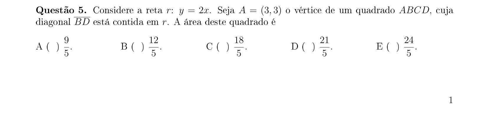

## Q06
**Assunto:** sistemas lineares
**Competências:** sistemas não-lineares com substituição, mudança de variáveis, módulo de número real
**Tipo:** múltipla escolha

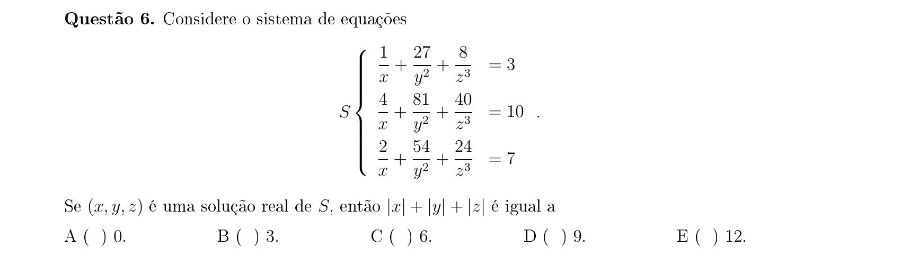

## Q07
**Assunto:** números reais
**Competências:** inequação modular, inequação quadrática, análise por casos, soluções inteiras
**Tipo:** múltipla escolha

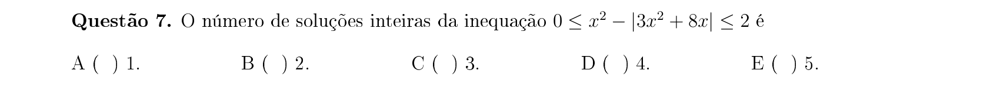

## Q08
**Assunto:** análise combinatória
**Competências:** cardinalidade de conjunto produto, fatoração inteira, contagem de produtos distintos
**Tipo:** múltipla escolha

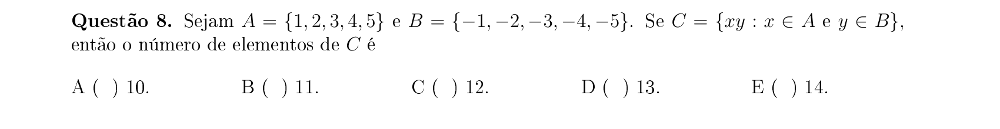

## Q09
**Assunto:** geometria plana
**Competências:** região plana, círculo, função modular, intersecção de regiões, cálculo de área
**Tipo:** múltipla escolha

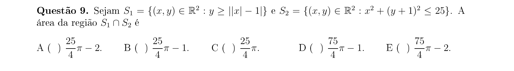

## Q10
**Assunto:** logaritmos
**Competências:** propriedades de logaritmos, mudança de base, identidades exponenciais com log
**Tipo:** múltipla escolha

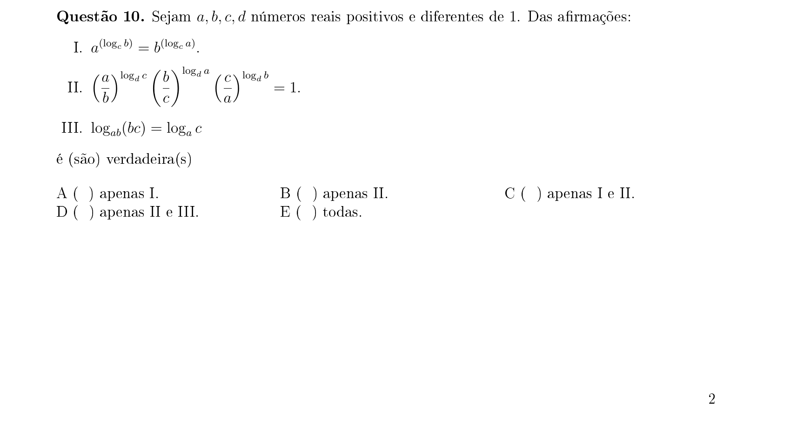

## Q11
**Assunto:** matrizes
**Competências:** matrizes semelhantes, conjugação P⁻¹DP, determinante de produto, autovalores
**Tipo:** múltipla escolha

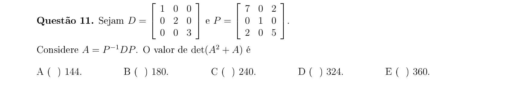

## Q12
**Assunto:** geometria analítica
**Competências:** circunferência, progressão geométrica, distância entre pontos, sistemas com PG
**Tipo:** múltipla escolha

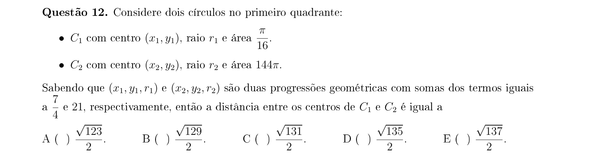

## Q13
**Assunto:** números reais
**Competências:** fatoração única de inteiros, progressão geométrica trigonométrica, irracionalidade de raízes de primos
**Tipo:** múltipla escolha

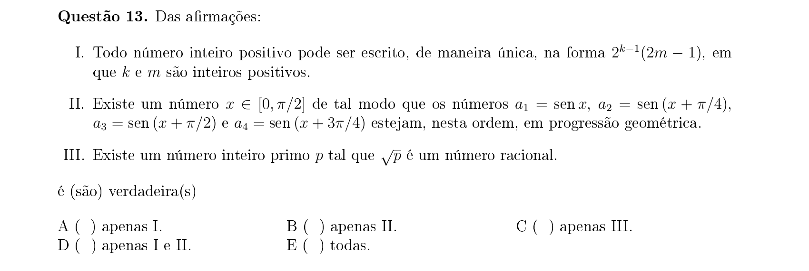

## Q14
**Assunto:** probabilidade
**Competências:** arranjos com repetição, arranjos sem repetição, probabilidade clássica
**Tipo:** múltipla escolha

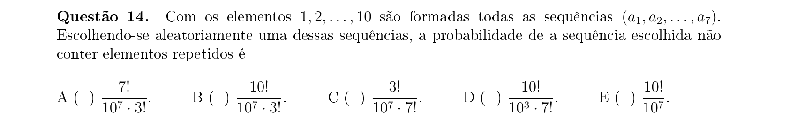

## Q15
**Assunto:** números complexos
**Competências:** módulo de complexo, forma polar, conjugado, equações com complexos
**Tipo:** múltipla escolha

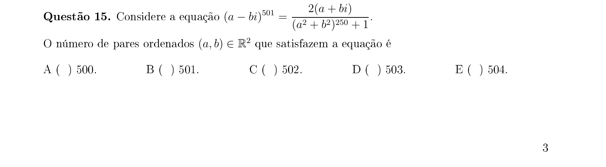

## Q16
**Assunto:** geometria plana
**Competências:** triângulo retângulo, altura relativa à hipotenusa, ponto médio, área de triângulo
**Tipo:** múltipla escolha

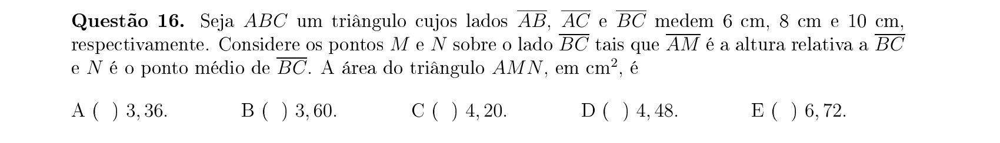

## Q17
**Assunto:** geometria plana
**Competências:** hexágono regular, circunferências tangentes, comprimento de correia, arcos
**Tipo:** múltipla escolha

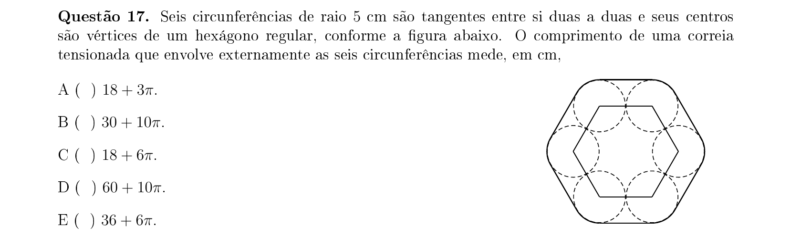

## Q18
**Assunto:** números complexos
**Competências:** raiz puramente imaginária, equação quadrática complexa, lugar geométrico, cônicas
**Tipo:** múltipla escolha

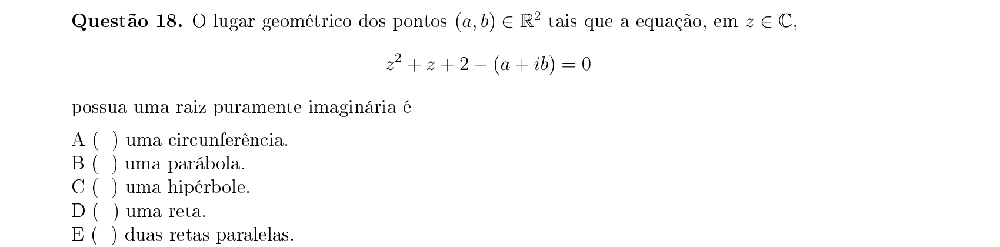

## Q19
**Assunto:** probabilidade
**Competências:** proporcionalidade inversa, probabilidade do complementar, eventos independentes, união de eventos
**Tipo:** múltipla escolha

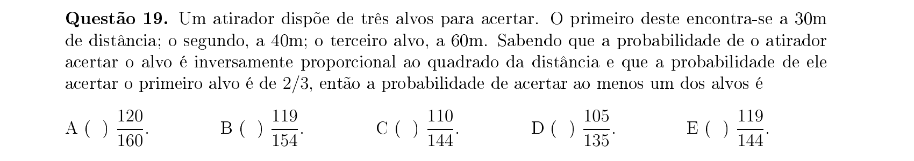

## Q20
**Assunto:** geometria plana
**Competências:** teorema da bissetriz interna, semelhança de triângulos, lei dos cossenos, cálculo de segmento
**Tipo:** múltipla escolha

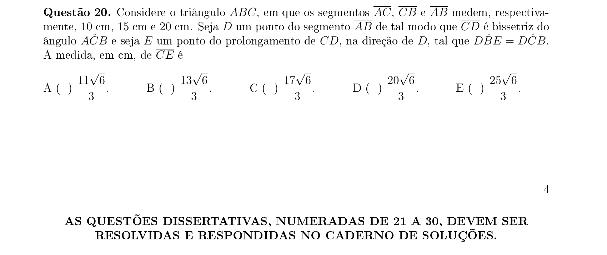

## Q21
**Assunto:** geometria analítica
**Competências:** retas perpendiculares, coeficiente angular, intersecção com eixo x, área de triângulo
**Tipo:** discursiva

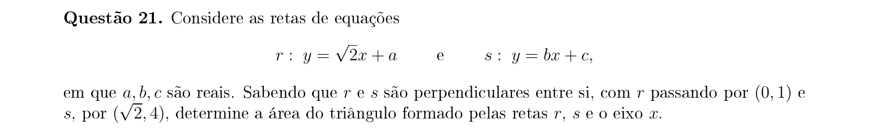

## Q22
**Assunto:** logaritmos
**Competências:** inequação exponencial, logaritmação, comparação de bases, solução em R
**Tipo:** discursiva

## Q23
**Assunto:** polinômios
**Competências:** fatoração de polinômios, identidade de coeficientes, raízes reais, raízes complexas
**Tipo:** discursiva

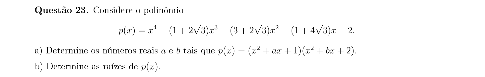

## Q24
**Assunto:** análise combinatória
**Competências:** funções sobrejetoras, princípio da inclusão-exclusão, contagem
**Tipo:** discursiva

## Q25
**Assunto:** progressões
**Competências:** progressão geométrica com termos inteiros, razão racional, divisibilidade, mdc
**Tipo:** discursiva

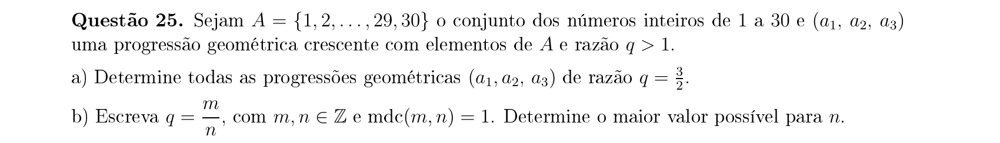

## Q26
**Assunto:** funções
**Competências:** função exponencial, função modular, esboço de gráfico, transformações
**Tipo:** discursiva

## Q27
**Assunto:** sistemas lineares
**Competências:** classificação de sistemas, determinante, sistema impossível, parâmetro
**Tipo:** discursiva

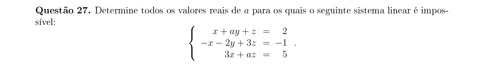

## Q28
**Assunto:** geometria espacial
**Competências:** triângulo retângulo circunscrito, círculo inscrito, cone de revolução, área da superfície
**Tipo:** discursiva

## Q29
**Assunto:** trigonometria
**Competências:** equação trigonométrica, cossecante, tangente, identidades, soluções em R
**Tipo:** discursiva

## Q30
**Assunto:** geometria espacial
**Competências:** cubo, pontos médios, vetores em 3D, área de triângulo no espaço
**Tipo:** discursiva

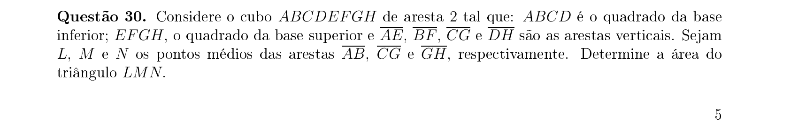
