# Matemática — ITA 2018

> 30 questões. Q01–Q20 múltipla escolha; Q21–Q30 discursivas.

## Q01
**Assunto:** geometria plana
**Competências:** triângulos, circunferência inscrita, pontos de tangência, segmentos tangentes
**Tipo:** múltipla escolha

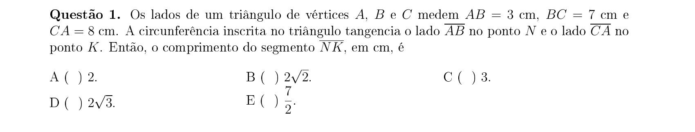

## Q02
**Assunto:** polinômios
**Competências:** redução de potências, relações algébricas, manipulação polinomial
**Tipo:** múltipla escolha

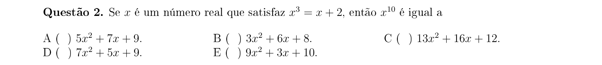

## Q03
**Assunto:** progressões
**Competências:** progressão geométrica, binômio de Newton, termo independente, coeficientes binomiais
**Tipo:** múltipla escolha

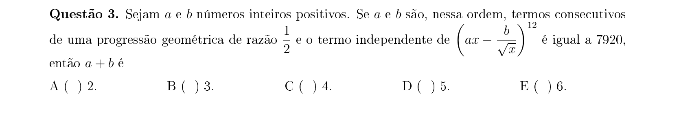

## Q04
**Assunto:** funções
**Competências:** função afim, função inversa, composição de funções, comutatividade
**Tipo:** múltipla escolha

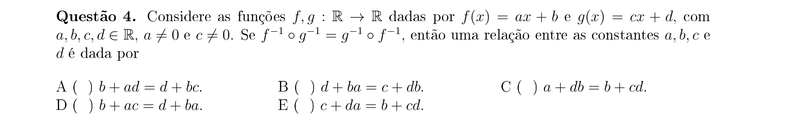

## Q05
**Assunto:** matrizes
**Competências:** característica (posto) de matriz, dependência linear, matrizes especiais
**Tipo:** múltipla escolha

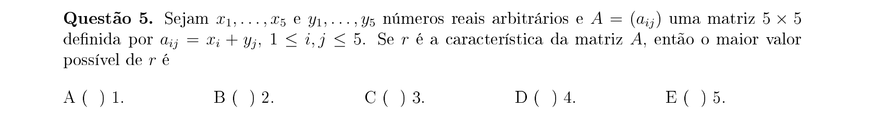

## Q06
**Assunto:** análise combinatória
**Competências:** combinações, contagem de triângulos, contagem de quadriláteros, equações
**Tipo:** múltipla escolha

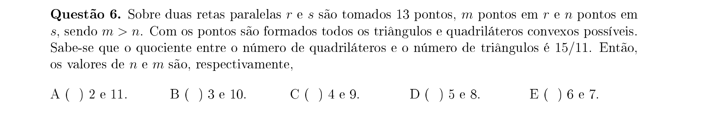

## Q07
**Assunto:** geometria analítica
**Competências:** circunferências no plano, ortogonalidade, tangentes, distância entre centros
**Tipo:** múltipla escolha

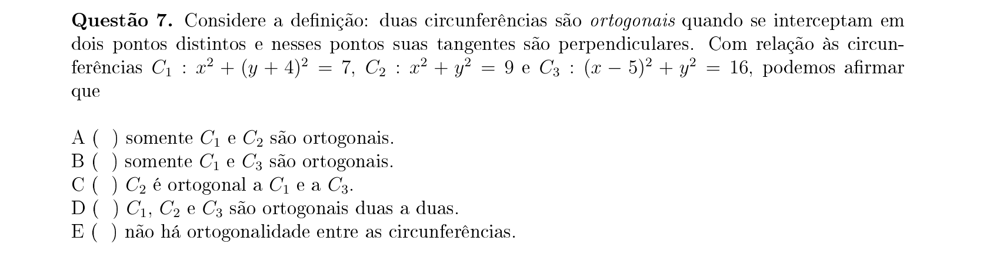

## Q08
**Assunto:** números complexos
**Competências:** raízes da unidade, polígono regular, área de polígono no plano complexo
**Tipo:** múltipla escolha

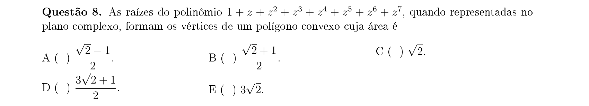

## Q09
**Assunto:** logaritmos
**Competências:** mudança de base, propriedades dos logaritmos, estimativas, desigualdades
**Tipo:** múltipla escolha

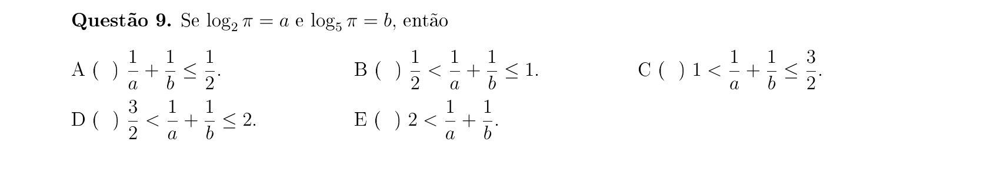

## Q10
**Assunto:** números complexos
**Competências:** equação do 2º grau, discriminante, lugar geométrico, módulo de complexo
**Tipo:** múltipla escolha

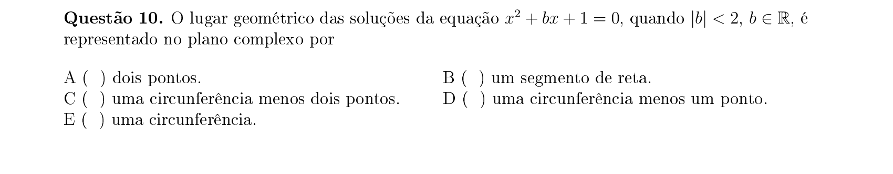

## Q11
**Assunto:** geometria plana
**Competências:** triângulo retângulo, circunferência sobre diâmetro, setor circular, áreas
**Tipo:** múltipla escolha

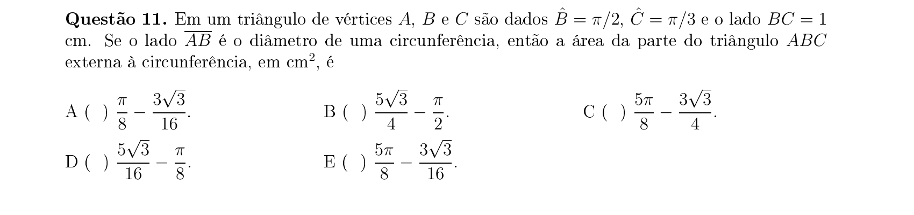

## Q12
**Assunto:** trigonometria
**Competências:** equações trigonométricas, identidades de tangente, fórmula da tangente do triplo, soluções em intervalo
**Tipo:** múltipla escolha

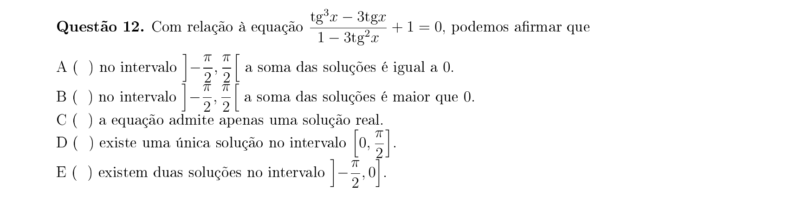

## Q13
**Assunto:** matrizes
**Competências:** álgebra matricial, matrizes inversíveis, comutatividade, demonstrações
**Tipo:** múltipla escolha

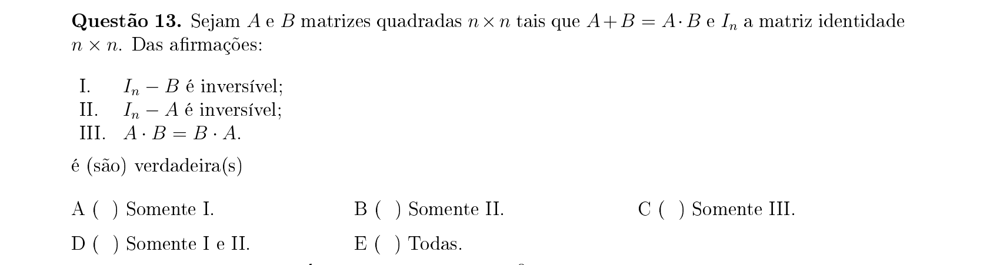

## Q14
**Assunto:** sistemas lineares
**Competências:** sistema homogêneo, infinitas soluções, determinante nulo, parâmetros
**Tipo:** múltipla escolha

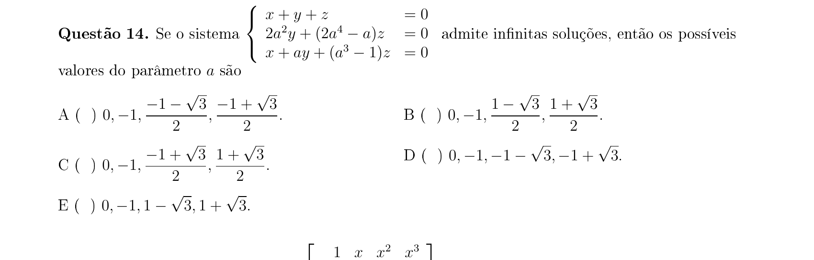

## Q15
**Assunto:** determinantes
**Competências:** determinante com variável, polinômio característico, produto das raízes, relações de Girard
**Tipo:** múltipla escolha

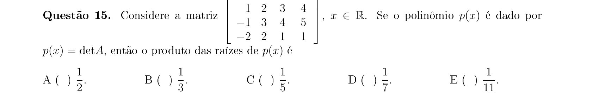

## Q16
**Assunto:** geometria espacial
**Competências:** paralelepípedo, tetraedro inscrito, volume, arestas opostas iguais
**Tipo:** múltipla escolha

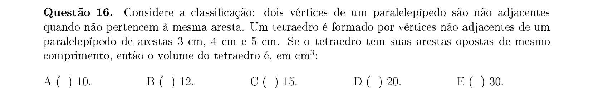

## Q17
**Assunto:** geometria espacial
**Competências:** triângulos equiláteros não coplanares, ponto médio, altura de triângulo, distâncias no espaço
**Tipo:** múltipla escolha

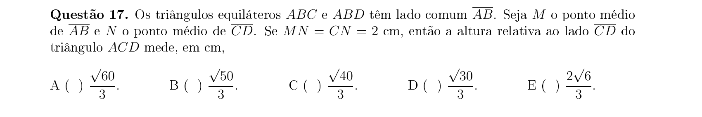

## Q18
**Assunto:** progressões
**Competências:** PA, soma dos termos, termo geral, determinante 3x3
**Tipo:** múltipla escolha

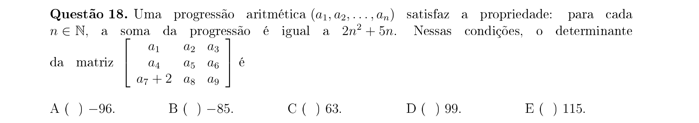

## Q19
**Assunto:** probabilidade
**Competências:** eventos independentes, probabilidade da união, eventos complementares, soma de probabilidades
**Tipo:** múltipla escolha

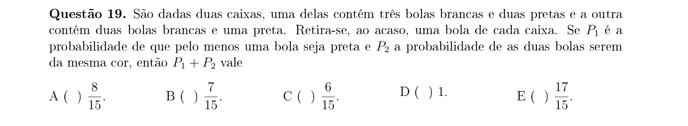

## Q20
**Assunto:** sistemas lineares
**Competências:** sistemas não lineares, equações simétricas, soma e produto, condição de discriminante
**Tipo:** múltipla escolha

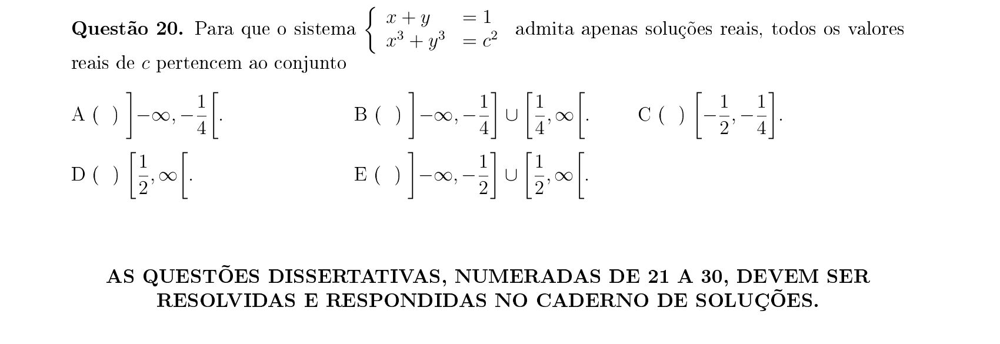

## Q21
**Assunto:** geometria espacial
**Competências:** poliedros convexos, relação de Euler, progressão aritmética, contagem de elementos
**Tipo:** discursiva

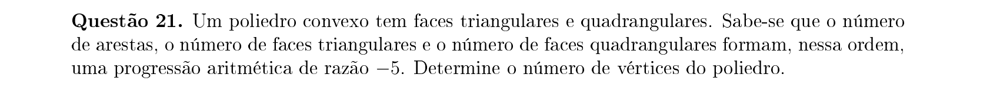

## Q22
**Assunto:** funções
**Competências:** equações exponenciais, inequações, somatório, manipulação algébrica
**Tipo:** discursiva

## Q23
**Assunto:** geometria analítica
**Competências:** circunferências tangentes, distância entre centros, equação da circunferência, ponto pertencente
**Tipo:** discursiva

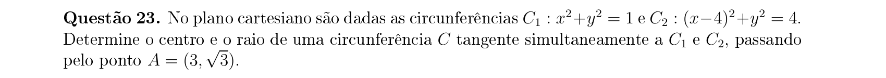

## Q24
**Assunto:** números complexos
**Competências:** forma trigonométrica, fórmula de De Moivre, raízes da unidade, soma de cossenos
**Tipo:** discursiva

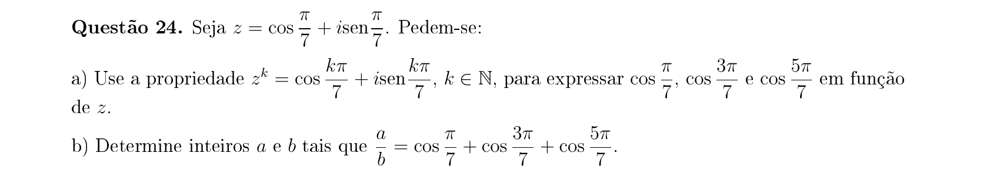

## Q25
**Assunto:** geometria plana
**Competências:** circunferência, corda, distância de ponto a reta, otimização geométrica
**Tipo:** discursiva

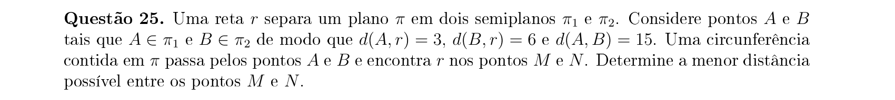

## Q26
**Assunto:** probabilidade
**Competências:** probabilidade hipergeométrica, combinações, identidade de Vandermonde, somatórios
**Tipo:** discursiva

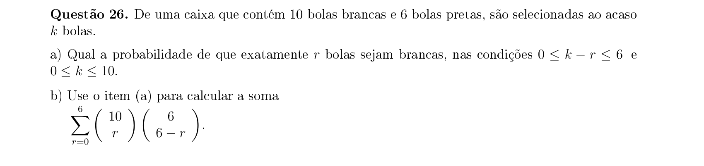

## Q27
**Assunto:** análise combinatória
**Competências:** decomposição em fatores primos, MMC, contagem de divisores, pares ordenados
**Tipo:** discursiva

## Q28
**Assunto:** geometria espacial
**Competências:** pirâmide regular, semelhança de sólidos, volume, círculo inscrito em quadrado
**Tipo:** discursiva

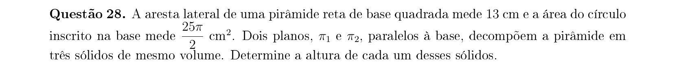

## Q29
**Assunto:** polinômios
**Competências:** divisibilidade de polinômios, MMC de polinômios, fatoração, raízes comuns
**Tipo:** discursiva

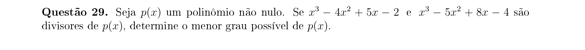

## Q30
**Assunto:** geometria analítica
**Competências:** área de triângulo, equação da reta, divisão de área, interseções no plano
**Tipo:** discursiva

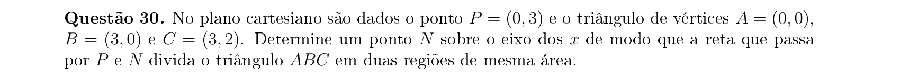
