# Matemática — ITA 2019 (1ª fase)

> 12 questões múltipla escolha.

## Q37
**Assunto:** geometria plana
**Competências:** retângulo; tangente de ângulo entre segmentos
**Tipo:** múltipla escolha

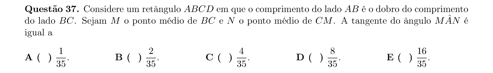

## Q38
**Assunto:** polinômios
**Competências:** raízes em PA; soma de coeficientes
**Tipo:** múltipla escolha

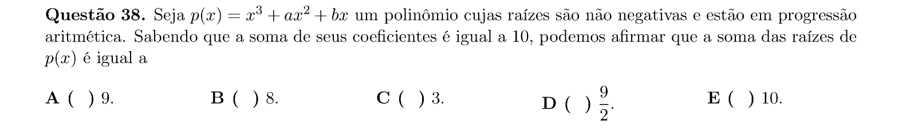

## Q39
**Assunto:** geometria analítica
**Competências:** circunferência; retas tangentes; cosseno do ângulo
**Tipo:** múltipla escolha

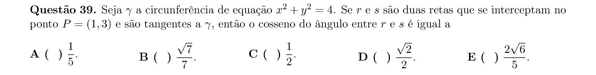

## Q40
**Assunto:** geometria espacial
**Competências:** cone circular reto; planificação; altura
**Tipo:** múltipla escolha

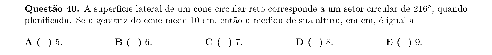

## Q41
**Assunto:** matrizes
**Competências:** lugar geométrico de pares (a,b) que tornam sistema impossível
**Tipo:** múltipla escolha

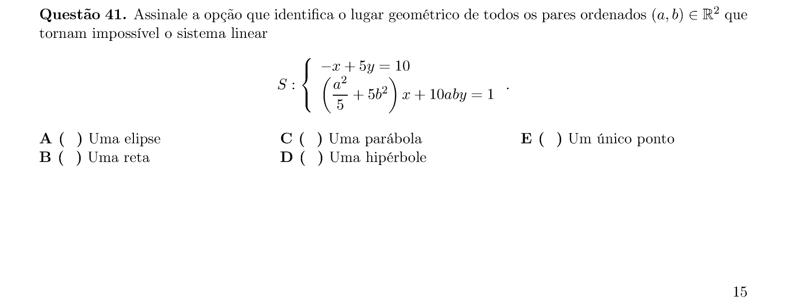

## Q42
**Assunto:** números complexos
**Competências:** raízes n-ésimas; área de triângulo no plano de Argand-Gauss
**Tipo:** múltipla escolha

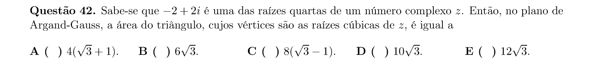

## Q43
**Assunto:** sequências e progressões
**Competências:** somas; equações; PA com raízes
**Tipo:** múltipla escolha

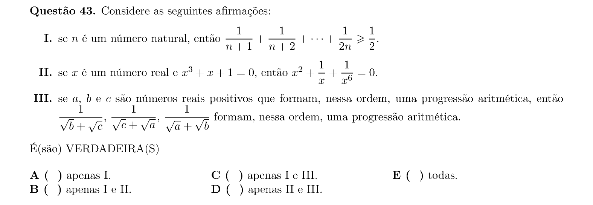

## Q44
**Assunto:** combinatória
**Competências:** lançamentos de moedas numeradas; probabilidade de soma
**Tipo:** múltipla escolha

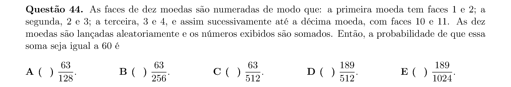

## Q45
**Assunto:** matrizes
**Competências:** matrizes inversíveis com elementos inteiros; propriedades
**Tipo:** múltipla escolha

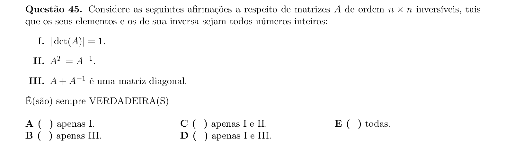

## Q46
**Assunto:** funções
**Competências:** arcsen; soma de série envolvendo cosseno
**Tipo:** múltipla escolha

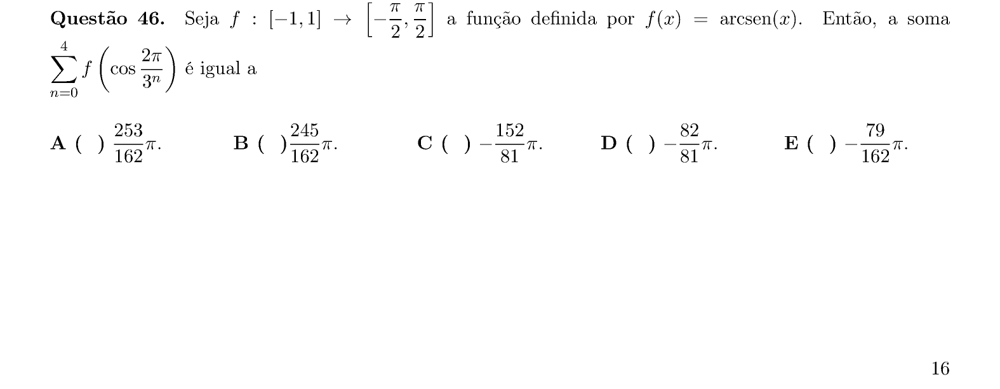

## Q47
**Assunto:** geometria espacial
**Competências:** volumes em PA; tronco de cone, esfera, cilindro
**Tipo:** múltipla escolha

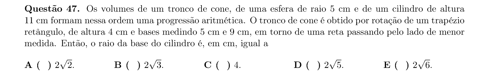

## Q48
**Assunto:** polinômios
**Competências:** raízes de equação cúbica; divisibilidade; afirmações
**Tipo:** múltipla escolha

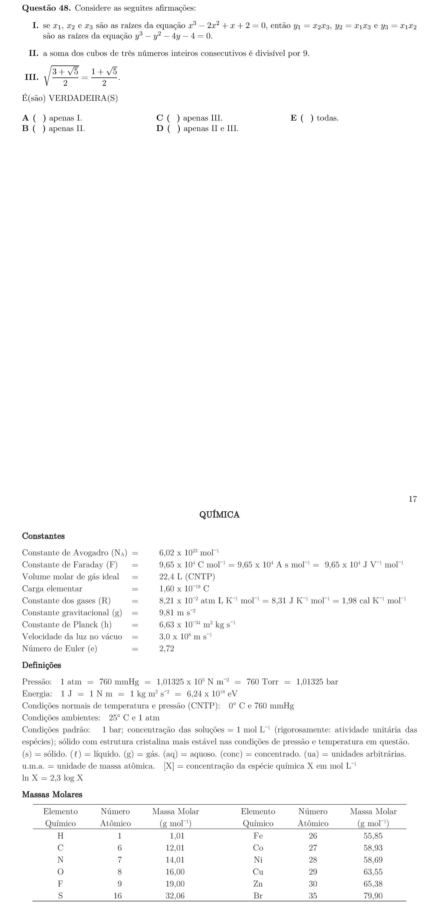
