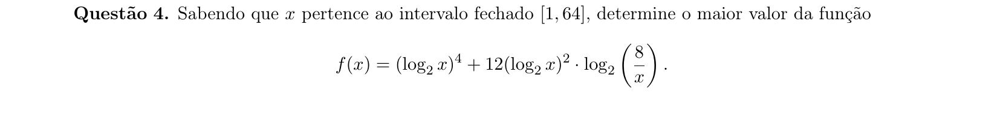
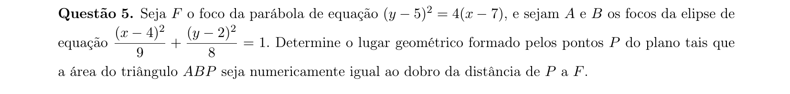
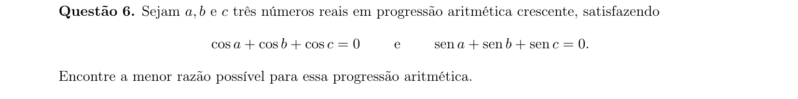
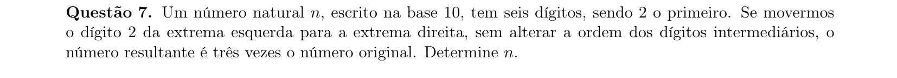
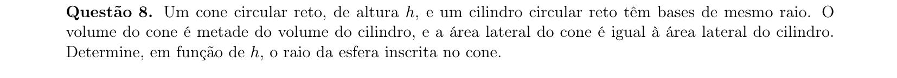
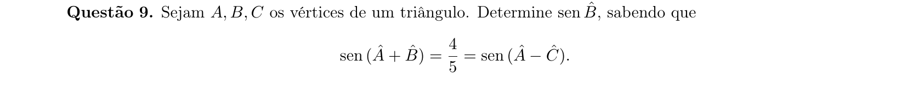
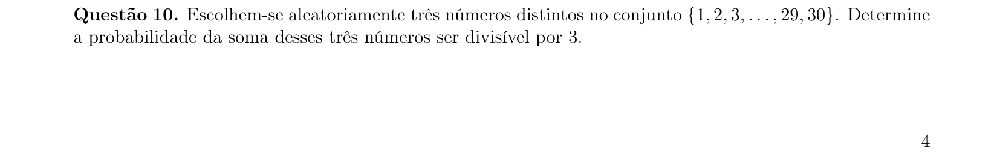

# Matemática — ITA 2019 (2ª fase)

> 10 questões discursivas.

## Q01
**Assunto:** polinômios
**Competências:** raízes comuns de polinômios, relações de Girard, fatoração, sistemas com parâmetros
**Tipo:** discursiva

## Q02
**Assunto:** trigonometria
**Competências:** identidades trigonométricas, potências de seno e cosseno, equações trigonométricas, arco duplo
**Tipo:** discursiva

## Q03
**Assunto:** números complexos
**Competências:** módulo e argumento, lugar geométrico no plano complexo, geometria do disco, otimização do argumento
**Tipo:** discursiva

## Q04
**Assunto:** logaritmos
**Competências:** propriedades de logaritmos, mudança de variável, otimização em intervalo fechado, análise de funções polinomiais
**Tipo:** discursiva

## Q05
**Assunto:** geometria analítica
**Competências:** parábola e foco, elipse e focos, lugar geométrico, área de triângulo via coordenadas
**Tipo:** discursiva

## Q06
**Assunto:** progressões
**Competências:** progressão aritmética, soma de senos e cossenos, identidades trigonométricas, raízes de equações trigonométricas
**Tipo:** discursiva

## Q07
**Assunto:** números reais
**Competências:** representação posicional na base 10, manipulação algébrica de dígitos, equações diofantinas, divisibilidade
**Tipo:** discursiva

## Q08
**Assunto:** geometria espacial
**Competências:** volume de cone e cilindro, área lateral, esfera inscrita em cone, relações métricas
**Tipo:** discursiva

## Q09
**Assunto:** trigonometria
**Competências:** soma de ângulos em triângulo, identidades de seno da soma e diferença, lei dos senos, resolução de equações trigonométricas
**Tipo:** discursiva

## Q10
**Assunto:** probabilidade
**Competências:** análise combinatória, contagem por classes de resto, probabilidade em conjuntos finitos, divisibilidade
**Tipo:** discursiva

