# Matemática — ITA 2020 (1ª fase)

> 15 questões múltipla escolha.

## Q41
**Assunto:** funções
**Competências:** produto de logaritmos encadeados; mudança de base
**Tipo:** múltipla escolha

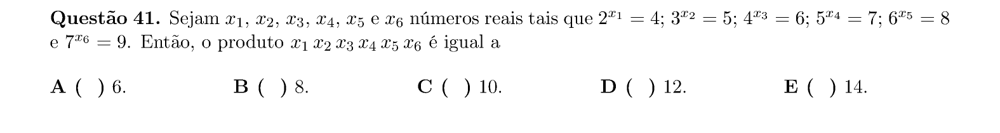

## Q42
**Assunto:** sequências e progressões
**Competências:** PG e relação pitagórica; razão e soma de valores
**Tipo:** múltipla escolha

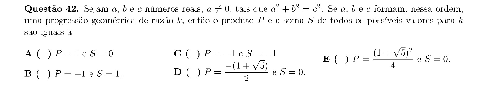

## Q43
**Assunto:** números complexos
**Competências:** parte real de soma infinita de PG complexa
**Tipo:** múltipla escolha

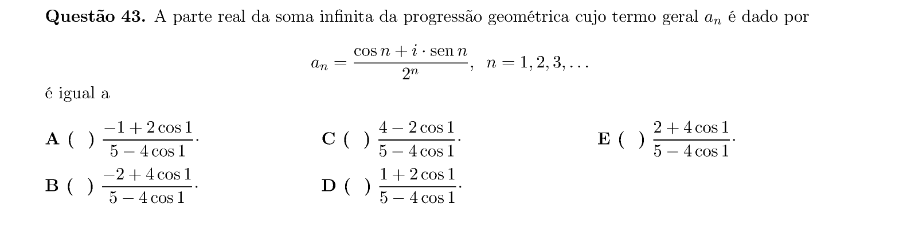

## Q44
**Assunto:** geometria analítica
**Competências:** interseções de cônicas com eixos; área de quadrilátero
**Tipo:** múltipla escolha

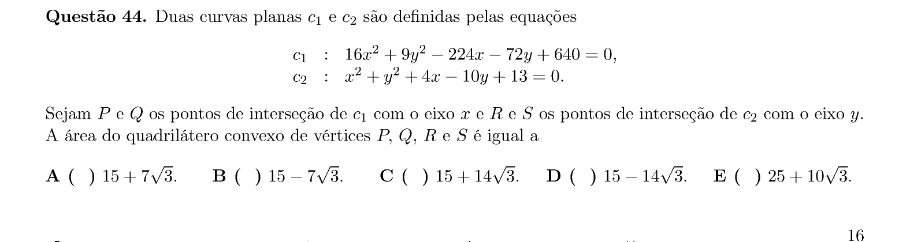

## Q45
**Assunto:** combinatória
**Competências:** problema de contagem com pacotes de velas; progressões
**Tipo:** múltipla escolha

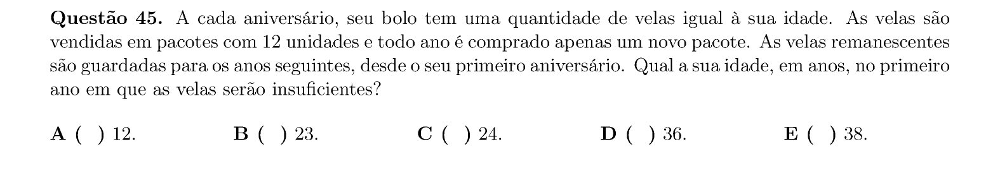

## Q46
**Assunto:** geometria plana
**Competências:** circunferência, secantes e ângulos inscritos
**Tipo:** múltipla escolha

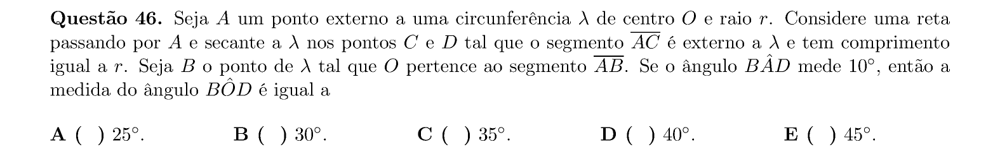

## Q47
**Assunto:** trigonometria
**Competências:** equação trigonométrica; soma de soluções em [0,2π]
**Tipo:** múltipla escolha

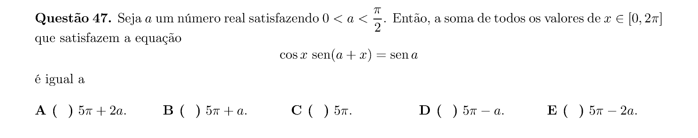

## Q48
**Assunto:** polinômios
**Competências:** raízes de polinômio com relação entre parte real e imaginária
**Tipo:** múltipla escolha

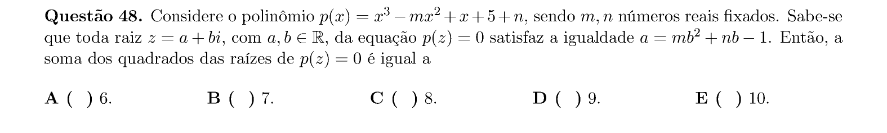

## Q49
**Assunto:** teoria dos números
**Competências:** fatorial; contagem de zeros à direita; expoente de 5 em 100!
**Tipo:** múltipla escolha

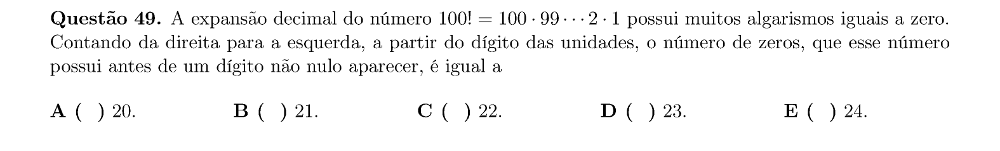

## Q50
**Assunto:** polinômios
**Competências:** divisibilidade; relações de Girard; valor de polinômio
**Tipo:** múltipla escolha

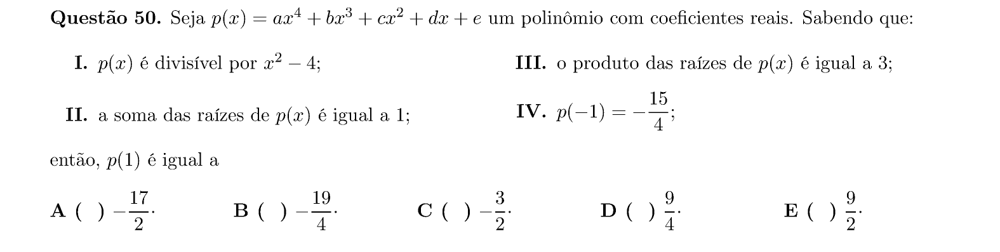

## Q51
**Assunto:** geometria analítica
**Competências:** triângulo isósceles; raio inscrito; coordenadas de vértice
**Tipo:** múltipla escolha

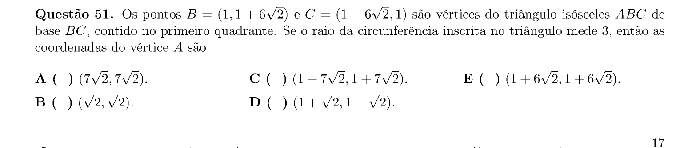

## Q52
**Assunto:** números reais
**Competências:** análise de afirmações sobre racionalidade de a, p, q
**Tipo:** múltipla escolha

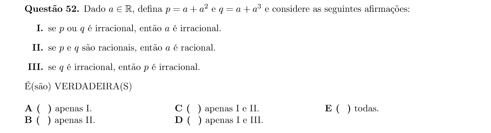

## Q53
**Assunto:** geometria espacial
**Competências:** relação de Euler; ângulos das faces; existência de poliedros
**Tipo:** múltipla escolha

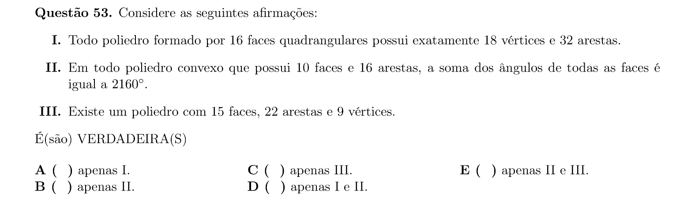

## Q54
**Assunto:** geometria espacial
**Competências:** retas, planos e projeções ortogonais no espaço
**Tipo:** múltipla escolha

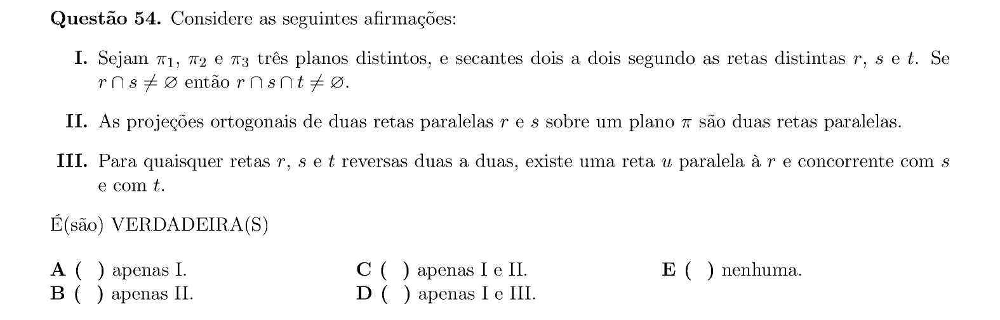

## Q55
**Assunto:** combinatória
**Competências:** matrizes nilpotentes; probabilidade de L² = 0 e R² = 0
**Tipo:** múltipla escolha

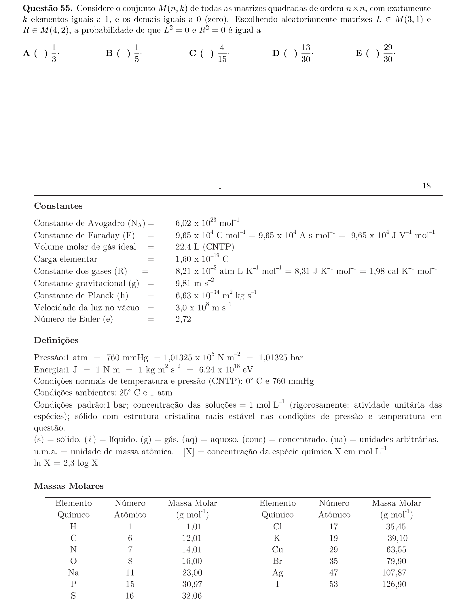
