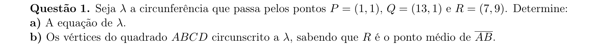
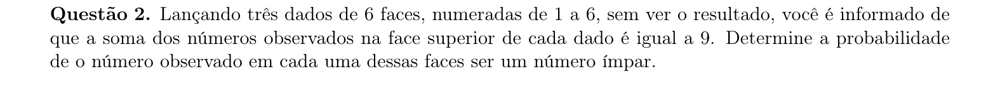
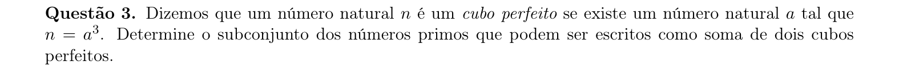
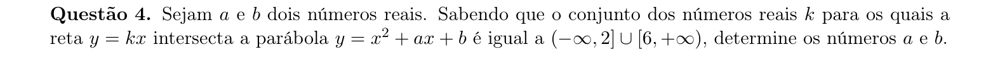
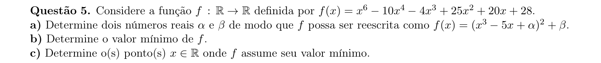
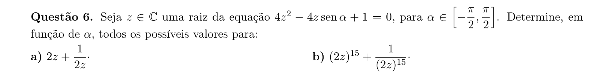
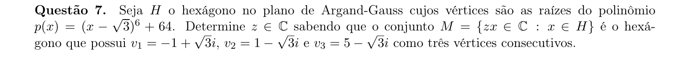
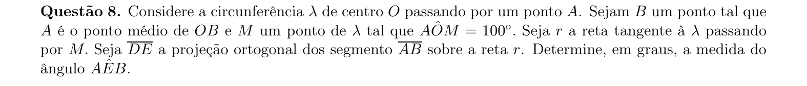
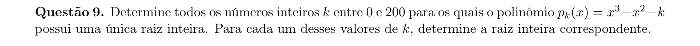
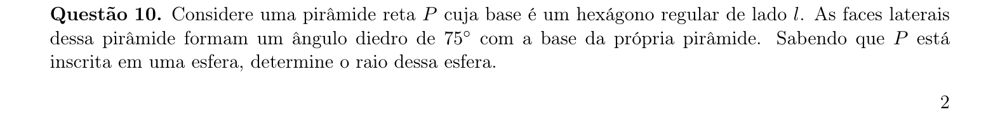

# Matemática — ITA 2020 (2ª fase)

> 10 questões discursivas.

## Q01
**Assunto:** geometria analítica
**Competências:** equação da circunferência, três pontos, quadrado circunscrito, ponto médio
**Tipo:** discursiva

## Q02
**Assunto:** probabilidade
**Competências:** probabilidade condicional, espaço amostral, lançamento de dados, contagem de casos favoráveis
**Tipo:** discursiva

## Q03
**Assunto:** números reais
**Competências:** números primos, soma de cubos, fatoração, teoria dos números
**Tipo:** discursiva

## Q04
**Assunto:** funções
**Competências:** parábola, intersecção reta-parábola, discriminante, inequação do 2º grau
**Tipo:** discursiva

## Q05
**Assunto:** polinômios
**Competências:** fatoração, quadrado perfeito, valor mínimo de função, derivada/raízes
**Tipo:** discursiva

## Q06
**Assunto:** números complexos
**Competências:** equação quadrática complexa, forma trigonométrica, fórmula de De Moivre, potências de z
**Tipo:** discursiva

## Q07
**Assunto:** números complexos
**Competências:** plano de Argand-Gauss, raízes de polinômio, hexágono regular, transformações no plano complexo
**Tipo:** discursiva

## Q08
**Assunto:** geometria plana
**Competências:** circunferência, tangente, ângulo central, projeção ortogonal, ângulo inscrito
**Tipo:** discursiva

## Q09
**Assunto:** polinômios
**Competências:** raízes inteiras, teorema das raízes racionais, divisibilidade, contagem
**Tipo:** discursiva

## Q10
**Assunto:** geometria espacial
**Competências:** pirâmide reta, hexágono regular, ângulo diedro, esfera circunscrita, raio
**Tipo:** discursiva

