# Matemática — ITA 2021 (1ª fase)

> 15 questões múltipla escolha.

## Q41
**Assunto:** álgebra linear, matrizes
**Competências:** matrizes simétricas e antissimétricas, comutatividade, determinante
**Tipo:** múltipla escolha

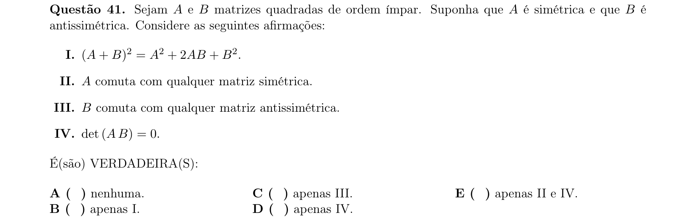

## Q42
**Assunto:** inequações
**Competências:** inequação racional/polinomial, conjunto solução em R
**Tipo:** múltipla escolha

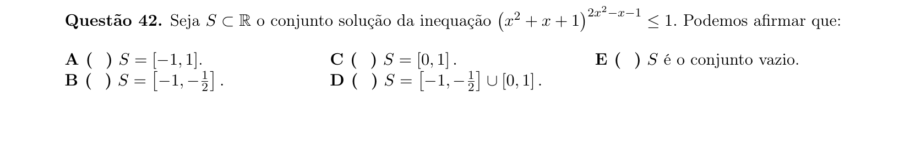

## Q43
**Assunto:** geometria analítica
**Competências:** triângulo isósceles inscrito em circunferência, cálculo de área
**Tipo:** múltipla escolha

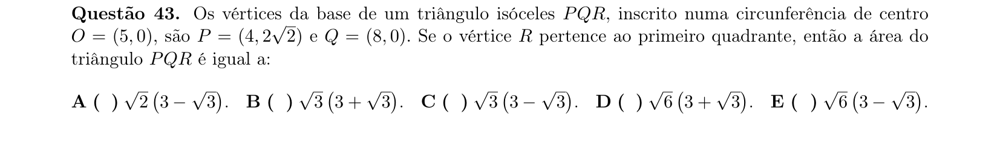

## Q44
**Assunto:** geometria analítica, cônicas
**Competências:** elipse, retângulo circunscrito, circunferência circunscrita ao retângulo
**Tipo:** múltipla escolha

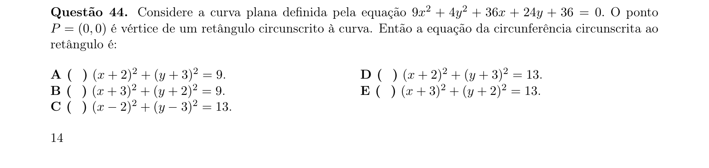

## Q45
**Assunto:** trigonometria, geometria plana
**Competências:** lei dos cossenos, área de triângulo, raio da circunferência inscrita
**Tipo:** múltipla escolha

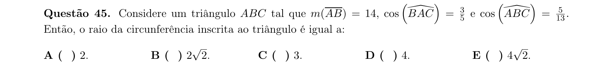

## Q46
**Assunto:** funções
**Competências:** interseções entre reta y=kx e união dos gráficos de 2^x, 2^-x e log2 x
**Tipo:** múltipla escolha

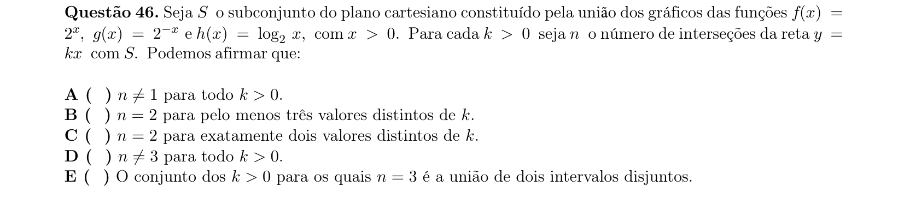

## Q47
**Assunto:** equações exponenciais
**Competências:** equação 7^x = 5^(9x-1), localização da solução em intervalo
**Tipo:** múltipla escolha

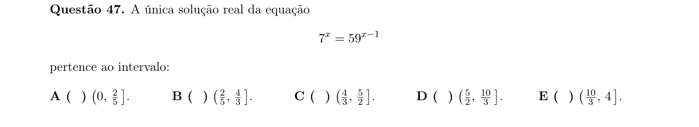

## Q48
**Assunto:** álgebra linear, matrizes
**Competências:** matriz 2x2 atuando em vetores, traço da matriz
**Tipo:** múltipla escolha

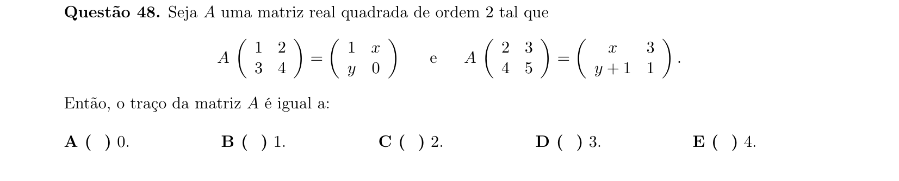

## Q49
**Assunto:** progressões aritméticas, geometria plana
**Competências:** triângulos com lados em PA, perímetro fixo, desigualdade triangular
**Tipo:** múltipla escolha

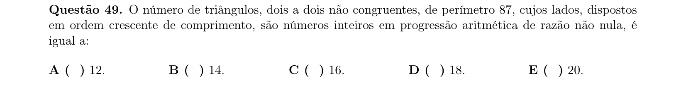

## Q50
**Assunto:** geometria plana
**Competências:** quadrilátero convexo, propriedades de diagonais, losango, paralelogramo, retângulo
**Tipo:** múltipla escolha

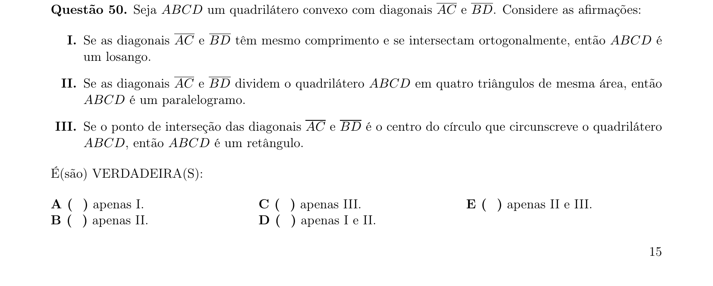

## Q51
**Assunto:** geometria espacial
**Competências:** ângulos entre retas e planos, perpendicularidade, equidistância
**Tipo:** múltipla escolha

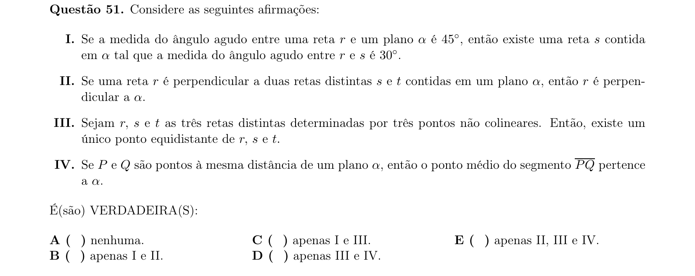

## Q52
**Assunto:** probabilidade, geometria espacial
**Competências:** dodecaedro regular, probabilidade de dois vértices pertencerem à mesma aresta
**Tipo:** múltipla escolha

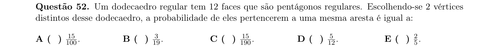

## Q53
**Assunto:** análise combinatória
**Competências:** distribuição de balas com restrições, contagem combinatória
**Tipo:** múltipla escolha

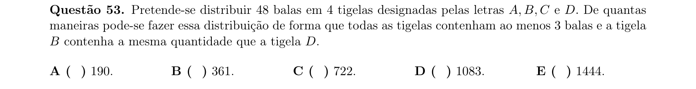

## Q54
**Assunto:** números complexos
**Competências:** triângulo equilátero no plano complexo, comprimento do lado
**Tipo:** múltipla escolha

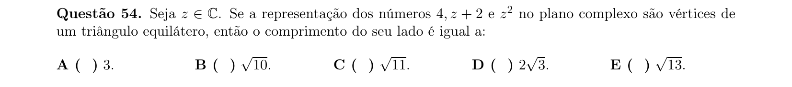

## Q55
**Assunto:** polinômios
**Competências:** polinômio com coeficientes inteiros, congruências, p(51) e p(3)
**Tipo:** múltipla escolha

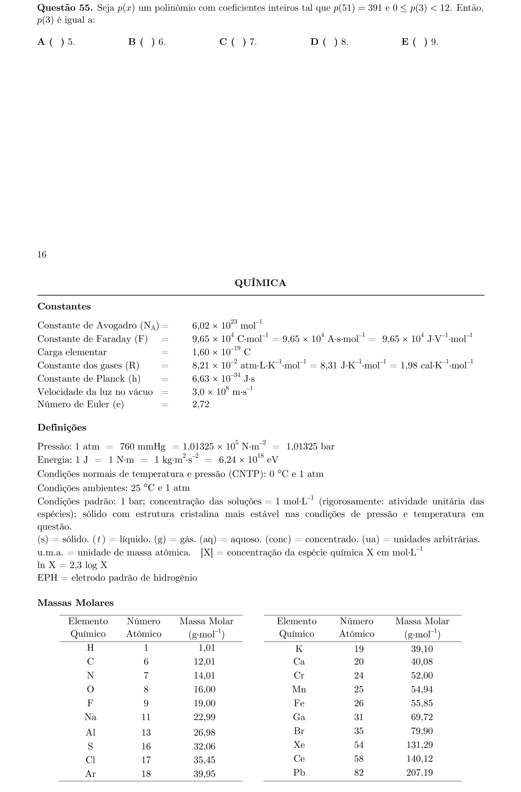
