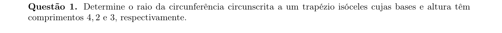
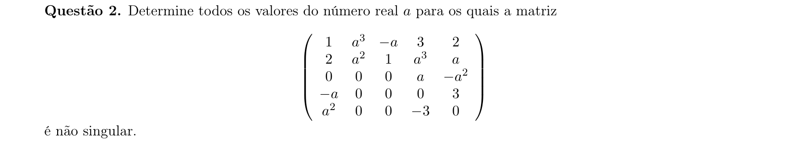
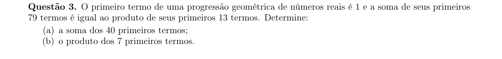
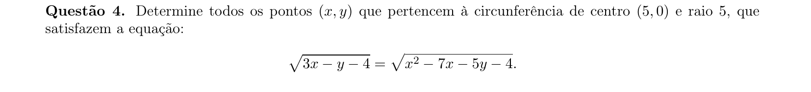
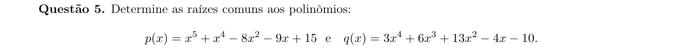
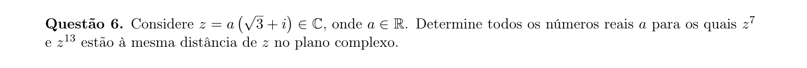
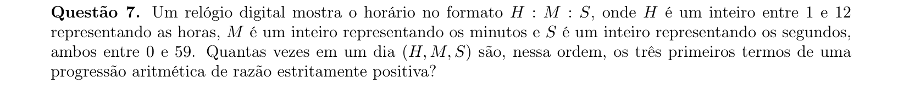
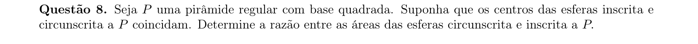
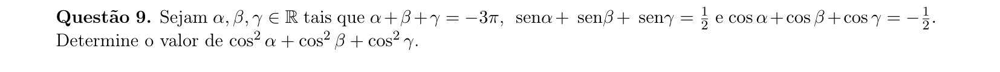
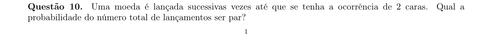

# Matemática — ITA 2021 (2ª fase)

> 10 questões discursivas.

## Q01
**Assunto:** geometria plana
**Competências:** trapézio isósceles, circunferência circunscrita, raio, relações métricas
**Tipo:** discursiva

## Q02
**Assunto:** determinantes
**Competências:** matriz não singular, cálculo de determinante, expansão de Laplace, parâmetro real
**Tipo:** discursiva

## Q03
**Assunto:** progressões
**Competências:** progressão geométrica, soma de termos, produto de termos, manipulação algébrica
**Tipo:** discursiva

## Q04
**Assunto:** geometria analítica
**Competências:** circunferência, equação irracional, sistema de equações, interseção
**Tipo:** discursiva

## Q05
**Assunto:** polinômios
**Competências:** raízes comuns, MDC de polinômios, fatoração, divisão polinomial
**Tipo:** discursiva

## Q06
**Assunto:** números complexos
**Competências:** forma polar, módulo, potências de complexo, equidistância
**Tipo:** discursiva

## Q07
**Assunto:** análise combinatória
**Competências:** contagem, progressão aritmética, restrições inteiras, casos
**Tipo:** discursiva

## Q08
**Assunto:** geometria espacial
**Competências:** pirâmide regular, esfera inscrita, esfera circunscrita, razão de áreas
**Tipo:** discursiva

## Q09
**Assunto:** trigonometria
**Competências:** soma de senos e cossenos, identidades trigonométricas, manipulação algébrica
**Tipo:** discursiva

## Q10
**Assunto:** probabilidade
**Competências:** série geométrica, esperança, paridade, eventos sucessivos
**Tipo:** discursiva

