# Matemática — ITA 2022 (1ª fase)

> 15 questões múltipla escolha.

## Q41
**Assunto:** logaritmos
**Competências:** propriedades de logaritmo, mudança de base, soma de logs em bases distintas
**Tipo:** múltipla escolha

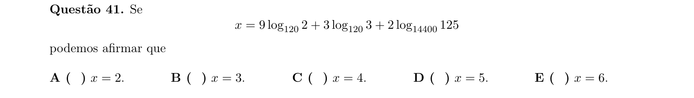

## Q42
**Assunto:** geometria plana
**Competências:** triângulo retângulo, ponto equidistante de dois pontos, distância a reta
**Tipo:** múltipla escolha

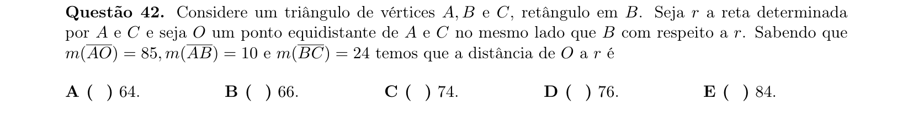

## Q43
**Assunto:** álgebra linear
**Competências:** sistemas lineares equivalentes, parâmetro real, equivalência de soluções
**Tipo:** múltipla escolha

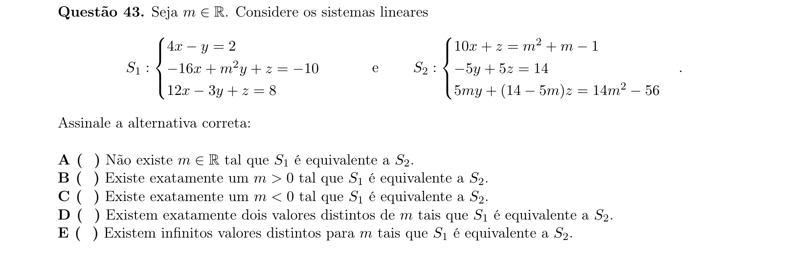

## Q44
**Assunto:** números complexos
**Competências:** condições para z1 e z2 serem reais, soma, produto e quociente reais
**Tipo:** múltipla escolha

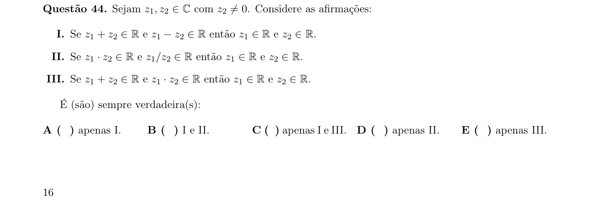

## Q45
**Assunto:** polinômios, números complexos
**Competências:** raízes de polinômio de grau 4 no plano complexo, área de quadrilátero
**Tipo:** múltipla escolha

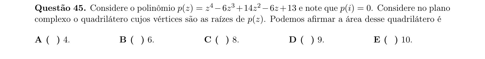

## Q46
**Assunto:** álgebra linear, matrizes
**Competências:** invertibilidade, comutatividade, transposta vs quadrado, determinante
**Tipo:** múltipla escolha

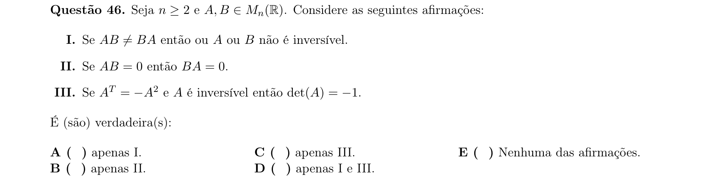

## Q47
**Assunto:** trigonometria, progressões
**Competências:** tangente, progressão aritmética com tan(x-r), tan(x), tan(x+r)
**Tipo:** múltipla escolha

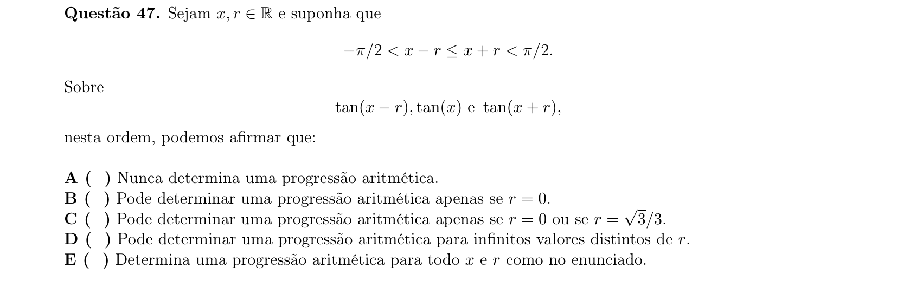

## Q48
**Assunto:** geometria analítica
**Competências:** cônicas, hipérbole, centro em região do plano, condição sobre parâmetro
**Tipo:** múltipla escolha

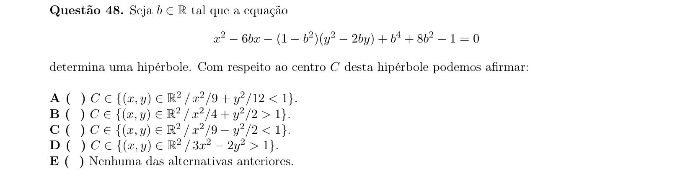

## Q49
**Assunto:** geometria espacial
**Competências:** pirâmide regular hexagonal inscrita em cubo, esfera circunscrita, raio
**Tipo:** múltipla escolha

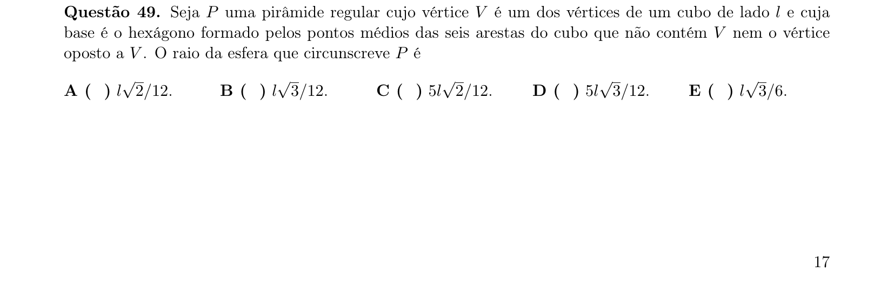

## Q50
**Assunto:** geometria espacial
**Competências:** planos paralelos, equidistância no espaço, ponto equidistante de quatro pontos
**Tipo:** múltipla escolha

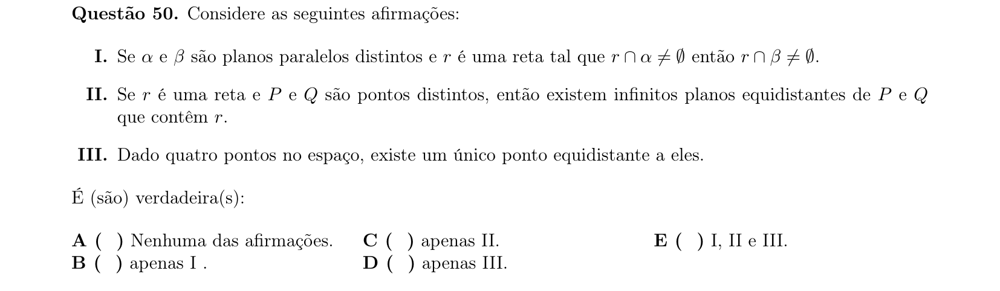

## Q51
**Assunto:** combinatória, probabilidade
**Competências:** representação binária, mudança no número de algarismos, probabilidade
**Tipo:** múltipla escolha

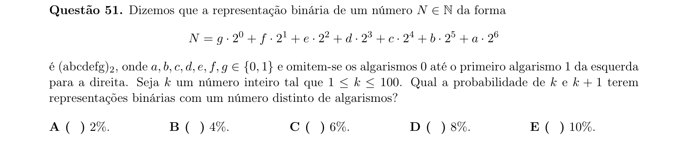

## Q52
**Assunto:** combinatória, geometria espacial
**Competências:** retas determinadas por vértices de cubo, probabilidade de interseção em vértice
**Tipo:** múltipla escolha

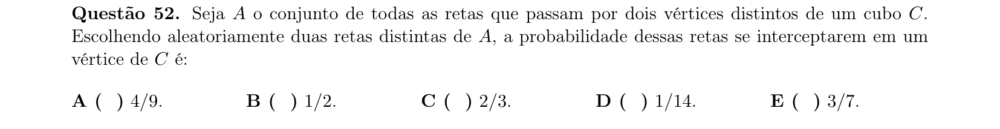

## Q53
**Assunto:** trigonometria, geometria
**Competências:** ângulos internos de triângulo, desigualdade trigonométrica, classificação
**Tipo:** múltipla escolha

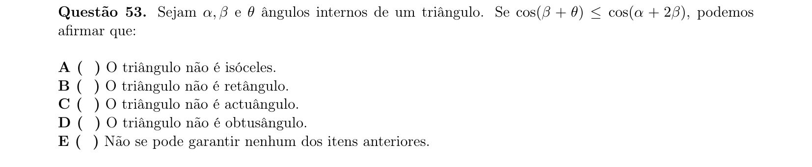

## Q54
**Assunto:** trigonometria
**Competências:** equação trigonométrica com cos²(2x), cos⁶(x), número de soluções em [0,2π[
**Tipo:** múltipla escolha

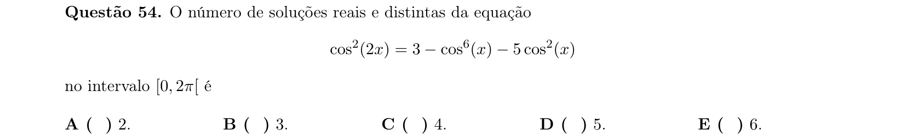

## Q55
**Assunto:** geometria plana
**Competências:** triângulo inscrito em circunferência, lei dos senos, ângulo agudo
**Tipo:** múltipla escolha

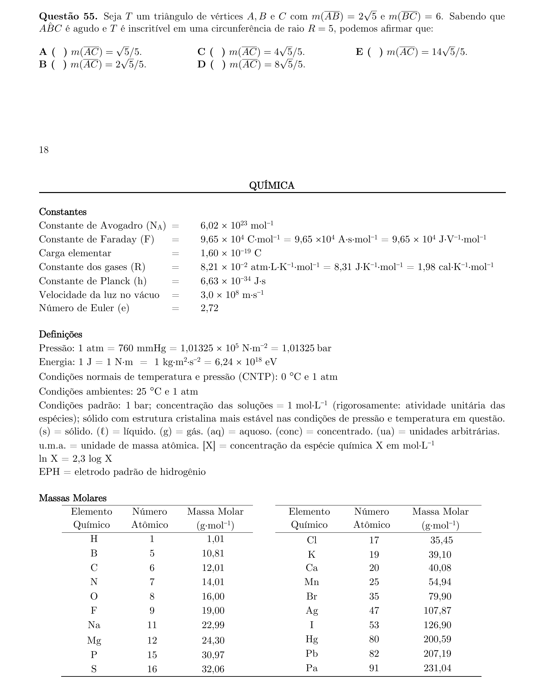
