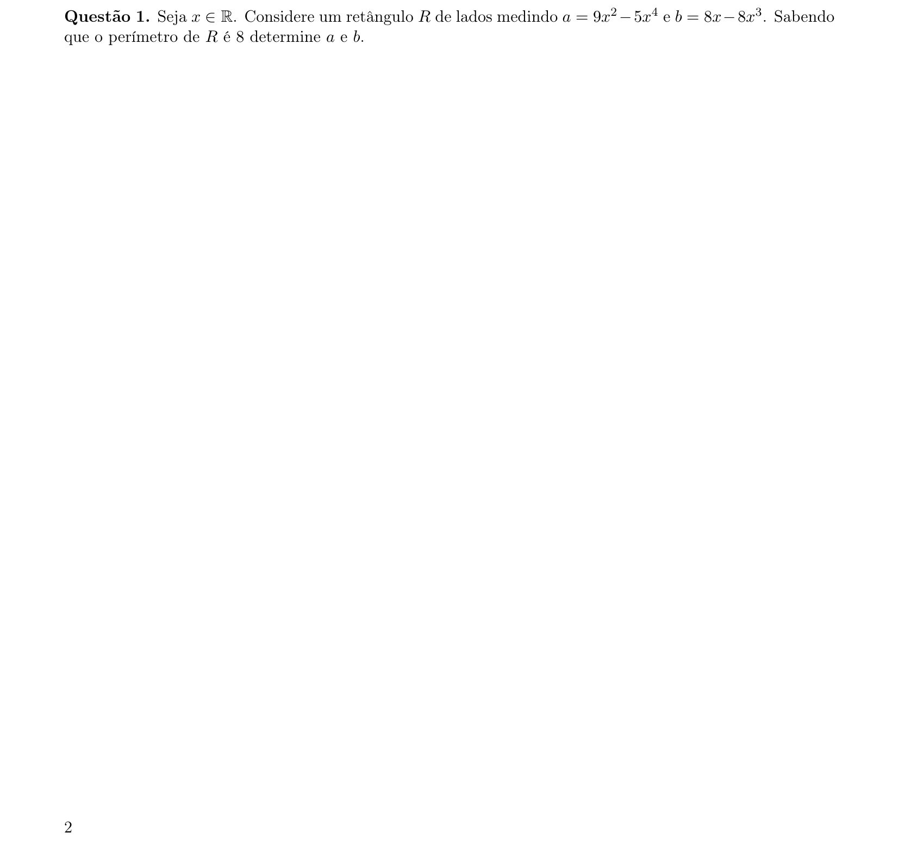
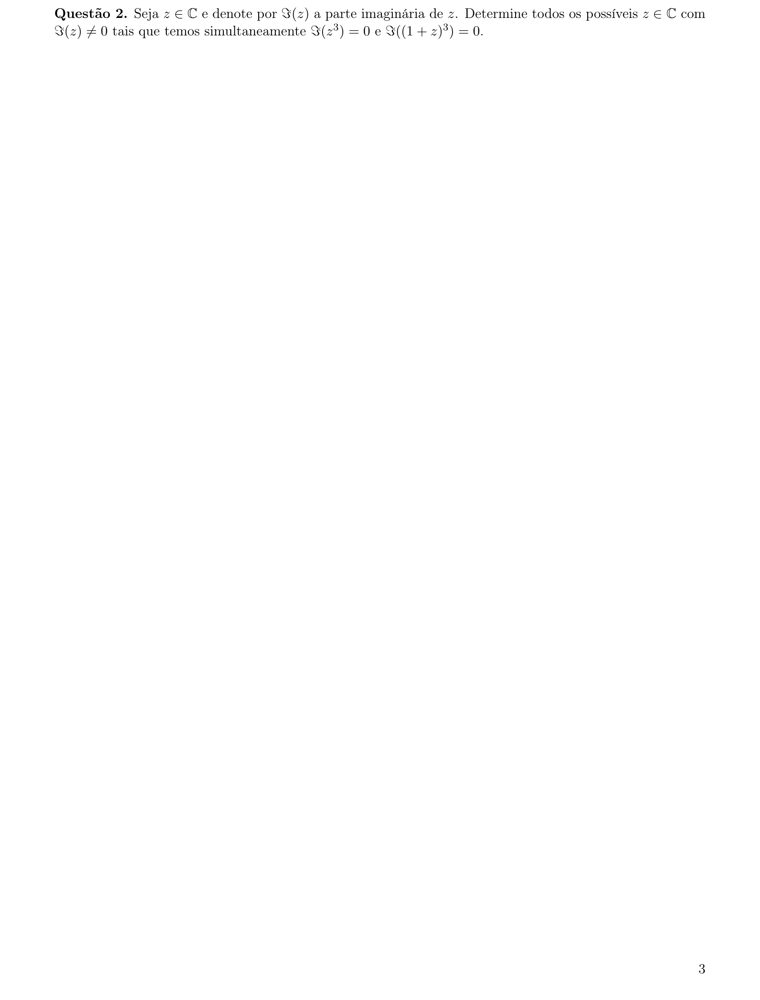
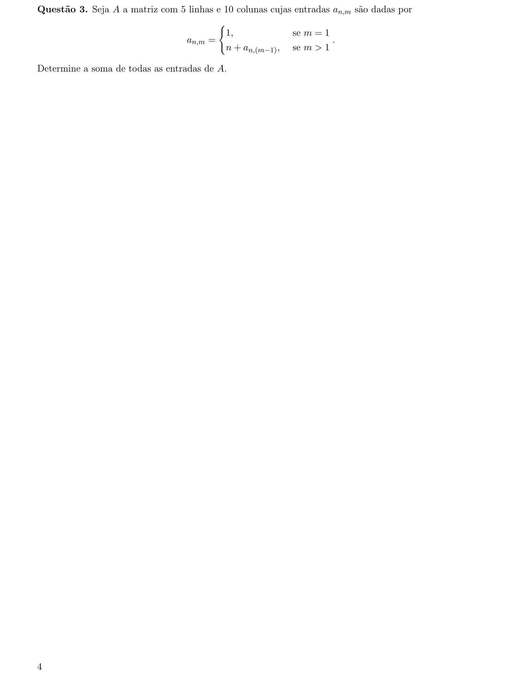
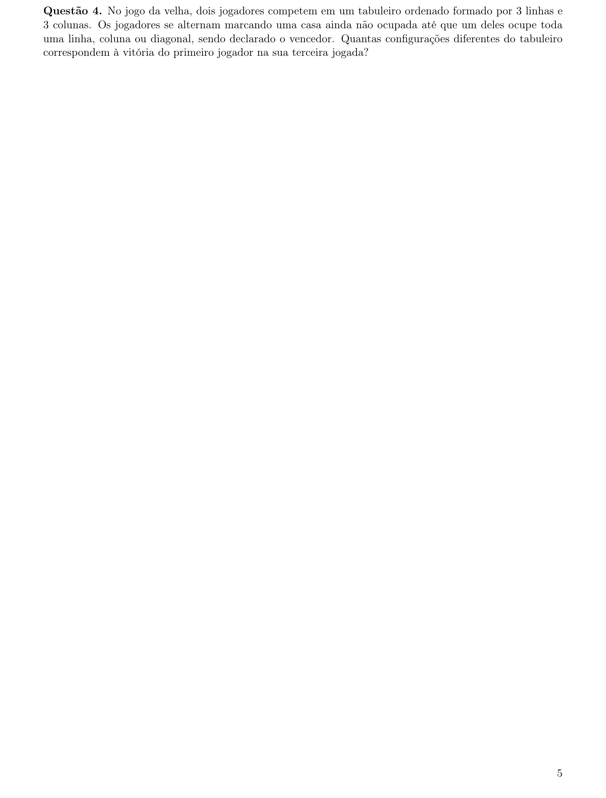
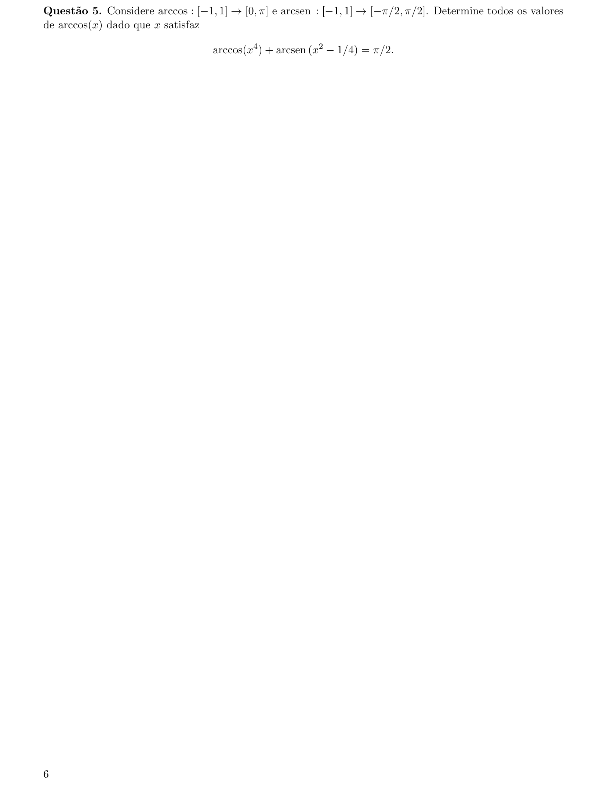
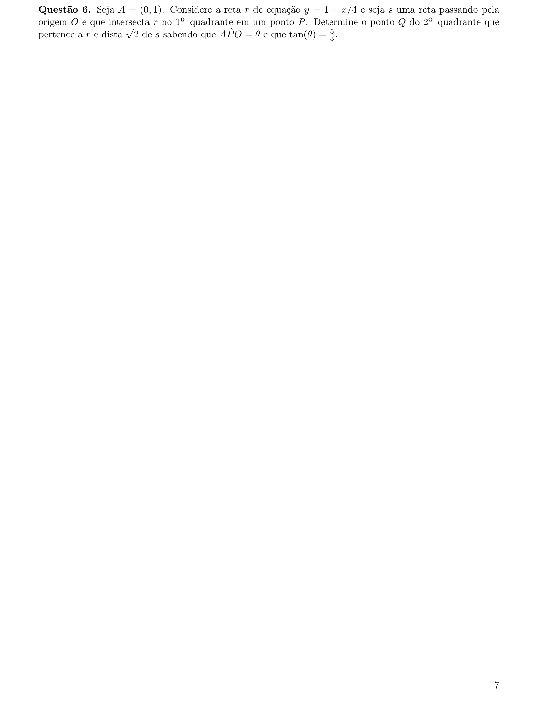
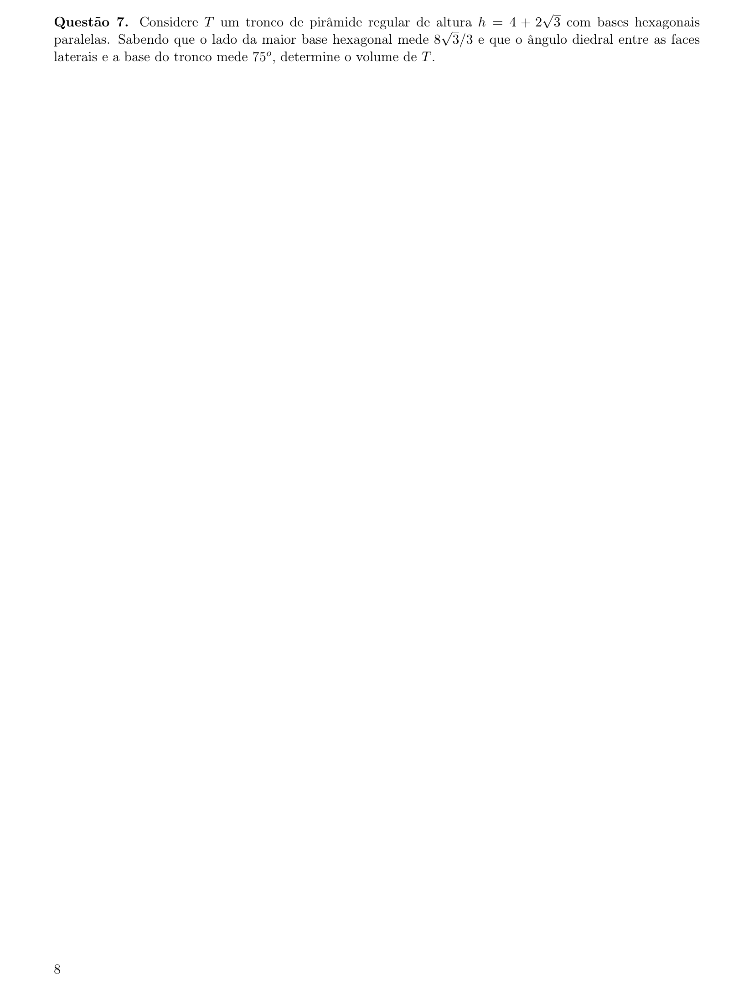
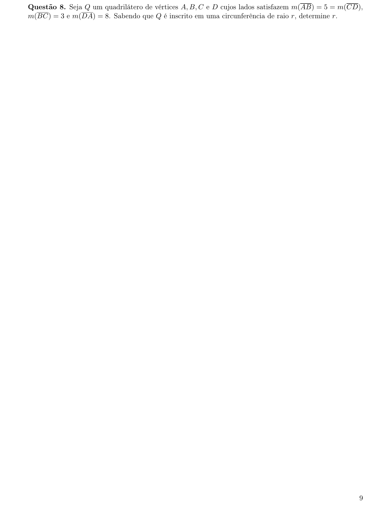
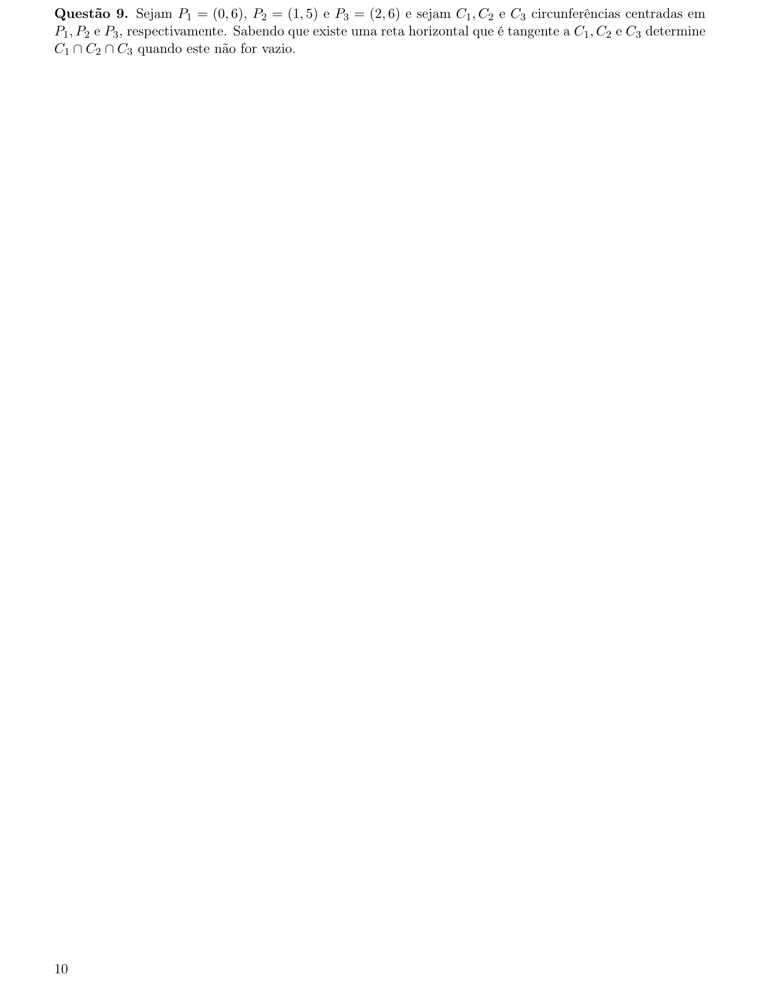
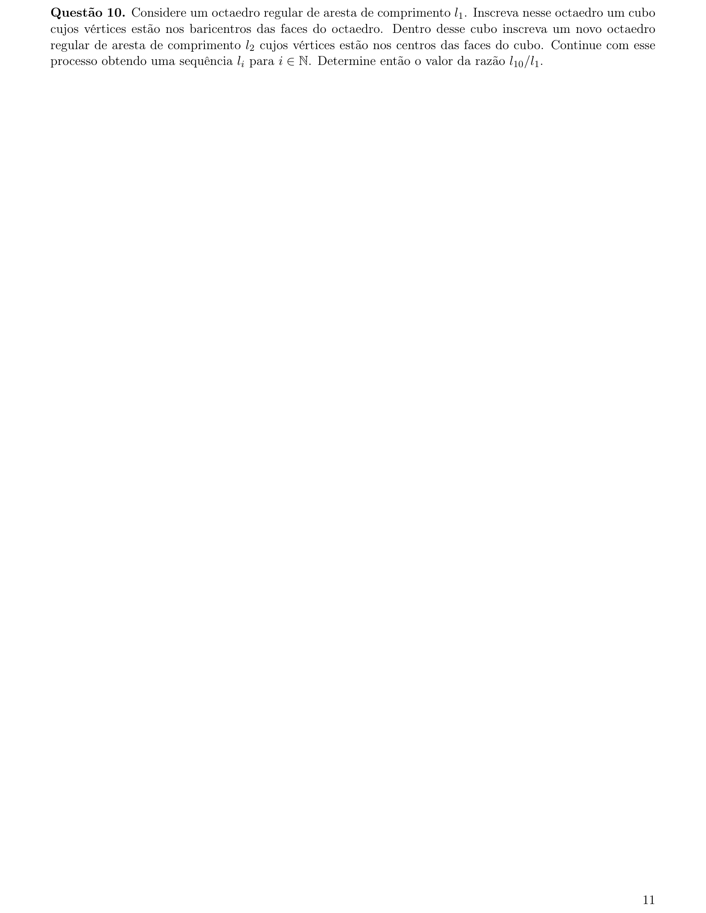

# Matemática — ITA 2022 (2ª fase)

> 10 questões discursivas.

## Q01
**Assunto:** polinômios
**Competências:** manipulação algébrica, fatoração, equações polinomiais, perímetro de retângulo, raízes reais
**Tipo:** discursiva

## Q02
**Assunto:** números complexos
**Competências:** parte imaginária, potências de complexos, forma algébrica, sistema de equações, expansão binomial
**Tipo:** discursiva

## Q03
**Assunto:** matrizes
**Competências:** recorrência, soma de entradas, progressão aritmética, somatórios, indução
**Tipo:** discursiva

## Q04
**Assunto:** análise combinatória
**Competências:** contagem de configurações, casos favoráveis, permutações, princípio multiplicativo, jogo da velha
**Tipo:** discursiva

## Q05
**Assunto:** trigonometria
**Competências:** funções arco-cosseno e arco-seno, identidade arccos+arcsen=π/2, equações trigonométricas, domínio, resolução algébrica
**Tipo:** discursiva

## Q06
**Assunto:** geometria analítica
**Competências:** equação de reta, ângulo entre retas, distância ponto-reta, tangente, interseção de retas
**Tipo:** discursiva

## Q07
**Assunto:** geometria espacial
**Competências:** tronco de pirâmide, base hexagonal regular, ângulo diedral, volume, apótema
**Tipo:** discursiva

## Q08
**Assunto:** geometria plana
**Competências:** quadrilátero inscrito, teorema de Ptolomeu, lei dos cossenos, raio circunscrito, propriedades de cíclicos
**Tipo:** discursiva

## Q09
**Assunto:** geometria analítica
**Competências:** circunferência, tangência a reta horizontal, raio, interseção de circunferências, sistemas de equações
**Tipo:** discursiva

## Q10
**Assunto:** geometria espacial
**Competências:** octaedro regular, cubo inscrito, sequência geométrica, razão de semelhança, progressão geométrica
**Tipo:** discursiva

