# Matemática — ITA 2023 (1ª fase)

> 12 questões múltipla escolha (Q37–Q48 da prova consolidada).

## Q37
**Assunto:** matrizes
**Competências:** propriedades do determinante, equação envolvendo det(A)
**Tipo:** múltipla escolha

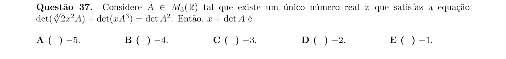

## Q38
**Assunto:** números complexos
**Competências:** iteração de função complexa, periodicidade
**Tipo:** múltipla escolha

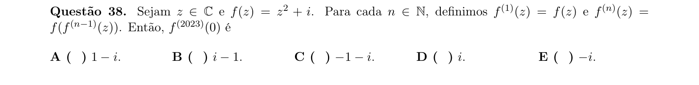

## Q39
**Assunto:** geometria plana
**Competências:** polígonos convexos, ângulos internos em PA
**Tipo:** múltipla escolha

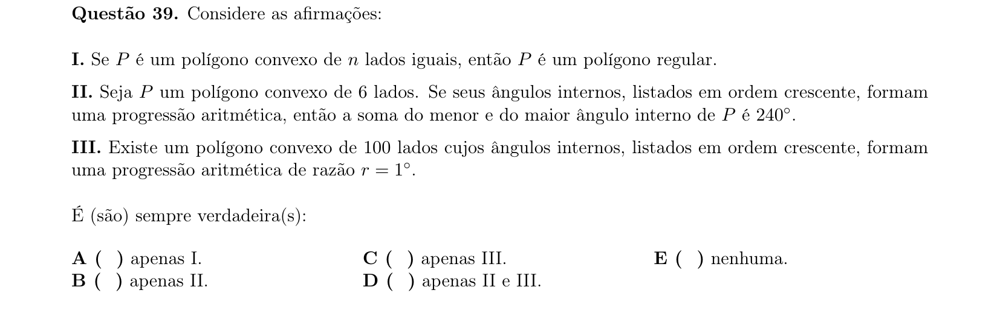

## Q40
**Assunto:** polinômios
**Competências:** relações de Girard, média harmônica de raízes
**Tipo:** múltipla escolha

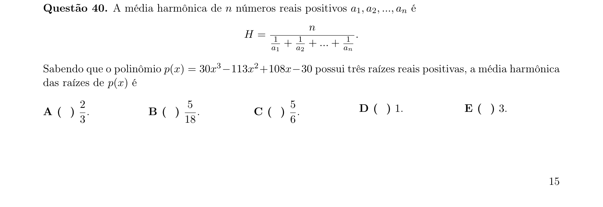

## Q41
**Assunto:** funções
**Competências:** funções exponenciais, comparação de funções
**Tipo:** múltipla escolha

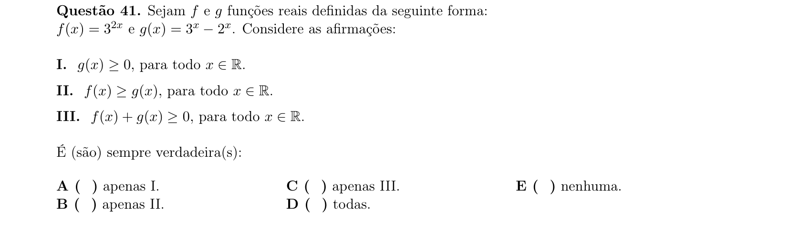

## Q42
**Assunto:** geometria plana
**Competências:** triângulo retângulo, otimização de distância
**Tipo:** múltipla escolha

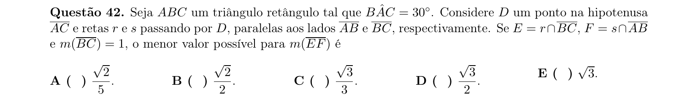

## Q43
**Assunto:** números complexos
**Competências:** potências de complexos, soma de série geométrica
**Tipo:** múltipla escolha

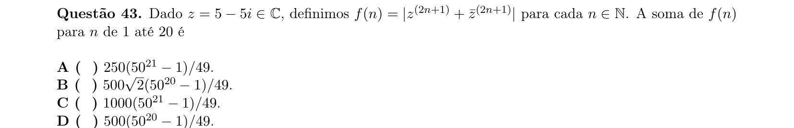

## Q44
**Assunto:** geometria analítica
**Competências:** hipérbole, focos, perímetro de triângulo
**Tipo:** múltipla escolha

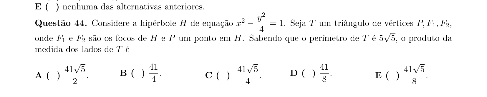

## Q45
**Assunto:** combinatória
**Competências:** probabilidade em jogos sequenciais, eventos independentes
**Tipo:** múltipla escolha

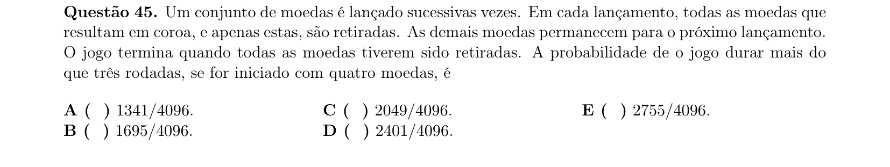

## Q46
**Assunto:** geometria plana
**Competências:** triângulo retângulo, volume do sólido de rotação
**Tipo:** múltipla escolha

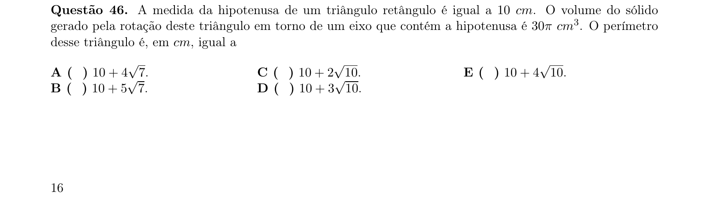

## Q47
**Assunto:** trigonometria
**Competências:** identidades trigonométricas, número de soluções em intervalo
**Tipo:** múltipla escolha

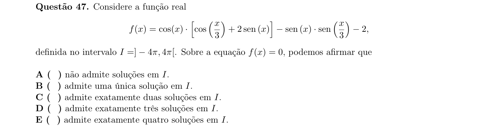

## Q48
**Assunto:** combinatória
**Competências:** expansão polinomial, soma de coeficientes de potências múltiplas de 3
**Tipo:** múltipla escolha

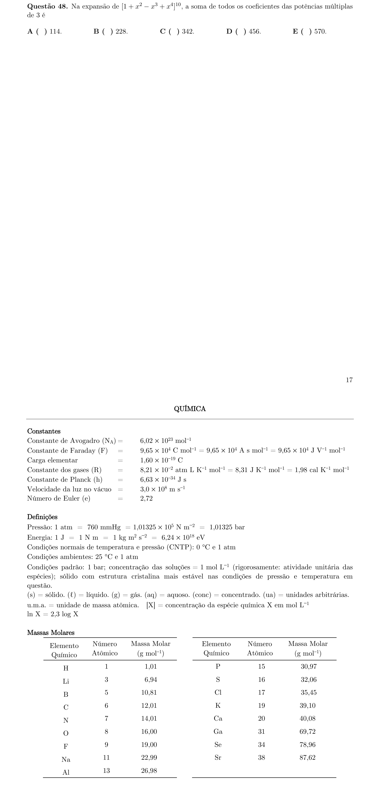
