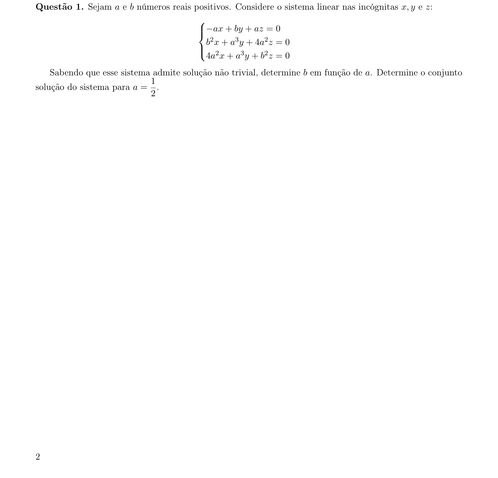
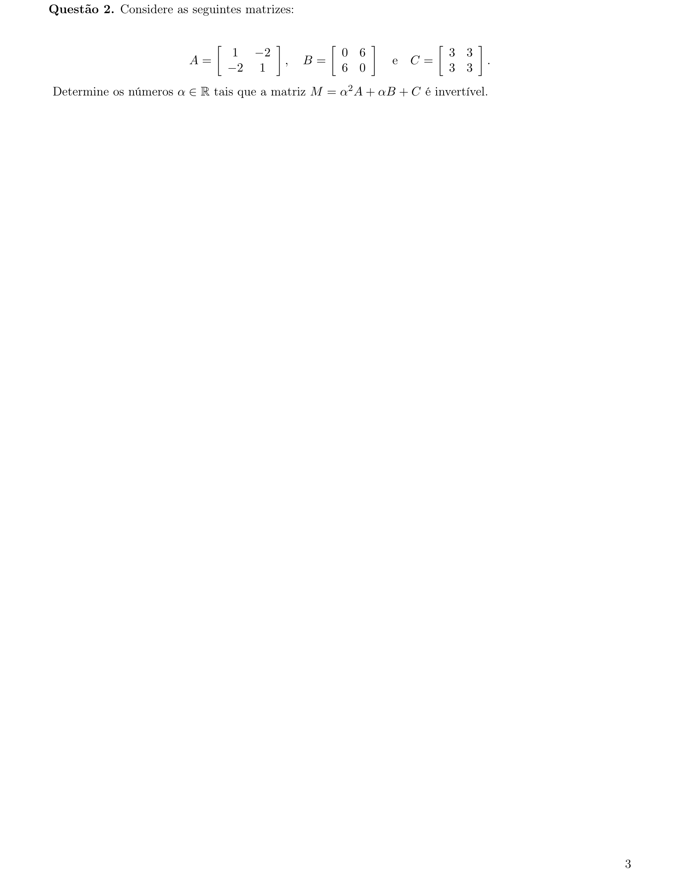
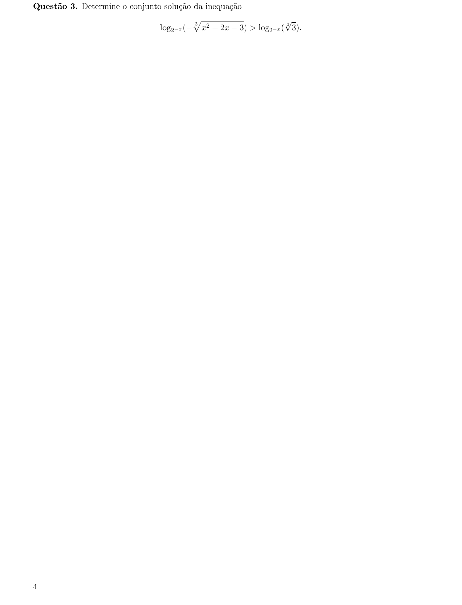
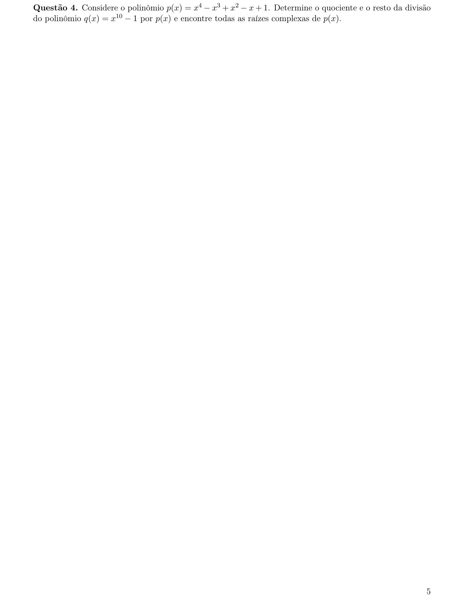
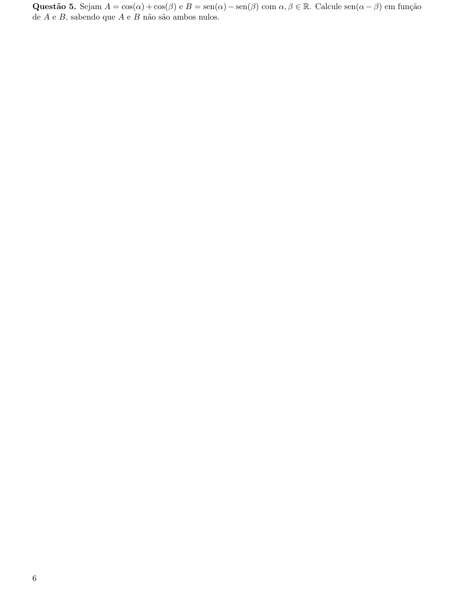
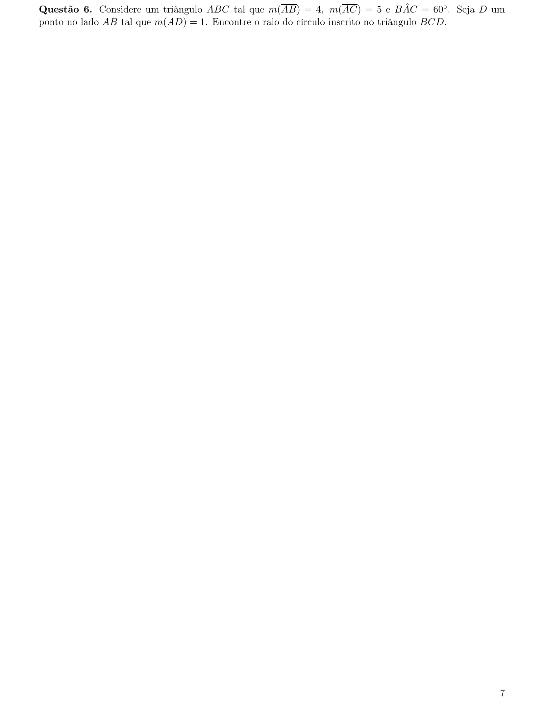
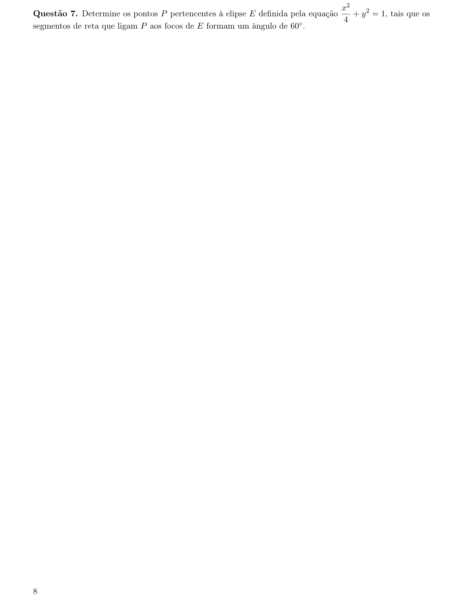
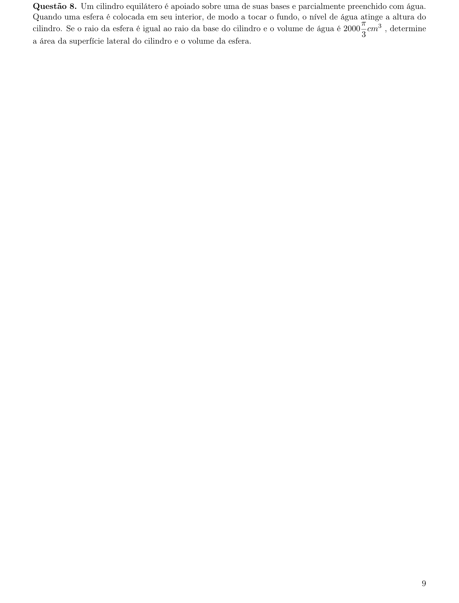
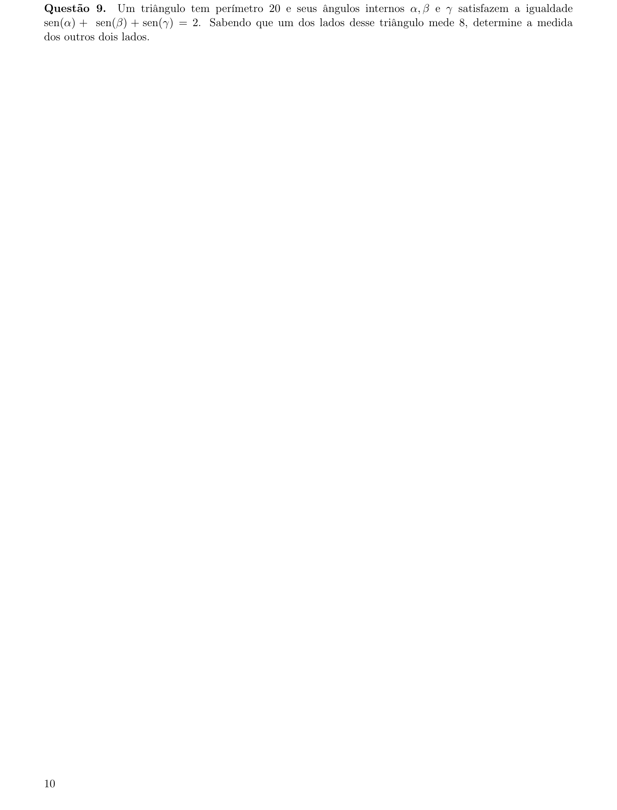
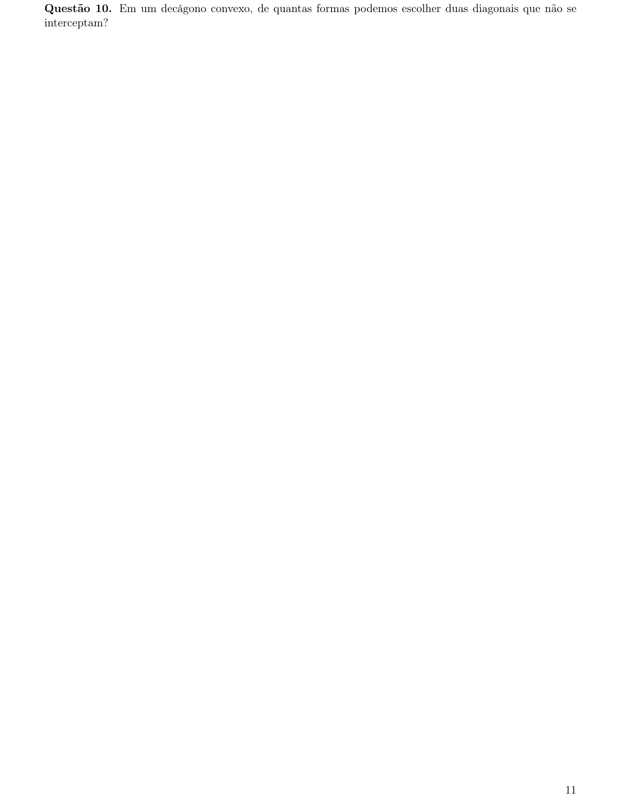

# Matemática — ITA 2023 (2ª fase)

> 10 questões discursivas.

## Q01
**Assunto:** sistemas lineares
**Competências:** sistemas homogêneos, solução não trivial, determinantes, parametrização de soluções
**Tipo:** discursiva

## Q02
**Assunto:** matrizes
**Competências:** operações com matrizes, determinantes, matriz invertível, equações polinomiais
**Tipo:** discursiva

## Q03
**Assunto:** logaritmos
**Competências:** inequações logarítmicas, base variável, domínio de funções, análise de sinais
**Tipo:** discursiva

## Q04
**Assunto:** polinômios
**Competências:** divisão polinomial, raízes complexas, raízes da unidade, fatoração
**Tipo:** discursiva

## Q05
**Assunto:** trigonometria
**Competências:** identidades trigonométricas, soma e diferença de ângulos, transformações em produto
**Tipo:** discursiva

## Q06
**Assunto:** geometria plana
**Competências:** lei dos cossenos, círculo inscrito, área de triângulo, relações métricas
**Tipo:** discursiva

## Q07
**Assunto:** geometria analítica
**Competências:** elipse, focos, distância focal, lei dos cossenos, equação canônica
**Tipo:** discursiva

## Q08
**Assunto:** geometria espacial
**Competências:** cilindro equilátero, esfera, volume, área lateral, princípio de Cavalieri
**Tipo:** discursiva

## Q09
**Assunto:** trigonometria
**Competências:** lei dos senos, triângulo retângulo, perímetro, identidades trigonométricas
**Tipo:** discursiva

## Q10
**Assunto:** análise combinatória
**Competências:** combinações, contagem em polígonos, diagonais, interseção de segmentos
**Tipo:** discursiva

