# Matemática — ITA 2024 (1ª fase)

> 12 questões múltipla escolha (Q37–Q48 da prova consolidada).

## Q37
**Assunto:** teoria dos conjuntos
**Competências:** operações entre conjuntos (união, interseção, diferença), identidades
**Tipo:** múltipla escolha (asserções I-III)

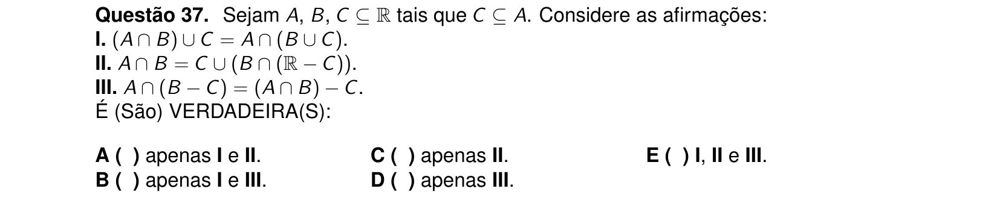

## Q38
**Assunto:** álgebra linear
**Competências:** sistemas lineares matriciais, condições de existência e unicidade, invertibilidade
**Tipo:** múltipla escolha (asserções I-III)

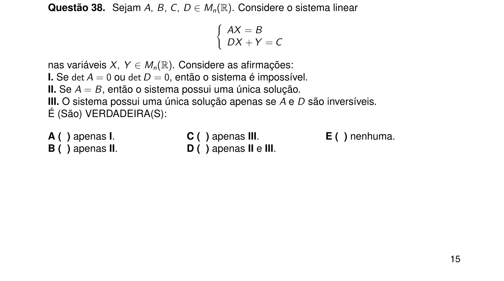

## Q39
**Assunto:** trigonometria
**Competências:** arco duplo, identidades trigonométricas, arctg
**Tipo:** múltipla escolha

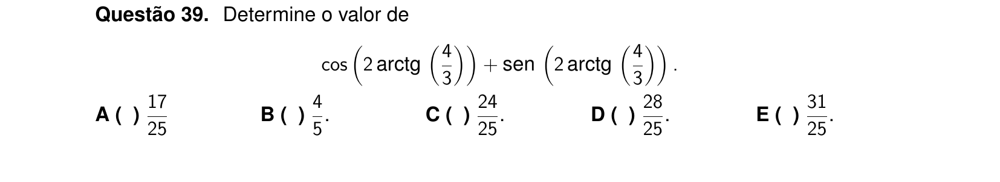

## Q40
**Assunto:** análise combinatória / princípio das gavetas
**Competências:** subconjuntos, princípio da casa dos pombos, produto fixo
**Tipo:** múltipla escolha

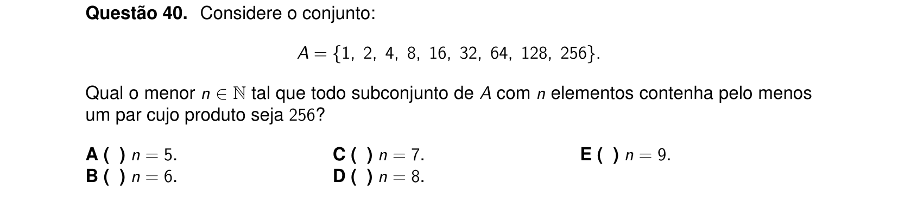

## Q41
**Assunto:** polinômios / análise combinatória
**Competências:** soma das raízes (relações de Girard), contagem, polinômios de grau 4
**Tipo:** múltipla escolha

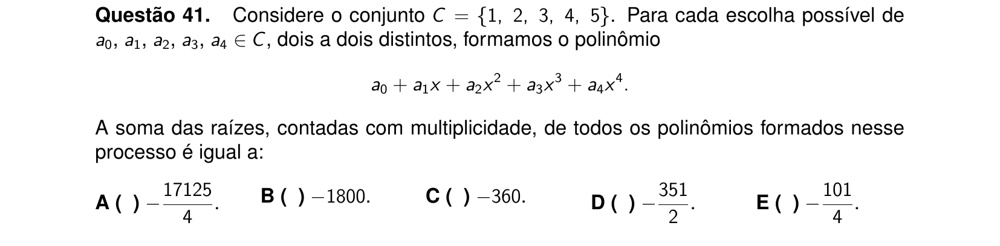

## Q42
**Assunto:** polinômios
**Competências:** raízes em progressão geométrica, relações de Girard
**Tipo:** múltipla escolha

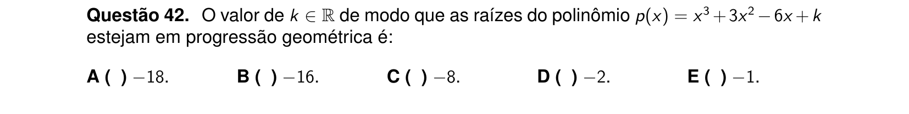

## Q43
**Assunto:** geometria espacial / progressões
**Competências:** cilindro circular reto, áreas e volume, progressão geométrica
**Tipo:** múltipla escolha

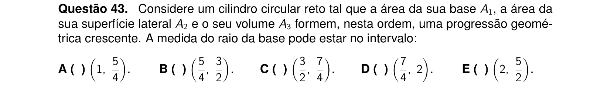

## Q44
**Assunto:** geometria espacial
**Competências:** poliedros convexos, relação de Euler, contagem de faces
**Tipo:** múltipla escolha

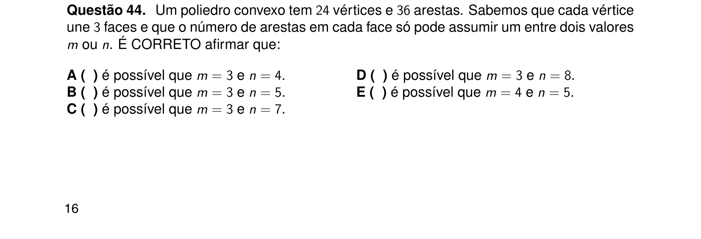

## Q45
**Assunto:** geometria plana
**Competências:** áreas de quadriláteros, semelhança, ponto médio e secções
**Tipo:** múltipla escolha

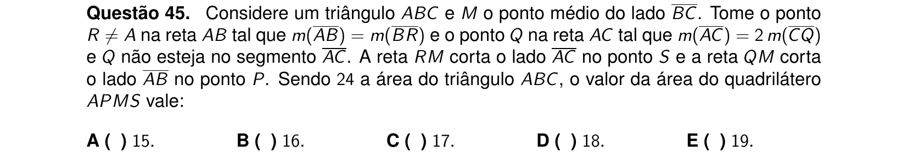

## Q46
**Assunto:** números complexos
**Competências:** forma polar, potência de complexos, argumento e módulo
**Tipo:** múltipla escolha

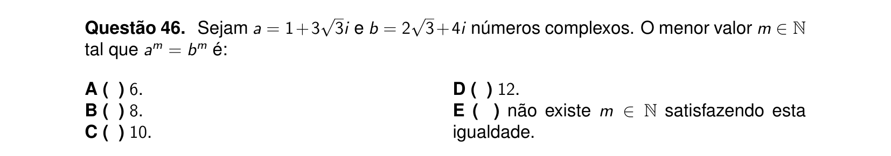

## Q47
**Assunto:** geometria analítica
**Competências:** bissetriz de ângulo, reta perpendicular, equação da reta
**Tipo:** múltipla escolha

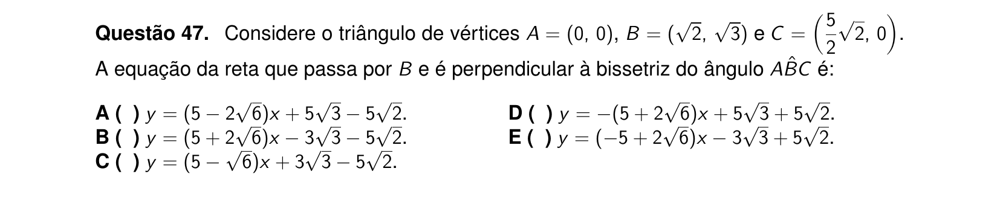

## Q48
**Assunto:** geometria analítica — cônicas
**Competências:** elipse, círculo, excentricidade, posição relativa entre cônicas
**Tipo:** múltipla escolha

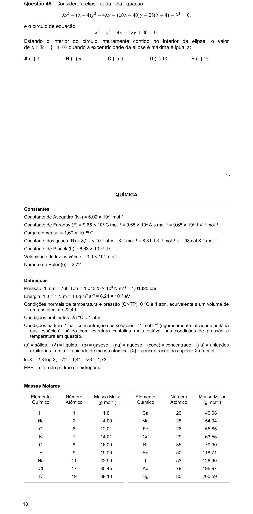
