# Matemática — ITA 2025 (1ª fase)

> 12 questões múltipla escolha (Q1–Q12 da prova consolidada MAT+FIS+QUI+ING).

## Q01
**Assunto:** números complexos / geometria analítica
**Competências:** plano de Argand-Gauss, área de triângulo, módulo e potências de complexos
**Tipo:** múltipla escolha

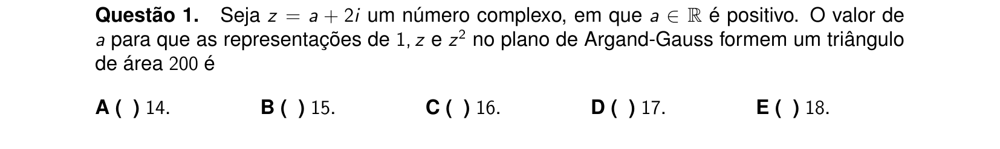

## Q02
**Assunto:** geometria espacial / poliedros
**Competências:** relação de Euler, classificação de poliedros, asserções I-III
**Tipo:** múltipla escolha (asserções I-III)

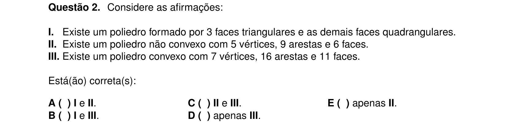

## Q03
**Assunto:** binômio de Newton
**Competências:** termo geral, termo independente, produto de expansões binomiais
**Tipo:** múltipla escolha

## Q04
**Assunto:** funções reais
**Competências:** injetividade, sobrejetividade, composição funcional
**Tipo:** múltipla escolha

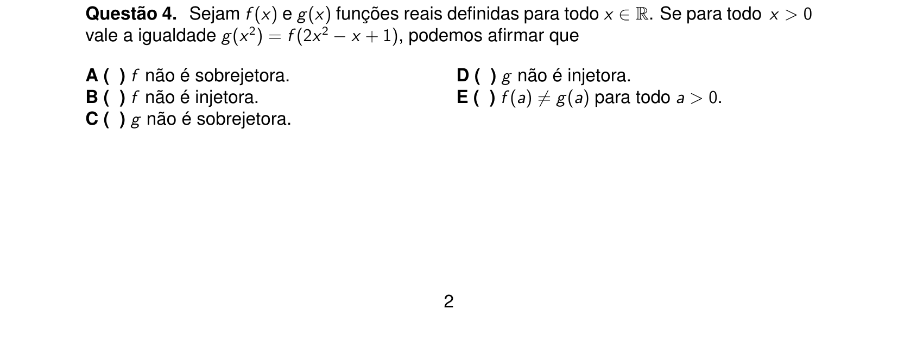

## Q05
**Assunto:** sequências / séries
**Competências:** progressões aritméticas e geométricas, somas parciais, asserções I-III
**Tipo:** múltipla escolha (asserções I-III)

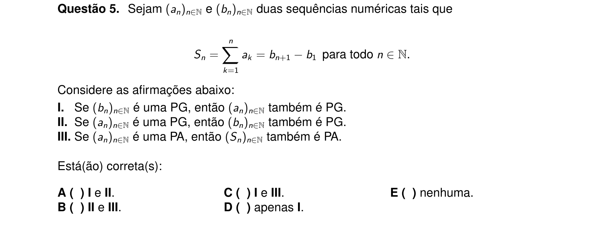

## Q06
**Assunto:** equações exponenciais
**Competências:** mudança de variável, equação do 2º grau, condições para raízes reais distintas
**Tipo:** múltipla escolha

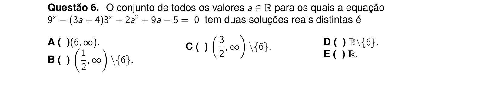

## Q07
**Assunto:** sistemas lineares
**Competências:** equivalência de sistemas, parâmetros, escalonamento
**Tipo:** múltipla escolha

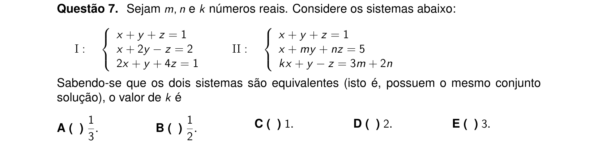

## Q08
**Assunto:** trigonometria
**Competências:** domínio de função trigonométrica, identidades de arco duplo, intervalos
**Tipo:** múltipla escolha

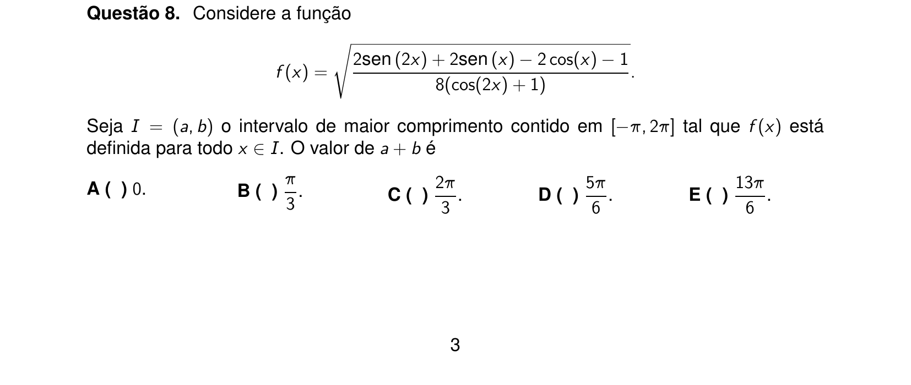

## Q09
**Assunto:** geometria plana / sólidos de revolução
**Competências:** intersecção de circunferências, volume de sólido de revolução, cone
**Tipo:** múltipla escolha

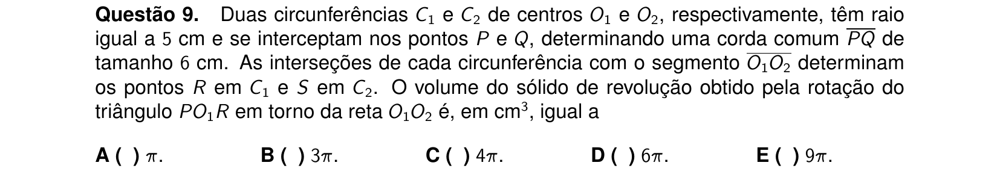

## Q10
**Assunto:** polinômios / números complexos
**Competências:** raízes comuns, MDC de polinômios, raízes complexas
**Tipo:** múltipla escolha

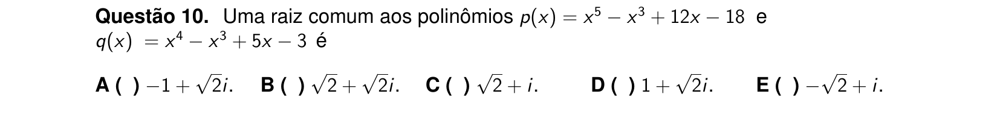

## Q11
**Assunto:** geometria analítica (cônicas)
**Competências:** elipse e hipérbole, focos comuns, excentricidade
**Tipo:** múltipla escolha

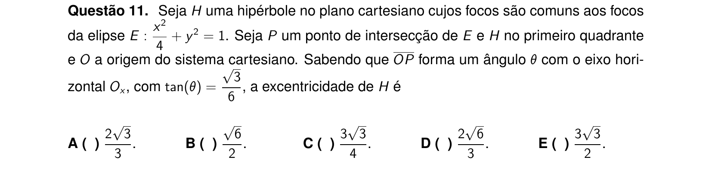

## Q12
**Assunto:** teoria dos números
**Competências:** número de divisores, fatoração em primos, quadrados perfeitos, asserções I-III
**Tipo:** múltipla escolha (asserções I-III)

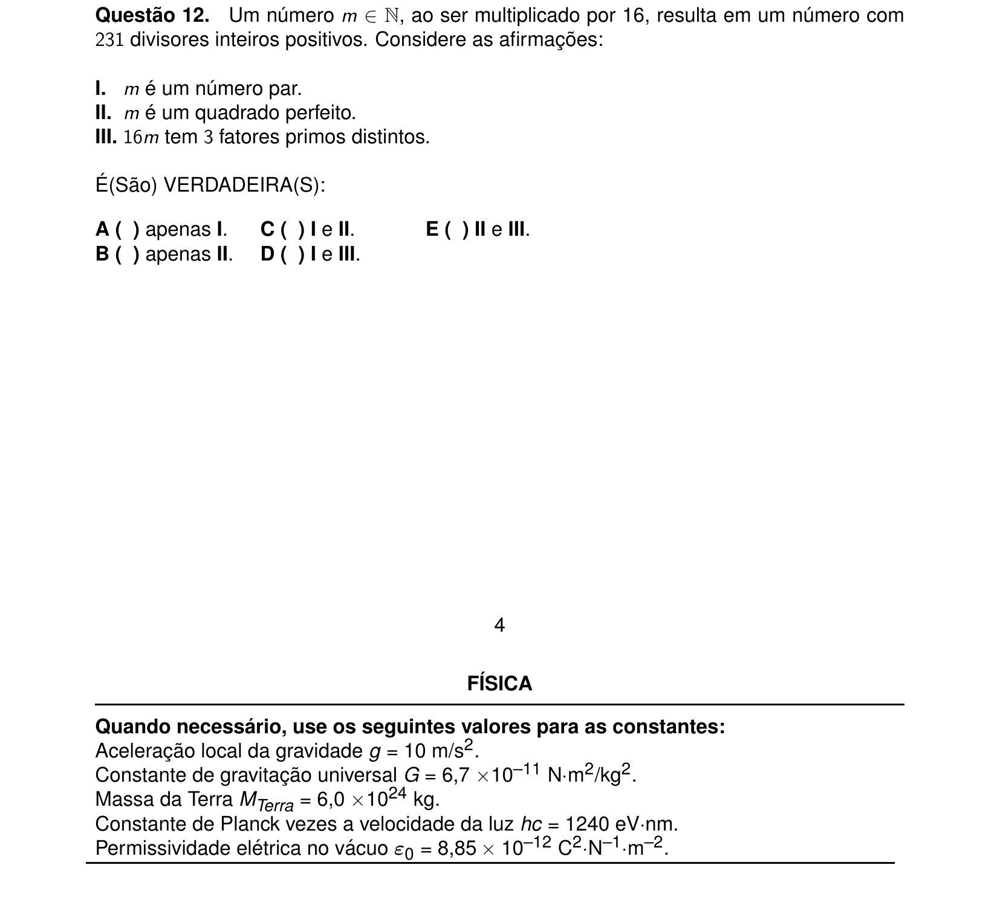
