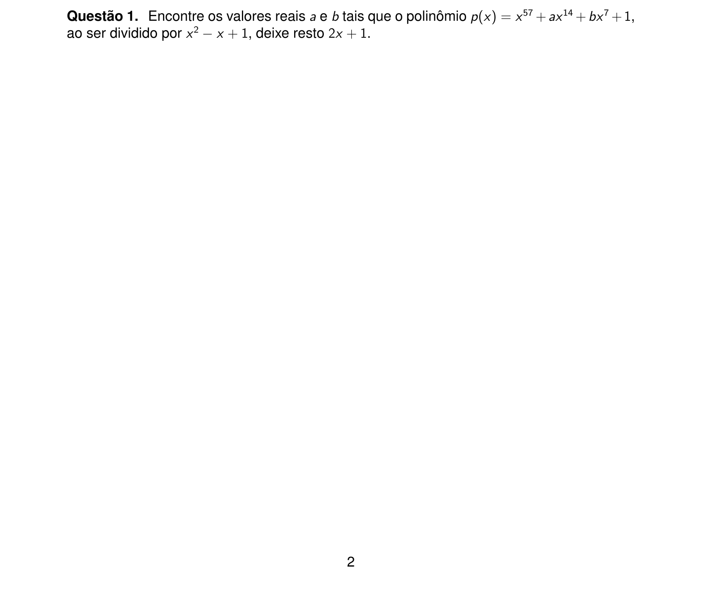
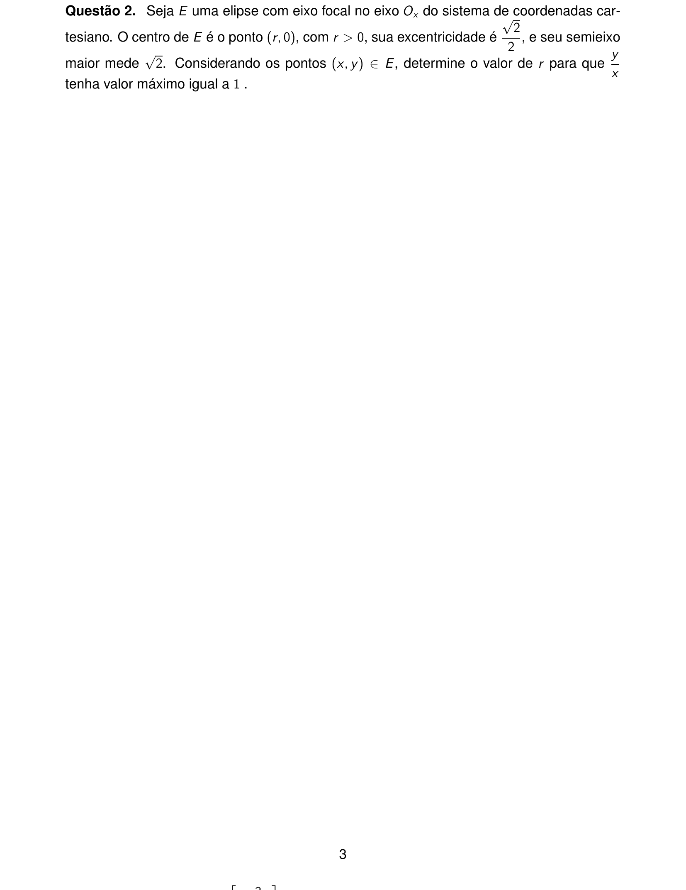
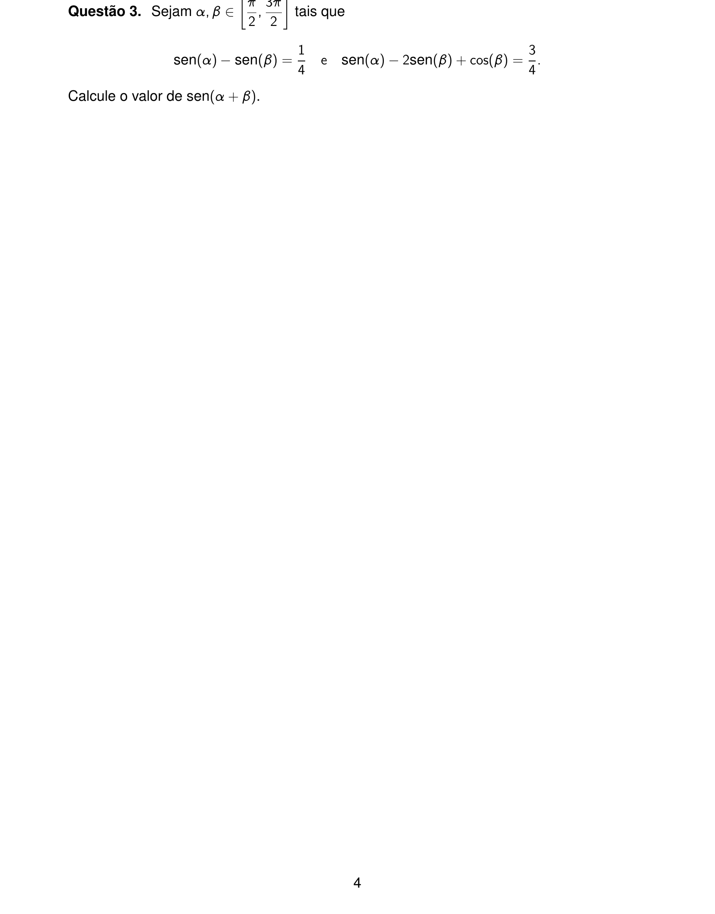
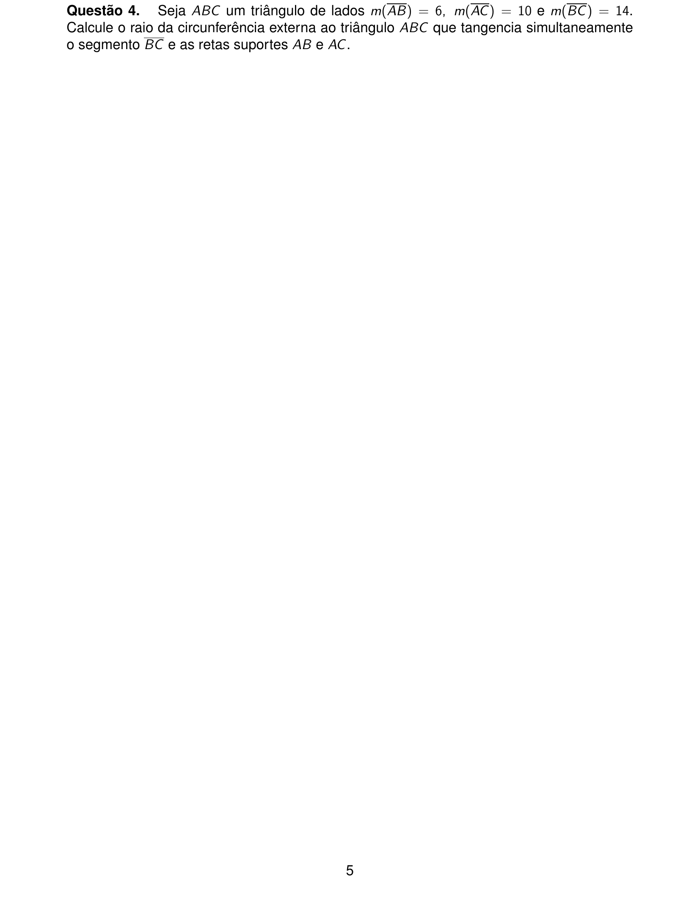
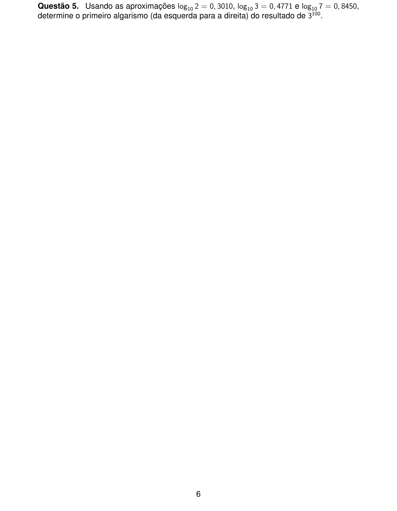
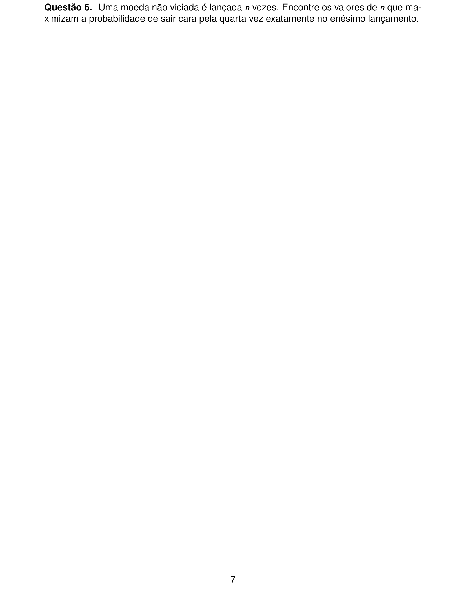
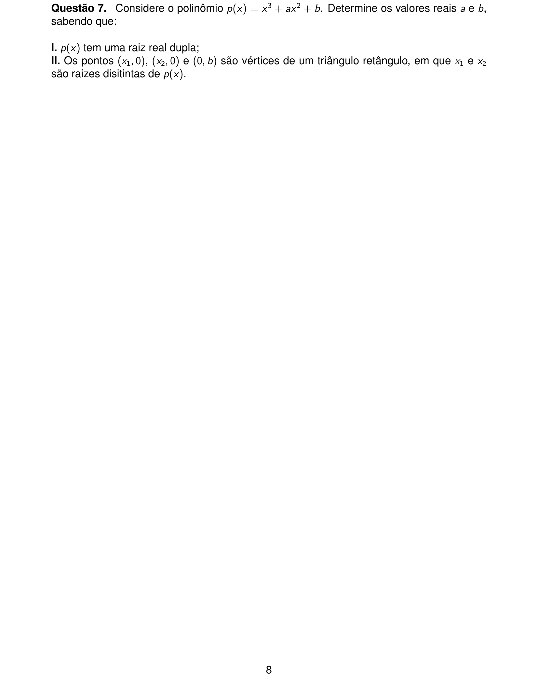
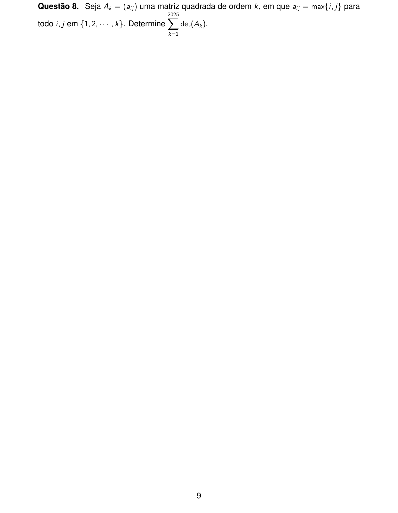
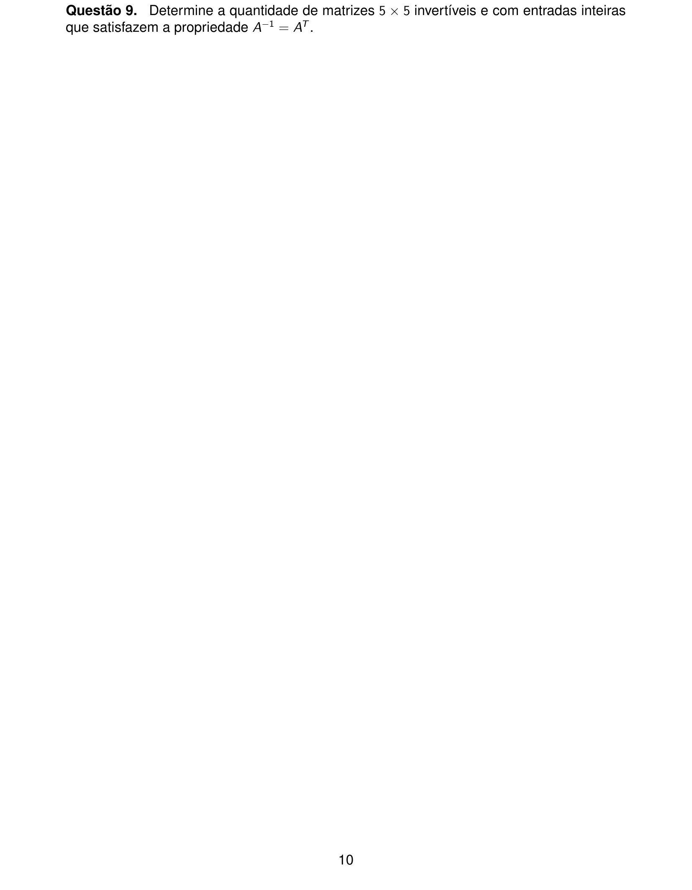
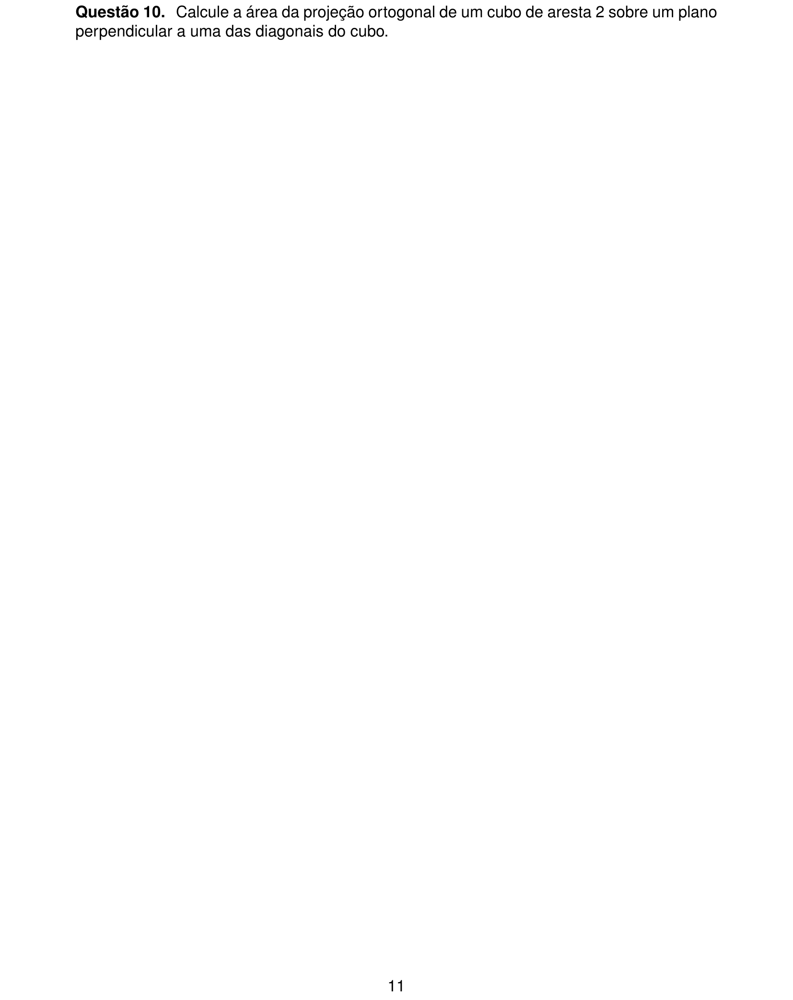

# Matemática — ITA 2025 (2ª fase)

> 10 questões discursivas.

## Q01
**Assunto:** polinômios
**Competências:** divisão de polinômios, teorema do resto, raízes complexas, identidades polinomiais
**Tipo:** discursiva

## Q02
**Assunto:** geometria analítica
**Competências:** elipse, excentricidade, semieixos, máximo de razão y/x, parametrização
**Tipo:** discursiva

## Q03
**Assunto:** trigonometria
**Competências:** identidades trigonométricas, seno da soma, sistemas trigonométricos, intervalo de validade
**Tipo:** discursiva

## Q04
**Assunto:** geometria plana
**Competências:** triângulo, circunferência tangente, ex-incírculo, tangência a retas suportes
**Tipo:** discursiva

## Q05
**Assunto:** funções
**Competências:** logaritmo decimal, característica e mantissa, primeiro algarismo de potência, manipulação de log
**Tipo:** discursiva

## Q06
**Assunto:** combinatória
**Competências:** distribuição binomial negativa, otimização discreta, probabilidade do enésimo sucesso, análise combinatória
**Tipo:** discursiva

## Q07
**Assunto:** polinômios
**Competências:** raiz dupla, relações de Girard, geometria analítica, triângulo retângulo
**Tipo:** discursiva

## Q08
**Assunto:** matrizes
**Competências:** determinante de matriz max{i,j}, operações elementares, somatório, padrão recursivo
**Tipo:** discursiva

## Q09
**Assunto:** matrizes
**Competências:** matrizes ortogonais, contagem, entradas inteiras, transposta como inversa
**Tipo:** discursiva

## Q10
**Assunto:** geometria espacial
**Competências:** projeção ortogonal, cubo, diagonal principal, área de hexágono regular
**Tipo:** discursiva

