# Matemática — ITA 2026 (1ª fase)

> 12 questões múltipla escolha (Q1–Q12 da prova consolidada MAT+FIS+QUI+ING).

## Q01
**Assunto:** números complexos
**Competências:** módulo e argumento, parte real, operações em C
**Tipo:** múltipla escolha

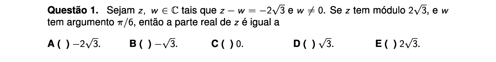

## Q02
**Assunto:** funções
**Competências:** mudança de base, propriedades de logaritmos, aproximações numéricas
**Tipo:** múltipla escolha

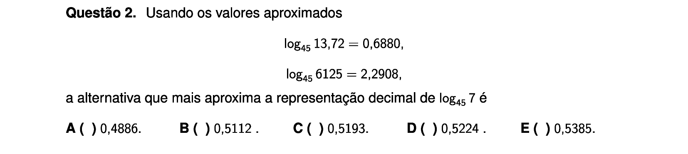

## Q03
**Assunto:** matrizes
**Competências:** matriz simétrica, progressão aritmética em linhas, matriz singular, asserções I-III
**Tipo:** múltipla escolha (asserções I-III)

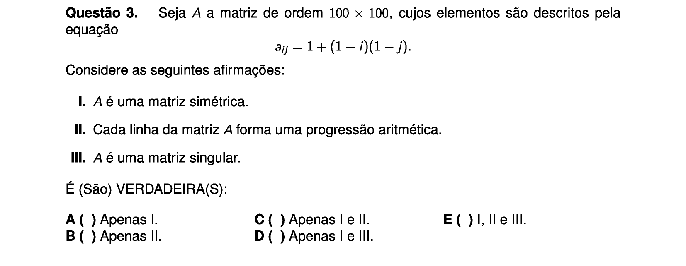

## Q04
**Assunto:** números complexos
**Competências:** raízes de equação complexa, polígono no plano de Argand-Gauss, área
**Tipo:** múltipla escolha

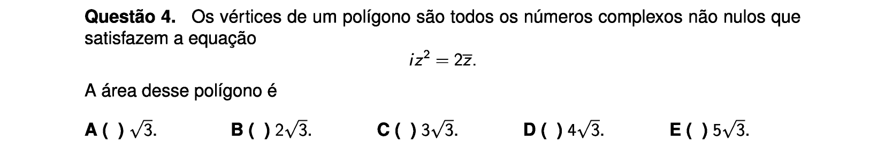

## Q05
**Assunto:** geometria plana
**Competências:** hexagrama (estrela de Davi), triângulos equiláteros inscritos, quadrado inscrito em circunferência, áreas
**Tipo:** múltipla escolha

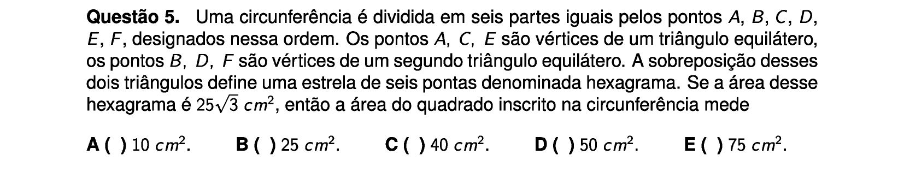

## Q06
**Assunto:** geometria espacial
**Competências:** seções planas no cubo, retas e planos no espaço, planos perpendiculares, asserções I-III
**Tipo:** múltipla escolha (asserções I-III)

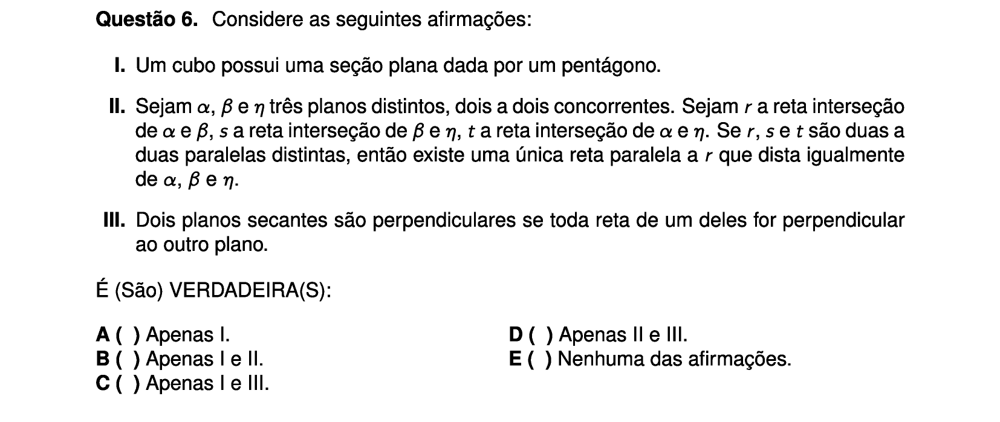

## Q07
**Assunto:** matrizes
**Competências:** matriz inversa, produto matricial
**Tipo:** múltipla escolha

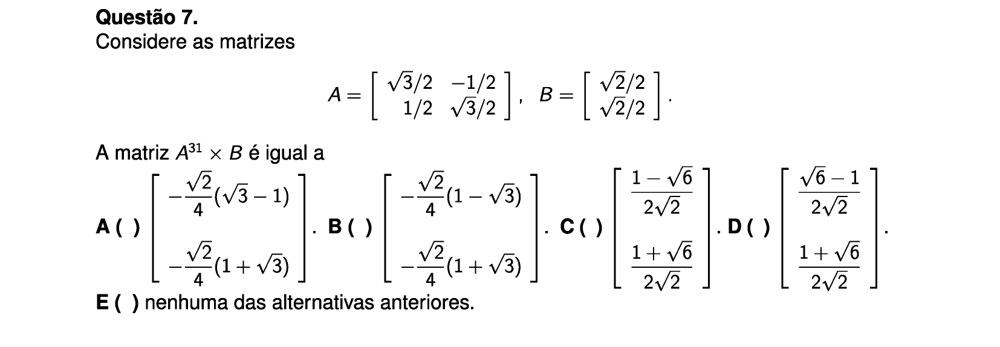

## Q08
**Assunto:** polinômios
**Competências:** polinômio cúbico, raízes reais, simetria p(2+x) = -p(2-x), valor mínimo
**Tipo:** múltipla escolha

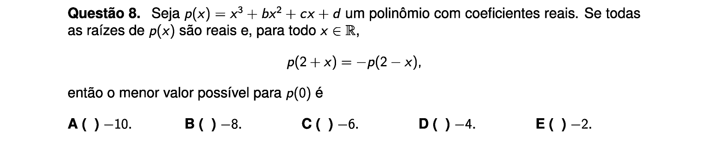

## Q09
**Assunto:** geometria analítica
**Competências:** parábola, reta tangente, ângulo entre retas, área de triângulo
**Tipo:** múltipla escolha

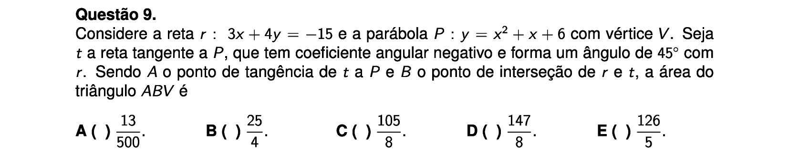

## Q10
**Assunto:** trigonometria
**Competências:** sistema de equações trigonométricas, identidades, produto de soluções
**Tipo:** múltipla escolha

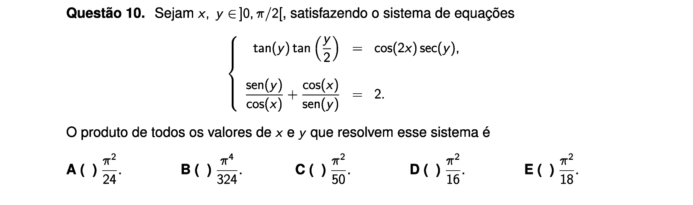

## Q11
**Assunto:** combinatória
**Competências:** bijeções com restrições de ordem, contagem
**Tipo:** múltipla escolha

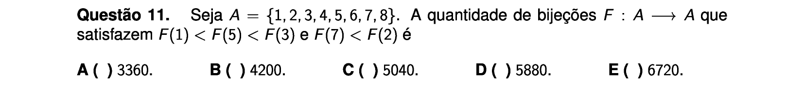

## Q12
**Assunto:** sequências e progressões
**Competências:** progressão geométrica, circunferências tangentes externamente, parâmetros
**Tipo:** múltipla escolha

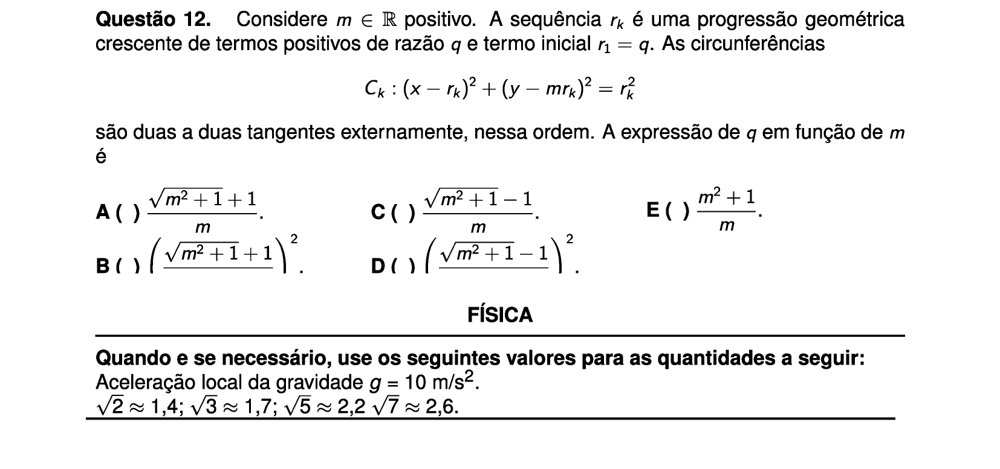
