# Português — ITA 2008

> 20 questões múltipla escolha.

## Q21
**Assunto:** gramática
**Competências:** morfologia, partícula "se"
**Tipo:** múltipla escolha

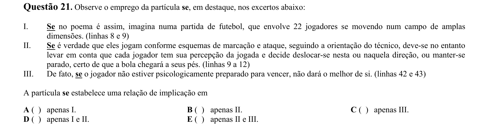

## Q22
**Assunto:** interpretação de texto
**Competências:** compreensão
**Tipo:** múltipla escolha

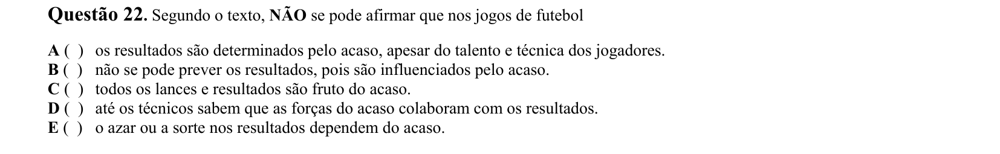

## Q23
**Assunto:** gramática
**Competências:** sintaxe (período composto), conjunções
**Tipo:** múltipla escolha

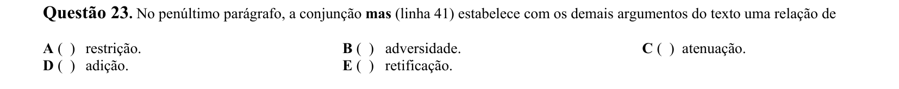

## Q24
**Assunto:** interpretação de texto
**Competências:** inferência, tom
**Tipo:** múltipla escolha

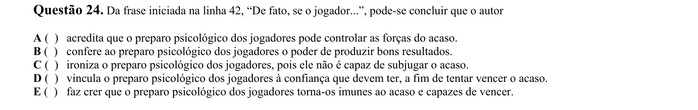

## Q25
**Assunto:** variação linguística
**Competências:** linguagem denotativa, técnica e popular
**Tipo:** múltipla escolha

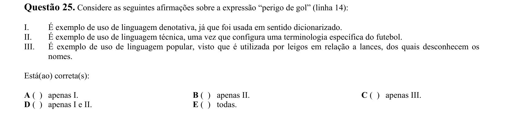

## Q26
**Assunto:** interpretação de texto
**Competências:** semântica, sinonímia
**Tipo:** múltipla escolha

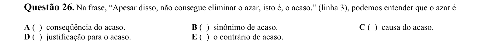

## Q27
**Assunto:** interpretação de texto
**Competências:** compreensão global, tema
**Tipo:** múltipla escolha

## Q28
**Assunto:** figuras de linguagem
**Competências:** ambiguidade, duplo sentido
**Tipo:** múltipla escolha

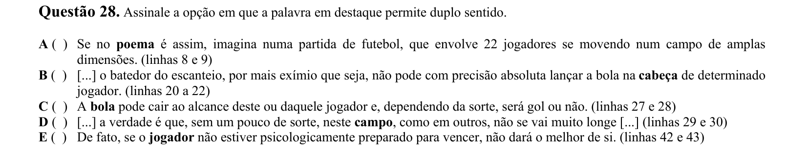

## Q29
**Assunto:** gramática
**Competências:** morfologia, advérbios
**Tipo:** múltipla escolha

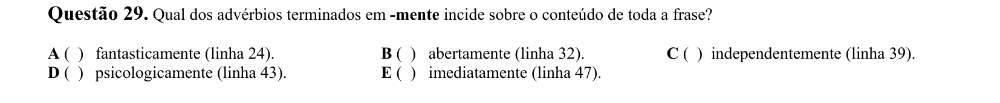

## Q30
**Assunto:** interpretação de texto
**Competências:** tese, argumentação
**Tipo:** múltipla escolha

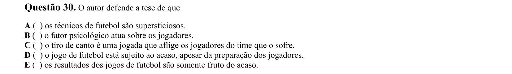

## Q31
**Assunto:** interpretação de texto
**Competências:** argumentação
**Tipo:** múltipla escolha

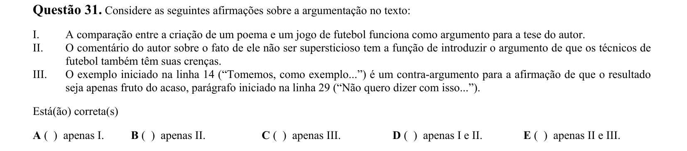

## Q32
**Assunto:** gramática
**Competências:** pontuação (vírgula)
**Tipo:** múltipla escolha

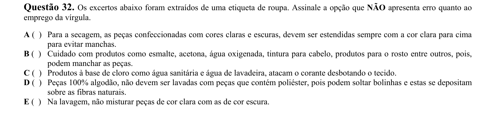

## Q33
**Assunto:** gramática
**Competências:** sintaxe (período composto), ambiguidade
**Tipo:** múltipla escolha

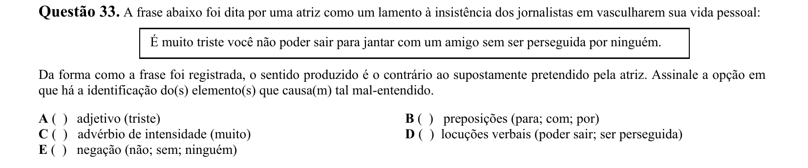

## Q34
**Assunto:** figuras de linguagem
**Competências:** ironia
**Tipo:** múltipla escolha

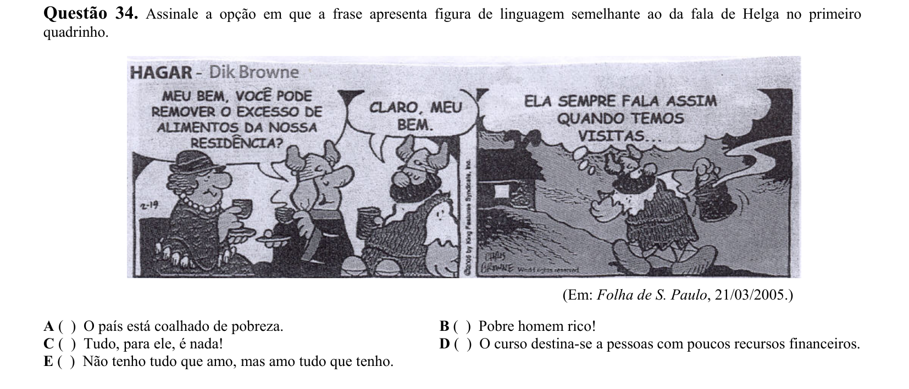

## Q35
**Assunto:** literatura
**Competências:** Machado de Assis, realismo, Dom Casmurro
**Tipo:** múltipla escolha

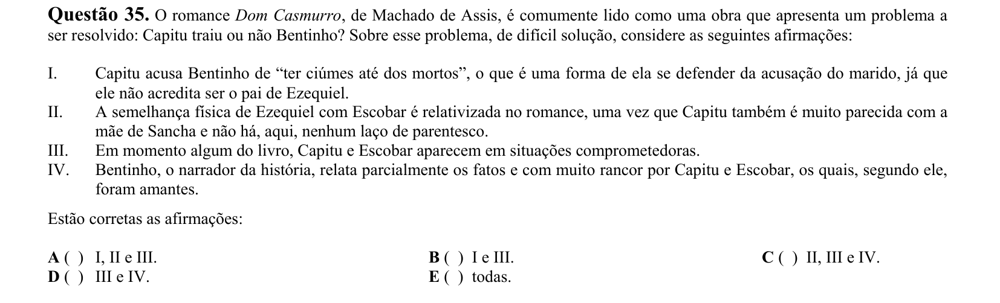

## Q36
**Assunto:** literatura
**Competências:** modernismo, José Lins do Rego, romance de 30
**Tipo:** múltipla escolha

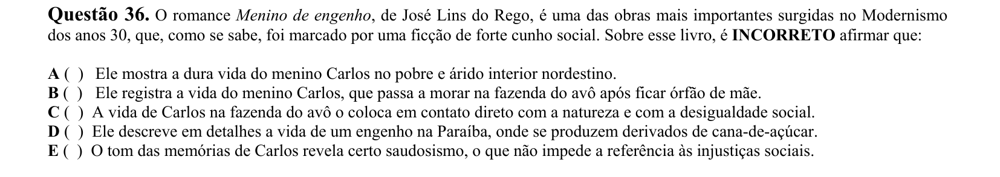

## Q37
**Assunto:** literatura
**Competências:** Drummond, modernismo
**Tipo:** múltipla escolha

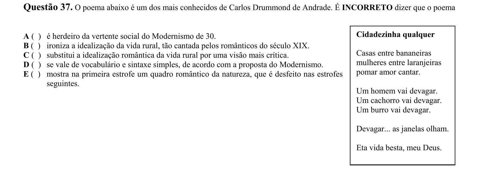

## Q38
**Assunto:** literatura
**Competências:** intertextualidade, Gonçalves Dias, José Paulo Paes
**Tipo:** múltipla escolha

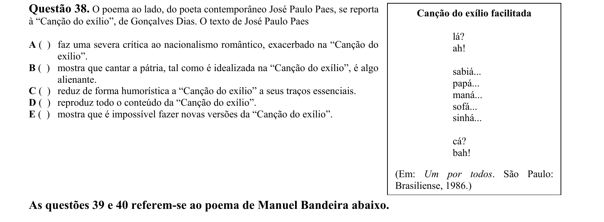

## Q39
**Assunto:** literatura
**Competências:** Manuel Bandeira, modernismo, romantismo
**Tipo:** múltipla escolha

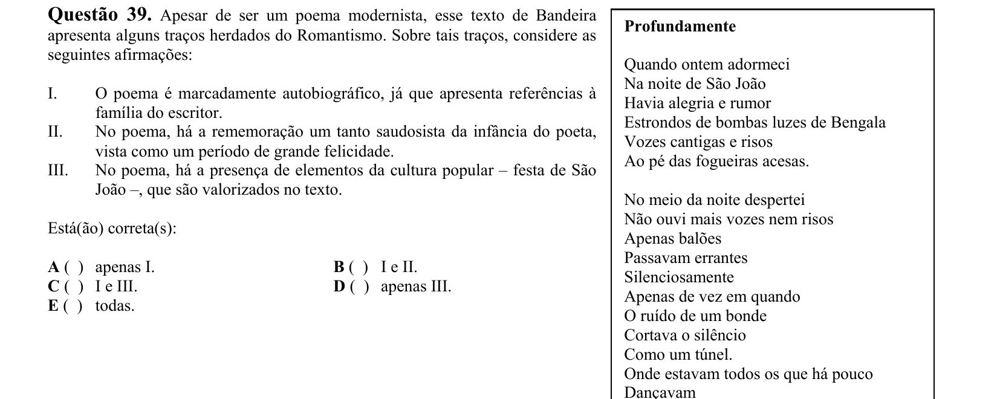

## Q40
**Assunto:** literatura
**Competências:** Manuel Bandeira, modernismo, romantismo
**Tipo:** múltipla escolha

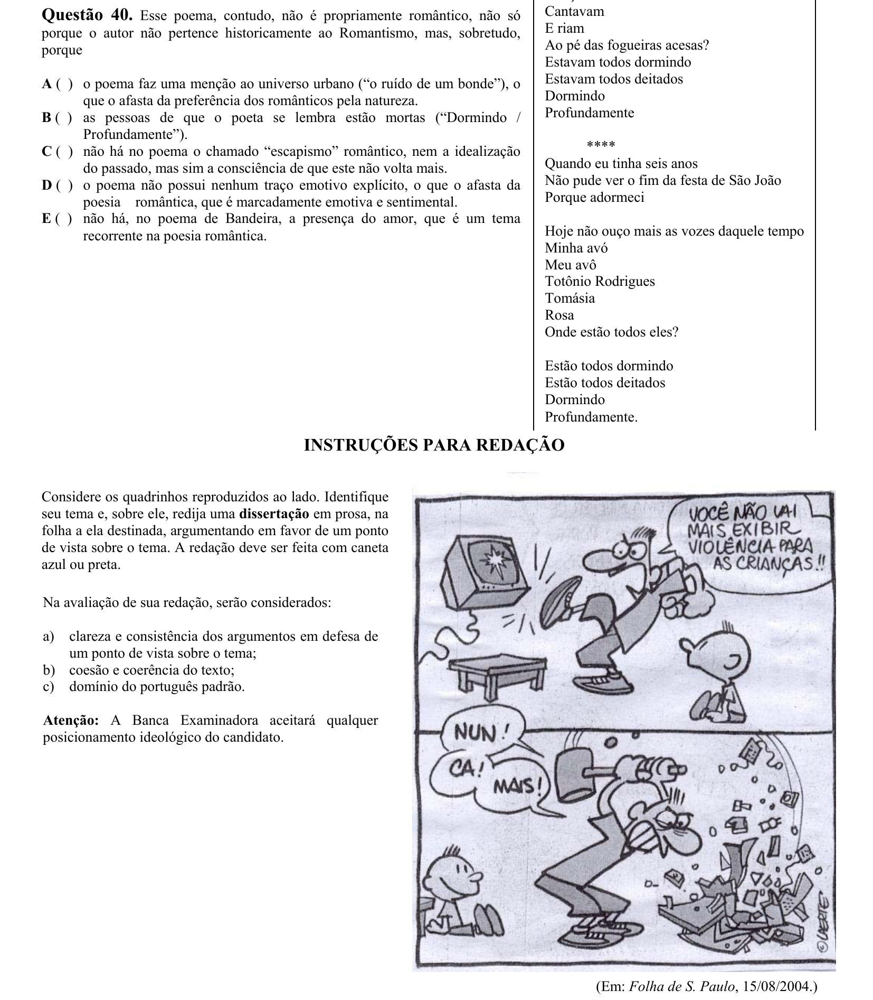
