# Português — ITA 2009

> 20 questões múltipla escolha.

## Q21
**Assunto:** interpretação de texto
**Competências:** compreensão global, afirmações I/II/III
**Tipo:** múltipla escolha

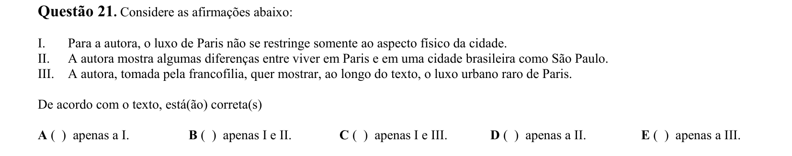

## Q22
**Assunto:** interpretação de texto
**Competências:** inferência, negação
**Tipo:** múltipla escolha

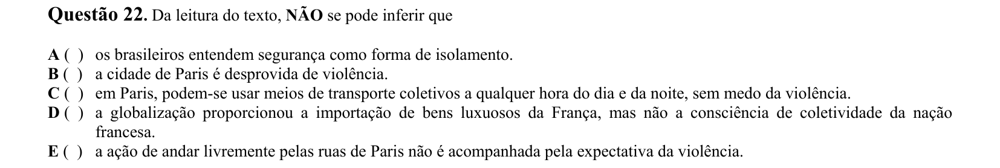

## Q23
**Assunto:** gramática
**Competências:** pontuação (parênteses, aspas, interrogação, exclamação, vírgula)
**Tipo:** múltipla escolha

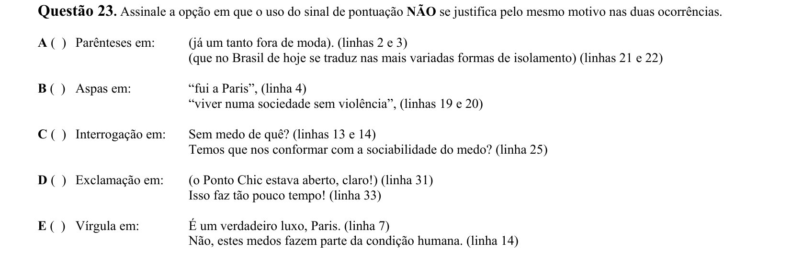

## Q24
**Assunto:** interpretação de texto
**Competências:** ideia principal, argumentação
**Tipo:** múltipla escolha

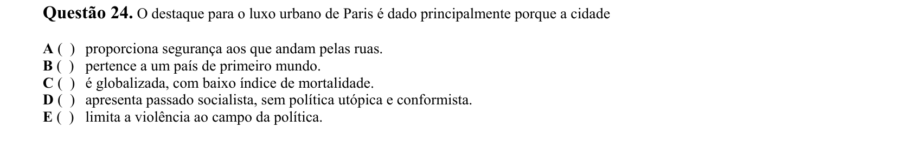

## Q25
**Assunto:** interpretação de texto
**Competências:** inferência, tese da autora
**Tipo:** múltipla escolha

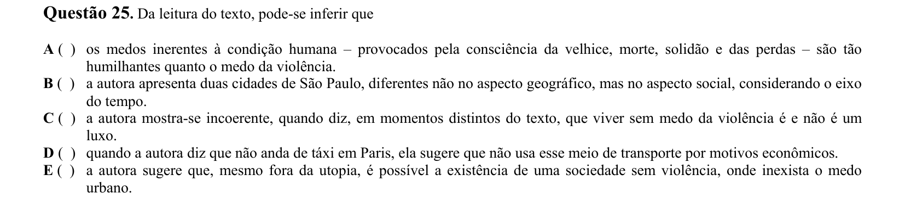

## Q26
**Assunto:** interpretação de texto
**Competências:** compreensão, afirmações I/II/III
**Tipo:** múltipla escolha

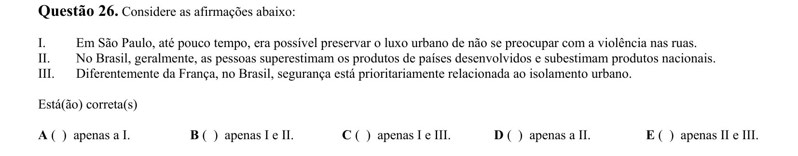

## Q27
**Assunto:** gramática
**Competências:** coesão referencial, pronome demonstrativo
**Tipo:** múltipla escolha

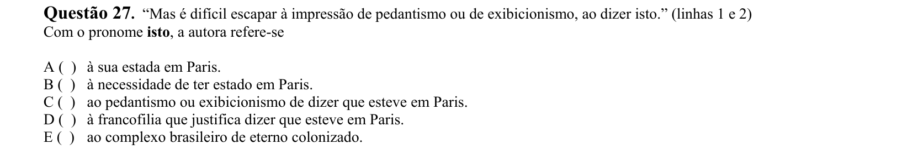

## Q28
**Assunto:** gramática
**Competências:** semântica lexical, significado contextual
**Tipo:** múltipla escolha

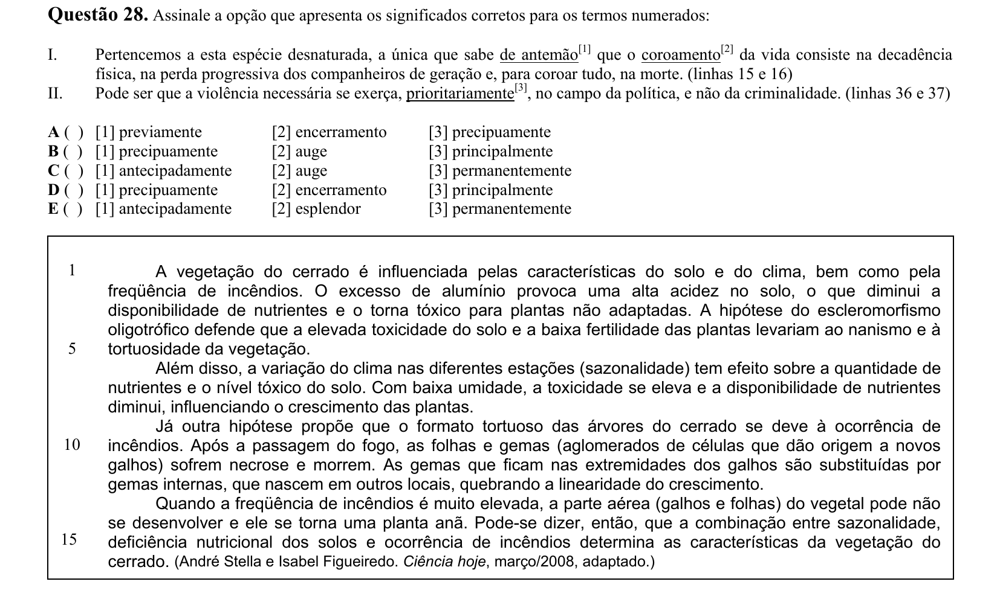

## Q29
**Assunto:** interpretação de texto
**Competências:** tema central, tópico frasal
**Tipo:** múltipla escolha

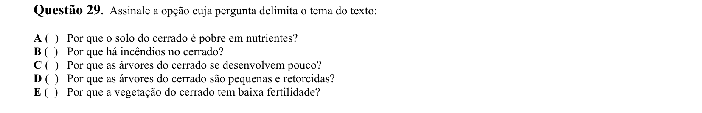

## Q30
**Assunto:** gramática
**Competências:** sintaxe (sujeito e complemento), relações de causalidade
**Tipo:** múltipla escolha

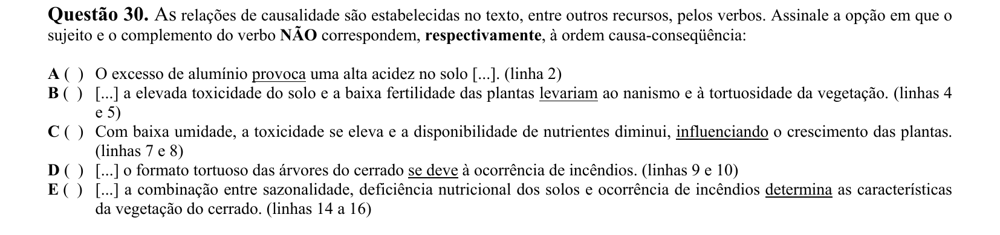

## Q31
**Assunto:** gramática
**Competências:** pontuação (parênteses), funções discursivas
**Tipo:** múltipla escolha

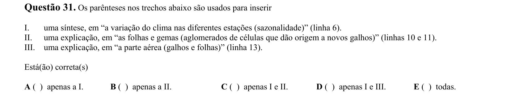

## Q32
**Assunto:** gramática
**Competências:** semântica lexical, acepções de dicionário
**Tipo:** múltipla escolha

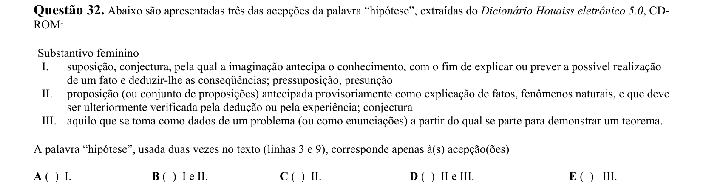

## Q33
**Assunto:** gramática
**Competências:** sintaxe (orações adjetivas), interpretação semântica
**Tipo:** múltipla escolha

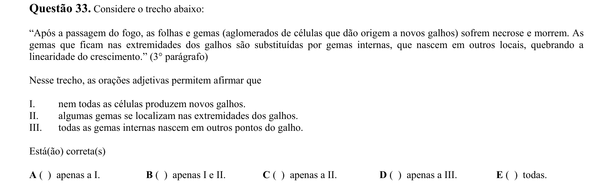

## Q34
**Assunto:** gramática
**Competências:** pontuação (vírgula), efeitos de sentido
**Tipo:** múltipla escolha

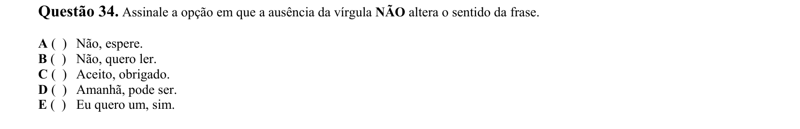

## Q35
**Assunto:** literatura
**Competências:** Manuel Bandeira, Modernismo, lírica amorosa, intertextualidade (quadrinha popular)
**Tipo:** múltipla escolha

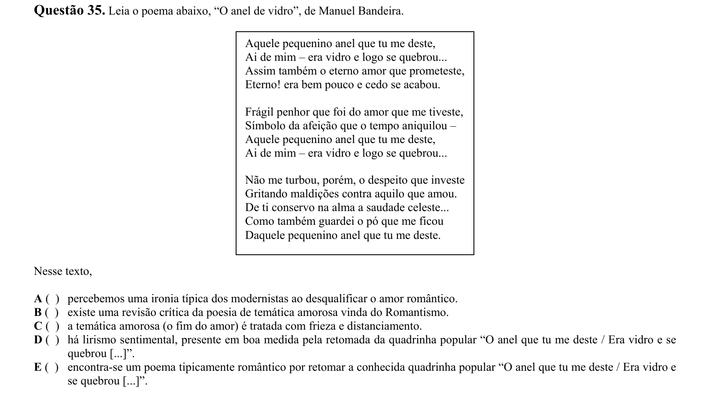

## Q36
**Assunto:** literatura
**Competências:** Cecília Meireles, poesia moderna, ironia/sentimentalismo
**Tipo:** múltipla escolha

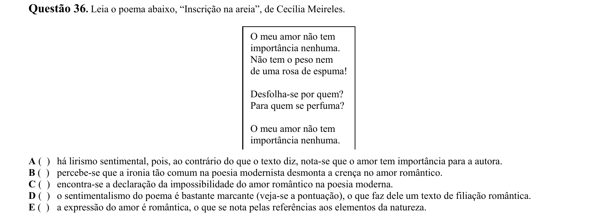

## Q37
**Assunto:** literatura
**Competências:** poesia contemporânea (Chacal), brevidade, informalidade, desencontro amoroso
**Tipo:** múltipla escolha

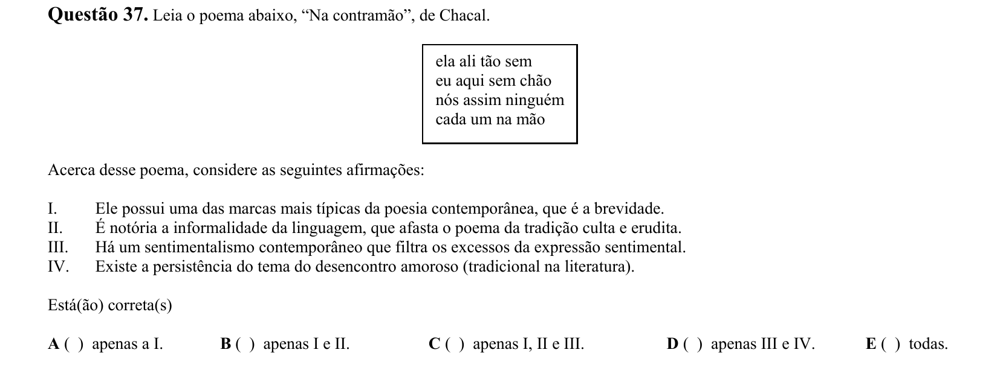

## Q38
**Assunto:** literatura
**Competências:** Romantismo (José de Alencar) x Realismo (Machado de Assis), Senhora, Dom Casmurro, O Guarani
**Tipo:** múltipla escolha

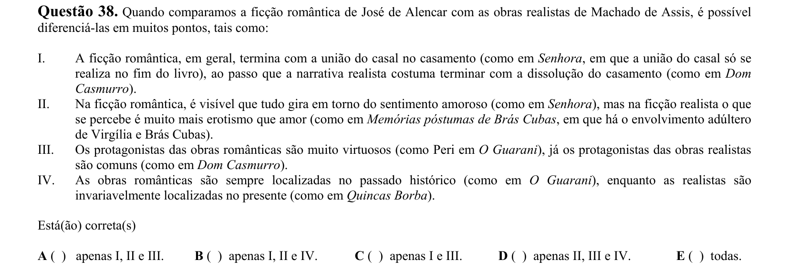

## Q39
**Assunto:** literatura
**Competências:** Realismo século XIX x romance de 30, Machado de Assis, Graciliano Ramos
**Tipo:** múltipla escolha

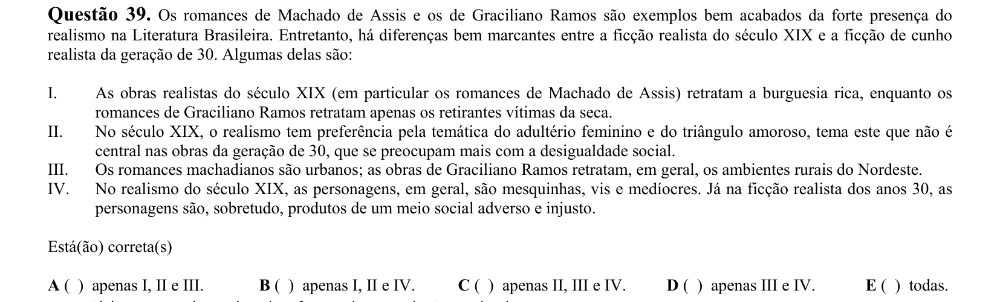

## Q40
**Assunto:** literatura
**Competências:** Guimarães Rosa, "A terceira margem do rio", Primeiras estórias, conto moderno
**Tipo:** múltipla escolha

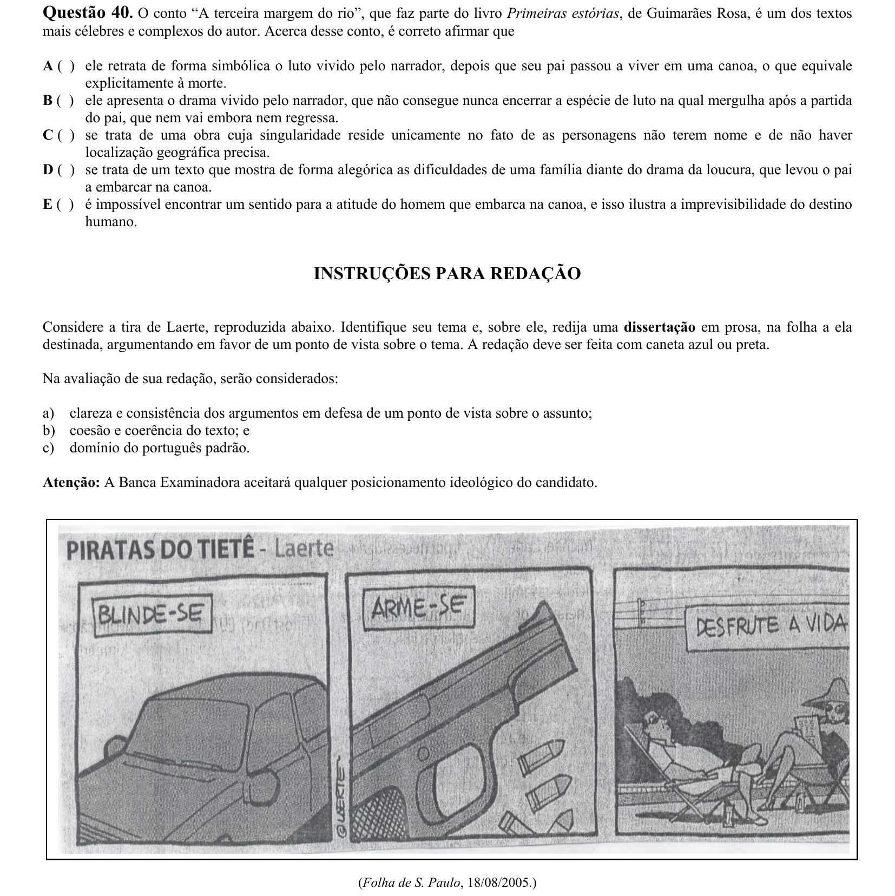
