# Português — ITA 2010

> 20 questões múltipla escolha.

## Q21
**Assunto:** interpretação de texto
**Competências:** compreensão global, ideia central
**Tipo:** múltipla escolha

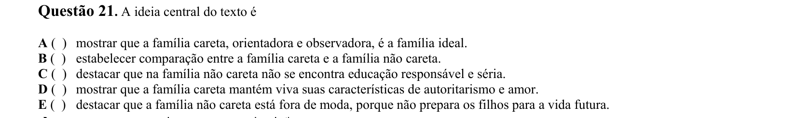

## Q22
**Assunto:** interpretação de texto
**Competências:** conotação, semântica, identificação de pejorativo
**Tipo:** múltipla escolha

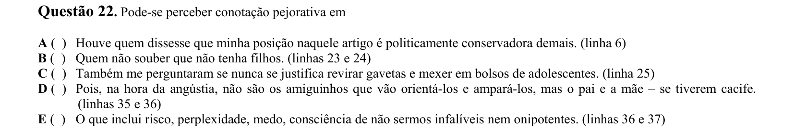

## Q23
**Assunto:** interpretação de texto
**Competências:** análise crítica, afirmações I/II/III/IV
**Tipo:** múltipla escolha

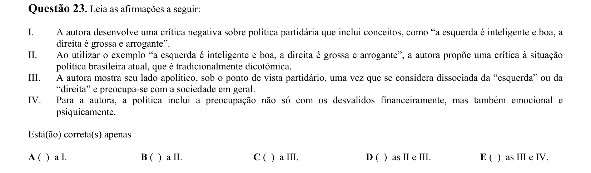

## Q24
**Assunto:** interpretação de texto
**Competências:** referência contextual, intenção autoral
**Tipo:** múltipla escolha

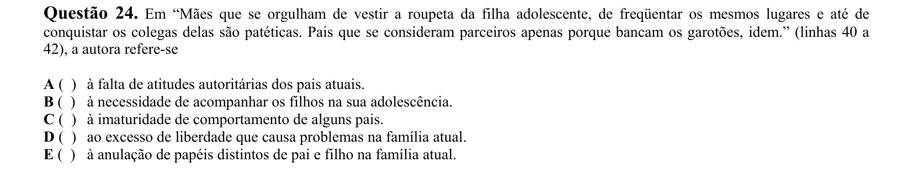

## Q25
**Assunto:** gramática
**Competências:** conjunções, valor semântico da conjunção MAS (aditivo vs. adversativo)
**Tipo:** múltipla escolha

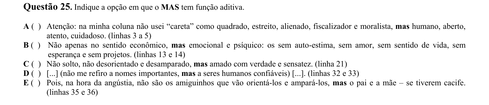

## Q26
**Assunto:** interpretação de texto
**Competências:** ideias do parágrafo, afirmações I/II/III
**Tipo:** múltipla escolha

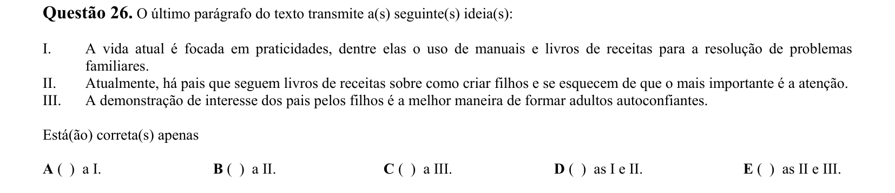

## Q27
**Assunto:** interpretação de texto
**Competências:** intenção discursiva, modalização, identificação de exceção
**Tipo:** múltipla escolha

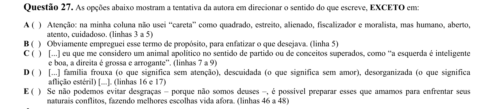

## Q28
**Assunto:** interpretação de texto
**Competências:** referência (substituição de palavra "repito")
**Tipo:** múltipla escolha

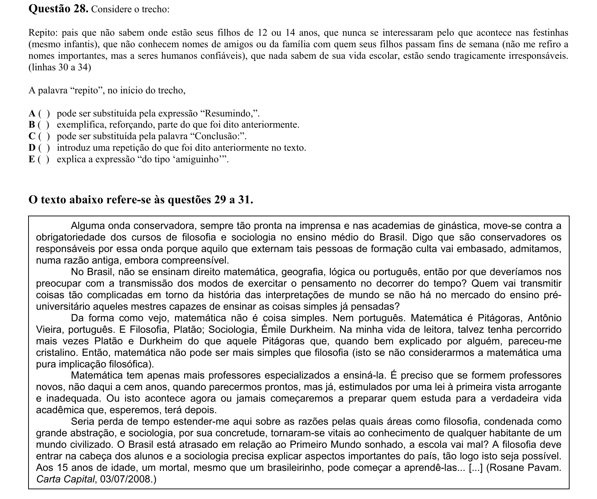

## Q29
**Assunto:** interpretação de texto
**Competências:** argumentação, identificação de argumentos
**Tipo:** múltipla escolha

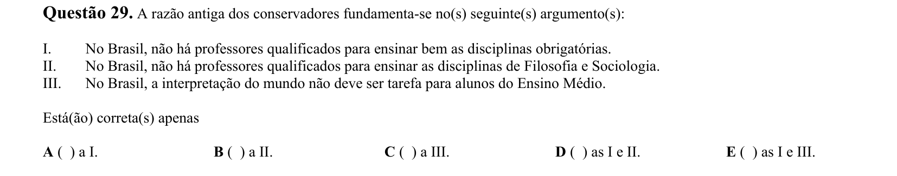

## Q30
**Assunto:** interpretação de texto
**Competências:** estratégias argumentativas, identificação de exceção
**Tipo:** múltipla escolha

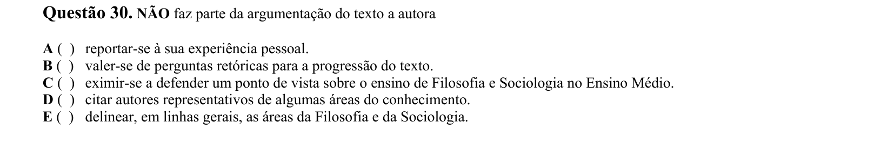

## Q31
**Assunto:** interpretação de texto
**Competências:** semântica, depreciação, juízo de valor
**Tipo:** múltipla escolha

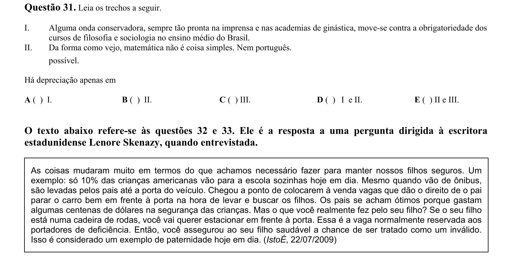

## Q32
**Assunto:** interpretação de texto
**Competências:** tema central, síntese
**Tipo:** múltipla escolha

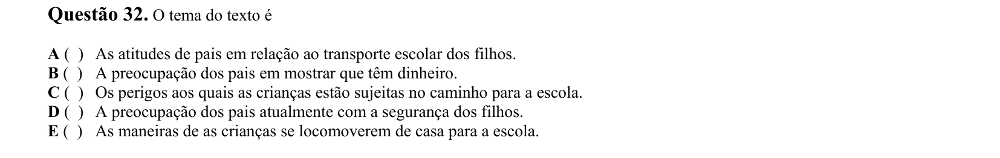

## Q33
**Assunto:** gramática
**Competências:** coesão referencial, anáfora (pronome "isso")
**Tipo:** múltipla escolha

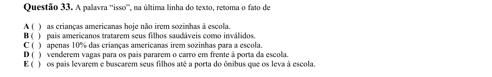

## Q34
**Assunto:** interpretação de texto
**Competências:** leitura de tirinha, ditados populares, linguagem não verbal
**Tipo:** múltipla escolha

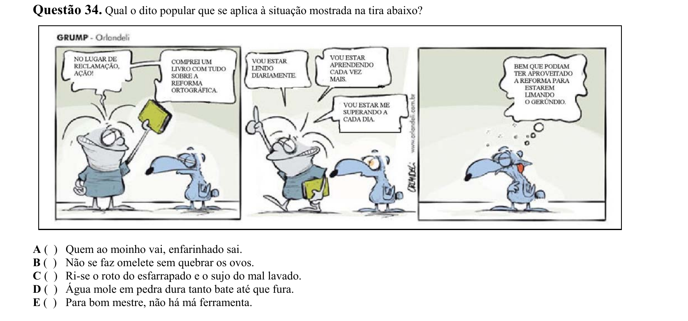

## Q35
**Assunto:** literatura
**Competências:** Machado de Assis, Quincas Borba, realismo, identificação de incorreção
**Tipo:** múltipla escolha

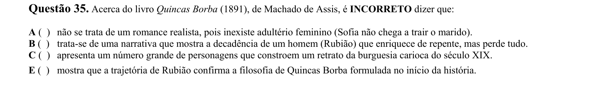

## Q36
**Assunto:** literatura
**Competências:** João Cabral de Melo Neto, Quaderna, análise de poema
**Tipo:** múltipla escolha

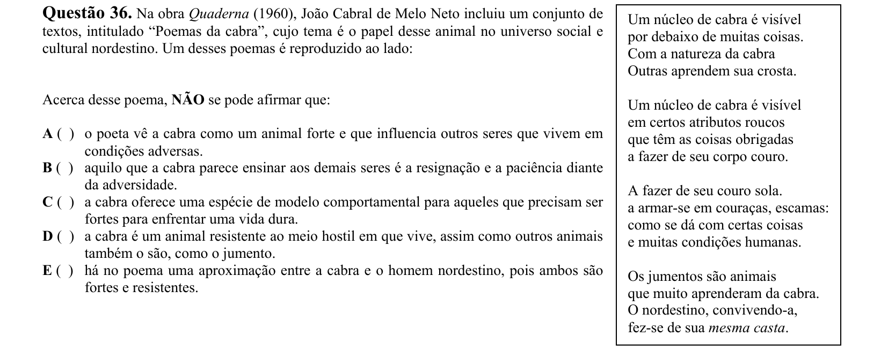

## Q37
**Assunto:** literatura
**Competências:** Clarice Lispector, A Hora da Estrela, narrador, Macabéa
**Tipo:** múltipla escolha

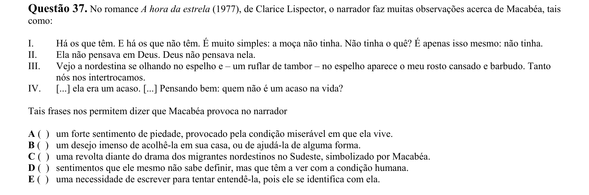

## Q38
**Assunto:** literatura
**Competências:** Manoel de Barros, Livro Sobre Nada, análise de poema
**Tipo:** múltipla escolha

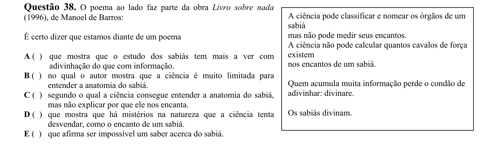

## Q39
**Assunto:** literatura
**Competências:** Graciliano Ramos, São Bernardo, Paulo Honório, identificação de incorreção
**Tipo:** múltipla escolha

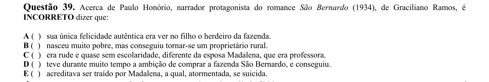

## Q40
**Assunto:** literatura
**Competências:** Orides Fontela, Teia, análise de poema, metáfora, afirmações I/II/III/IV
**Tipo:** múltipla escolha

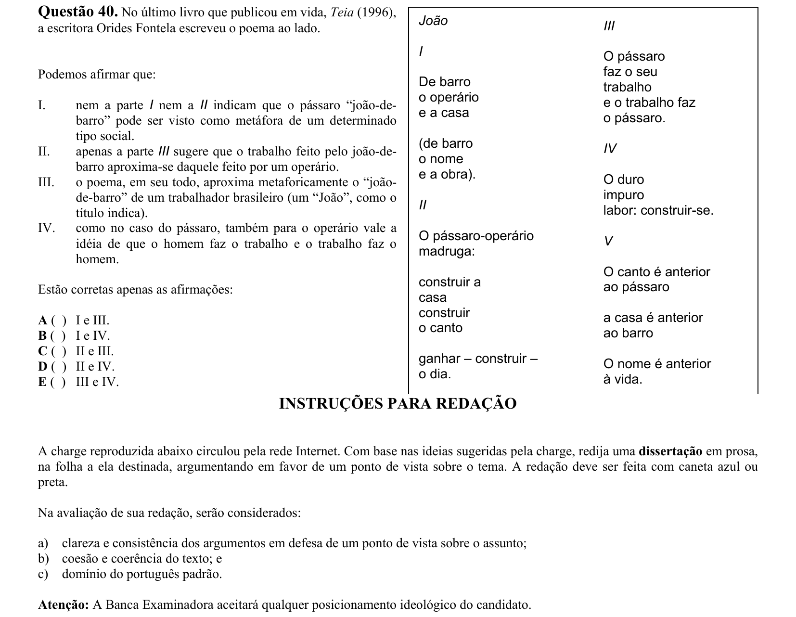
