# Português — ITA 2011

> 20 questões múltipla escolha.

## Q21
**Assunto:** interpretação de texto
**Competências:** compreensão global, inferência
**Tipo:** múltipla escolha

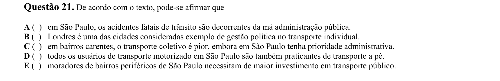

## Q22
**Assunto:** interpretação de texto
**Competências:** inferência, identificação do que NÃO se pode depreender
**Tipo:** múltipla escolha

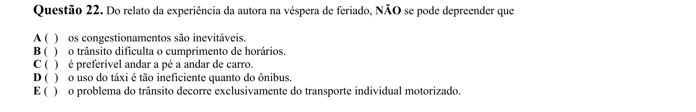

## Q23
**Assunto:** interpretação de texto
**Competências:** ponto de vista do autor, semântica vocabular
**Tipo:** múltipla escolha

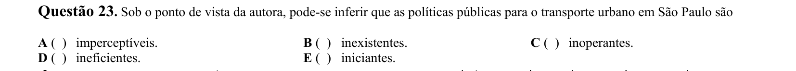

## Q24
**Assunto:** interpretação de texto
**Competências:** análise de título, inferência, afirmações I-IV
**Tipo:** múltipla escolha

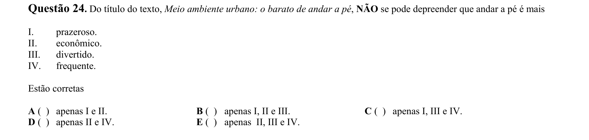

## Q25
**Assunto:** figuras de linguagem
**Competências:** hipérbole, exagero, conotação
**Tipo:** múltipla escolha

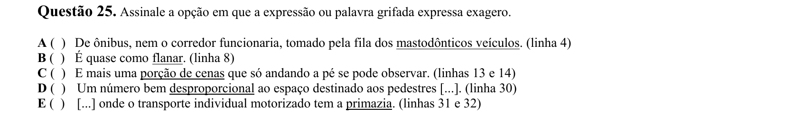

## Q26
**Assunto:** gramática
**Competências:** conjunções, relações lógicas (causa, tempo, concessão)
**Tipo:** múltipla escolha

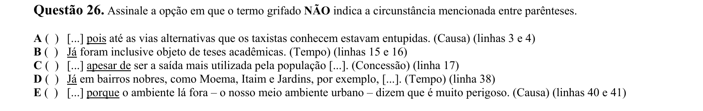

## Q27
**Assunto:** gramática
**Competências:** pronome relativo QUE, referência, antecedente
**Tipo:** múltipla escolha

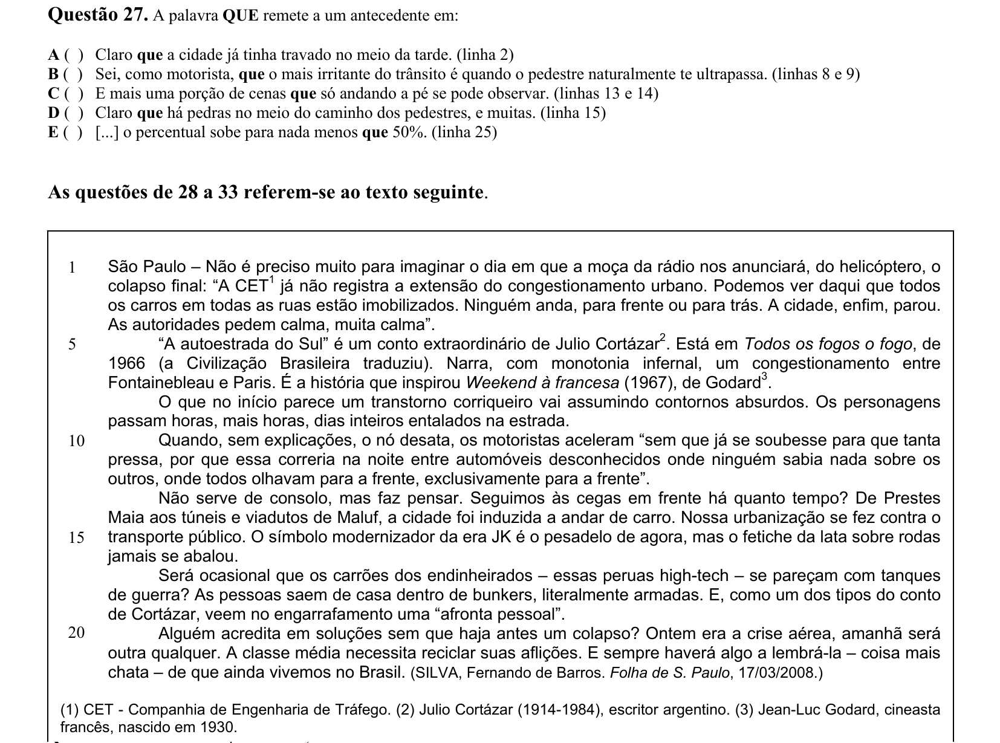

## Q28
**Assunto:** interpretação de texto
**Competências:** compreensão global, identificação de afirmação incorreta
**Tipo:** múltipla escolha

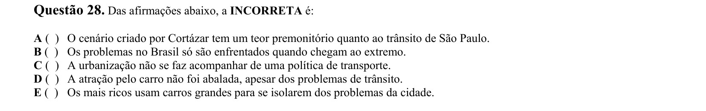

## Q29
**Assunto:** interpretação de texto
**Competências:** ponto de vista do autor, afirmações I-III
**Tipo:** múltipla escolha

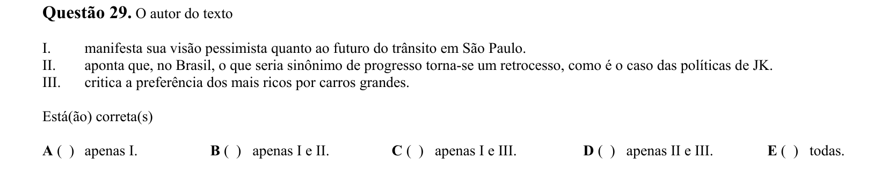

## Q30
**Assunto:** interpretação de texto
**Competências:** julgamento autoral, identificação de subjetividade
**Tipo:** múltipla escolha

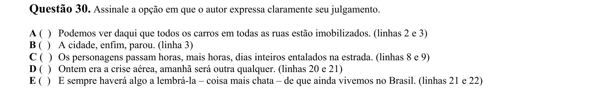

## Q31
**Assunto:** literatura
**Competências:** intertextualidade, função da citação (Cortázar)
**Tipo:** múltipla escolha

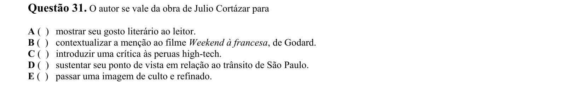

## Q32
**Assunto:** redação técnica
**Competências:** recursos de progressão textual, coesão
**Tipo:** múltipla escolha

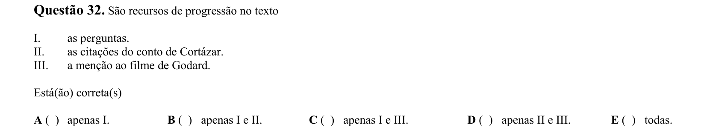

## Q33
**Assunto:** figuras de linguagem
**Competências:** metáfora, identificação de sentido literal/figurado
**Tipo:** múltipla escolha

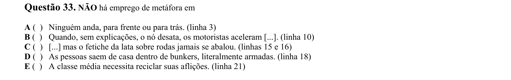

## Q34
**Assunto:** redação técnica
**Competências:** coesão, coerência, ordenação de parágrafos
**Tipo:** múltipla escolha

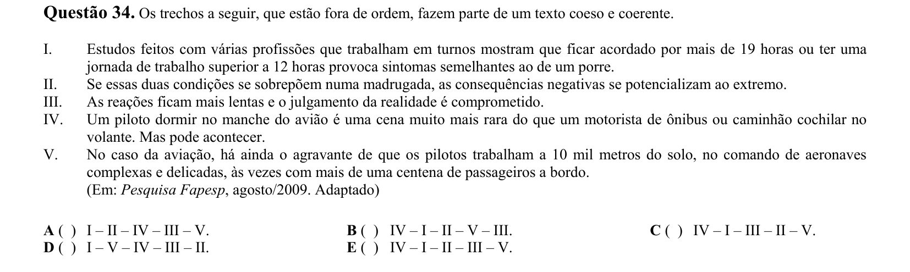

## Q35
**Assunto:** literatura
**Competências:** Romantismo, Iracema (José de Alencar), personagem
**Tipo:** múltipla escolha

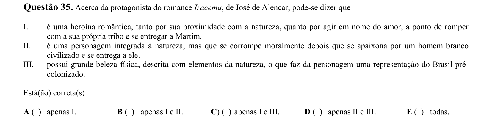

## Q36
**Assunto:** literatura
**Competências:** Modernismo 2ª fase, Capitães da areia (Jorge Amado)
**Tipo:** múltipla escolha

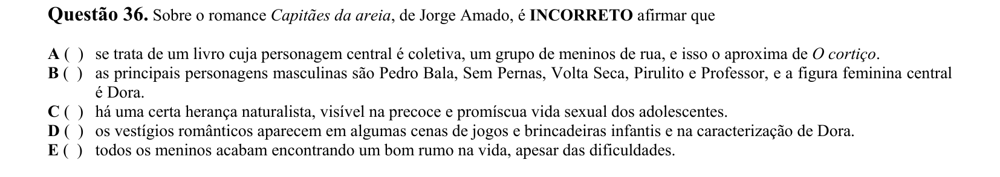

## Q37
**Assunto:** literatura
**Competências:** Drummond, metalinguagem, polissemia, análise de poema
**Tipo:** múltipla escolha

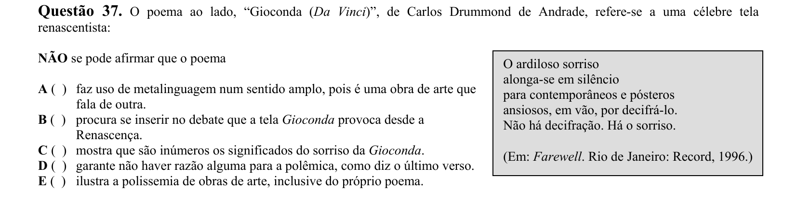

## Q38
**Assunto:** literatura
**Competências:** romance século XIX, Lucíola, Brás Cubas, O cortiço
**Tipo:** múltipla escolha

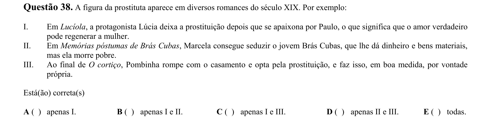

## Q39
**Assunto:** literatura
**Competências:** Adélia Prado, análise de poema, tom confessional
**Tipo:** múltipla escolha

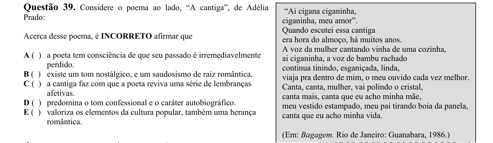

## Q40
**Assunto:** literatura
**Competências:** poesia concreta, Ronaldo Azeredo, visualidade do poema
**Tipo:** múltipla escolha

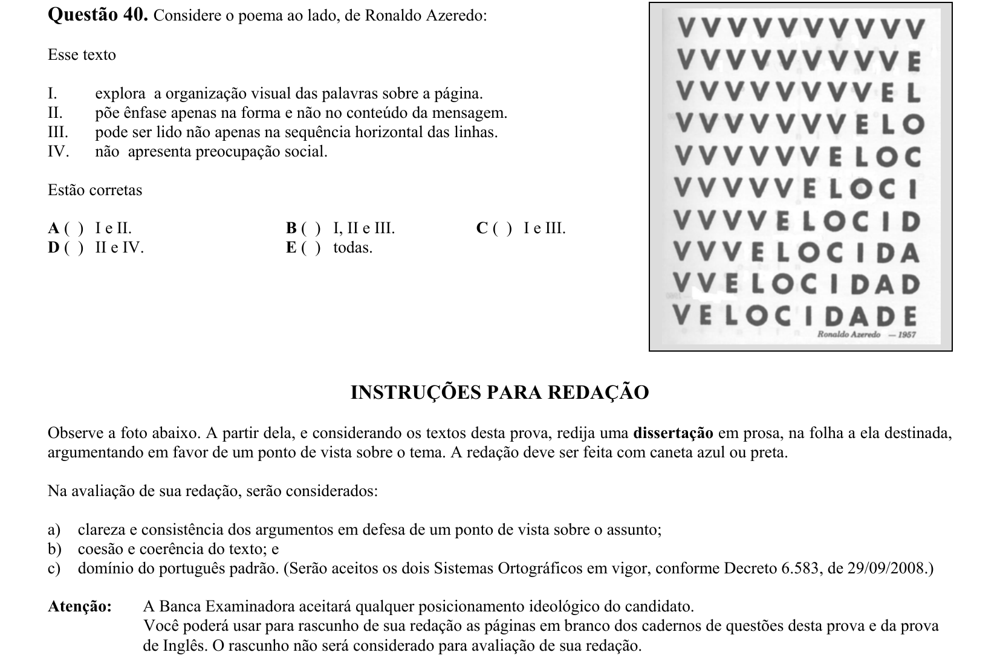
