# Português — ITA 2012

> 20 questões múltipla escolha.

## Q21
**Assunto:** interpretação de texto
**Competências:** ideia central, compreensão global
**Tipo:** múltipla escolha

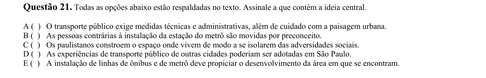

## Q22
**Assunto:** interpretação de texto
**Competências:** inferência, justificativa argumentativa
**Tipo:** múltipla escolha

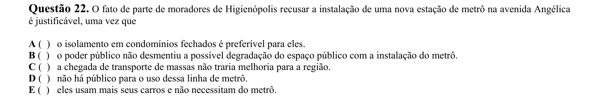

## Q23
**Assunto:** interpretação de texto
**Competências:** análise de afirmações I-III, ponto de vista do autor
**Tipo:** múltipla escolha

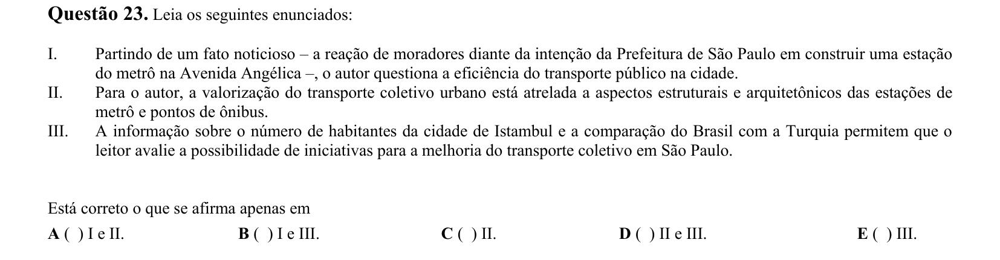

## Q24
**Assunto:** interpretação de texto
**Competências:** pressuposição, identificação do que NÃO se depreende
**Tipo:** múltipla escolha

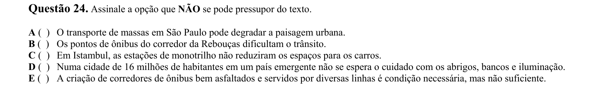

## Q25
**Assunto:** interpretação de texto
**Competências:** avaliação do autor, distinção entre fato e opinião
**Tipo:** múltipla escolha

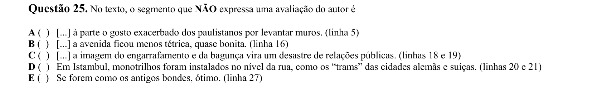

## Q26
**Assunto:** interpretação de texto
**Competências:** semântica vocabular, referenciação, coesão
**Tipo:** múltipla escolha

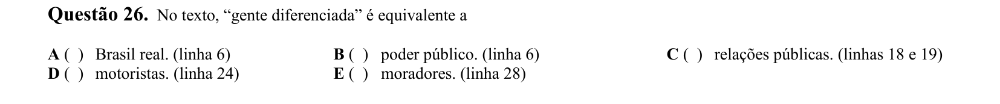

## Q27
**Assunto:** gramática
**Competências:** relações de causa e efeito, conectores, sintaxe
**Tipo:** múltipla escolha

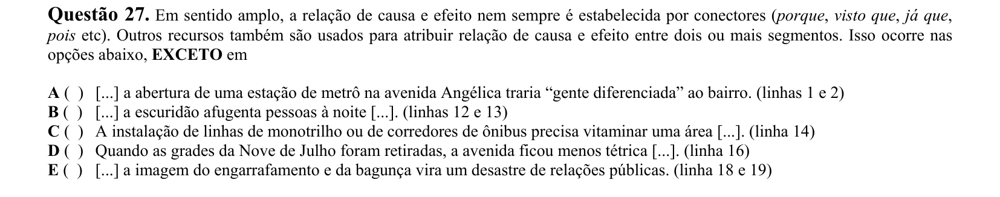

## Q28
**Assunto:** figuras de linguagem
**Competências:** ironia, identificação de recursos retóricos, leitura de manifestações
**Tipo:** múltipla escolha

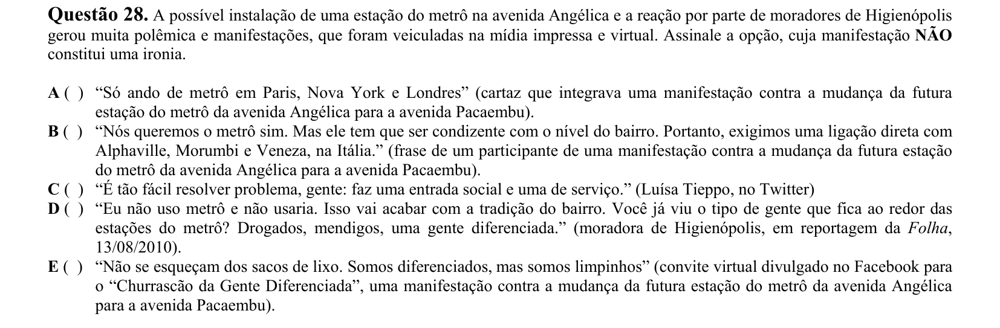

## Q29
**Assunto:** interpretação de texto
**Competências:** intertextualidade texto-imagem, correlação entre textos
**Tipo:** múltipla escolha

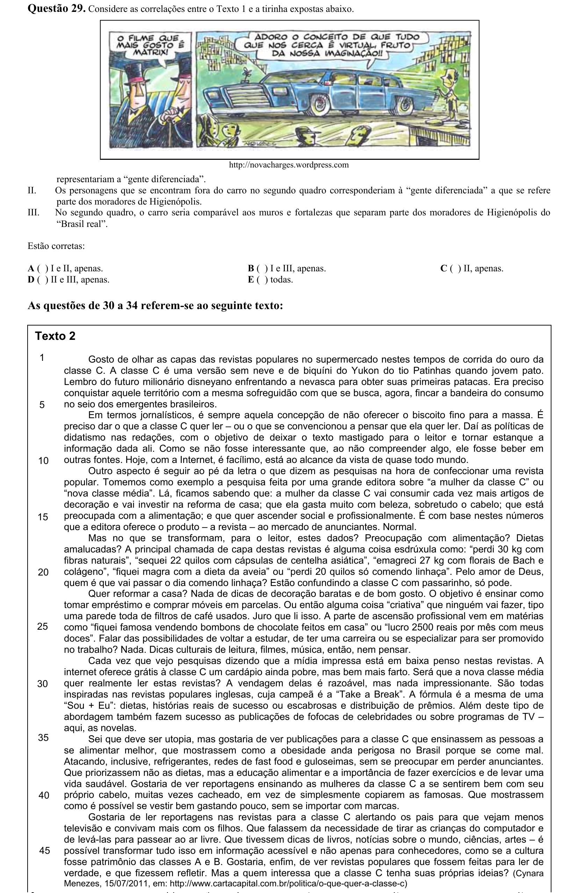

## Q30
**Assunto:** interpretação de texto
**Competências:** crítica autoral, abrangência argumentativa
**Tipo:** múltipla escolha

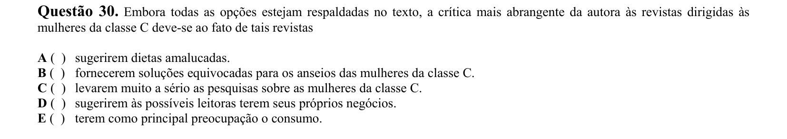

## Q31
**Assunto:** interpretação de texto
**Competências:** análise de afirmações I-IV, ponto de vista da autora
**Tipo:** múltipla escolha

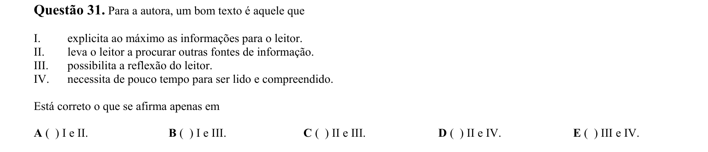

## Q32
**Assunto:** variação linguística
**Competências:** registro formal vs informal, identificação de coloquialismos
**Tipo:** múltipla escolha

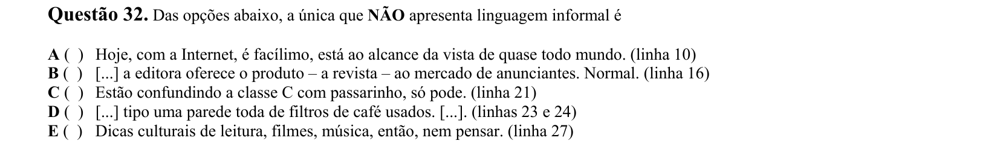

## Q33
**Assunto:** gramática
**Competências:** sintaxe, semântica, ambiguidade, estrutura frasal
**Tipo:** múltipla escolha

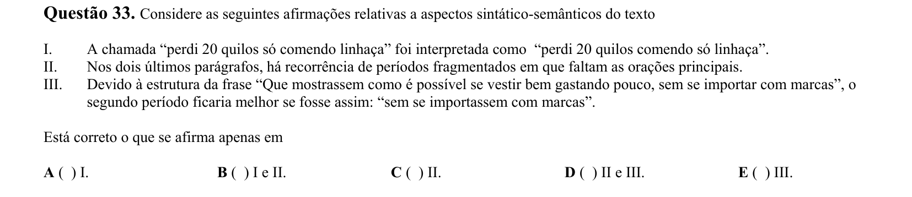

## Q34
**Assunto:** interpretação de texto
**Competências:** diálogo entre textos, temática social
**Tipo:** múltipla escolha

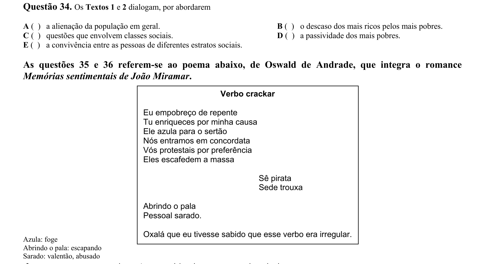

## Q35
**Assunto:** literatura
**Competências:** Modernismo, Oswald de Andrade, proposta estética modernista
**Tipo:** múltipla escolha

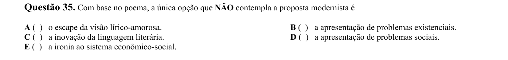

## Q36
**Assunto:** literatura
**Competências:** Oswald de Andrade, Memórias sentimentais de João Miramar, análise de título
**Tipo:** múltipla escolha

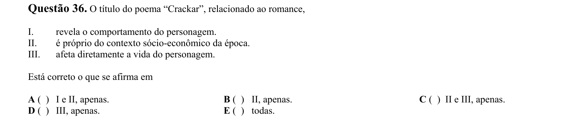

## Q37
**Assunto:** literatura
**Competências:** Machado de Assis, Dom Casmurro, narrador, análise de afirmações I-IV
**Tipo:** múltipla escolha

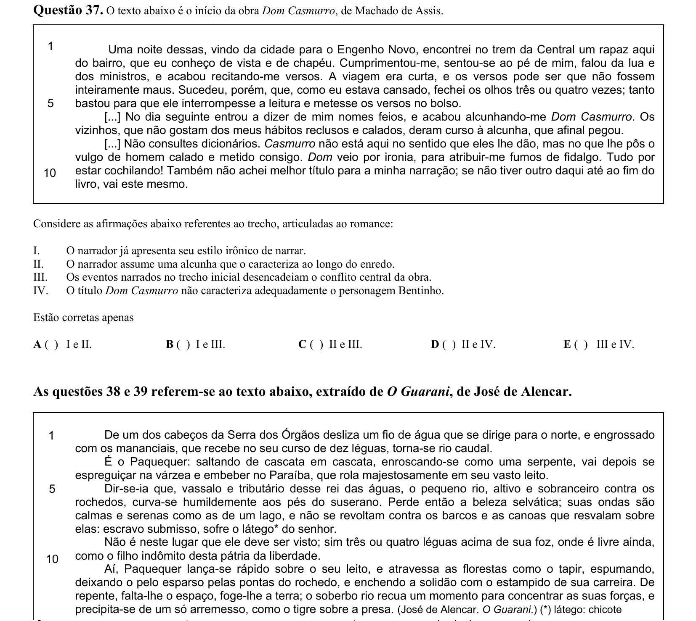

## Q38
**Assunto:** literatura
**Competências:** José de Alencar, O Guarani, Romantismo indianista, conflito narrativo
**Tipo:** múltipla escolha

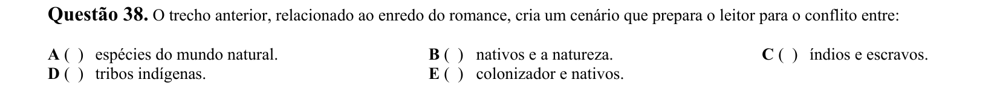

## Q39
**Assunto:** figuras de linguagem
**Competências:** personificação, prosopopeia, análise literária
**Tipo:** múltipla escolha

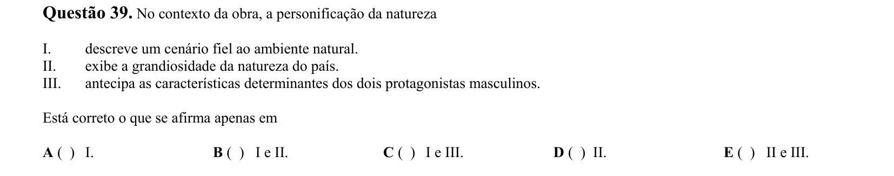

## Q40
**Assunto:** literatura
**Competências:** Ana Cristina César, poesia contemporânea, análise de título, eu-lírico
**Tipo:** múltipla escolha

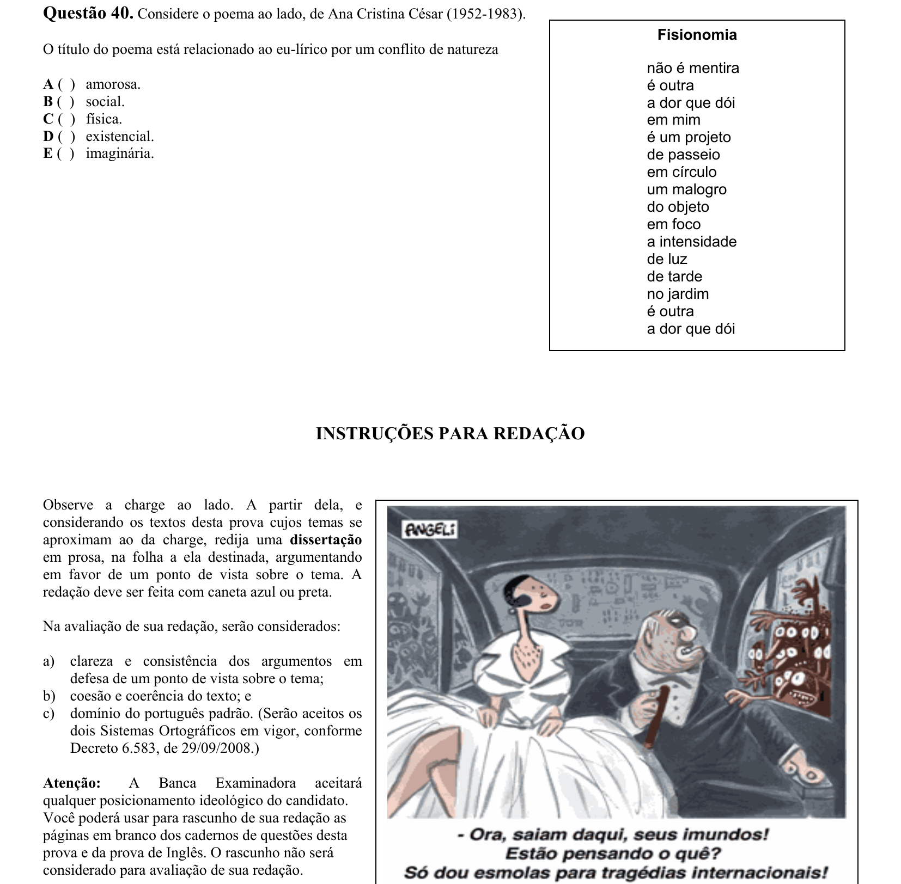
