# Português — ITA 2013

> 20 questões múltipla escolha.

## Q21
**Assunto:** interpretação de texto
**Competências:** identificação do foco crítico, leitura crítica, compreensão global
**Tipo:** múltipla escolha

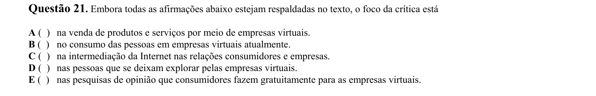

## Q22
**Assunto:** interpretação de texto
**Competências:** identificação de aspecto criticado, leitura analítica, compreensão de argumentos
**Tipo:** múltipla escolha

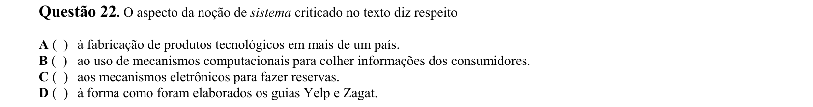

## Q23
**Assunto:** interpretação de texto
**Competências:** distinção entre objetividade e subjetividade, análise discursiva, leitura crítica
**Tipo:** múltipla escolha

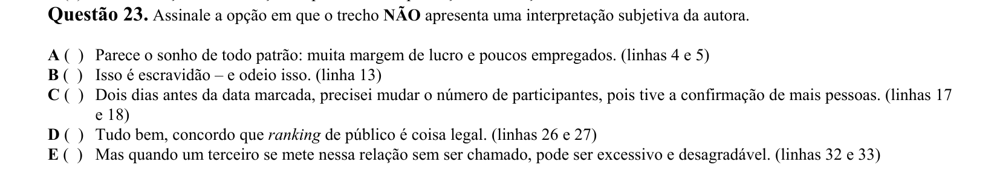

## Q24
**Assunto:** figuras de linguagem
**Competências:** identificação de linguagem figurada, análise estilística, interpretação de recursos expressivos
**Tipo:** múltipla escolha

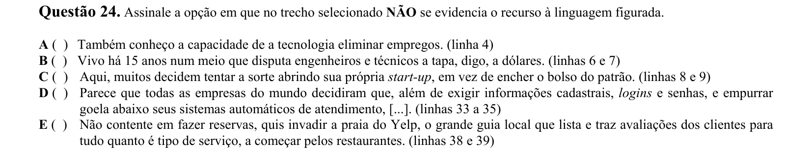

## Q25
**Assunto:** interpretação de texto
**Competências:** identificação de marcas dialógicas, análise de interlocução, leitura crítica
**Tipo:** múltipla escolha

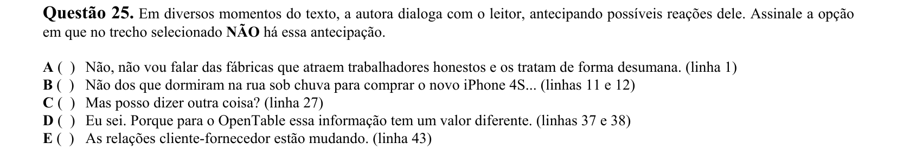

## Q26
**Assunto:** interpretação de texto
**Competências:** identificação de referente, análise semântica, leitura contextual
**Tipo:** múltipla escolha

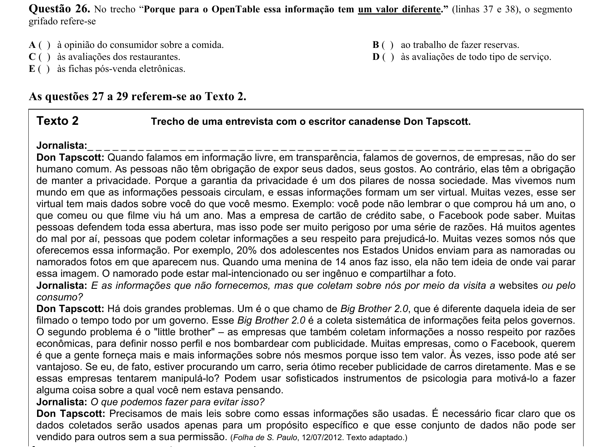

## Q27
**Assunto:** interpretação de texto
**Competências:** compreensão de entrevista, análise de argumentos, leitura crítica
**Tipo:** múltipla escolha

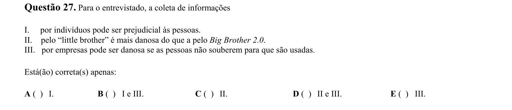

## Q28
**Assunto:** interpretação de texto
**Competências:** análise pergunta-resposta, coerência discursiva, leitura crítica
**Tipo:** múltipla escolha

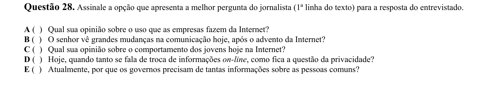

## Q29
**Assunto:** variação linguística
**Competências:** distinção oralidade/escrita, análise de registro formal, uso de pronomes
**Tipo:** múltipla escolha

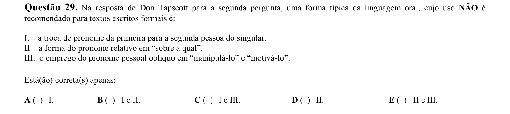

## Q30
**Assunto:** interpretação de texto
**Competências:** comparação entre textos, identificação de tema comum, leitura crítica
**Tipo:** múltipla escolha

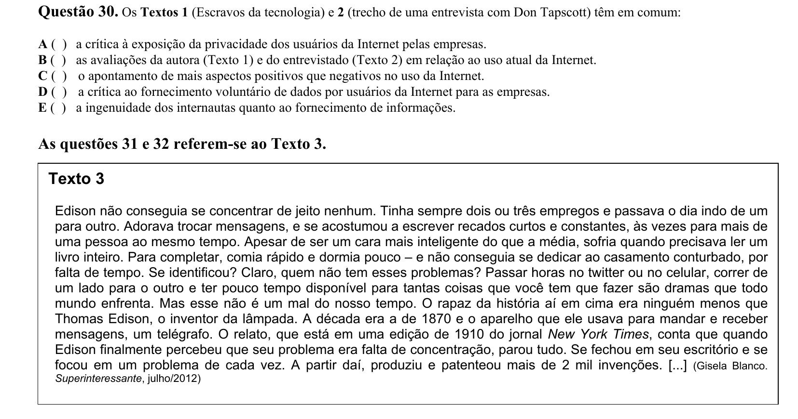

## Q31
**Assunto:** interpretação de texto
**Competências:** identificação do tema, compreensão global, síntese
**Tipo:** múltipla escolha

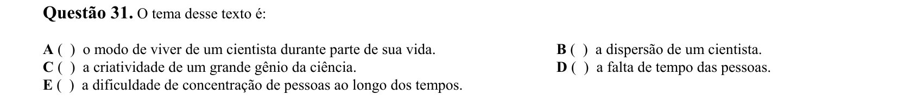

## Q32
**Assunto:** gramática
**Competências:** pontuação, aposto, análise sintática
**Tipo:** múltipla escolha

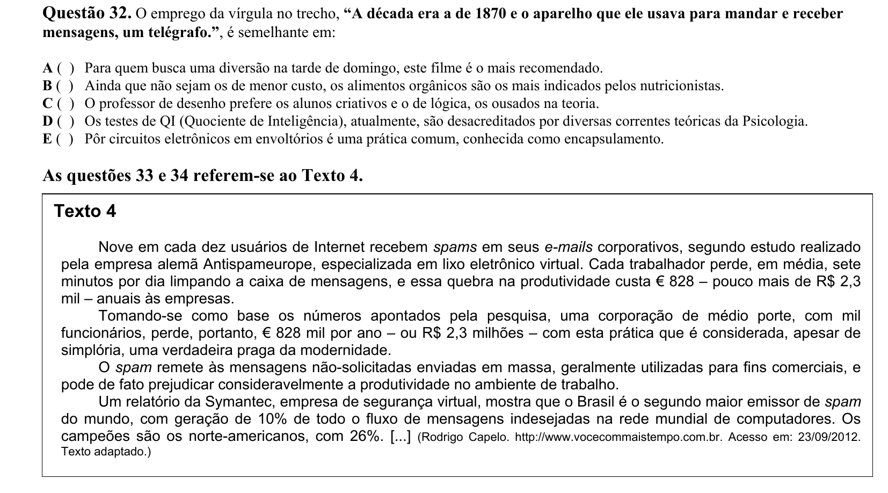

## Q33
**Assunto:** interpretação de texto
**Competências:** identificação de título adequado, compreensão global, síntese
**Tipo:** múltipla escolha

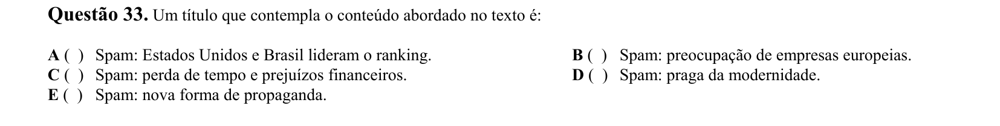

## Q34
**Assunto:** gramática
**Competências:** substituição de expressões, conectivos concessivos, equivalência semântica
**Tipo:** múltipla escolha

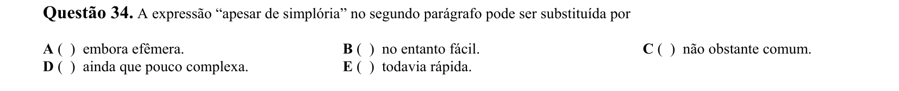

## Q35
**Assunto:** literatura
**Competências:** análise de conto machadiano, interpretação de personagem, leitura crítica
**Tipo:** múltipla escolha

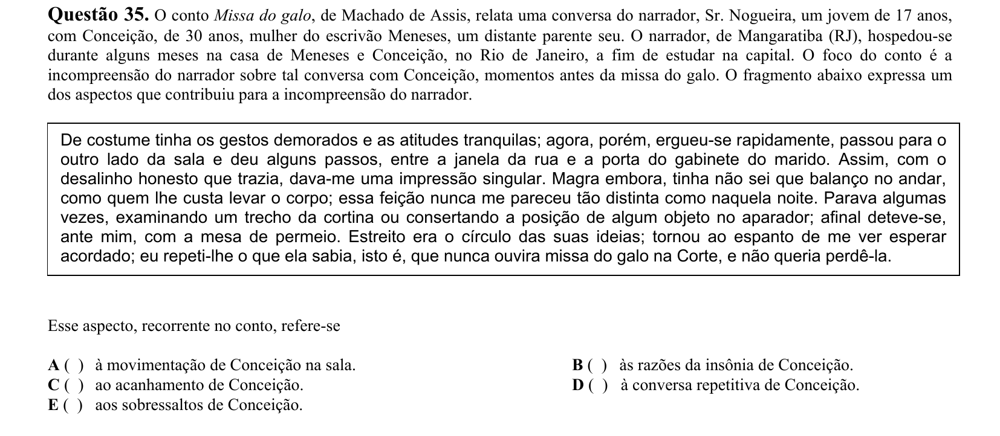

## Q36
**Assunto:** literatura
**Competências:** identificação de obra/autor, pré-romantismo brasileiro, contexto literário
**Tipo:** múltipla escolha

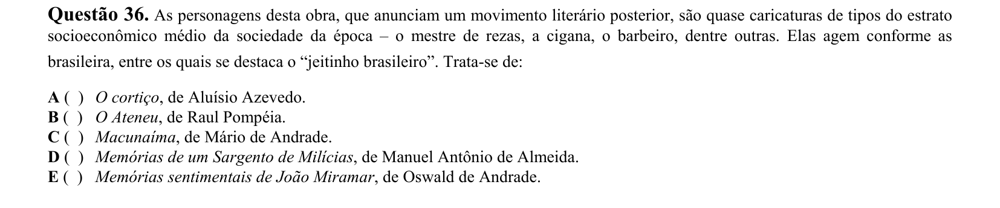

## Q37
**Assunto:** literatura
**Competências:** identificação de escola literária, simbolismo, análise estilística
**Tipo:** múltipla escolha

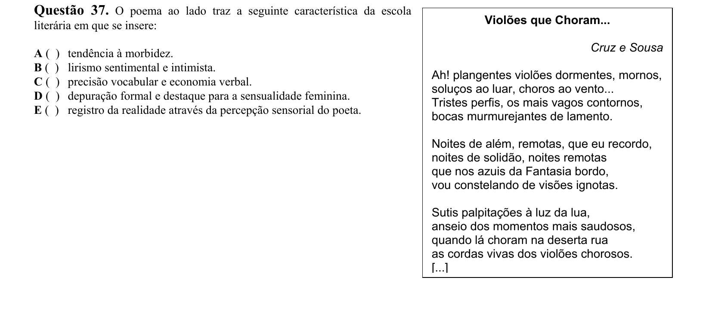

## Q38
**Assunto:** literatura
**Competências:** análise de poesia regionalista, identificação de voz lírica, interpretação
**Tipo:** múltipla escolha

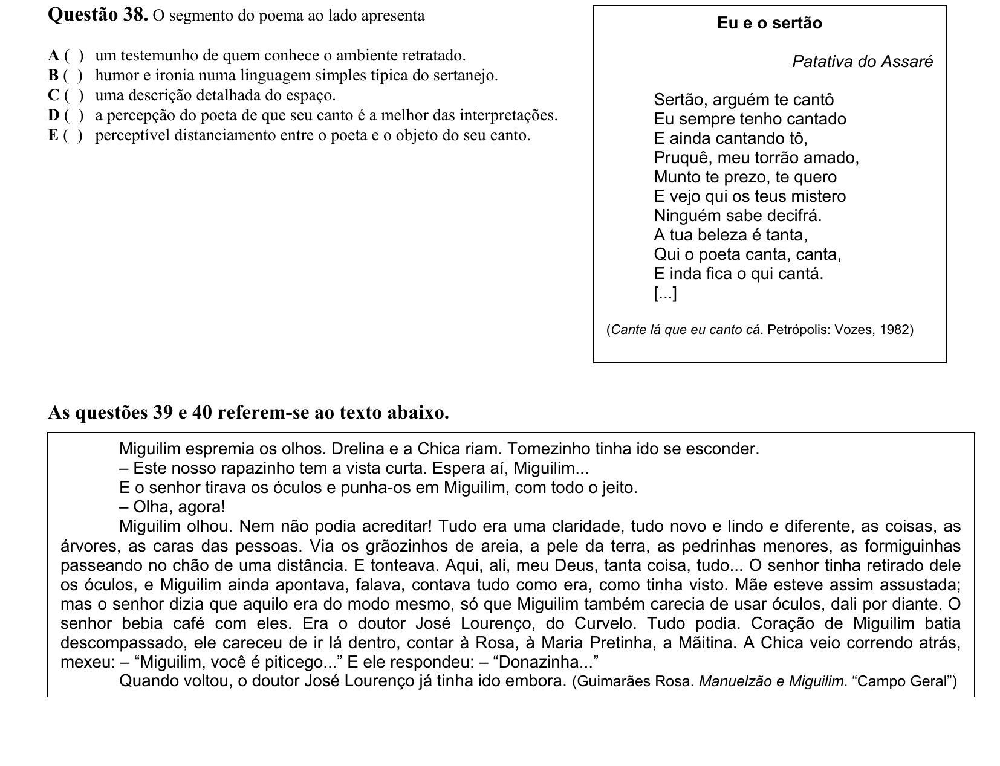

## Q39
**Assunto:** literatura
**Competências:** análise de narrativa, foco narrativo, Guimarães Rosa
**Tipo:** múltipla escolha

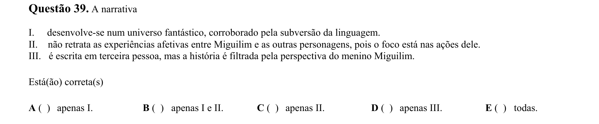

## Q40
**Assunto:** gramática
**Competências:** análise de diminutivos, morfologia, valor semântico de sufixos
**Tipo:** múltipla escolha

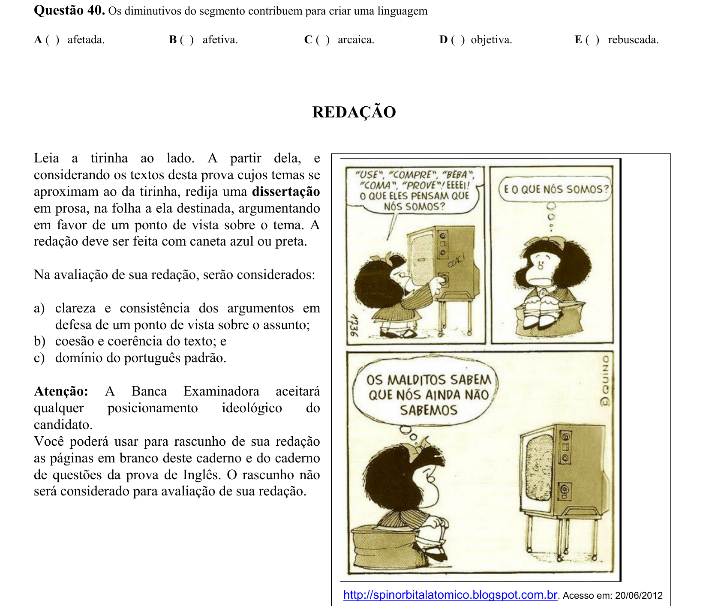
