# Português — ITA 2014

> 20 questões múltipla escolha.

## Q21
**Assunto:** interpretação de texto
**Competências:** identificação do tema central, escolha de título, leitura global
**Tipo:** múltipla escolha

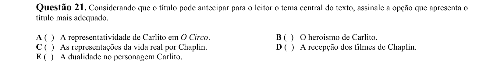

## Q22
**Assunto:** interpretação de texto
**Competências:** compreensão de causalidade, análise de argumentos, leitura inferencial
**Tipo:** múltipla escolha

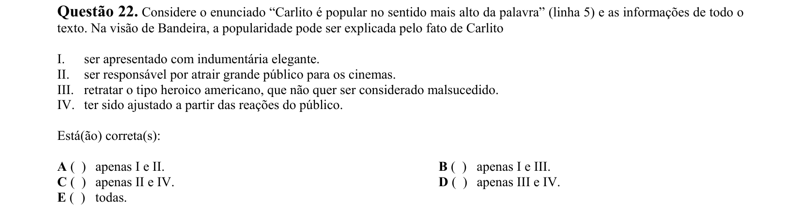

## Q23
**Assunto:** gramática
**Competências:** coesão textual, conectivos, relações semântico-sintáticas
**Tipo:** múltipla escolha

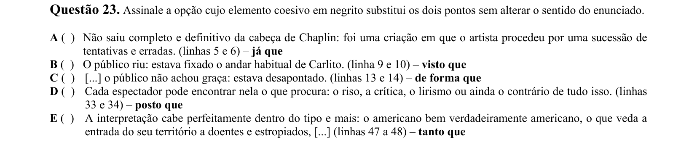

## Q24
**Assunto:** interpretação de texto
**Competências:** leitura analítica, reconhecimento de tese, síntese
**Tipo:** múltipla escolha

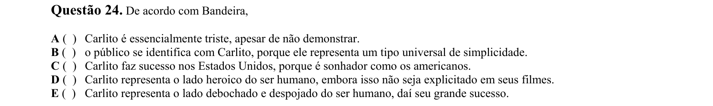

## Q25
**Assunto:** interpretação de texto
**Competências:** compreensão global, inferência, análise crítica
**Tipo:** múltipla escolha

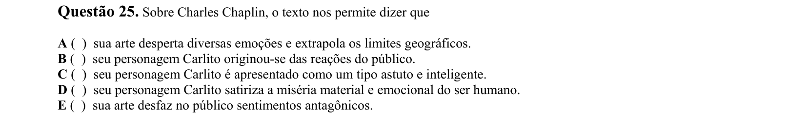

## Q26
**Assunto:** gramática
**Competências:** referenciação, coesão lexical, retomada anafórica
**Tipo:** múltipla escolha

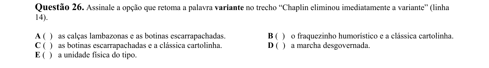

## Q27
**Assunto:** gramática
**Competências:** classes de palavras, valor adjetival, morfossintaxe
**Tipo:** múltipla escolha

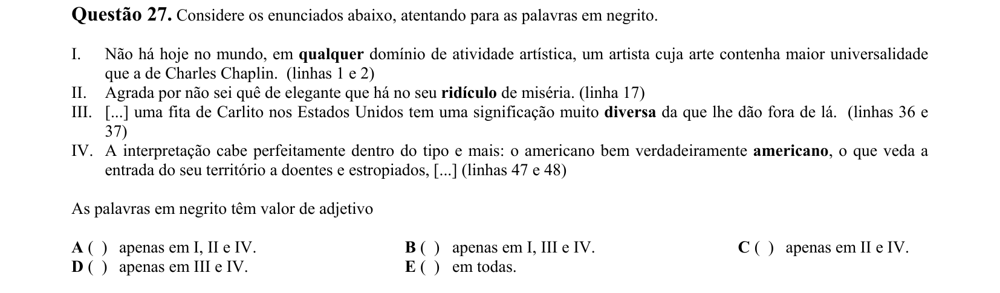

## Q28
**Assunto:** interpretação de texto
**Competências:** análise de causalidade, leitura crítica, compreensão argumentativa
**Tipo:** múltipla escolha

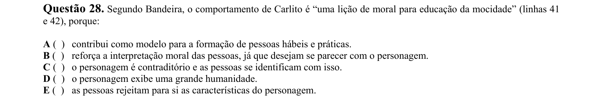

## Q29
**Assunto:** interpretação de texto
**Competências:** identificação de conceito, leitura inferencial, síntese
**Tipo:** múltipla escolha

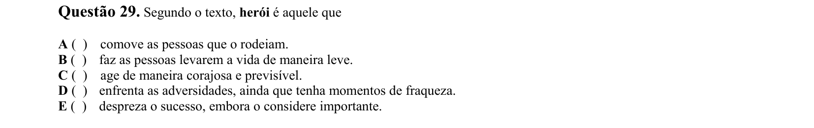

## Q30
**Assunto:** interpretação de texto
**Competências:** análise da estrutura textual, identificação de estratégias discursivas, leitura crítica
**Tipo:** múltipla escolha

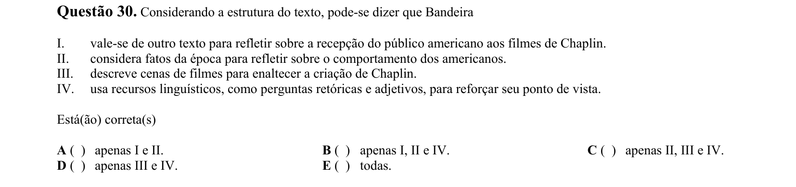

## Q31
**Assunto:** interpretação de texto
**Competências:** inferência, análise de visão de mundo, leitura crítica
**Tipo:** múltipla escolha

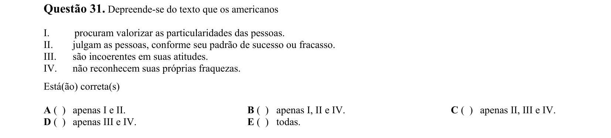

## Q32
**Assunto:** interpretação de texto
**Competências:** avaliação de juízo do autor, leitura analítica, comparação de afirmações
**Tipo:** múltipla escolha

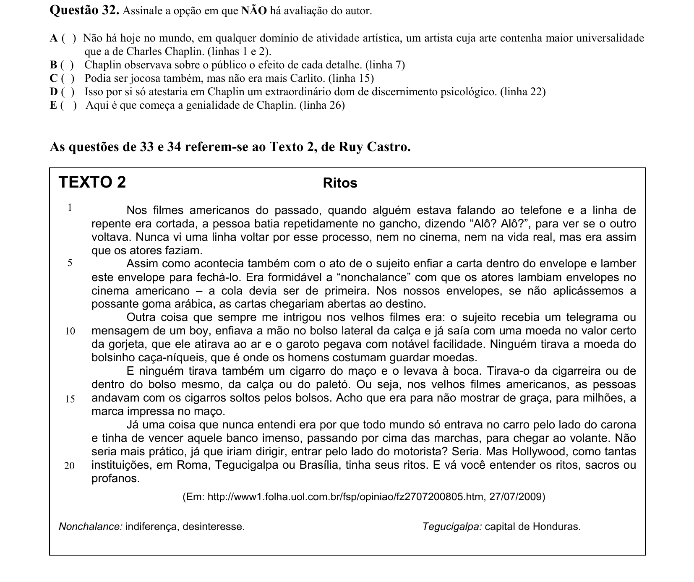

## Q33
**Assunto:** interpretação de texto
**Competências:** identificação de objeto crítico, leitura global, análise discursiva
**Tipo:** múltipla escolha

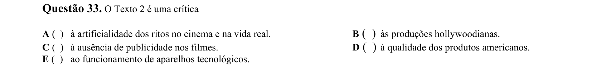

## Q34
**Assunto:** interpretação de texto
**Competências:** análise comparativa de textos, intertextualidade, síntese
**Tipo:** múltipla escolha

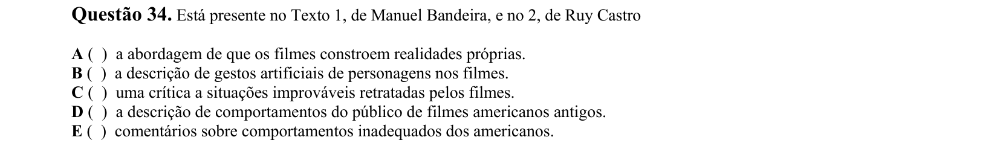

## Q35
**Assunto:** literatura
**Competências:** Romantismo brasileiro, José de Alencar, análise de Lucíola
**Tipo:** múltipla escolha

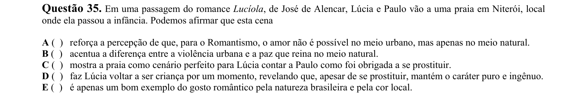

## Q36
**Assunto:** literatura
**Competências:** Modernismo brasileiro, Graciliano Ramos, análise de Vidas Secas
**Tipo:** múltipla escolha

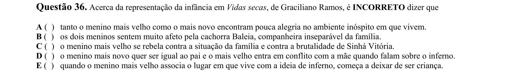

## Q37
**Assunto:** literatura
**Competências:** poesia de Cecília Meireles, análise de poema, figuras de linguagem
**Tipo:** múltipla escolha

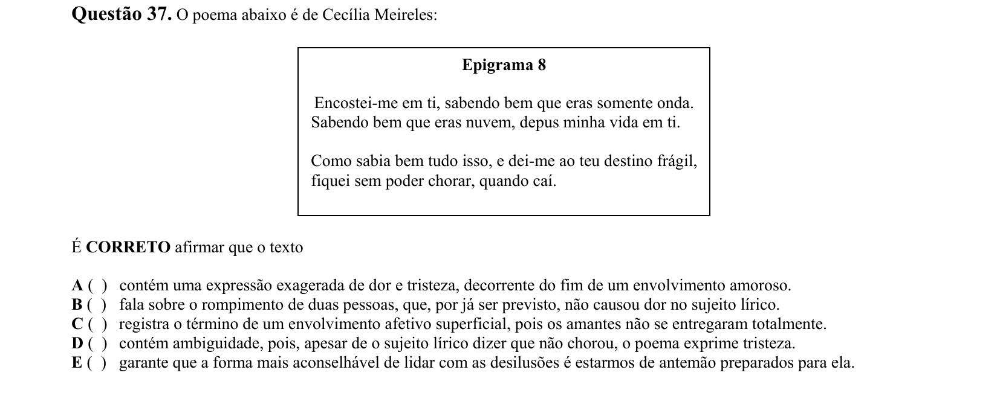

## Q38
**Assunto:** literatura
**Competências:** romance regionalista, Jorge Amado, análise de Gabriela cravo e canela
**Tipo:** múltipla escolha

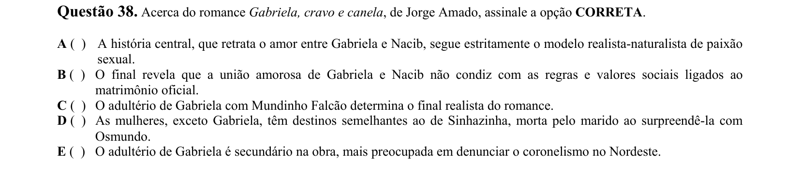

## Q39
**Assunto:** literatura
**Competências:** poesia contemporânea, Paulo Leminski, análise de haicai
**Tipo:** múltipla escolha

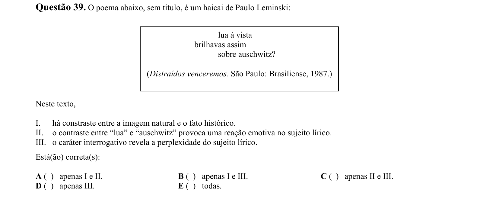

## Q40
**Assunto:** literatura
**Competências:** Carlos Drummond de Andrade, relação texto-pintura, análise intersemiótica
**Tipo:** múltipla escolha

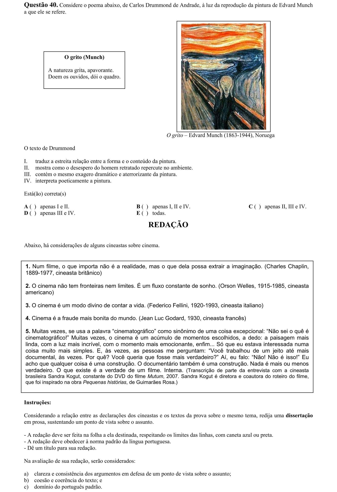
