# Português — ITA 2015

> 20 questões múltipla escolha.

## Q21
**Assunto:** interpretação de texto
**Competências:** identificação de tese, intenção autoral, leitura crítica
**Tipo:** múltipla escolha

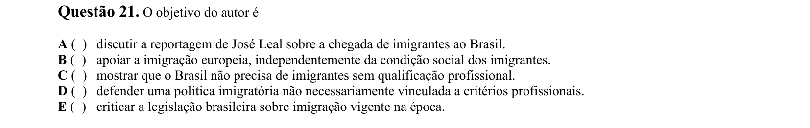

## Q22
**Assunto:** interpretação de texto
**Competências:** análise argumentativa, ponto de vista do autor, leitura crítica
**Tipo:** múltipla escolha

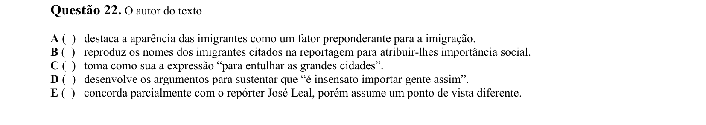

## Q23
**Assunto:** interpretação de texto
**Competências:** análise argumentativa, inferência, leitura crítica
**Tipo:** múltipla escolha

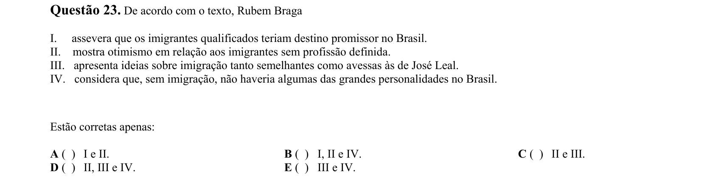

## Q24
**Assunto:** interpretação de texto
**Competências:** análise argumentativa, intertextualidade, citação
**Tipo:** múltipla escolha

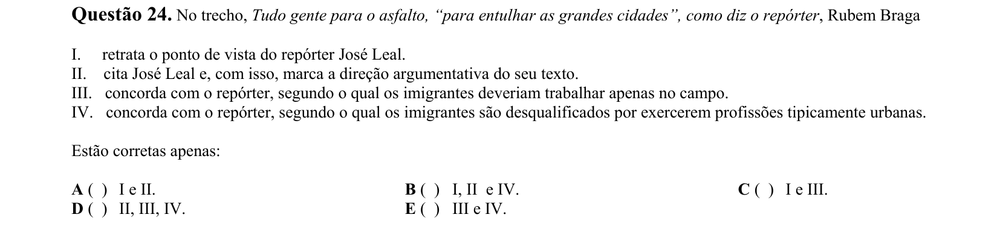

## Q25
**Assunto:** gramática
**Competências:** classes de palavras, conjunções, sintaxe
**Tipo:** múltipla escolha

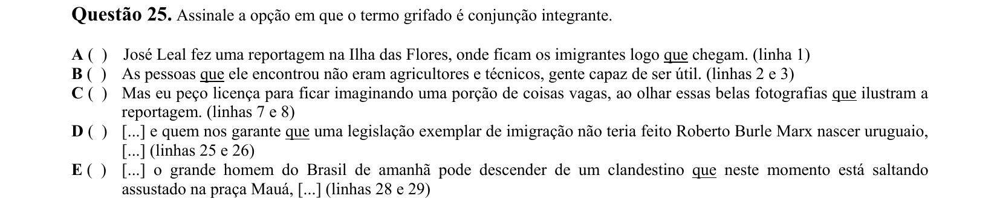

## Q26
**Assunto:** gramática
**Competências:** coesão referencial, anáfora, sintaxe
**Tipo:** múltipla escolha

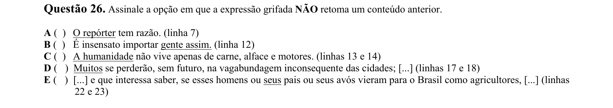

## Q27
**Assunto:** gramática
**Competências:** pontuação, normas gramaticais, sintaxe
**Tipo:** múltipla escolha

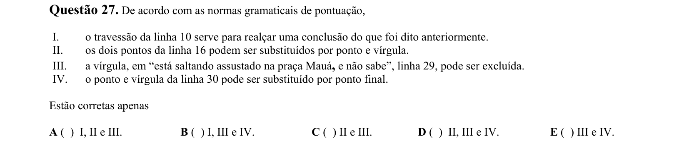

## Q28
**Assunto:** figuras de linguagem
**Competências:** metonímia, semântica, figuras de palavras
**Tipo:** múltipla escolha

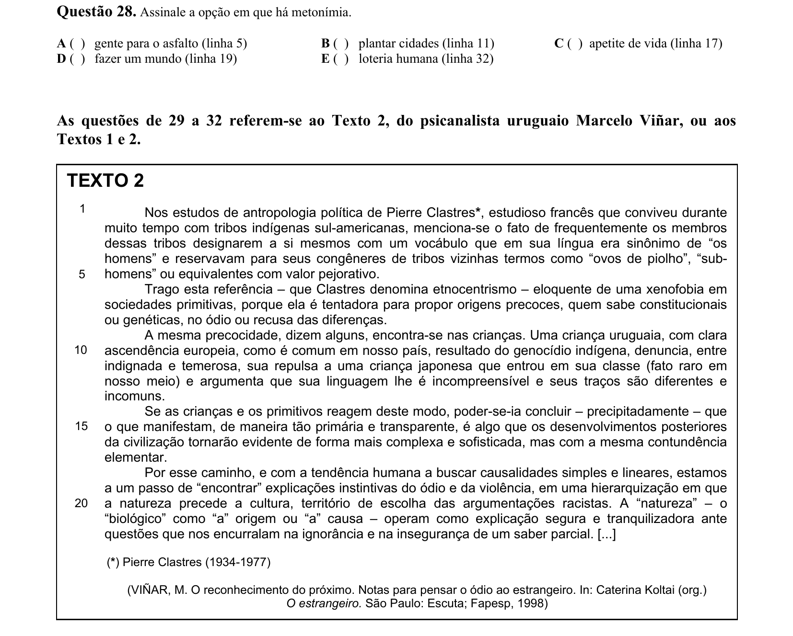

## Q29
**Assunto:** interpretação de texto
**Competências:** comparação entre textos, tema, leitura crítica
**Tipo:** múltipla escolha

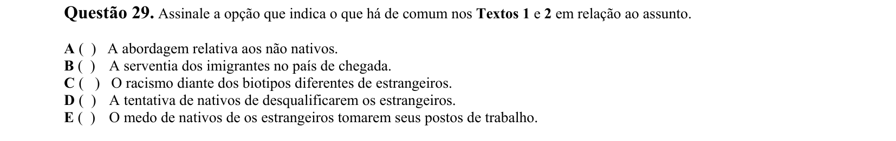

## Q30
**Assunto:** interpretação de texto
**Competências:** estratégias argumentativas, comparação entre textos, retórica
**Tipo:** múltipla escolha

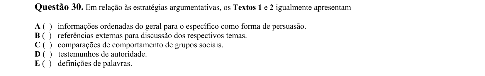

## Q31
**Assunto:** interpretação de texto
**Competências:** inferência, leitura crítica, análise conceitual
**Tipo:** múltipla escolha

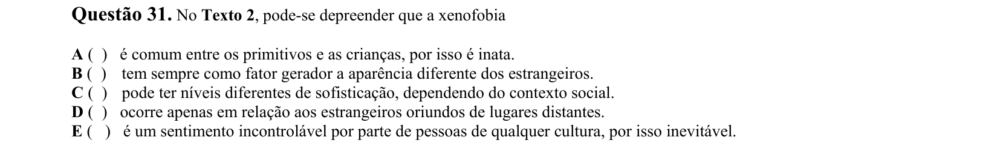

## Q32
**Assunto:** gramática
**Competências:** pronomes pessoais, dêixis, multimodalidade
**Tipo:** múltipla escolha

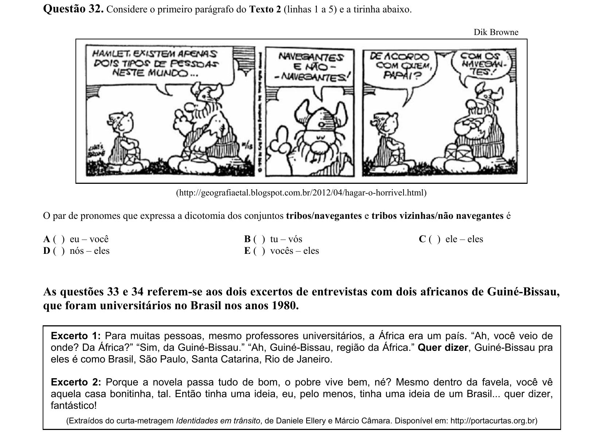

## Q33
**Assunto:** variação linguística
**Competências:** representação cultural, estereótipos, análise discursiva
**Tipo:** múltipla escolha

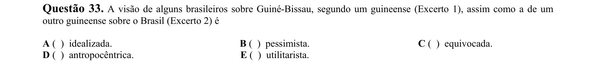

## Q34
**Assunto:** gramática
**Competências:** marcadores discursivos, semântica, coesão
**Tipo:** múltipla escolha

## Q35
**Assunto:** literatura
**Competências:** Machado de Assis, Dom Casmurro, Realismo
**Tipo:** múltipla escolha

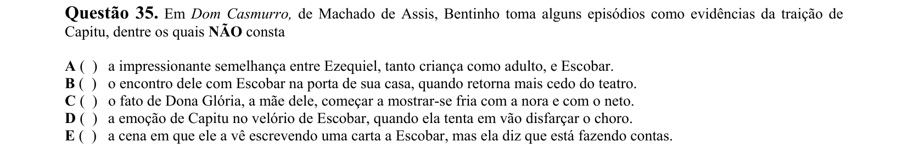

## Q36
**Assunto:** literatura
**Competências:** José de Alencar, Senhora, Romantismo
**Tipo:** múltipla escolha

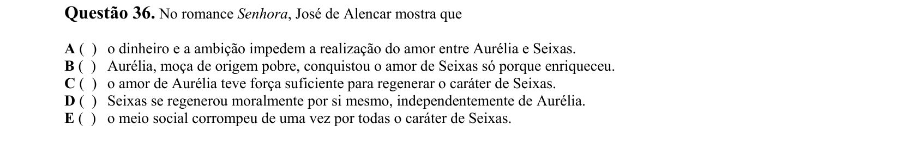

## Q37
**Assunto:** literatura
**Competências:** Clarice Lispector, A hora da estrela, Modernismo
**Tipo:** múltipla escolha

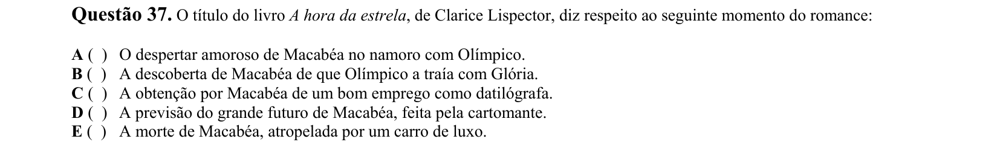

## Q38
**Assunto:** literatura
**Competências:** Manuel Bandeira, poesia modernista, análise poética
**Tipo:** múltipla escolha

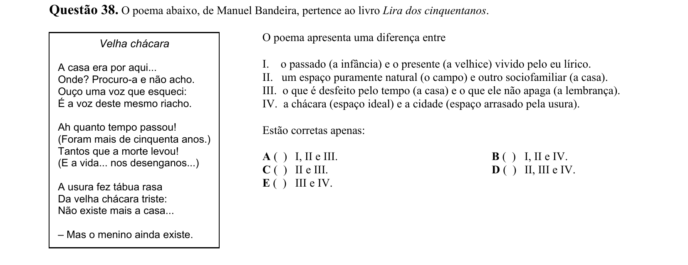

## Q39
**Assunto:** literatura
**Competências:** João Cabral de Melo Neto, poesia, figuras de linguagem
**Tipo:** múltipla escolha

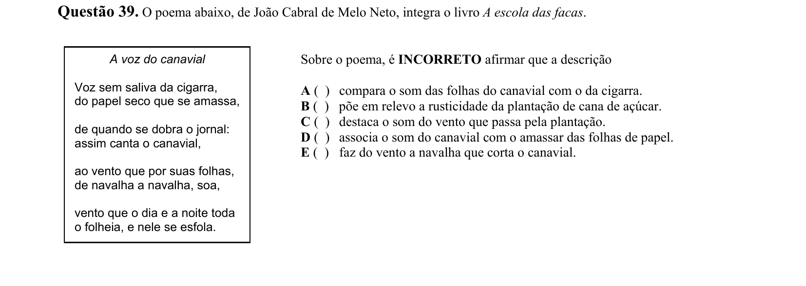

## Q40
**Assunto:** literatura
**Competências:** poesia modernista, Alice Ruiz, análise poética
**Tipo:** múltipla escolha

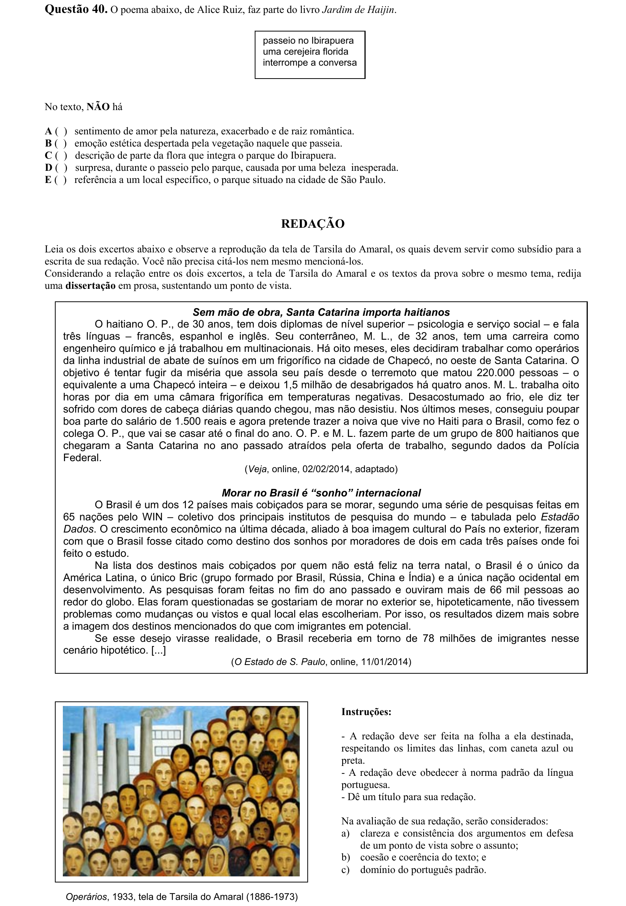
