# Português — ITA 2016

> 20 questões múltipla escolha.

## Q21
**Assunto:** interpretação de texto
**Competências:** compreensão global, identificação da tese do autor, inferência
**Tipo:** múltipla escolha

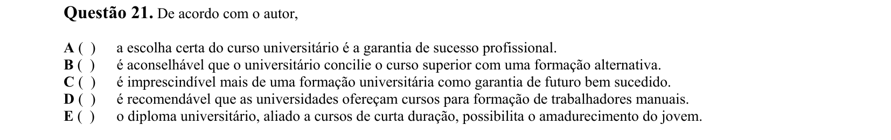

## Q22
**Assunto:** interpretação de texto
**Competências:** identificação do ponto de vista do autor, inferência, análise crítica
**Tipo:** múltipla escolha

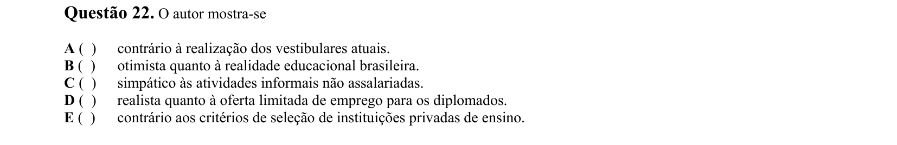

## Q23
**Assunto:** interpretação de texto
**Competências:** compreensão de expectativas socioculturais, leitura crítica
**Tipo:** múltipla escolha

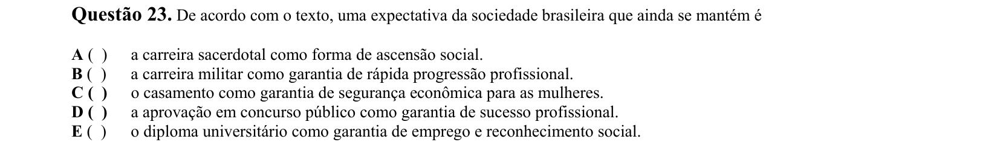

## Q24
**Assunto:** interpretação de texto
**Competências:** identificação de argumentos, análise da tese, raciocínio por exclusão
**Tipo:** múltipla escolha

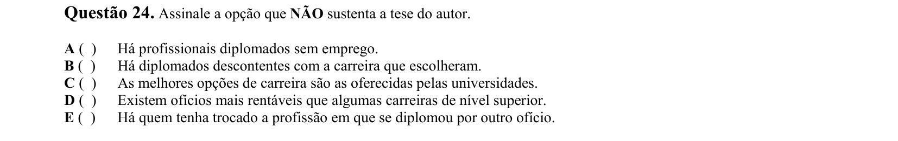

## Q25
**Assunto:** gramática
**Competências:** coesão referencial, retomada anafórica, semântica contextual
**Tipo:** múltipla escolha

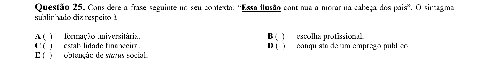

## Q26
**Assunto:** variação linguística
**Competências:** identificação de registro coloquial, análise de níveis de linguagem
**Tipo:** múltipla escolha

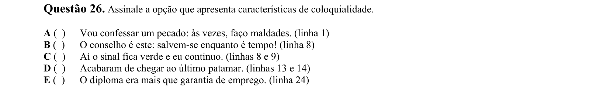

## Q27
**Assunto:** figuras de linguagem
**Competências:** identificação de figuras de pensamento (paradoxo, gradação, antítese, ironia, hipérbole)
**Tipo:** múltipla escolha

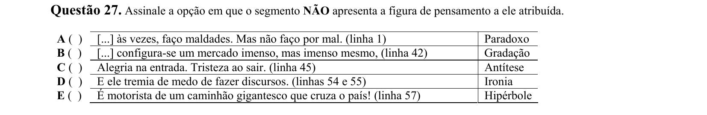

## Q28
**Assunto:** gramática
**Competências:** semântica verbal, valores do verbo "ter", análise contextual
**Tipo:** múltipla escolha

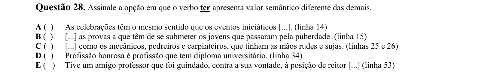

## Q29
**Assunto:** gramática
**Competências:** semântica das conjunções, valor da preposição "até", inferência contextual
**Tipo:** múltipla escolha

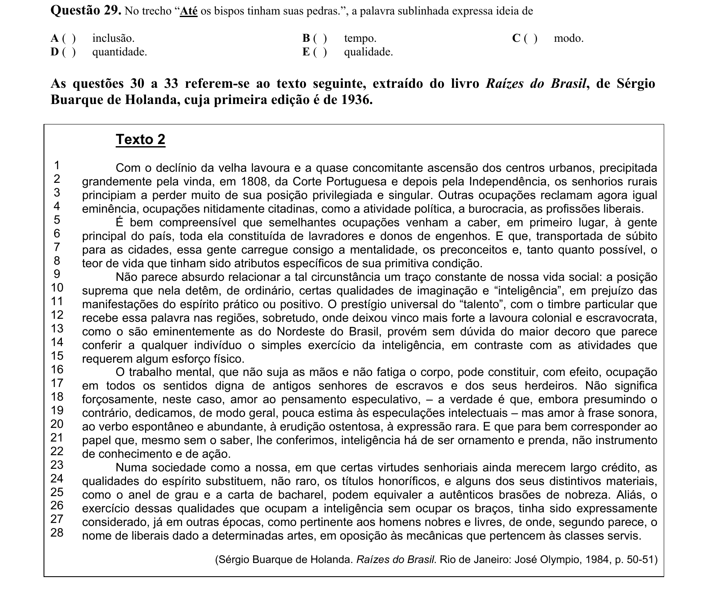

## Q30
**Assunto:** interpretação de texto
**Competências:** comparação entre textos, identificação de tema comum, síntese
**Tipo:** múltipla escolha

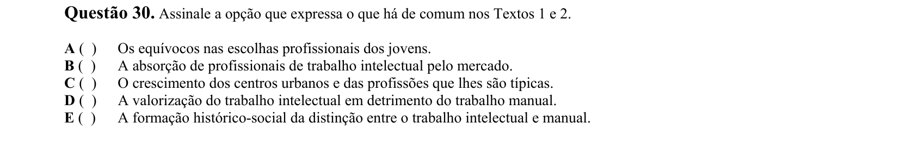

## Q31
**Assunto:** interpretação de texto
**Competências:** identificação do tom do texto, análise de estilo, leitura crítica
**Tipo:** múltipla escolha

## Q32
**Assunto:** gramática
**Competências:** pontuação, emprego da vírgula, norma padrão
**Tipo:** múltipla escolha

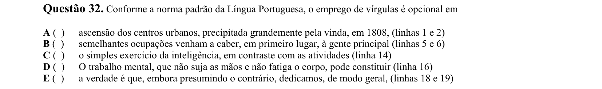

## Q33
**Assunto:** gramática
**Competências:** emprego das aspas, função estilística, interpretação semântica
**Tipo:** múltipla escolha

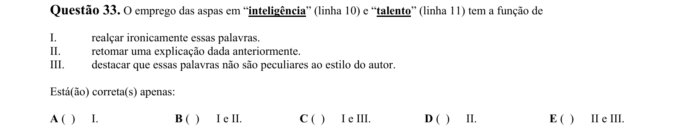

## Q34
**Assunto:** interpretação de texto
**Competências:** leitura de gênero quadrinhos, análise de humor, recursos verbo-visuais
**Tipo:** múltipla escolha

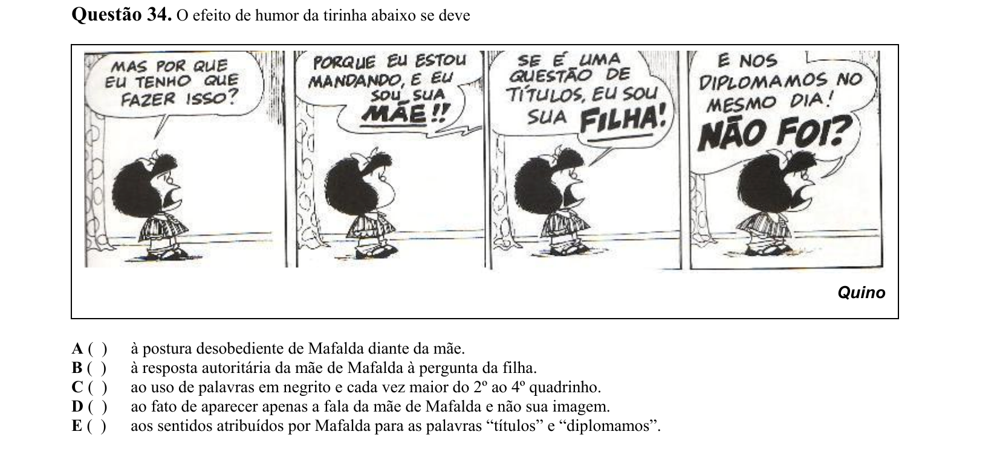

## Q35
**Assunto:** literatura
**Competências:** Machado de Assis, Memórias Póstumas de Brás Cubas, realismo brasileiro
**Tipo:** múltipla escolha

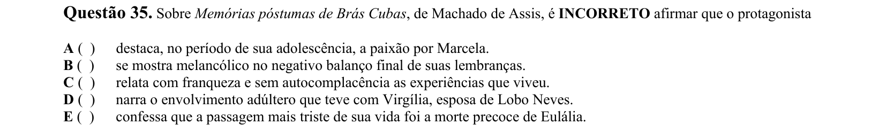

## Q36
**Assunto:** literatura
**Competências:** Aluísio Azevedo, O Cortiço, naturalismo brasileiro, personagens
**Tipo:** múltipla escolha

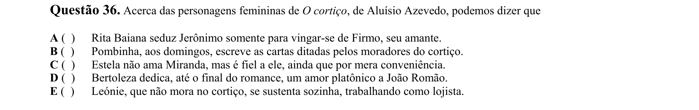

## Q37
**Assunto:** literatura
**Competências:** poesia contemporânea, José Paulo Paes, arcadismo vs realismo social
**Tipo:** múltipla escolha

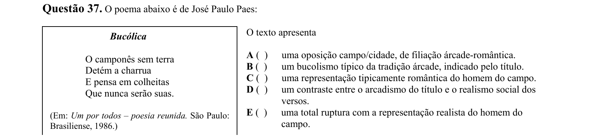

## Q38
**Assunto:** literatura
**Competências:** Graciliano Ramos, São Bernardo, romance de 30, análise de enredo
**Tipo:** múltipla escolha

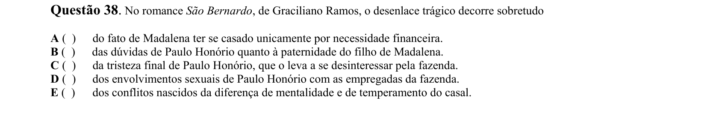

## Q39
**Assunto:** literatura
**Competências:** poesia de Ivan Junqueira, análise de metáforas, estrutura poética
**Tipo:** múltipla escolha

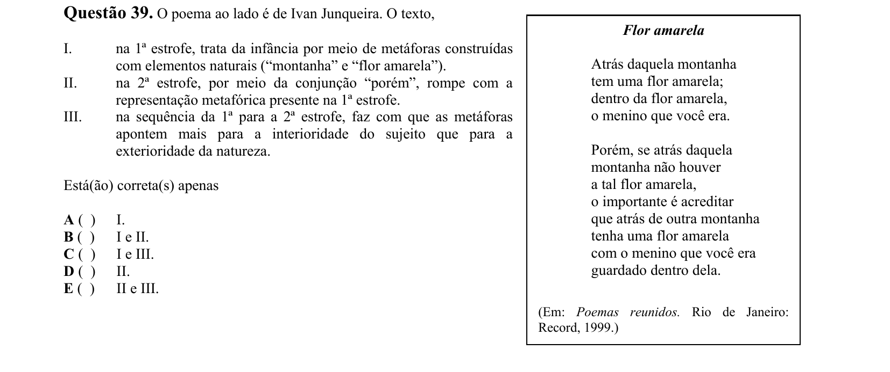

## Q40
**Assunto:** redação técnica
**Competências:** análise de proposta de redação, leitura de tabelas/dados, gênero adivinha
**Tipo:** múltipla escolha

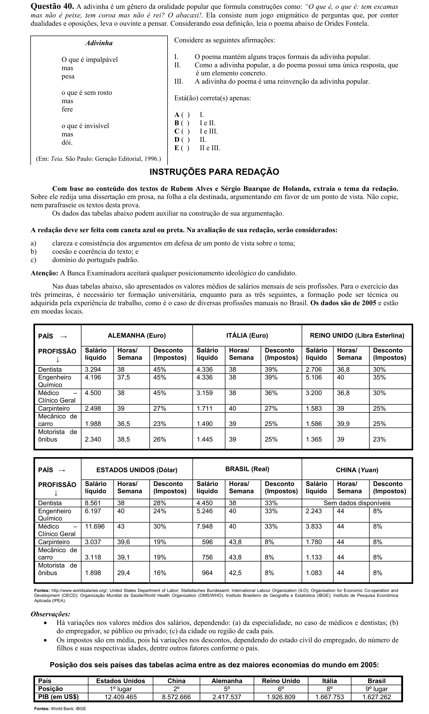
