# Português — ITA 2017

> 20 questões múltipla escolha.

## Q21
**Assunto:** interpretação de texto
**Competências:** identificação da tese do autor, compreensão global, inferência
**Tipo:** múltipla escolha

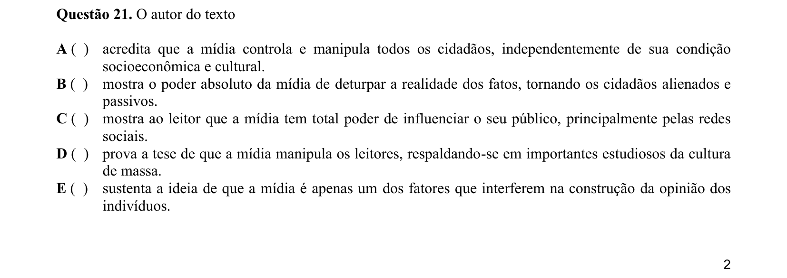

## Q22
**Assunto:** interpretação de texto
**Competências:** análise do ponto de vista do autor, julgamento de asserções, inferência
**Tipo:** múltipla escolha

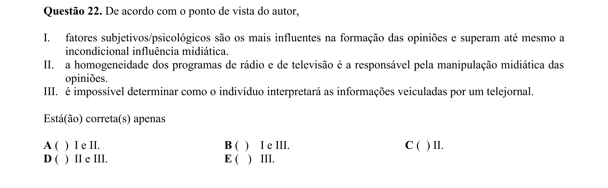

## Q23
**Assunto:** interpretação de texto
**Competências:** análise de estratégias argumentativas, recursos retóricos, leitura crítica
**Tipo:** múltipla escolha

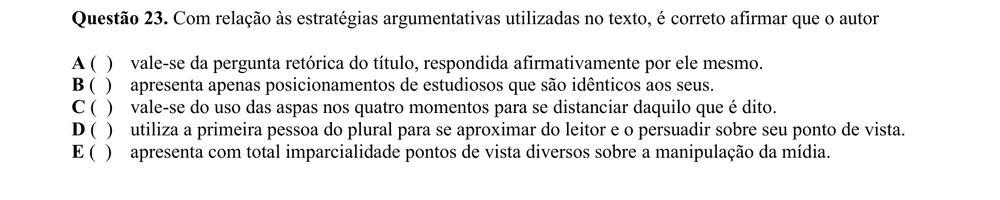

## Q24
**Assunto:** gramática
**Competências:** voz passiva pronominal, análise sintática, classificação verbal
**Tipo:** múltipla escolha

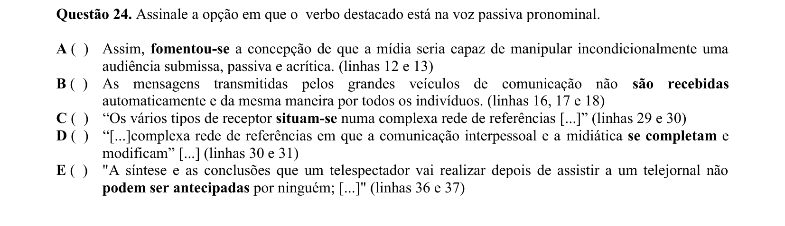

## Q25
**Assunto:** gramática
**Competências:** transitividade verbal, regência verbal, análise sintática
**Tipo:** múltipla escolha

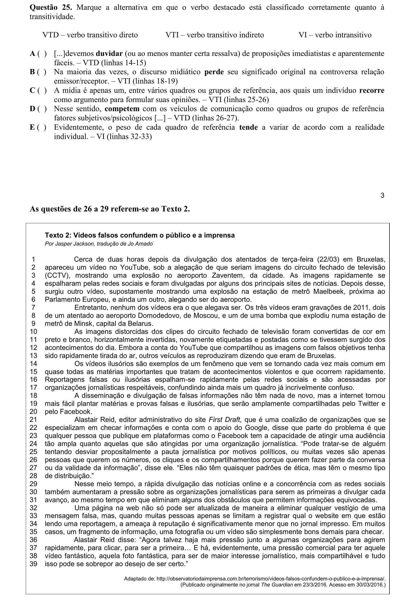

## Q26
**Assunto:** interpretação de texto
**Competências:** compreensão global, identificação de informações explícitas, leitura crítica
**Tipo:** múltipla escolha

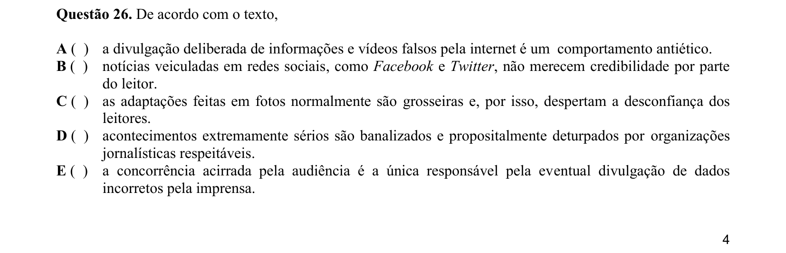

## Q27
**Assunto:** interpretação de texto
**Competências:** raciocínio por exclusão, identificação de incorreção, inferência
**Tipo:** múltipla escolha

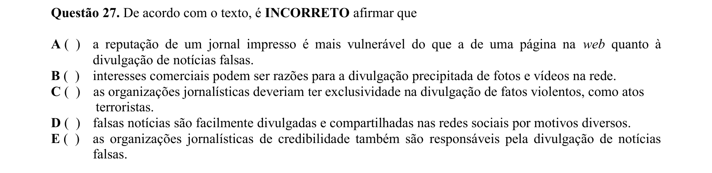

## Q28
**Assunto:** interpretação de texto
**Competências:** identificação de causas, leitura analítica, raciocínio por exclusão
**Tipo:** múltipla escolha

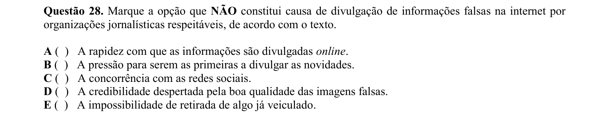

## Q29
**Assunto:** gramática
**Competências:** pronome relativo, classificação morfológica, análise sintática
**Tipo:** múltipla escolha

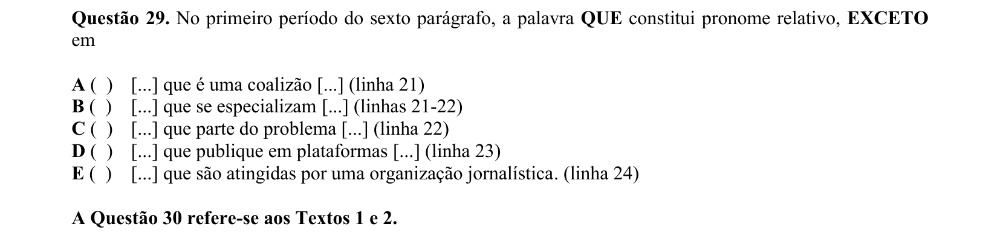

## Q30
**Assunto:** interpretação de texto
**Competências:** comparação entre textos, identificação de tese comum, leitura crítica
**Tipo:** múltipla escolha

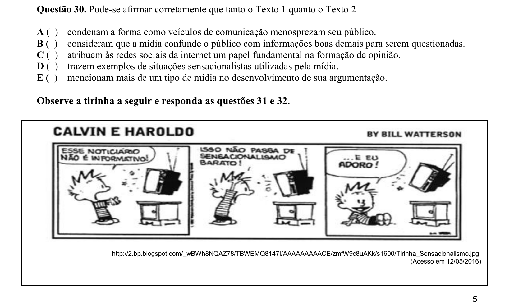

## Q31
**Assunto:** interpretação de texto
**Competências:** leitura de tirinha, identificação de comportamento social, inferência
**Tipo:** múltipla escolha

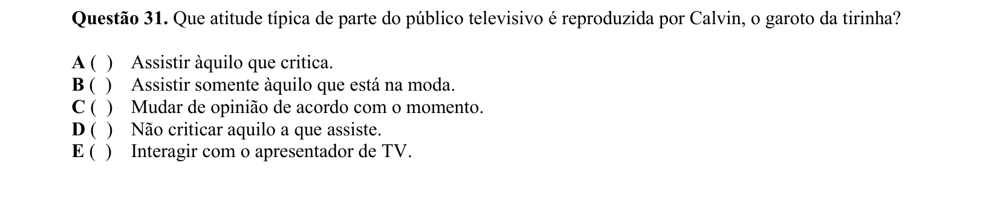

## Q32
**Assunto:** gramática
**Competências:** conjunções coordenativas, relações lógico-semânticas, coesão textual
**Tipo:** múltipla escolha

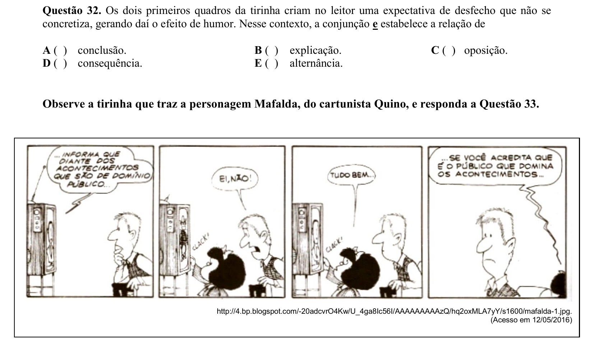

## Q33
**Assunto:** interpretação de texto
**Competências:** análise semântica, leitura de tirinha, função sintática
**Tipo:** múltipla escolha

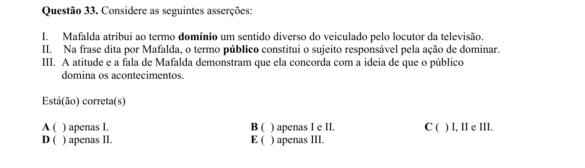

## Q34
**Assunto:** interpretação de texto
**Competências:** comparação entre tirinhas, análise crítica, raciocínio por exclusão
**Tipo:** múltipla escolha

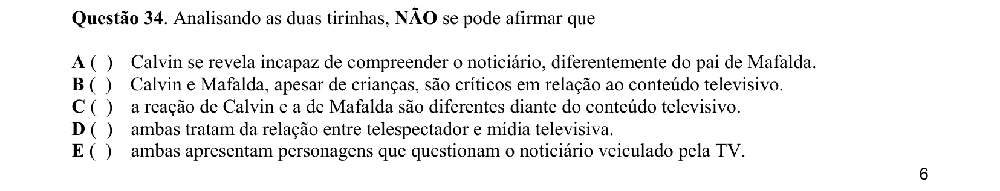

## Q35
**Assunto:** literatura
**Competências:** Memórias de um sargento de milícias, Manuel Antônio de Almeida, análise de personagem
**Tipo:** múltipla escolha

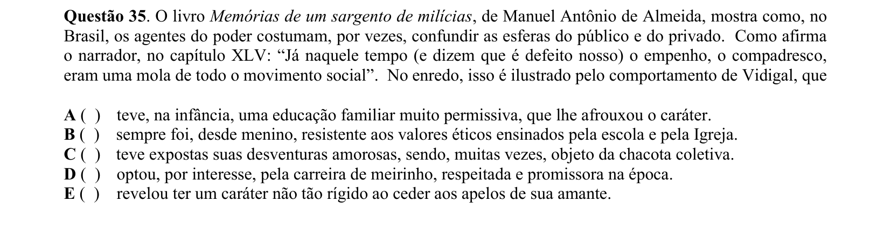

## Q36
**Assunto:** literatura
**Competências:** Til, José de Alencar, romantismo, análise de enredo
**Tipo:** múltipla escolha

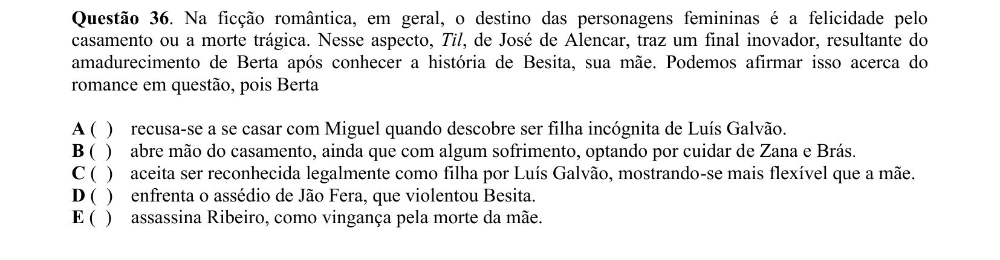

## Q37
**Assunto:** literatura
**Competências:** Fogo morto, José Lins do Rego, regionalismo, análise de personagens
**Tipo:** múltipla escolha

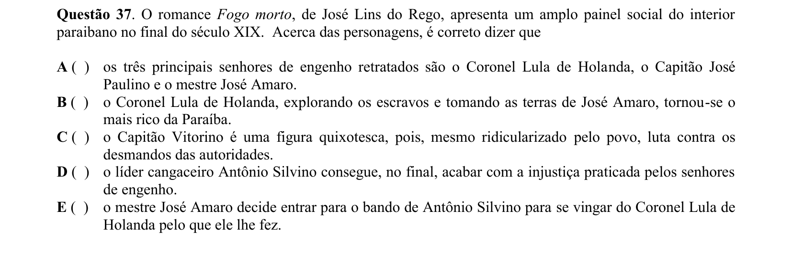

## Q38
**Assunto:** literatura
**Competências:** Manuel Bandeira, modernismo, análise de poema, relação afetiva no eu lírico
**Tipo:** múltipla escolha

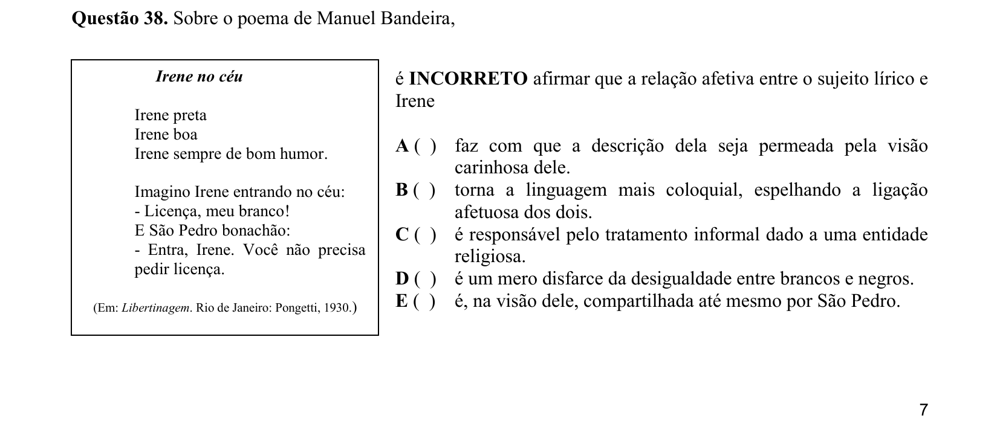

## Q39
**Assunto:** literatura
**Competências:** intertextualidade, Manuel Bandeira, Alcides Villaça, análise comparativa
**Tipo:** múltipla escolha

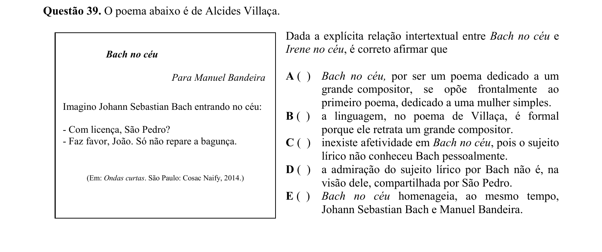

## Q40
**Assunto:** literatura
**Competências:** análise de poema, Maria Lúcia Alvim, figuras de linguagem, julgamento de asserções
**Tipo:** múltipla escolha

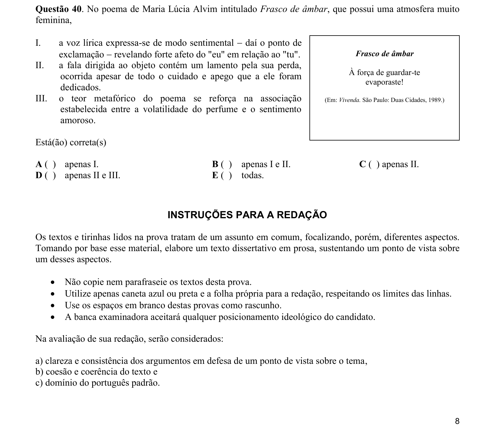
