# Português — ITA 2018

> 20 questões múltipla escolha.

## Q21
**Assunto:** literatura
**Competências:** romance brasileiro, José de Alencar, Senhora, interpretação de personagem
**Tipo:** múltipla escolha

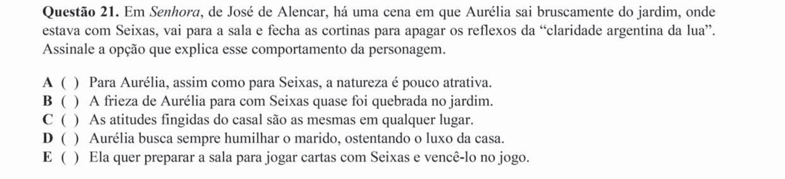

## Q22
**Assunto:** literatura
**Competências:** Machado de Assis, Quincas Borba, realismo, interpretação de enredo
**Tipo:** múltipla escolha

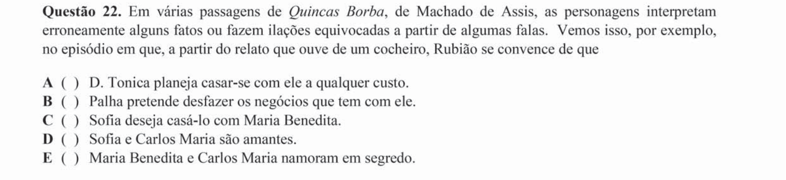

## Q23
**Assunto:** literatura
**Competências:** Graciliano Ramos, São Bernardo, narrador-personagem, romance de 30
**Tipo:** múltipla escolha

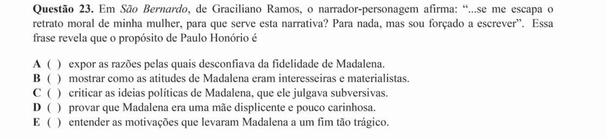

## Q24
**Assunto:** literatura
**Competências:** arcadismo, Tomás Antônio Gonzaga, Marília de Dirceu, análise poética
**Tipo:** múltipla escolha

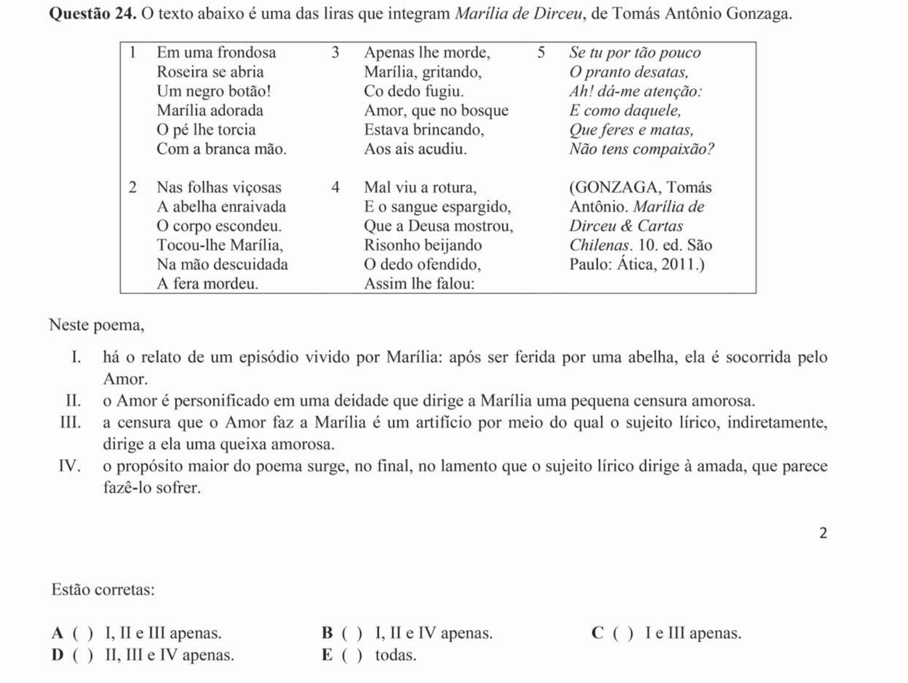

## Q25
**Assunto:** literatura
**Competências:** intertextualidade, Manuel Bandeira, Gonzaga, modernismo
**Tipo:** múltipla escolha

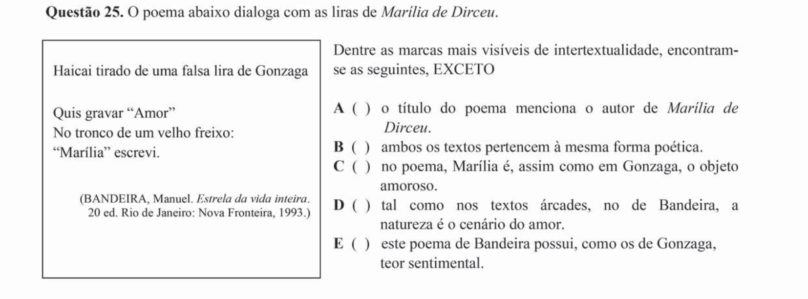

## Q26
**Assunto:** interpretação de texto
**Competências:** poesia, Cacaso, leitura simbólica, lirismo
**Tipo:** múltipla escolha

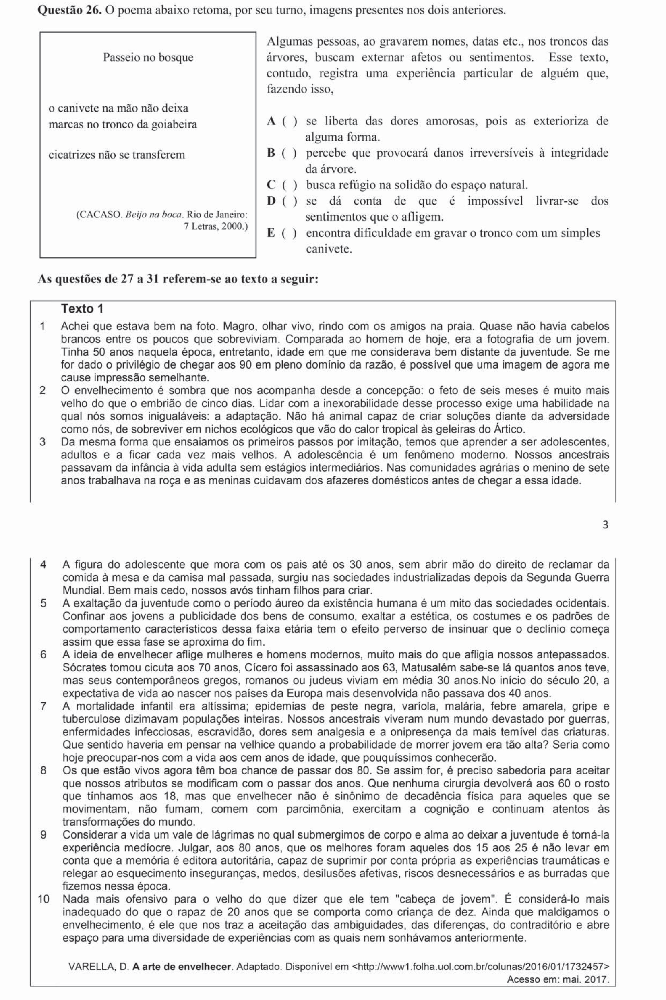

## Q27
**Assunto:** interpretação de texto
**Competências:** posicionamento autoral, tom do texto, leitura inferencial
**Tipo:** múltipla escolha

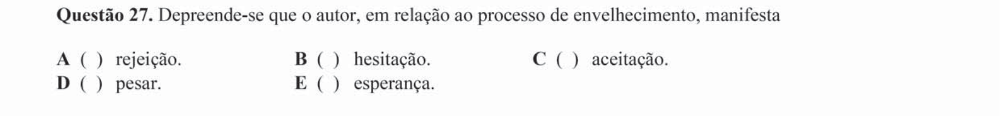

## Q28
**Assunto:** interpretação de texto
**Competências:** compreensão global, argumentação, articulação de ideias
**Tipo:** múltipla escolha

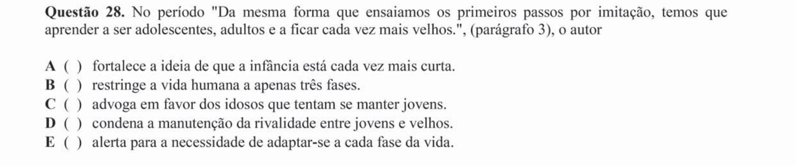

## Q29
**Assunto:** interpretação de texto
**Competências:** progressão temática, paráfrase, leitura crítica
**Tipo:** múltipla escolha

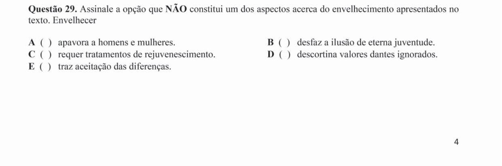

## Q30
**Assunto:** interpretação de texto
**Competências:** sentido figurado, intenção autoral, leitura inferencial
**Tipo:** múltipla escolha

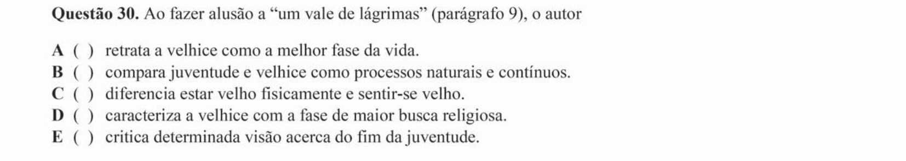

## Q31
**Assunto:** figuras de linguagem
**Competências:** metáfora, argumentação por imagem, análise estilística
**Tipo:** múltipla escolha

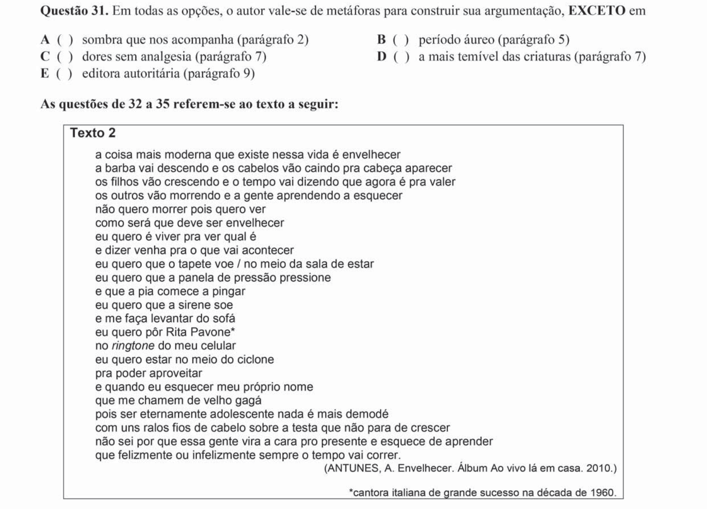

## Q32
**Assunto:** figuras de linguagem
**Competências:** prosopopeia/personificação, sentido figurado, análise estilística
**Tipo:** múltipla escolha

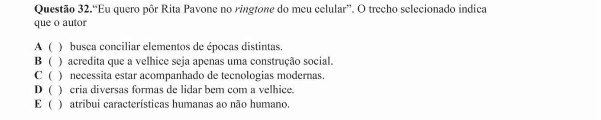

## Q33
**Assunto:** interpretação de texto
**Competências:** repetição lexical, função expressiva, leitura semântica
**Tipo:** múltipla escolha

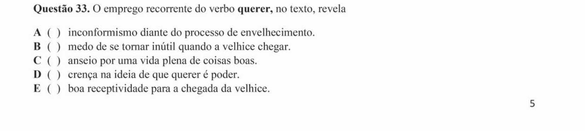

## Q34
**Assunto:** interpretação de texto
**Competências:** identificação de tese, crítica social, leitura de trechos
**Tipo:** múltipla escolha

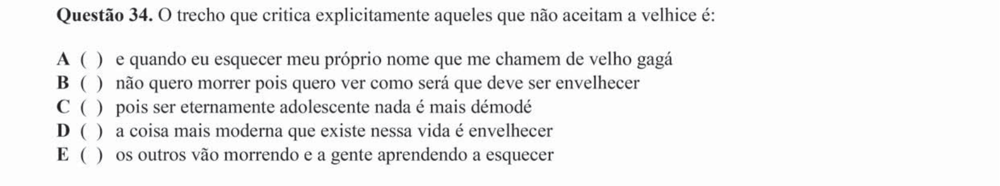

## Q35
**Assunto:** interpretação de texto
**Competências:** comparação entre textos, leitura intertextual, síntese argumentativa
**Tipo:** múltipla escolha

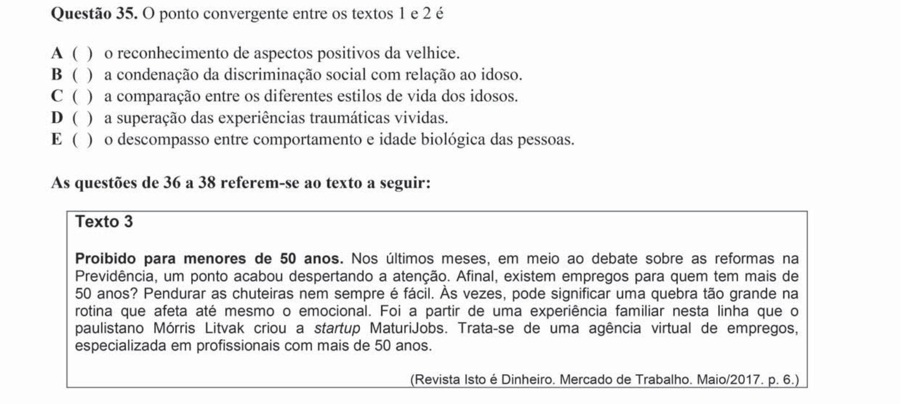

## Q36
**Assunto:** gramática
**Competências:** pontuação, uso da vírgula, sintaxe do período
**Tipo:** múltipla escolha

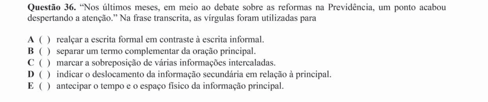

## Q37
**Assunto:** figuras de linguagem
**Competências:** metáfora idiomática, leitura conotativa, interpretação semântica
**Tipo:** múltipla escolha

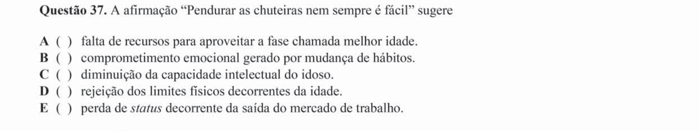

## Q38
**Assunto:** gramática
**Competências:** semântica de conectivos, valor das expressões, coesão textual
**Tipo:** múltipla escolha

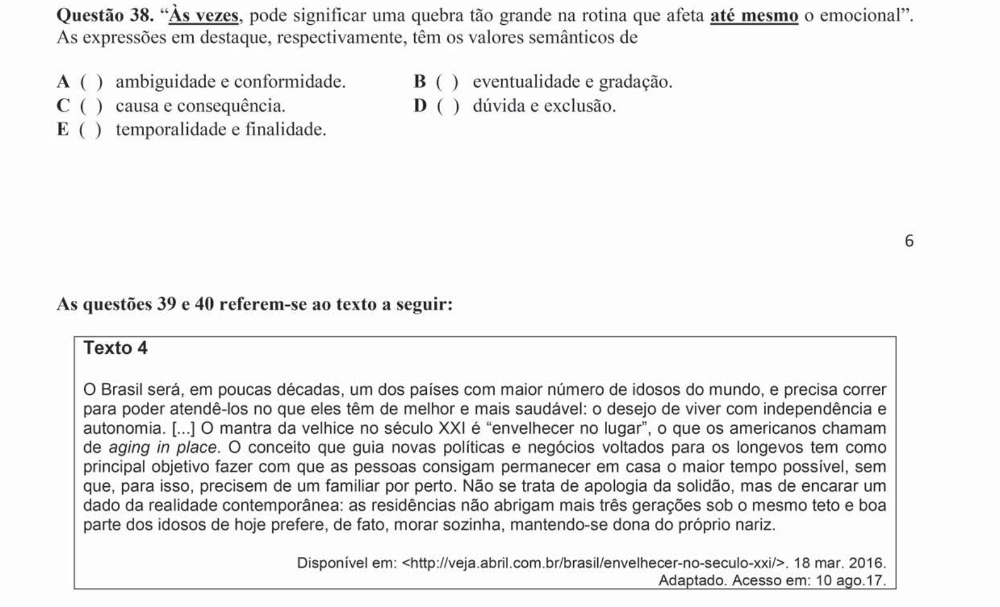

## Q39
**Assunto:** gramática
**Competências:** semântica de conjunções, valor de "mas", coesão
**Tipo:** múltipla escolha

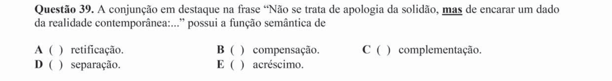

## Q40
**Assunto:** interpretação de texto
**Competências:** comparação entre textos, síntese argumentativa, leitura crítica
**Tipo:** múltipla escolha

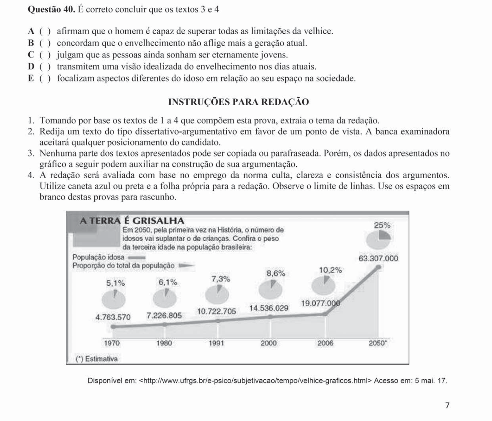
