# Português — ITA 2019 (1ª fase)

> 12 questões múltipla escolha.

## Q13
**Assunto:** interpretação de texto
**Competências:** análise global do texto sobre grafite e pichação
**Tipo:** múltipla escolha

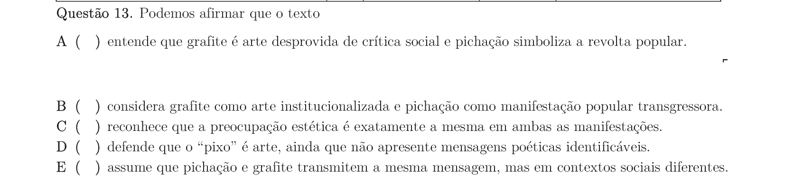

## Q14
**Assunto:** interpretação de texto
**Competências:** identificação de afirmação INCORRETA sobre o texto
**Tipo:** múltipla escolha

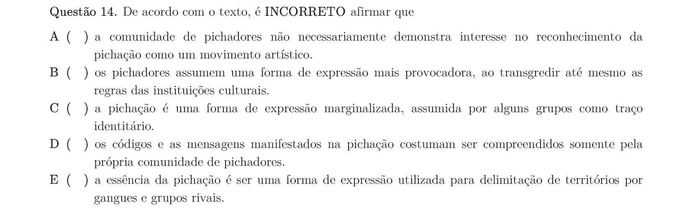

## Q15
**Assunto:** gramática
**Competências:** orações subordinadas; ideia de condição
**Tipo:** múltipla escolha

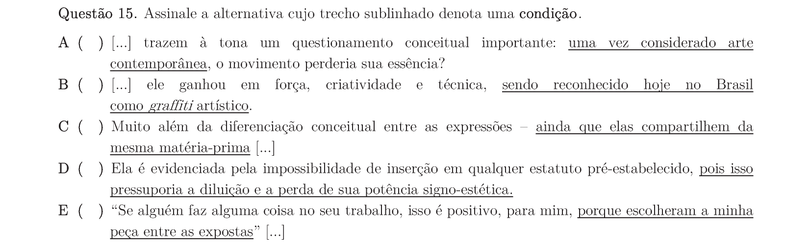

## Q16
**Assunto:** gramática
**Competências:** orações subordinadas; ideia de causa
**Tipo:** múltipla escolha

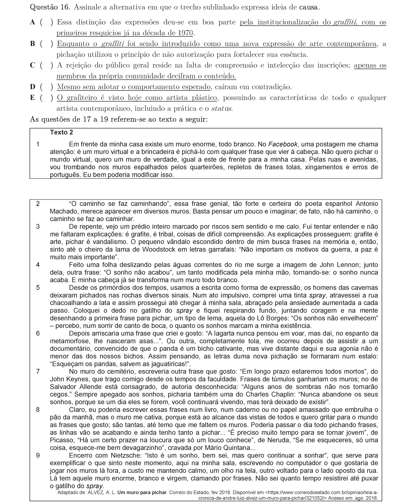

## Q17
**Assunto:** variação linguística, gramática
**Competências:** norma culta vs. coloquial em crônica
**Tipo:** múltipla escolha

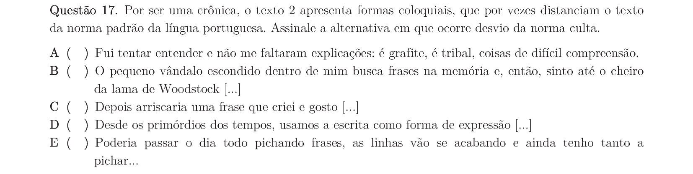

## Q18
**Assunto:** gramática
**Competências:** classificação morfológica; pronome relativo
**Tipo:** múltipla escolha

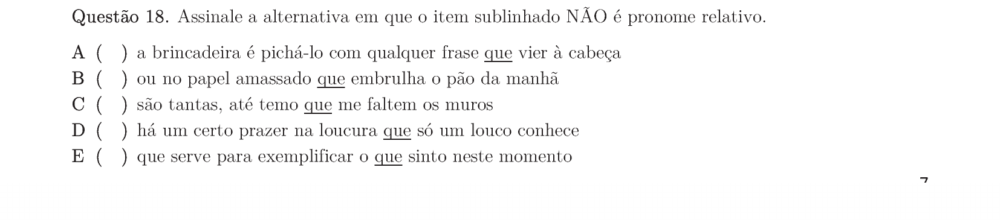

## Q19
**Assunto:** interpretação de texto
**Competências:** análise comparativa entre dois textos
**Tipo:** múltipla escolha

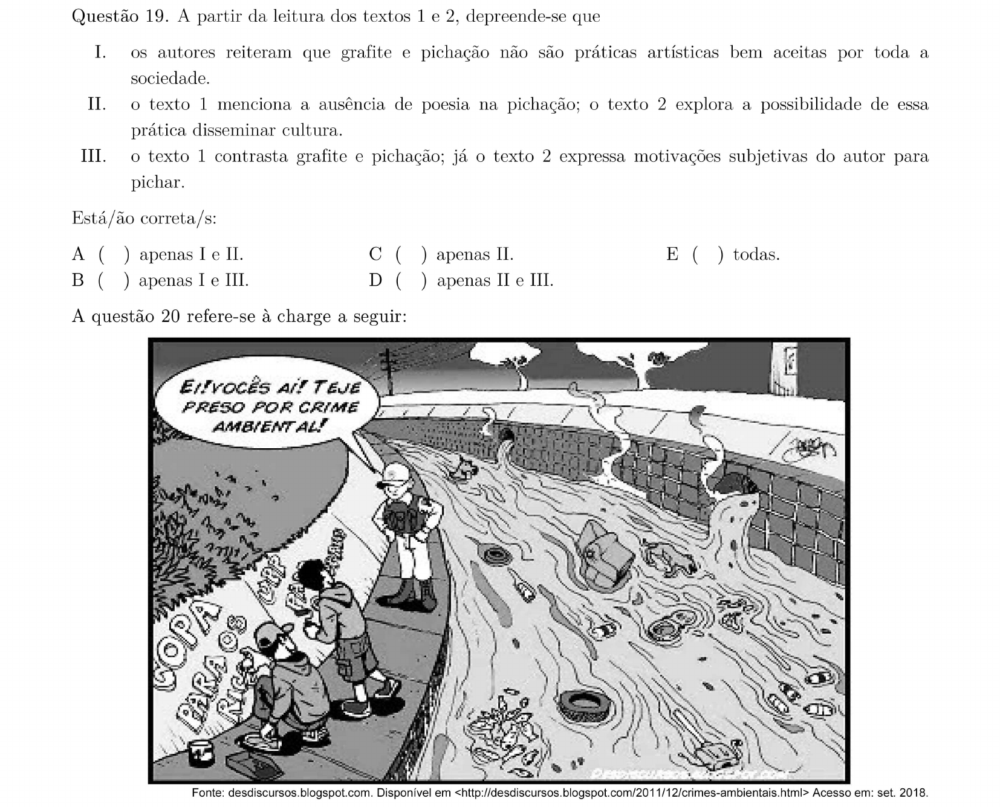

## Q20
**Assunto:** interpretação de texto
**Competências:** leitura crítica de charge
**Tipo:** múltipla escolha

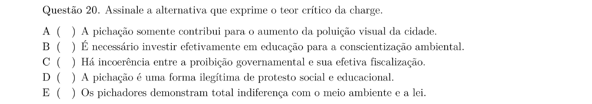

## Q21
**Assunto:** literatura
**Competências:** Romantismo; Senhora, de José de Alencar
**Tipo:** múltipla escolha

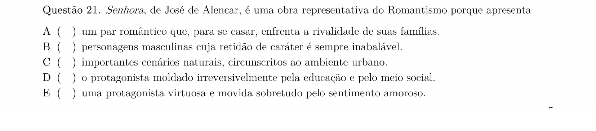

## Q22
**Assunto:** literatura
**Competências:** Realismo; Quincas Borba, de Machado de Assis
**Tipo:** múltipla escolha

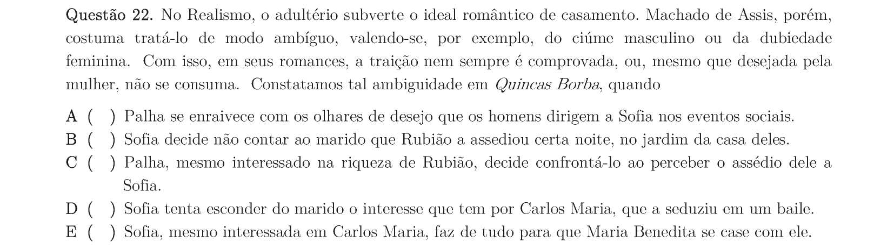

## Q23
**Assunto:** literatura
**Competências:** Geração de 30; São Bernardo, de Graciliano Ramos
**Tipo:** múltipla escolha

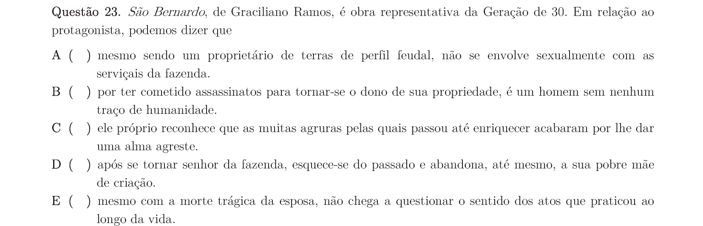

## Q24
**Assunto:** literatura, figuras de linguagem
**Competências:** análise de poema de Cecília Meireles; metáfora
**Tipo:** múltipla escolha

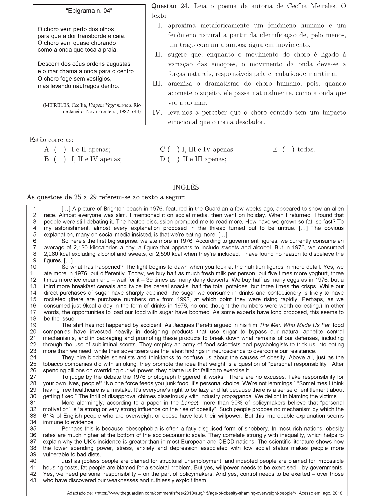
