# Português — ITA 2020 (1ª fase)

> 15 questões múltipla escolha.

## Q16
**Assunto:** literatura, Machado de Assis (O Alienista)
**Competências:** análise de narrador, gênero e linguagem irônica
**Tipo:** múltipla escolha

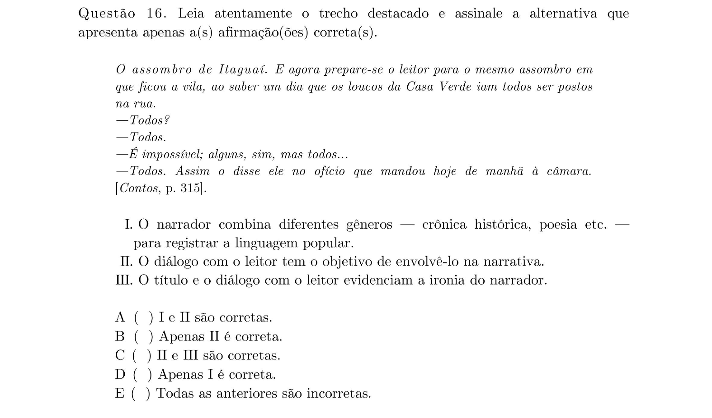

## Q17
**Assunto:** literatura, Graciliano Ramos (São Bernardo)
**Competências:** análise do perfil moral do narrador-protagonista
**Tipo:** múltipla escolha

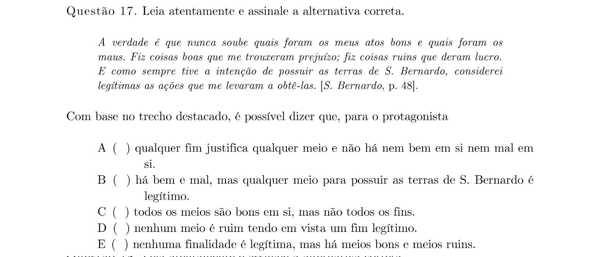

## Q18
**Assunto:** literatura, Graciliano Ramos (São Bernardo)
**Competências:** análise de discurso e crítica social na obra
**Tipo:** múltipla escolha

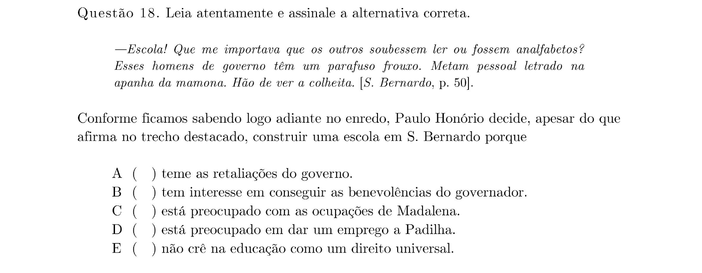

## Q19
**Assunto:** literatura, Graciliano Ramos / Guimarães Rosa
**Competências:** comparação de personagens entre São Bernardo e A Hora e Vez de Augusto Matraga
**Tipo:** múltipla escolha

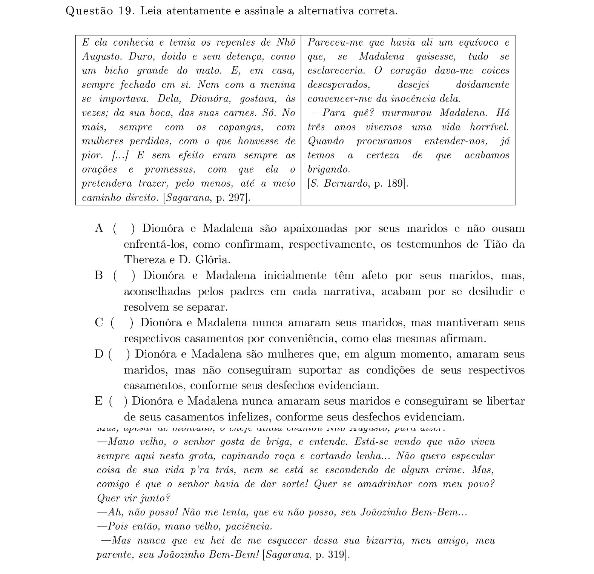

## Q20
**Assunto:** literatura, Guimarães Rosa (A Hora e Vez de Augusto Matraga)
**Competências:** interpretação da resposta do protagonista no contexto narrativo
**Tipo:** múltipla escolha

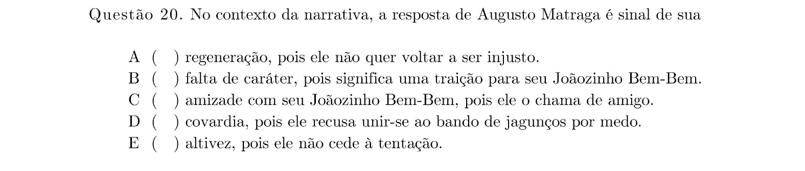

## Q21
**Assunto:** semântica, vocabulário
**Competências:** sentido contextual da palavra "bizarria"
**Tipo:** múltipla escolha

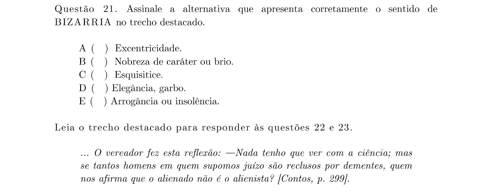

## Q22
**Assunto:** literatura, Machado de Assis (O Alienista)
**Competências:** distinção entre razão e loucura no discurso de Simão Bacamarte
**Tipo:** múltipla escolha

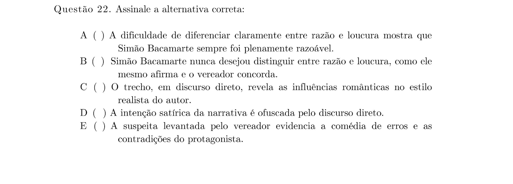

## Q23
**Assunto:** literatura, Machado de Assis (O Alienista)
**Competências:** análise do sentido da narrativa e papel dos personagens
**Tipo:** múltipla escolha

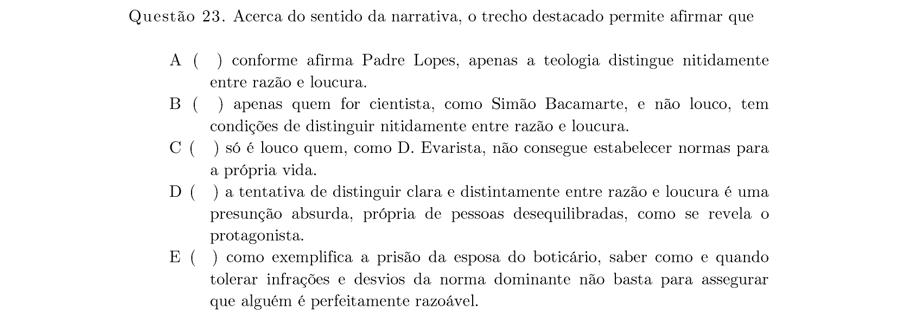

## Q24
**Assunto:** gramática, sintaxe
**Competências:** discurso indireto livre; identificação e função
**Tipo:** múltipla escolha

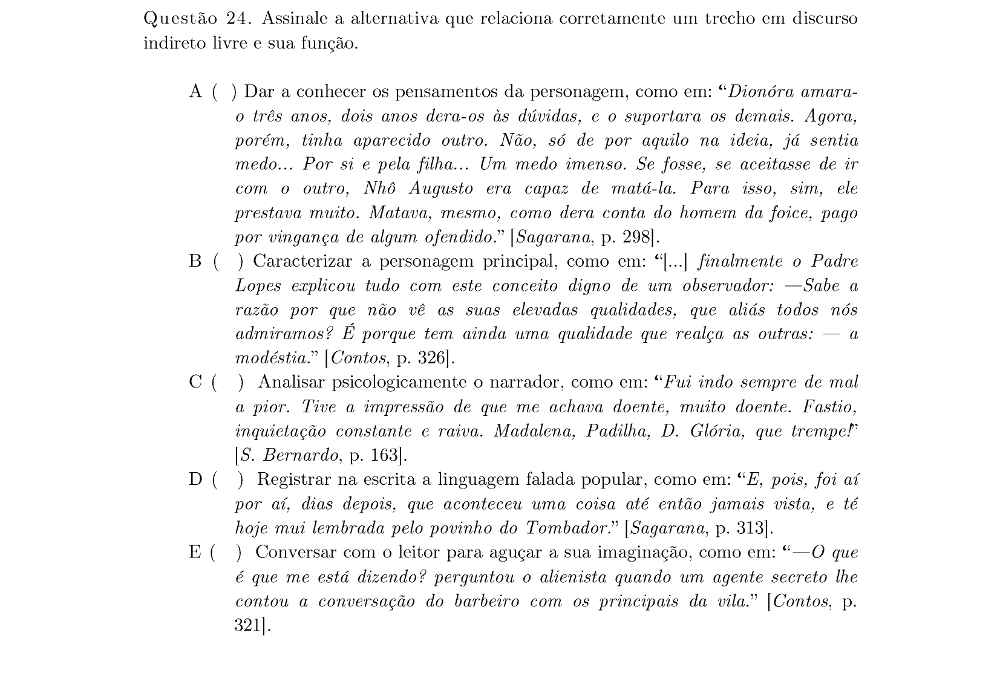

## Q25
**Assunto:** literatura, Graciliano Ramos (São Bernardo)
**Competências:** análise do personagem seu Ribeiro; interpretação textual
**Tipo:** múltipla escolha

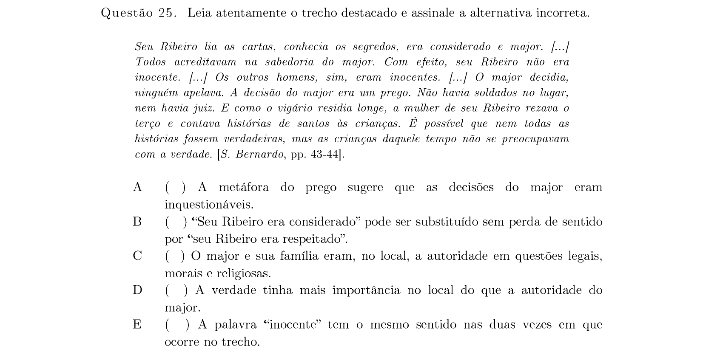

## Q26
**Assunto:** literatura, Guimarães Rosa (A Hora e Vez de Augusto Matraga)
**Competências:** caracterização do protagonista a partir de trecho
**Tipo:** múltipla escolha

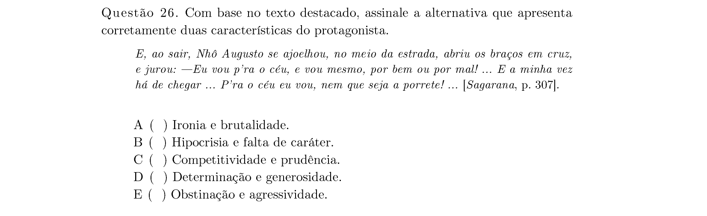

## Q27
**Assunto:** literatura, Graciliano Ramos (São Bernardo)
**Competências:** interpretação de trecho narrativo
**Tipo:** múltipla escolha

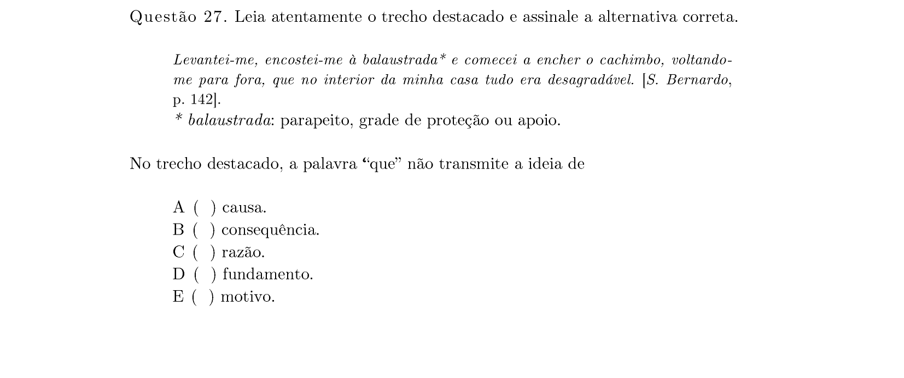

## Q28
**Assunto:** semântica, sinônimos
**Competências:** sinônimos contextuais de "desinteligência"
**Tipo:** múltipla escolha

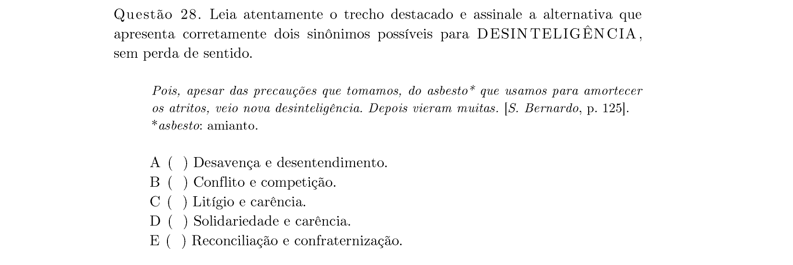

## Q29
**Assunto:** literatura, Guimarães Rosa (A Hora e Vez de Augusto Matraga)
**Competências:** análise da cena final; conduta moral do protagonista
**Tipo:** múltipla escolha

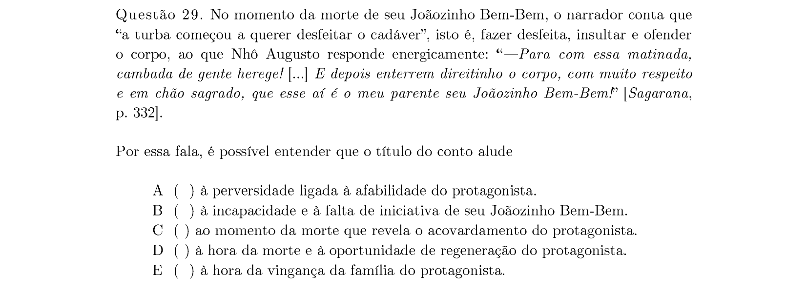

## Q30
**Assunto:** literatura comparada
**Competências:** características comuns aos protagonistas das três obras
**Tipo:** múltipla escolha

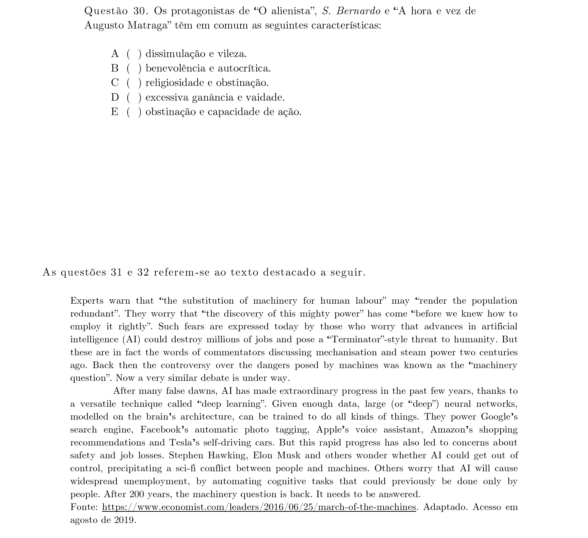
