# Português — ITA 2021 (1ª fase)

> 15 questões múltipla escolha.

## Q16
**Assunto:** literatura, Memórias de um sargento de milícias
**Competências:** caracterização do narrador, foco narrativo
**Tipo:** múltipla escolha

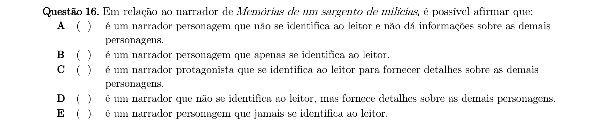

## Q17
**Assunto:** literatura, Teoria do medalhão (Machado de Assis)
**Competências:** ironia machadiana, mediocridade como medida do sucesso
**Tipo:** múltipla escolha

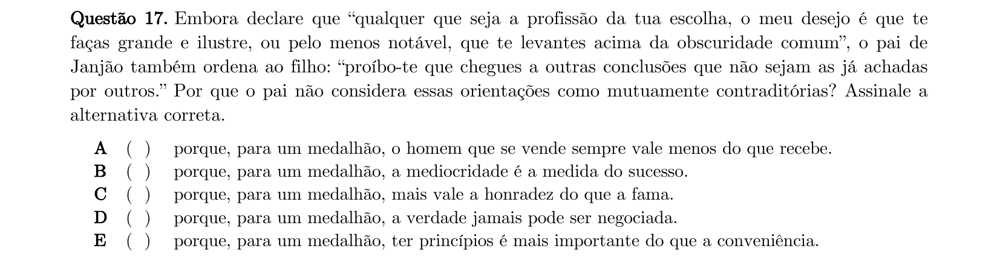

## Q18
**Assunto:** literatura, Memórias de um sargento de milícias
**Competências:** análise de personagens, ambiguidade moral
**Tipo:** múltipla escolha

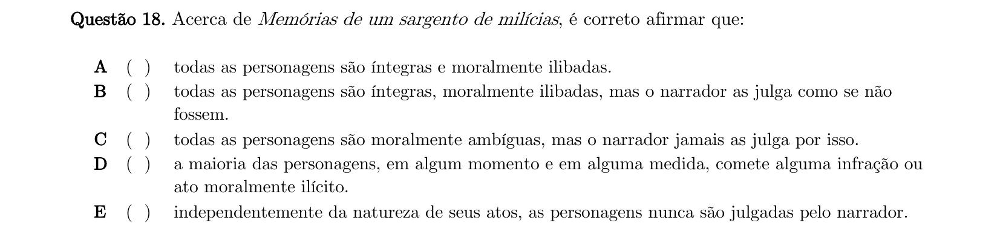

## Q19
**Assunto:** literatura, contexto histórico-social
**Competências:** período joanino, classes populares, compadrio e interesse
**Tipo:** múltipla escolha

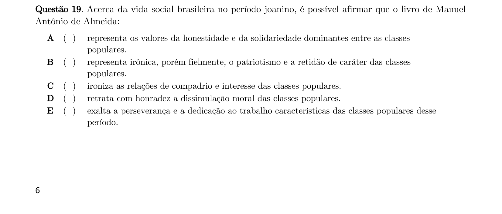

## Q20
**Assunto:** literatura, Senhor Diretor (Lygia Fagundes Telles)
**Competências:** caracterização da narradora protagonista, recalque sexual
**Tipo:** múltipla escolha

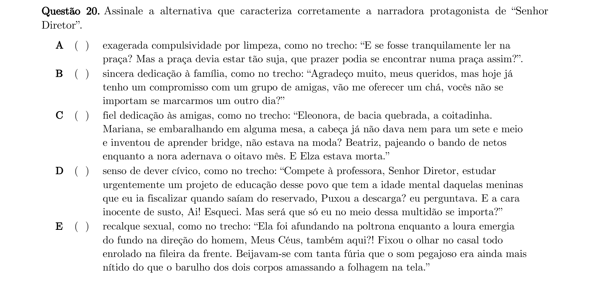

## Q21
**Assunto:** literatura, As Formigas (Lygia Fagundes Telles)
**Competências:** análise de trechos, desfecho do conto
**Tipo:** múltipla escolha

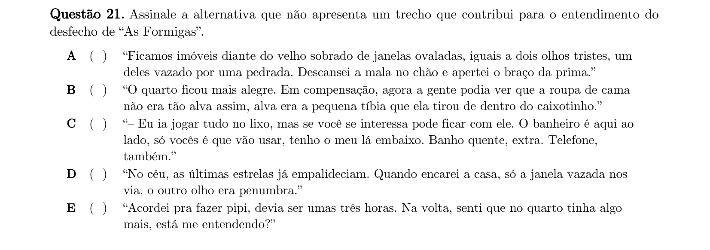

## Q22
**Assunto:** literatura, Teoria do medalhão (Machado de Assis)
**Competências:** chalaça versus ironia, publicidade e mediocridade
**Tipo:** múltipla escolha

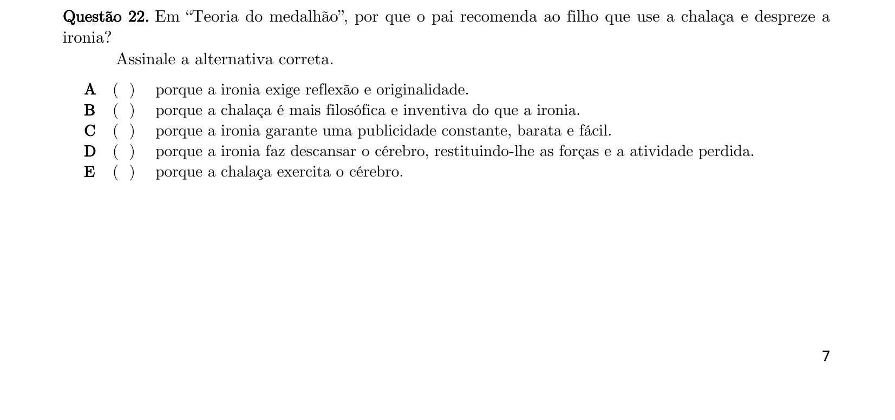

## Q23
**Assunto:** literatura, Tigrela (Lygia Fagundes Telles)
**Competências:** análise de trechos, compreensão do desfecho
**Tipo:** múltipla escolha

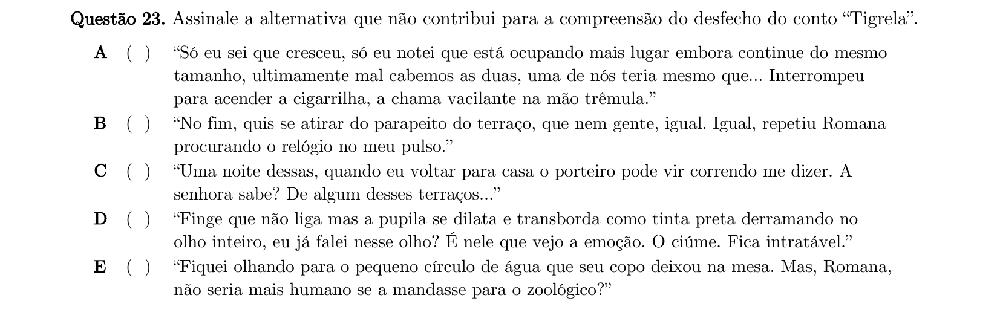

## Q24
**Assunto:** literatura, Memórias de um sargento de milícias
**Competências:** análise de passagem, ironia sobre o "real", verniz de respeitabilidade
**Tipo:** múltipla escolha

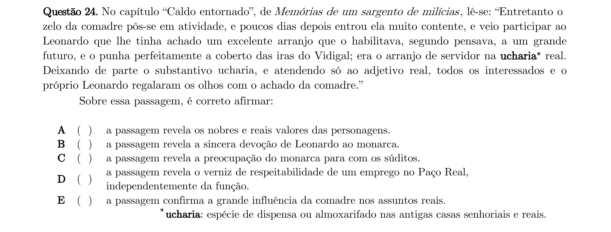

## Q25
**Assunto:** literatura, A Sauna (Lygia Fagundes Telles)
**Competências:** epítetos, caracterização da personagem Rosa pelo narrador
**Tipo:** múltipla escolha

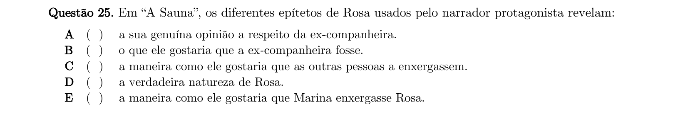

## Q26
**Assunto:** literatura, As Formigas (Lygia Fagundes Telles)
**Competências:** atmosfera de suspense, dubiedade narrativa, vulnerabilidade das protagonistas
**Tipo:** múltipla escolha

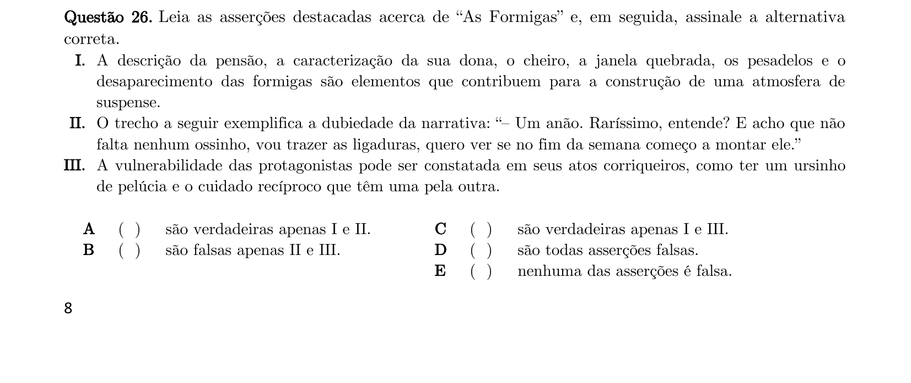

## Q27
**Assunto:** literatura, Teoria do medalhão (Machado de Assis)
**Competências:** análise semântica, frases feitas e "esforço inútil"
**Tipo:** múltipla escolha

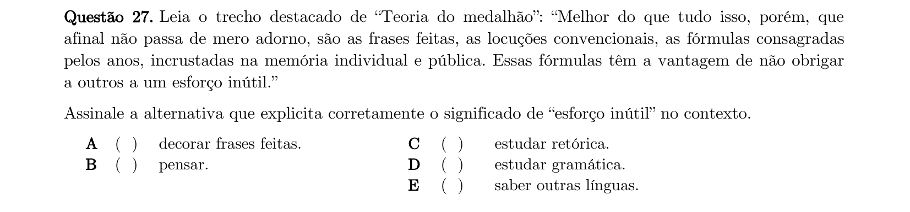

## Q28
**Assunto:** gramática, literatura, Presença (Lygia Fagundes Telles)
**Competências:** uso do pronome demonstrativo e pontuação para realce expressivo
**Tipo:** múltipla escolha

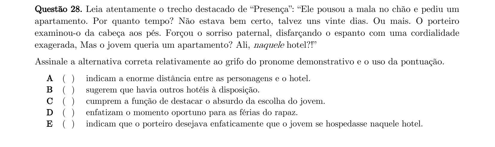

## Q29
**Assunto:** literatura, contos de Lygia Fagundes Telles
**Competências:** análise comparativa de Senhor Diretor, A Sauna, WM, Seminário dos ratos
**Tipo:** múltipla escolha

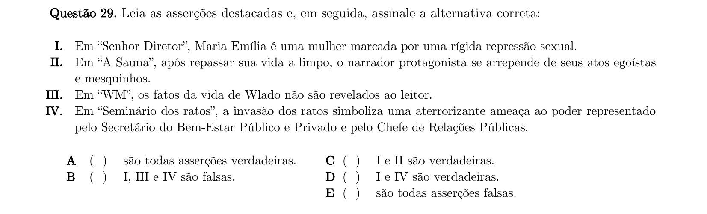

## Q30
**Assunto:** literatura, WM (Lygia Fagundes Telles)
**Competências:** caracterização do enredo, narradora, abandono materno
**Tipo:** múltipla escolha

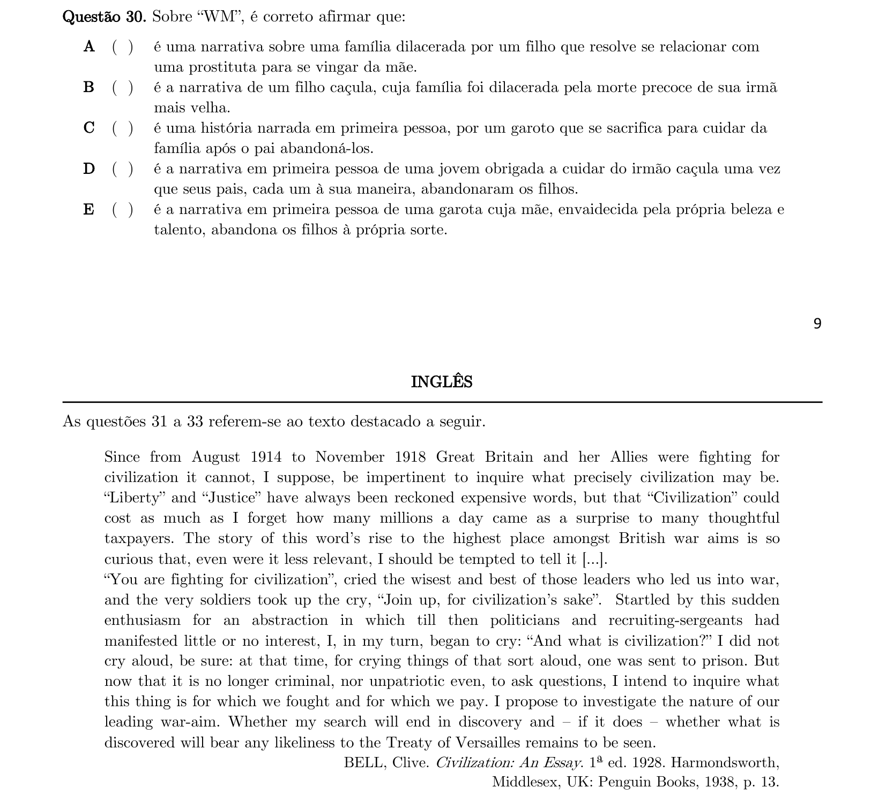
