# Português — ITA 2022 (1ª fase)

> 15 questões múltipla escolha.

## Q16
**Assunto:** literatura, Lima Barreto
**Competências:** Numa e a ninfa, ironia, crítica à política da República Velha
**Tipo:** múltipla escolha

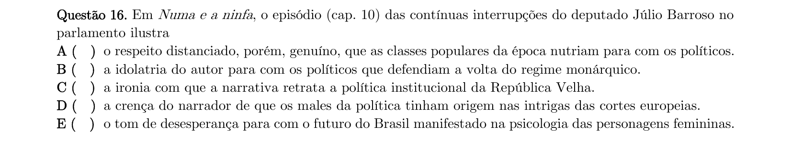

## Q17
**Assunto:** literatura, Lima Barreto
**Competências:** Numa e a ninfa, personagens Numa e Lucrécio Barba de Bode, oportunismo social
**Tipo:** múltipla escolha

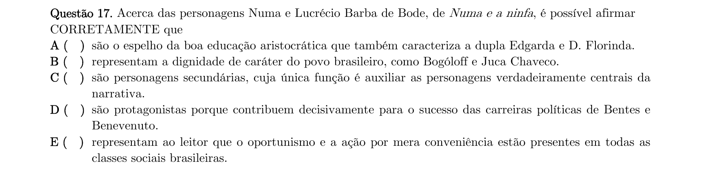

## Q18
**Assunto:** teoria literária, narrador
**Competências:** caracterização do narrador de Numa e a ninfa, onisciência, ironia
**Tipo:** múltipla escolha

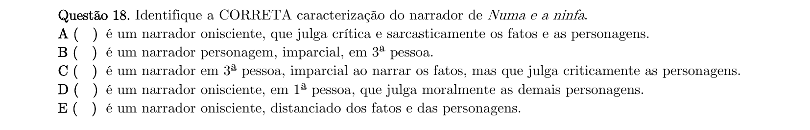

## Q19
**Assunto:** teoria literária, discurso
**Competências:** discurso direto, indireto, indireto livre em Numa e a ninfa
**Tipo:** múltipla escolha

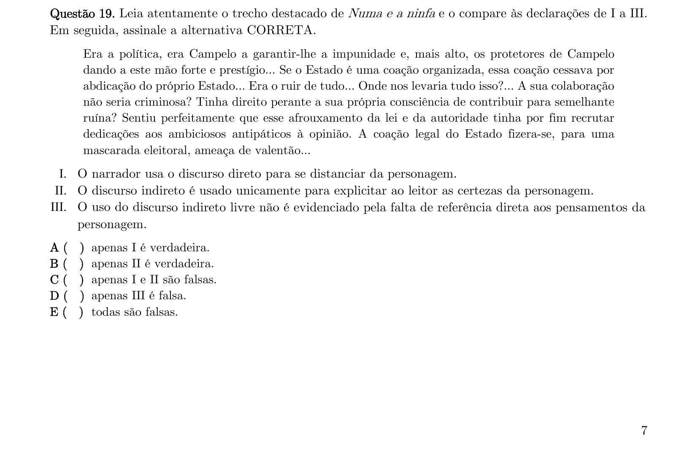

## Q20
**Assunto:** literatura, Lima Barreto
**Competências:** Numa e a ninfa, crônica de costumes, juízo do narrador sobre cultura popular
**Tipo:** múltipla escolha

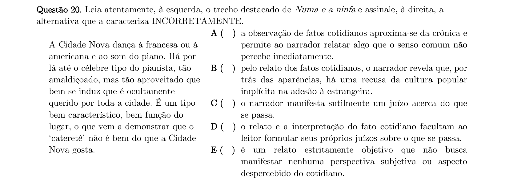

## Q21
**Assunto:** literatura, Drummond
**Competências:** "Morte do leiteiro", forma e conteúdo, crítica social
**Tipo:** múltipla escolha

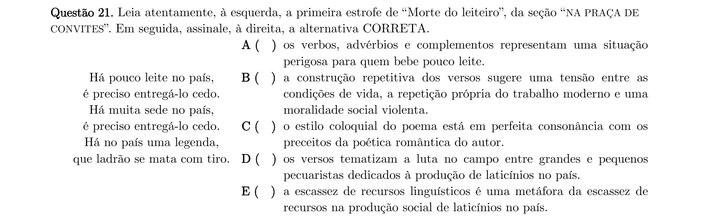

## Q22
**Assunto:** literatura, Drummond
**Competências:** relação ambígua com a memória, esperança sem saudosismo
**Tipo:** múltipla escolha

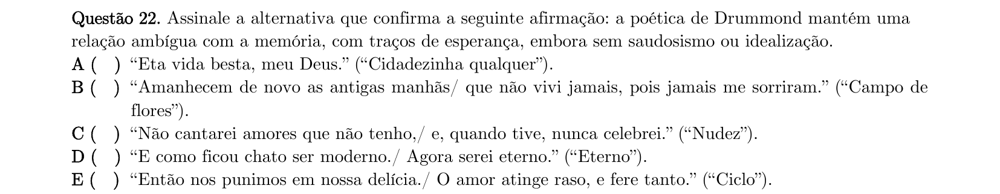

## Q23
**Assunto:** literatura, Drummond
**Competências:** Antologia poética, organização da obra, ironia do poeta
**Tipo:** múltipla escolha

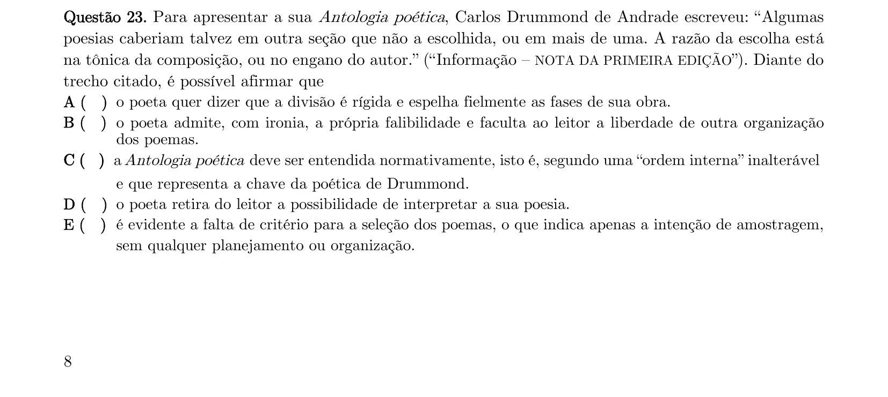

## Q24
**Assunto:** literatura, Drummond
**Competências:** memória, amor e luxúria na obra de Drummond, análise comparativa de versos
**Tipo:** múltipla escolha

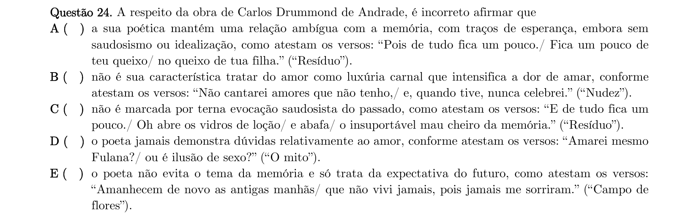

## Q25
**Assunto:** literatura, Drummond
**Competências:** "Amar", amor como relação humana ampla, poética drummondiana
**Tipo:** múltipla escolha

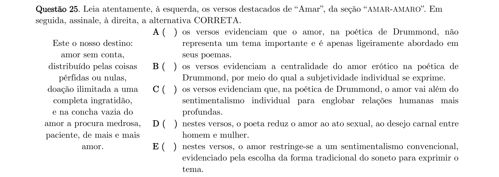

## Q26
**Assunto:** literatura, Lygia Fagundes Telles
**Competências:** conto "A mão no ombro", narrador em terceira pessoa, discurso indireto livre
**Tipo:** múltipla escolha

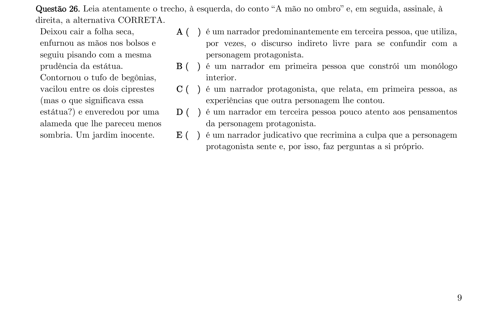

## Q27
**Assunto:** literatura, Lygia Fagundes Telles
**Competências:** relações amorosas desgastadas nos contos, identificação do trecho que não ilustra o tema
**Tipo:** múltipla escolha

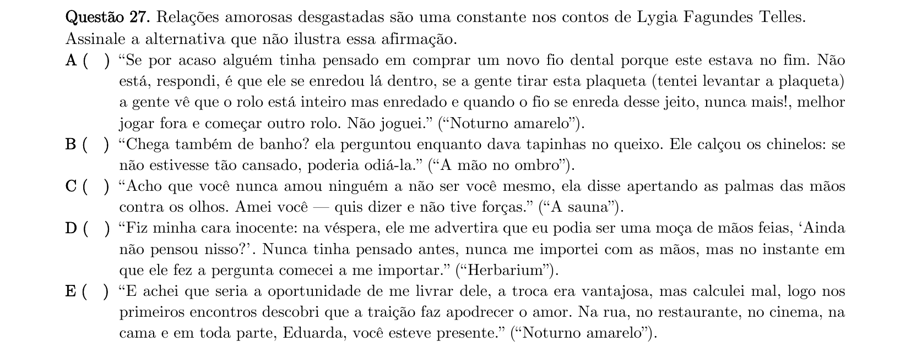

## Q28
**Assunto:** literatura, Lygia Fagundes Telles
**Competências:** conto "Noturno amarelo", memória, balanço da vida da protagonista
**Tipo:** múltipla escolha

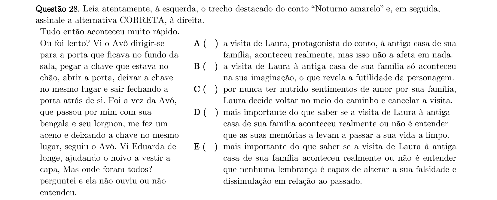

## Q29
**Assunto:** literatura, Lygia Fagundes Telles
**Competências:** conto "Herbarium", amadurecimento traumático, assédio
**Tipo:** múltipla escolha

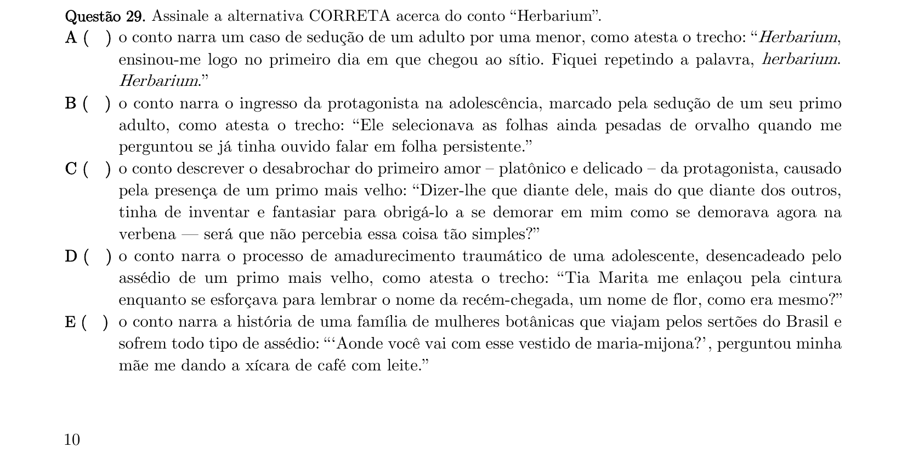

## Q30
**Assunto:** literatura, Lygia Fagundes Telles
**Competências:** conto "Seminário dos ratos", crítica à política, utilitarismo
**Tipo:** múltipla escolha

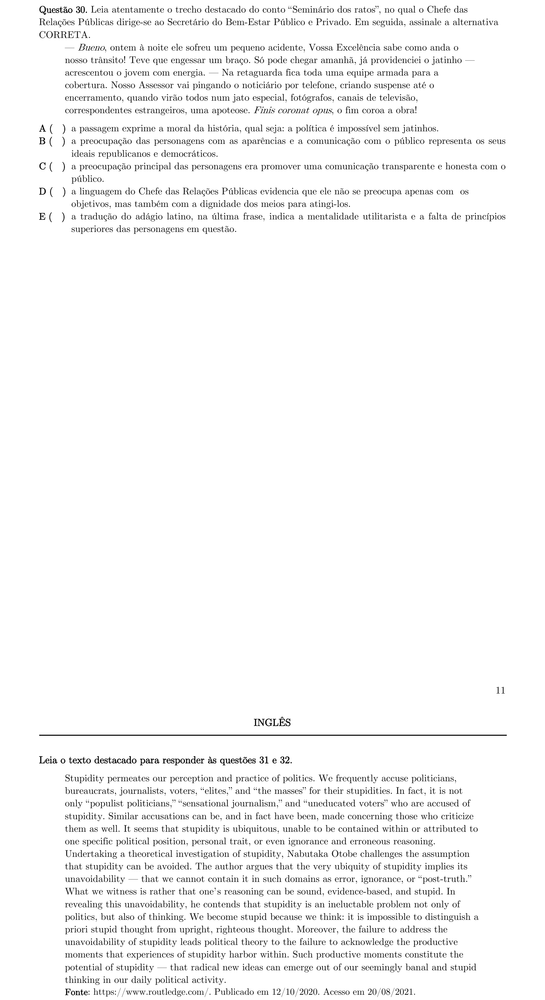
