# Português — ITA 2023 (1ª fase)

> 12 questões múltipla escolha (Q13–Q24 da prova consolidada).

## Q13
**Assunto:** literatura
**Competências:** Os ratos de Dyonélio Machado, análise de personagem
**Tipo:** múltipla escolha

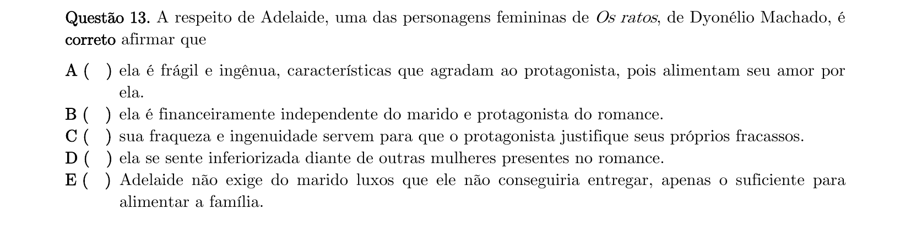

## Q14
**Assunto:** literatura, gramática
**Competências:** Os ratos de Dyonélio Machado, linguagem narrativa, norma culta vs oralidade
**Tipo:** múltipla escolha

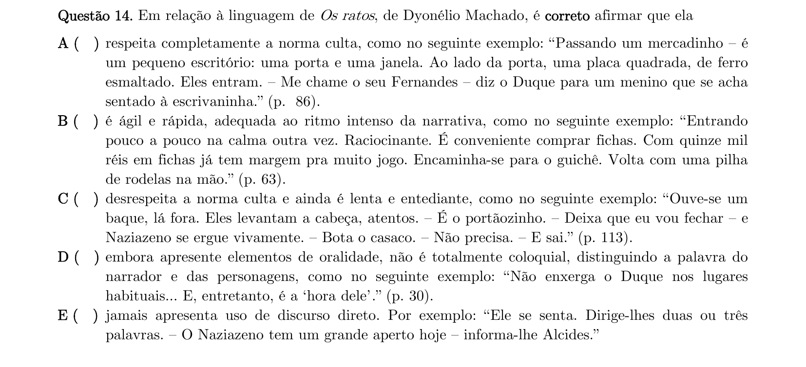

## Q15
**Assunto:** literatura, interpretação de texto
**Competências:** Carlos Drummond de Andrade, análise de versos, versos livres
**Tipo:** múltipla escolha

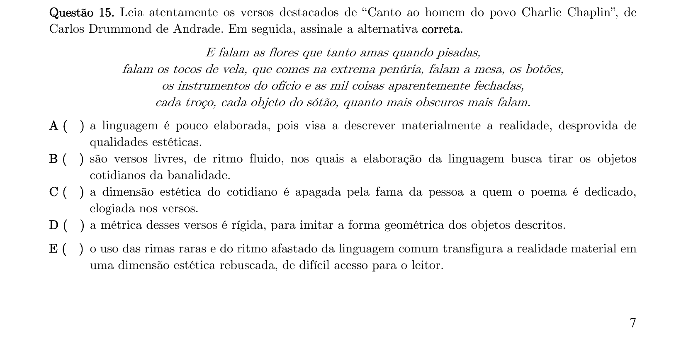

## Q16
**Assunto:** literatura, interpretação de texto
**Competências:** Mário de Andrade Contos novos, classes sociais, variação linguística
**Tipo:** múltipla escolha

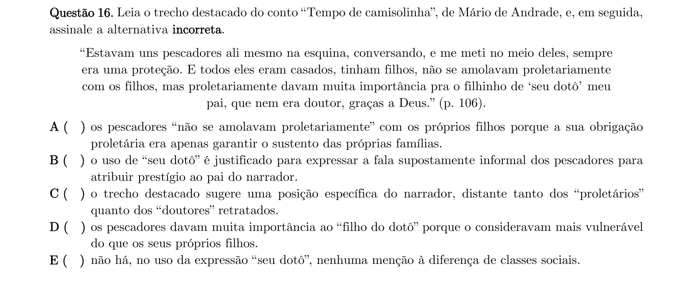

## Q17
**Assunto:** literatura, gramática
**Competências:** Drummond, experimentalismo modernista, norma culta
**Tipo:** múltipla escolha

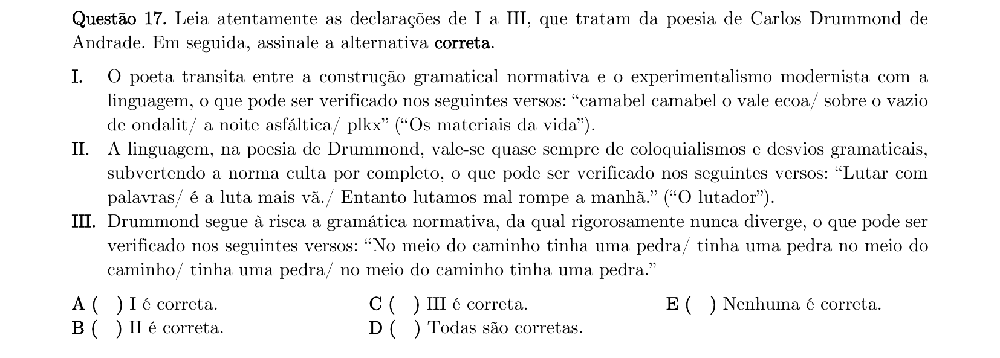

## Q18
**Assunto:** literatura, interpretação de texto
**Competências:** Mário de Andrade O peru de Natal, análise psicológica do narrador
**Tipo:** múltipla escolha

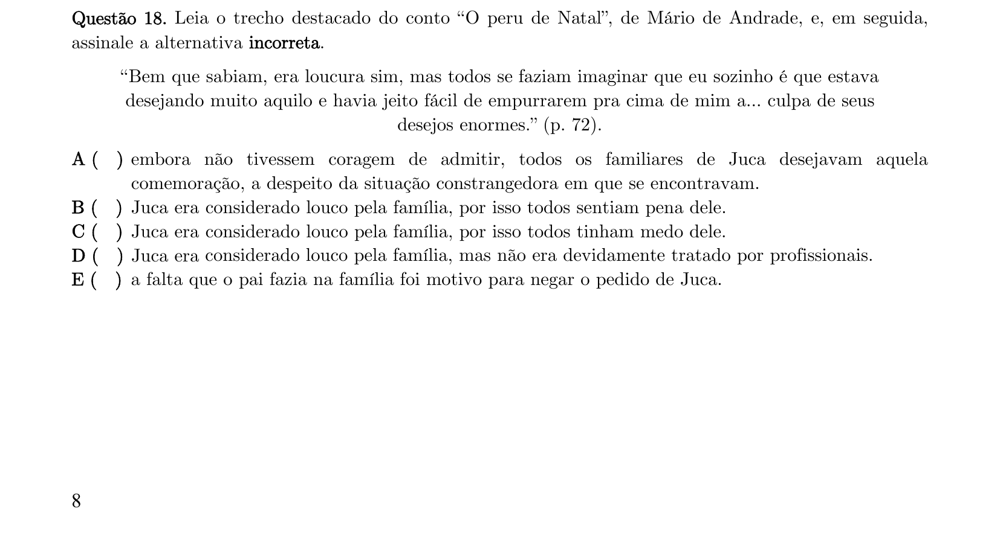

## Q19
**Assunto:** literatura
**Competências:** Os ratos de Dyonélio Machado, estrutura narrativa, fragmentação temporal
**Tipo:** múltipla escolha

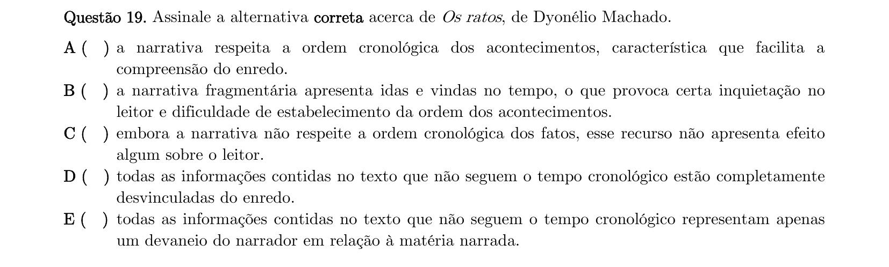

## Q20
**Assunto:** literatura, interpretação de texto
**Competências:** Mário de Andrade Atrás da catedral de Ruão, interpretação de personagem
**Tipo:** múltipla escolha

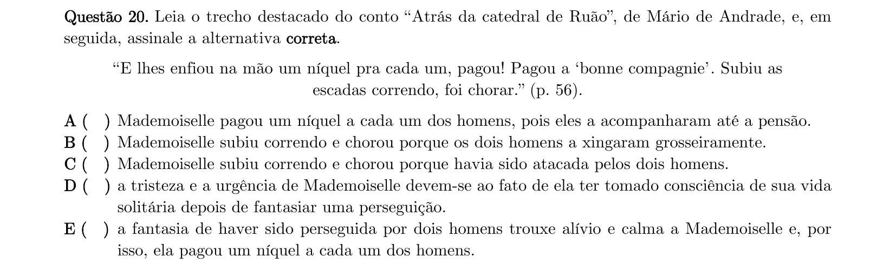

## Q21
**Assunto:** literatura, interpretação de texto
**Competências:** Drummond Cantiga de enganar, ironia, condição humana
**Tipo:** múltipla escolha

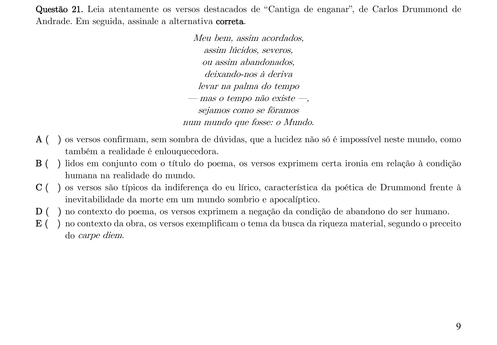

## Q22
**Assunto:** literatura, figuras de linguagem
**Competências:** Os ratos, animalização do humano, intertextualidade
**Tipo:** múltipla escolha

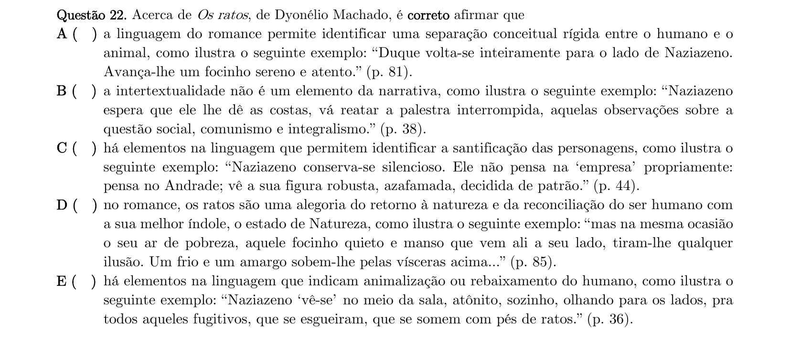

## Q23
**Assunto:** literatura
**Competências:** Mário de Andrade Contos novos, temas e estilo
**Tipo:** múltipla escolha

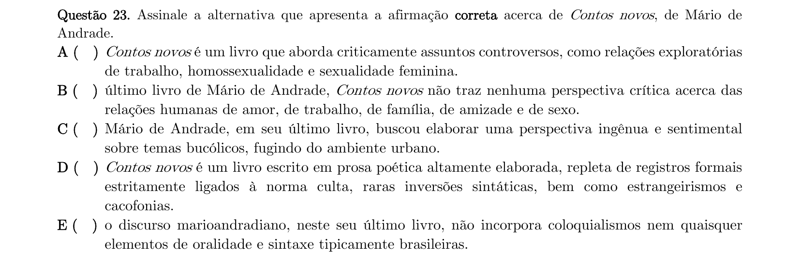

## Q24
**Assunto:** literatura, interpretação de texto
**Competências:** Drummond Antologia Poética, cotidiano e inconformismo
**Tipo:** múltipla escolha

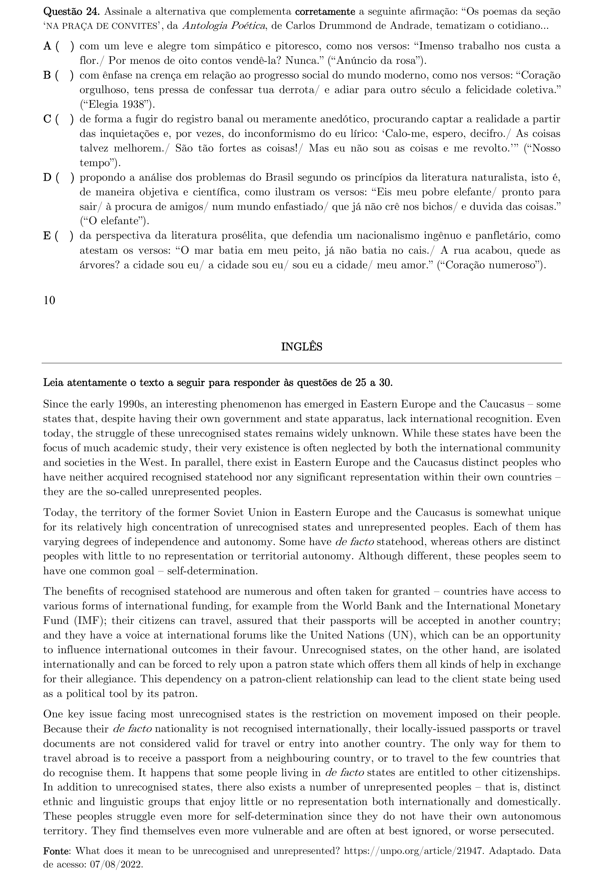
