# Português — ITA 2024 (1ª fase)

> 12 questões múltipla escolha (Q13–Q24 da prova consolidada). Obras: *Nós matamos o cão tinhoso* (Luís Bernardo Honwana), *O avesso da pele* (Jeferson Tenório), *A falecida* (Nelson Rodrigues).

## Q13
**Assunto:** literatura — *Nós matamos o cão tinhoso* (Honwana)
**Competências:** colonialismo, perspectiva infantil, linguagem (idioma ronga)
**Tipo:** múltipla escolha (assinalar INCORRETA)

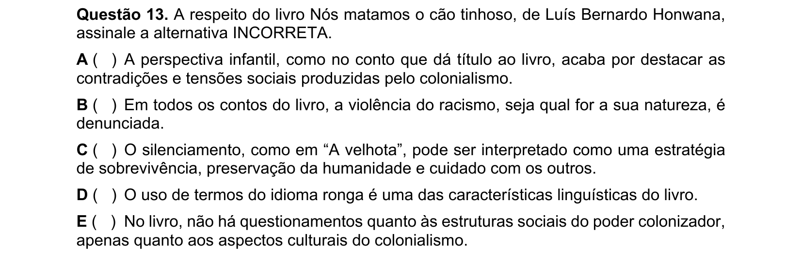

## Q14
**Assunto:** literatura — *Nós matamos o cão tinhoso* (Honwana)
**Competências:** linguagem, identidade cultural, crítica ao colonialismo
**Tipo:** múltipla escolha

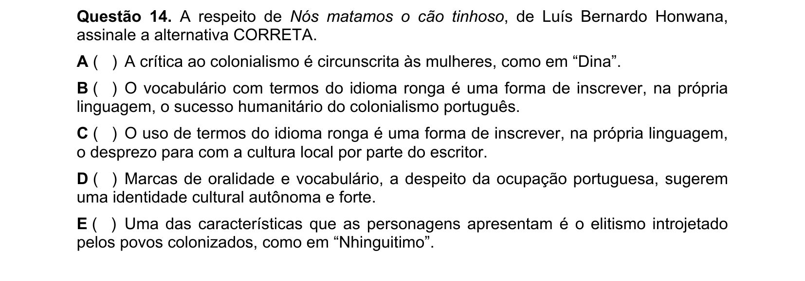

## Q15
**Assunto:** literatura — conto "A velhota" (Honwana)
**Competências:** análise de excerto, narrador, violência colonial
**Tipo:** múltipla escolha (assinalar INCORRETA)

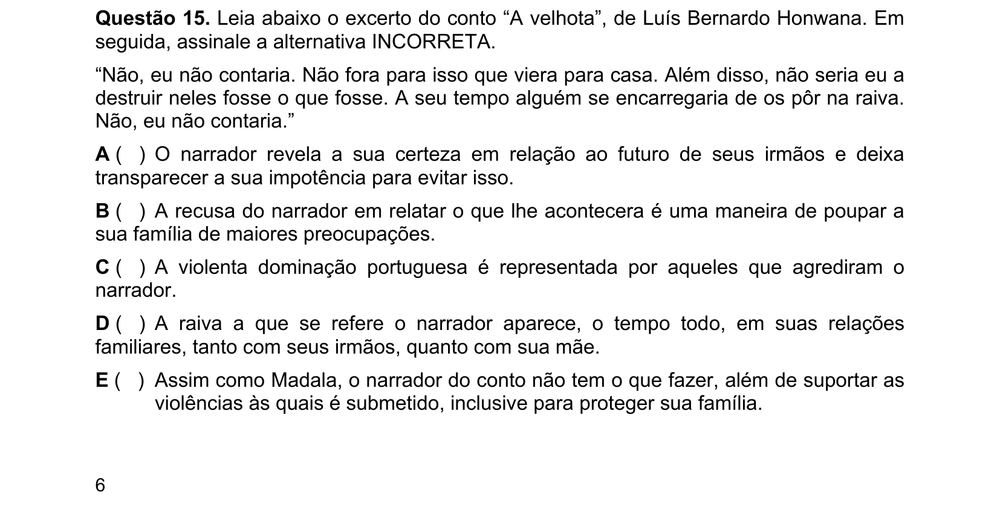

## Q16
**Assunto:** literatura — conto "Dina" (Honwana)
**Competências:** análise de personagens (capataz, Madala, Maria), violência e racismo
**Tipo:** múltipla escolha

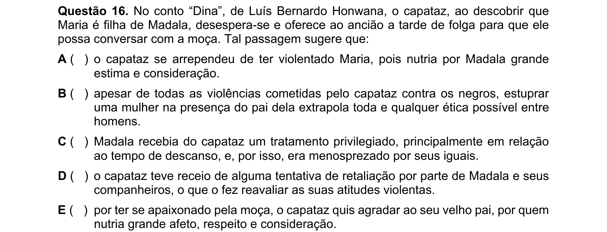

## Q17
**Assunto:** literatura — *O avesso da pele* (Tenório)
**Competências:** foco narrativo, narrador, ponto de vista
**Tipo:** múltipla escolha

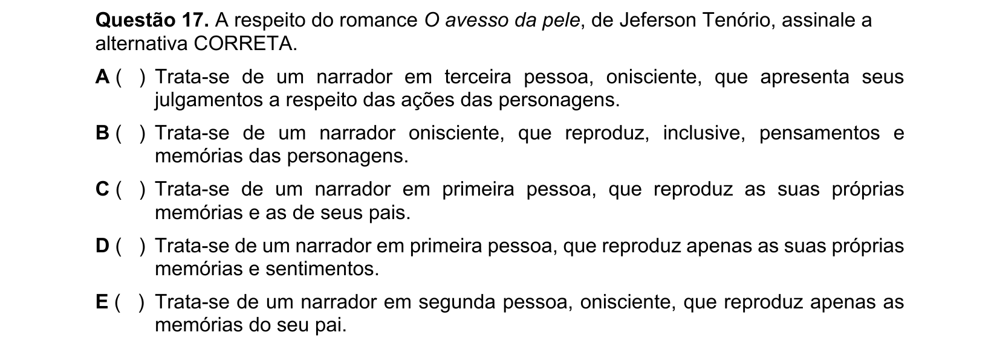

## Q18
**Assunto:** literatura — *O avesso da pele* (Tenório)
**Competências:** tomada de consciência sobre negritude, análise de trechos
**Tipo:** múltipla escolha (EXCETO EM)

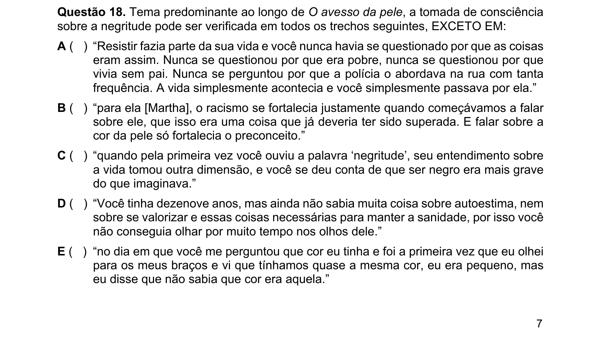

## Q19
**Assunto:** literatura comparada — Honwana e Tenório
**Competências:** comparação entre obras, racismo no Brasil e em Moçambique, leitura crítica
**Tipo:** múltipla escolha (asserções)

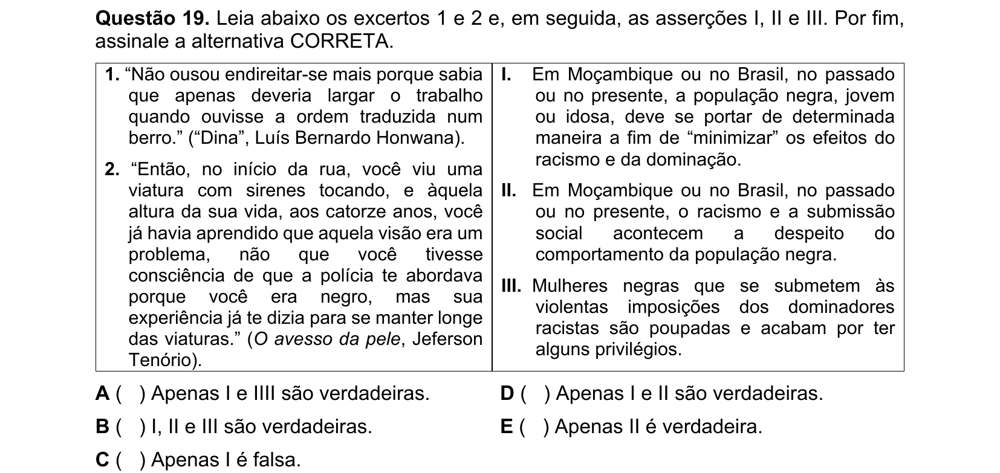

## Q20
**Assunto:** literatura — *O avesso da pele* (Tenório)
**Competências:** análise de personagens (Henrique, Martha, Juliana), conscientização sobre racismo
**Tipo:** múltipla escolha (asserções I-IV)

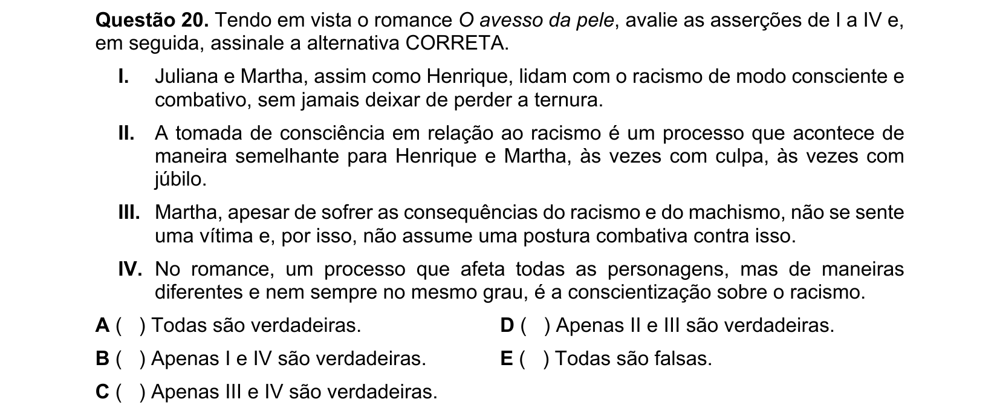

## Q21
**Assunto:** literatura — *A falecida* (Nelson Rodrigues)
**Competências:** realidade social do Rio nos anos 1950, linguagem coloquial, cotidiano
**Tipo:** múltipla escolha

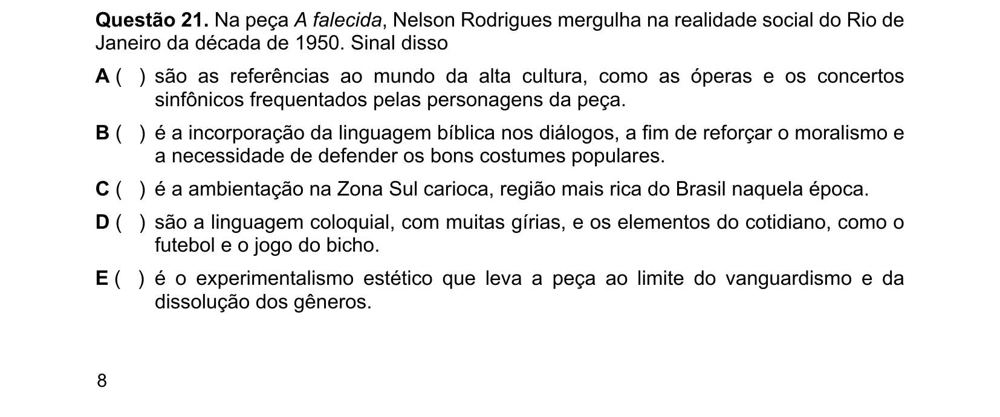

## Q22
**Assunto:** literatura — *A falecida* (Nelson Rodrigues)
**Competências:** modernidade do teatro de Nelson Rodrigues, influências do cinema e da crônica
**Tipo:** múltipla escolha

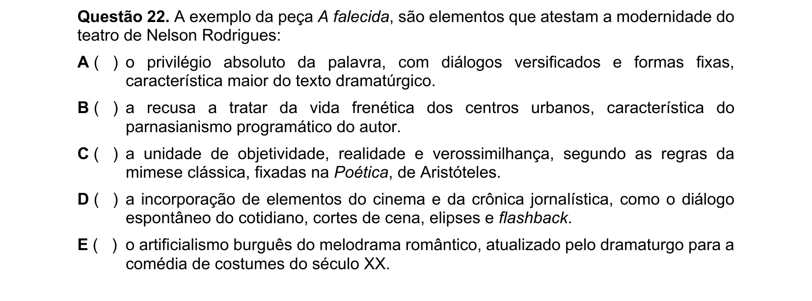

## Q23
**Assunto:** literatura — *A falecida* (Nelson Rodrigues)
**Competências:** análise de personagem (Zulmira), escapismo, marginalidade social
**Tipo:** múltipla escolha (asserções I-IV)

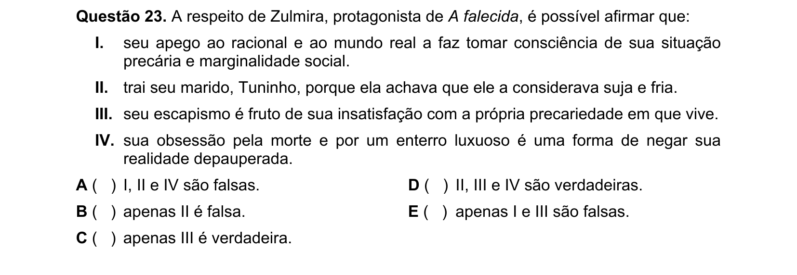

## Q24
**Assunto:** literatura — *A falecida* (Nelson Rodrigues)
**Competências:** análise de personagem (Tuninho), relações familiares
**Tipo:** múltipla escolha

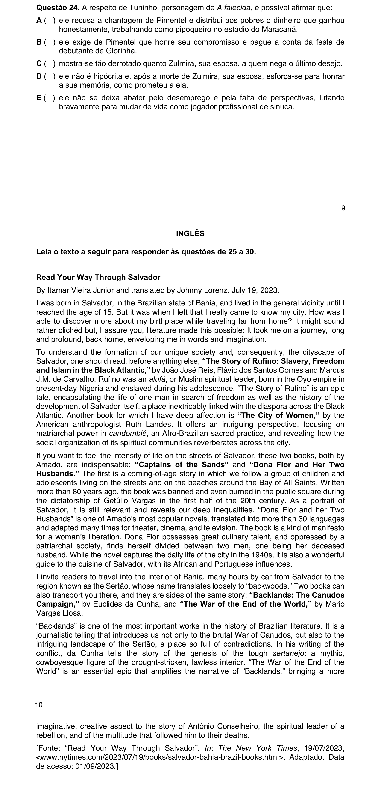
