# Português — ITA 2025 (2ª fase)

> 15 questões de múltipla escolha.

## Q01
**Assunto:** interpretação de texto
**Competências:** identificação de tipos de argumento (autoridade, analogia, prova concreta, senso comum, causa/consequência)
**Tipo:** múltipla escolha

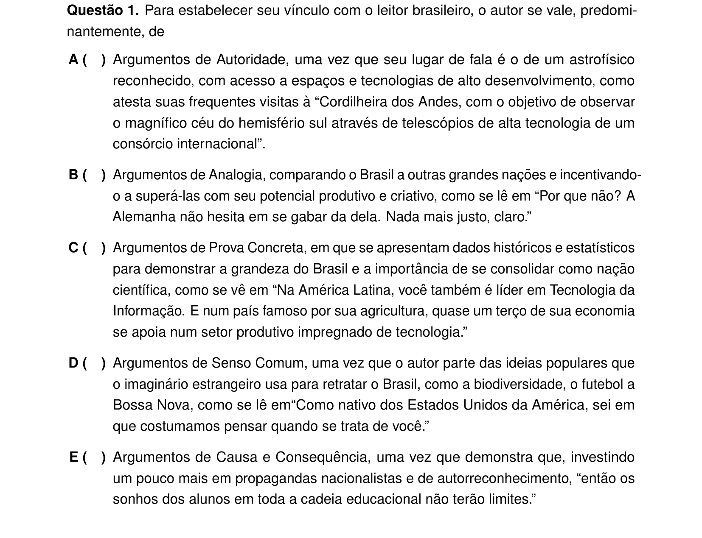

## Q02
**Assunto:** gramática
**Competências:** análise semântica da conjunção aditiva "e" como elemento de ênfase e qualificação
**Tipo:** múltipla escolha

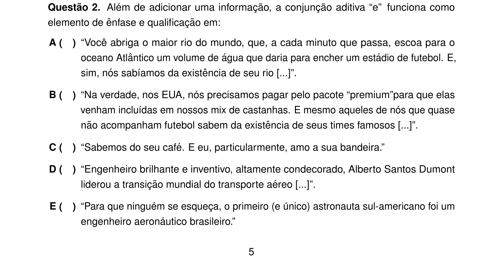

## Q03
**Assunto:** interpretação de texto
**Competências:** intertextualidade — citação, paráfrase, alusão, plágio
**Tipo:** múltipla escolha

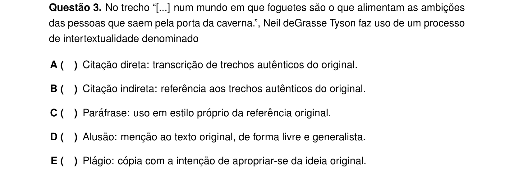

## Q04
**Assunto:** gramática
**Competências:** classificação morfológica e função sintática do pronome QUE
**Tipo:** múltipla escolha

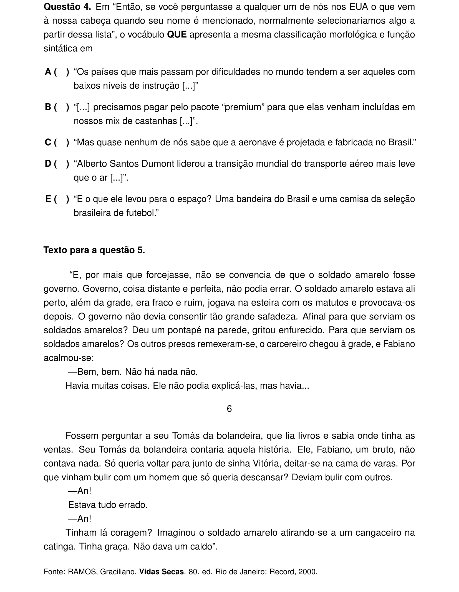

## Q05
**Assunto:** literatura
**Competências:** Vidas Secas (Graciliano Ramos); discurso indireto livre
**Tipo:** múltipla escolha

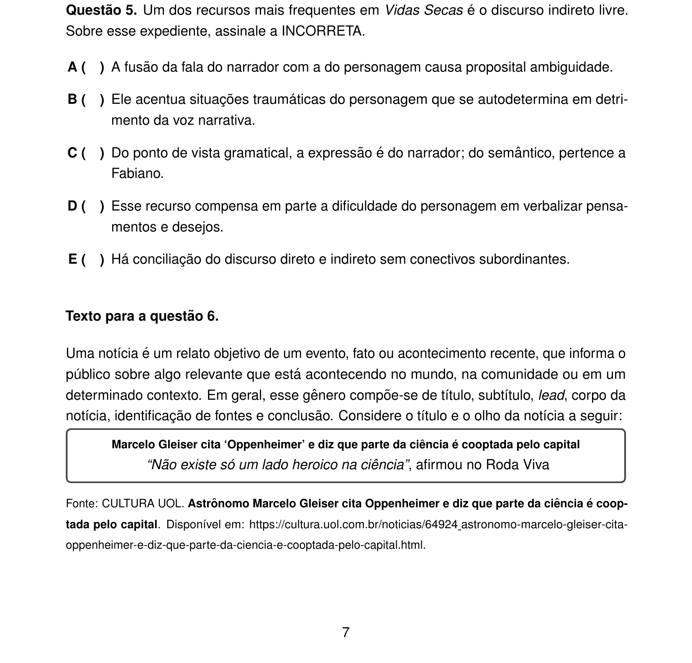

## Q06
**Assunto:** interpretação de texto
**Competências:** coesão e coerência; sequência lógica de parágrafos em notícia
**Tipo:** múltipla escolha

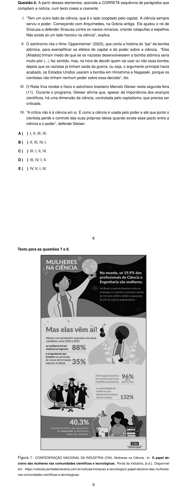

## Q07
**Assunto:** gramática
**Competências:** semântica e deslocamento de palavra denotativa (SÓ)
**Tipo:** múltipla escolha

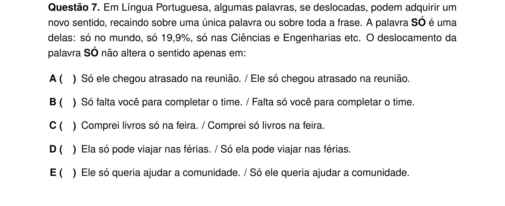

## Q08
**Assunto:** gramática
**Competências:** reescrita com preservação de sentido; conectores concessivos e causais
**Tipo:** múltipla escolha

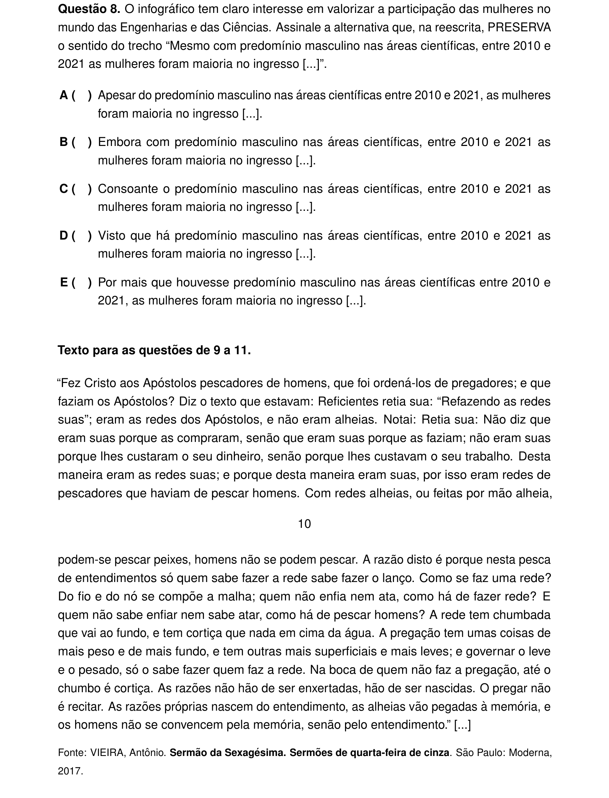

## Q09
**Assunto:** interpretação de texto
**Competências:** Sermão da Sexagésima (Pe. Antônio Vieira) — leitura literal e argumentativa
**Tipo:** múltipla escolha

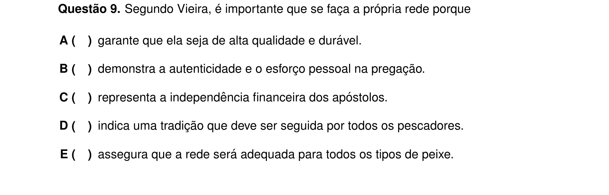

## Q10
**Assunto:** figuras de linguagem
**Competências:** identificação de metáfora/antítese em trecho do Sermão da Sexagésima
**Tipo:** múltipla escolha

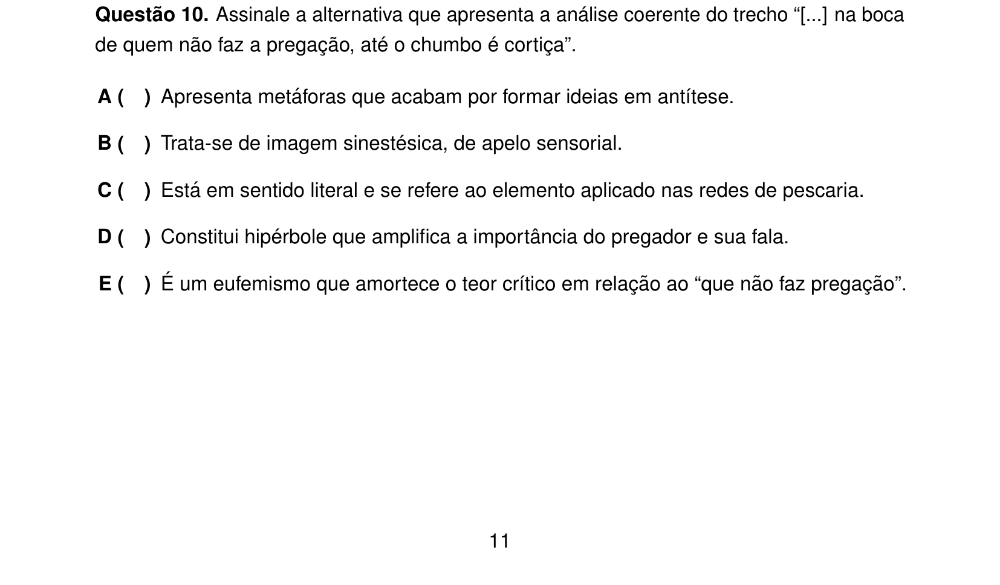

## Q11
**Assunto:** literatura
**Competências:** aforismos na obra de Pe. Antônio Vieira (sermões barrocos)
**Tipo:** múltipla escolha

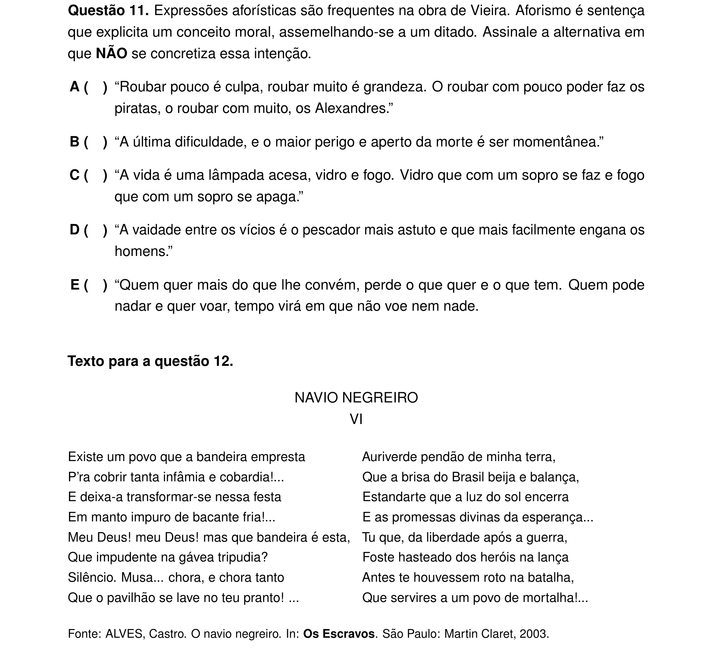

## Q12
**Assunto:** literatura
**Competências:** Castro Alves, condoreirismo, terceira geração romântica; aliteração no Navio Negreiro
**Tipo:** múltipla escolha

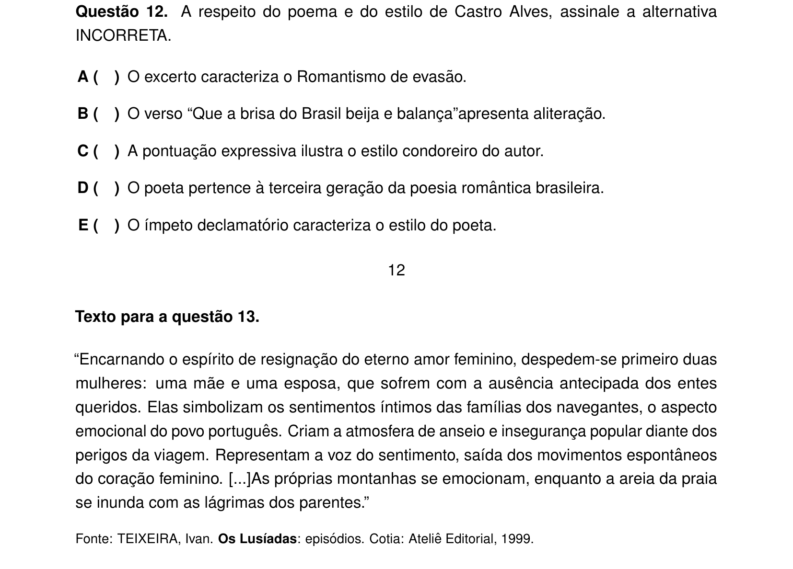

## Q13
**Assunto:** literatura
**Competências:** Os Lusíadas (Camões) — episódio do Velho do Restelo / despedida em Belém
**Tipo:** múltipla escolha

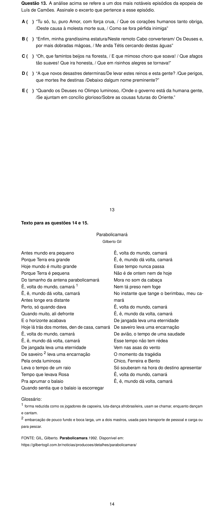

## Q14
**Assunto:** interpretação de texto
**Competências:** leitura da canção "Parabolicamará" (Gilberto Gil); globalização, espaço-tempo
**Tipo:** múltipla escolha

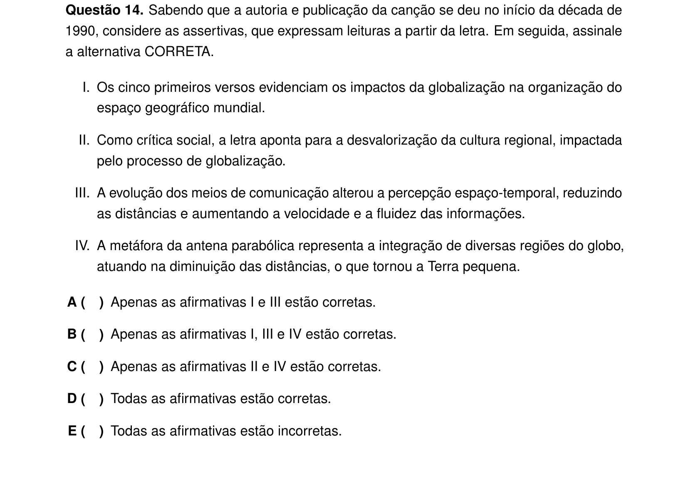

## Q15
**Assunto:** figuras de linguagem
**Competências:** identificação de metáfora de tempo (rapidez) em versos da canção "Parabolicamará"
**Tipo:** múltipla escolha

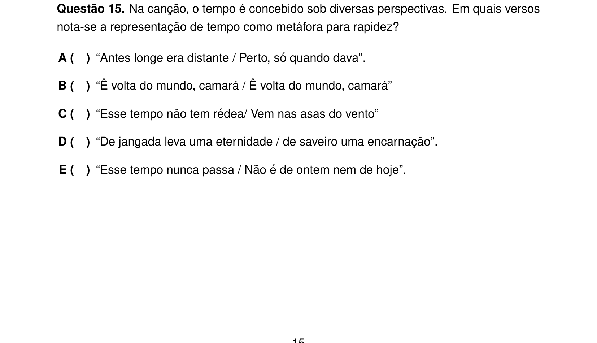
