# Química — ITA 2008

> 30 questões. Q01–Q20 múltipla escolha; Q21–Q30 discursivas.

## Q01
**Assunto:** reações inorgânicas
**Competências:** balanceamento redox, identificação de produtos, reações ácido-base, ácido nítrico oxidante, sulfetos
**Tipo:** múltipla escolha

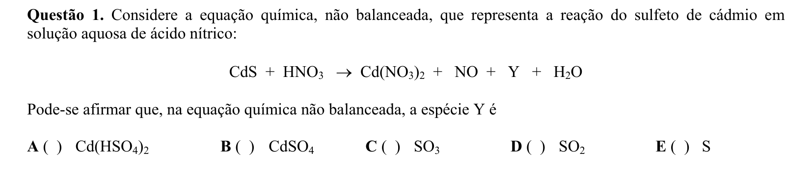

## Q02
**Assunto:** química orgânica
**Competências:** reações de oxirredução em orgânica, adição eletrofílica, neutralização ácido-base, reação de Williamson, redução por hidreto
**Tipo:** múltipla escolha

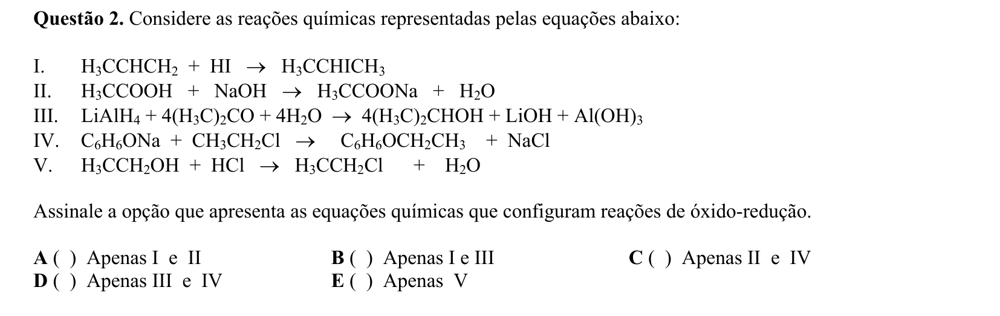

## Q03
**Assunto:** estequiometria
**Competências:** neutralização ácido-base, ácidos dicarboxílicos, cálculo de massa molar, mol e concentração molar
**Tipo:** múltipla escolha

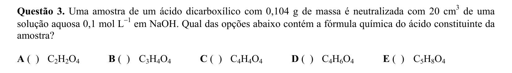

## Q04
**Assunto:** equilíbrio químico
**Competências:** constante Kp em sistemas gasosos, equilíbrio heterogêneo, pressões parciais, decomposição térmica
**Tipo:** múltipla escolha

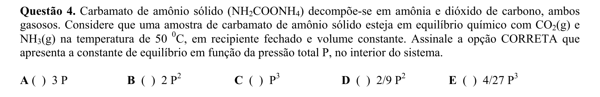

## Q05
**Assunto:** equilíbrio iônico
**Competências:** efeito do íon comum, produto de solubilidade, solubilidade de sais, deslocamento de equilíbrio
**Tipo:** múltipla escolha

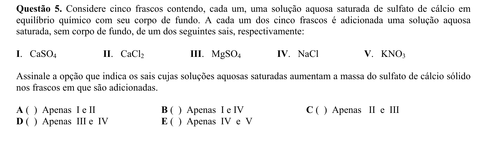

## Q06
**Assunto:** reações inorgânicas
**Competências:** reações de oxirredução em meio aquoso, potenciais redox, reatividade de halogenetos, oxidação por O2 atmosférico
**Tipo:** múltipla escolha

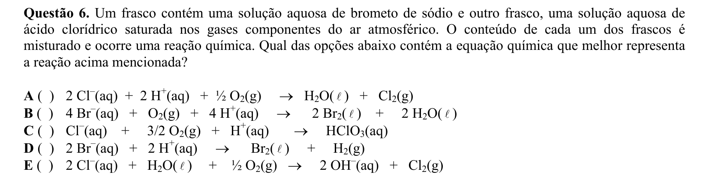

## Q07
**Assunto:** equilíbrio iônico
**Competências:** produto de solubilidade Kps, efeito do íon comum, cálculo de concentração de íons, solução saturada
**Tipo:** múltipla escolha

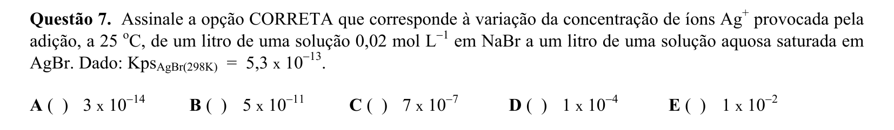

## Q08
**Assunto:** cinética química
**Competências:** ordem de reação, transformações físicas vs químicas, leis de velocidade, conceito de pseudo-ordem
**Tipo:** múltipla escolha

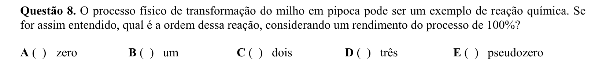

## Q09
**Assunto:** cinética química
**Competências:** reação autocatalítica, perfil de concentração no tempo, sistemas fechados, equilíbrio químico
**Tipo:** múltipla escolha

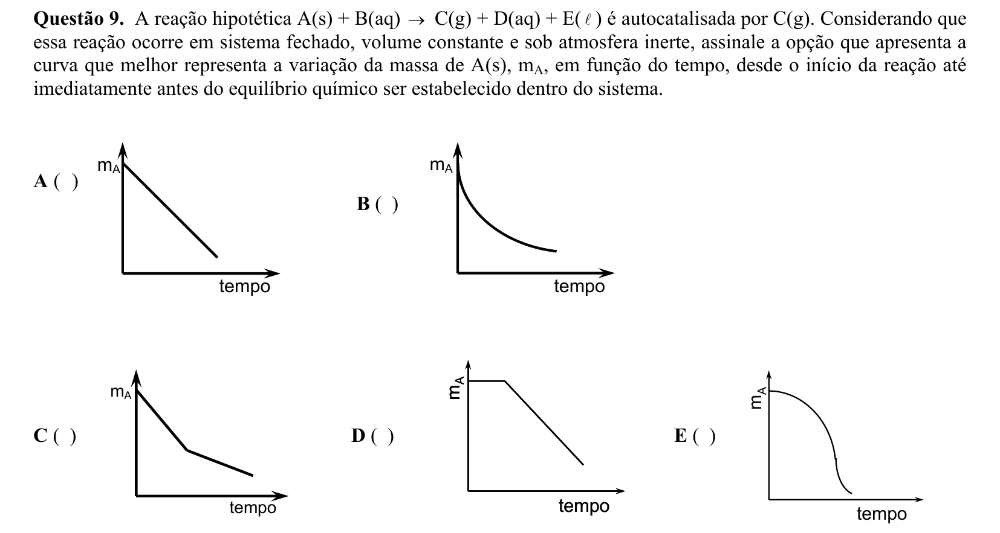

## Q10
**Assunto:** soluções
**Competências:** soluções ideais, propriedades coligativas, lei de Raoult, aditividade de volumes, balanço térmico
**Tipo:** múltipla escolha

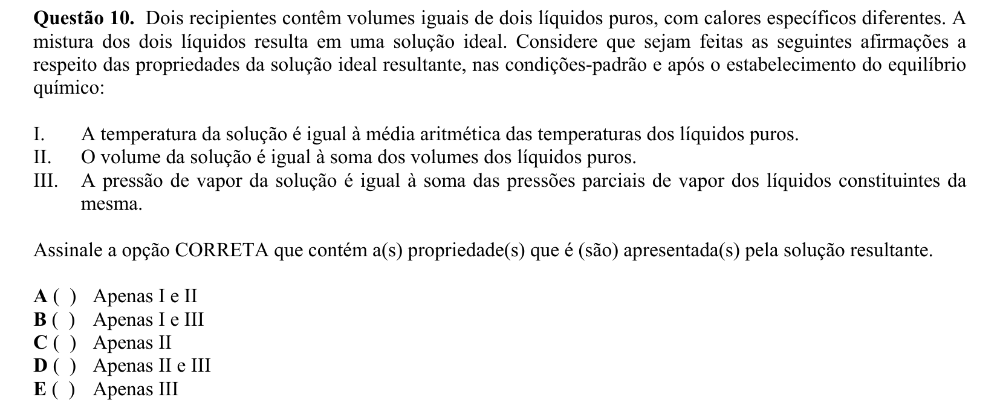

## Q11
**Assunto:** eletroquímica
**Competências:** proteção catódica, leis de Faraday, corrosão eletroquímica, cálculo de massa eletrolisada
**Tipo:** múltipla escolha

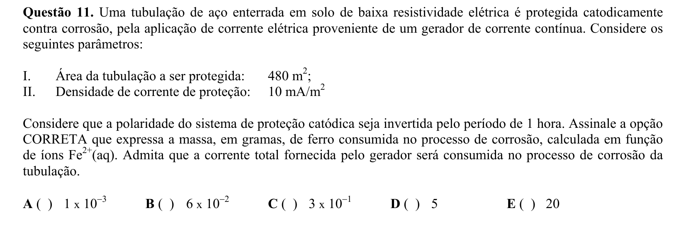

## Q12
**Assunto:** eletroquímica
**Competências:** equação de Nernst, potencial de eletrodo, pilha galvânica, EPH, força eletromotriz
**Tipo:** múltipla escolha

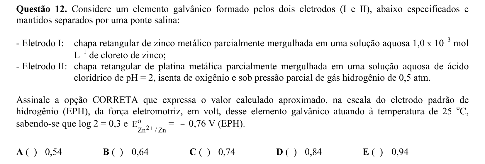

## Q13
**Assunto:** termoquímica
**Competências:** calorimetria, calor de fusão, balanço térmico adiabático, mudança de fase, calor específico
**Tipo:** múltipla escolha

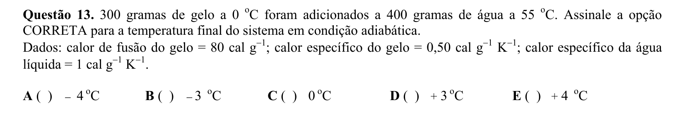

## Q14
**Assunto:** eletroquímica
**Competências:** constante de equilíbrio via potencial redox, equação de Nernst, relação ΔG-K-E, potenciais padrão
**Tipo:** múltipla escolha

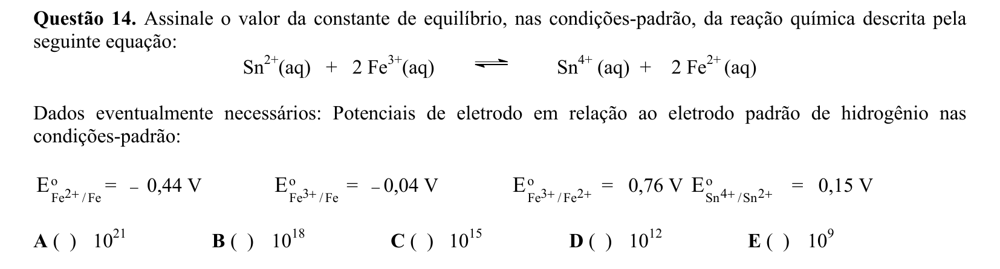

## Q15
**Assunto:** tabela periódica
**Competências:** semicondutores, dopagem tipo-p, grupos da tabela periódica, valência de elementos
**Tipo:** múltipla escolha

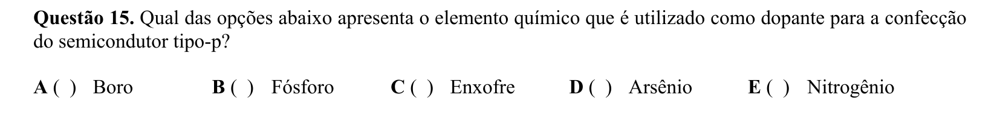

## Q16
**Assunto:** química orgânica
**Competências:** polímeros de condensação, poliuretanos, grupos funcionais, reação isocianato-álcool
**Tipo:** múltipla escolha

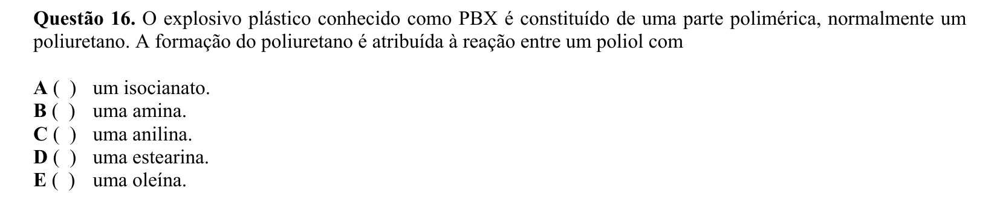

## Q17
**Assunto:** química orgânica
**Competências:** polímeros termoplásticos, propriedades de polímeros, aplicações industriais, policarbonato
**Tipo:** múltipla escolha

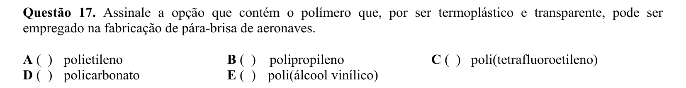

## Q18
**Assunto:** termoquímica
**Competências:** primeira lei da termodinâmica, processos isobáricos isotérmicos, variação de energia interna, mudança de fase, dissolução
**Tipo:** múltipla escolha

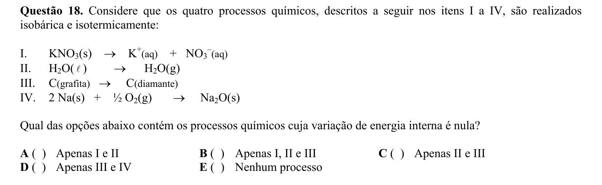

## Q19
**Assunto:** termoquímica
**Competências:** entalpia padrão de formação, estados de referência, alotropia, substâncias simples
**Tipo:** múltipla escolha

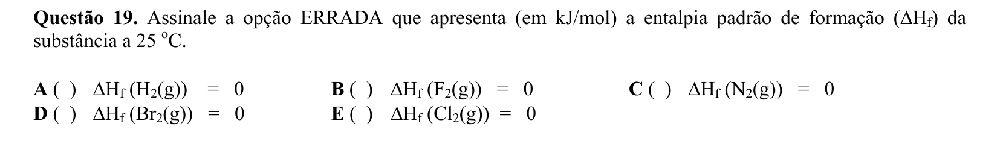

## Q20
**Assunto:** reações inorgânicas
**Competências:** pólvora negra, composição de explosivos, química industrial, nitratos
**Tipo:** múltipla escolha

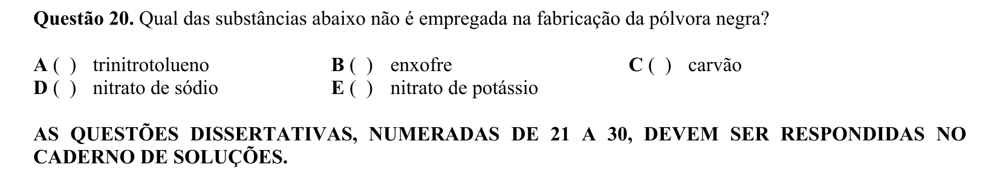

## Q21
**Assunto:** geometria molecular
**Competências:** estruturas de Lewis, geometria VSEPR, polaridade molecular, momento dipolar, hibridização
**Tipo:** discursiva

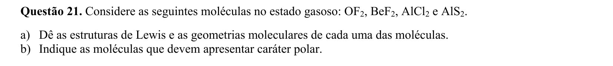

## Q22
**Assunto:** equilíbrio químico
**Competências:** equilíbrio líquido-vapor, pressão de vapor, princípio de Le Chatelier, perturbação de equilíbrio, esboço gráfico
**Tipo:** discursiva

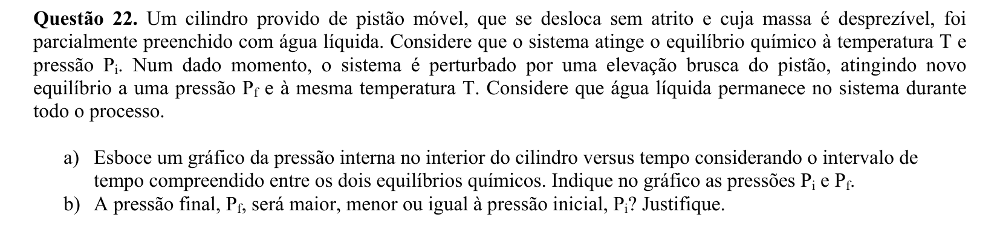

## Q23
**Assunto:** propriedades coligativas
**Competências:** pressão osmótica, equação de van't Hoff, regressão linear, cálculo de massa molar
**Tipo:** discursiva

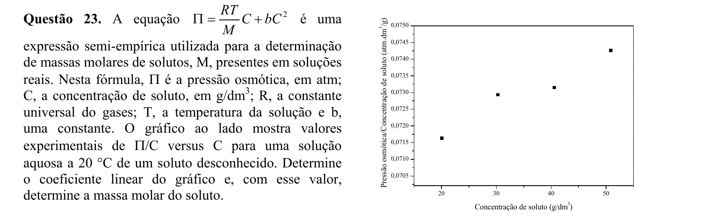

## Q24
**Assunto:** estequiometria
**Competências:** lei dos gases ideais, pressão parcial e vapor d'água, reação metal-ácido, cálculo de pureza
**Tipo:** discursiva

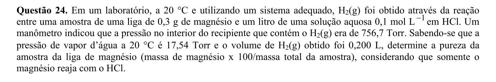

## Q25
**Assunto:** química orgânica
**Competências:** eliminação E2, regra de Saytzeff, desidratação ácida, adição de Markovnikov, haletos de alquila
**Tipo:** discursiva

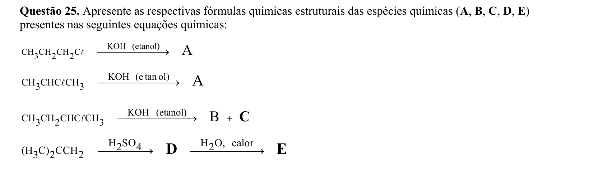

## Q26
**Assunto:** termoquímica
**Competências:** expansão isotérmica vs adiabática, primeira lei da termodinâmica, trabalho de gás ideal, energia interna
**Tipo:** discursiva

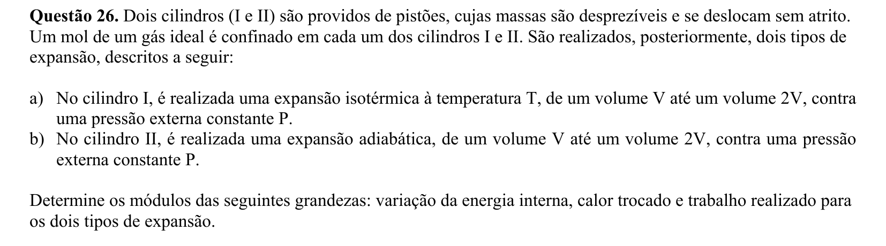

## Q27
**Assunto:** gases
**Competências:** lei de Boyle, pressão hidrostática, gases ideais, cálculo de massa via mols, número de Avogadro
**Tipo:** discursiva

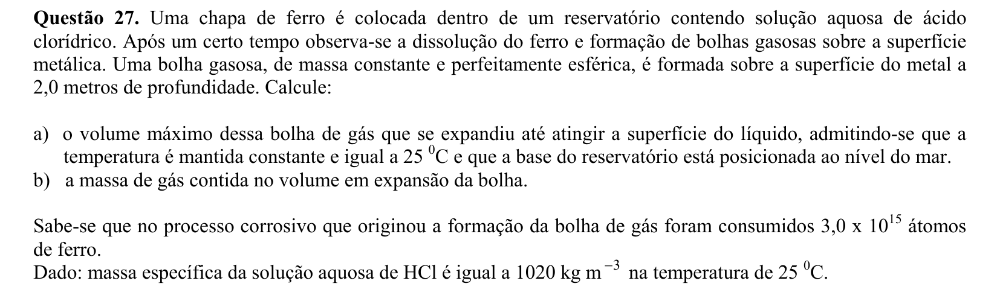

## Q28
**Assunto:** tabela periódica
**Competências:** previsão de propriedades por grupo, metais alcalinos, reatividade com água, solubilidade de carbonatos
**Tipo:** discursiva

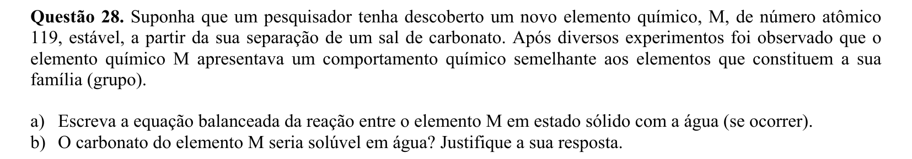

## Q29
**Assunto:** eletroquímica
**Competências:** corrosão, leis de Faraday, cálculo de corrente a partir de taxa de corrosão, conversão de unidades
**Tipo:** discursiva

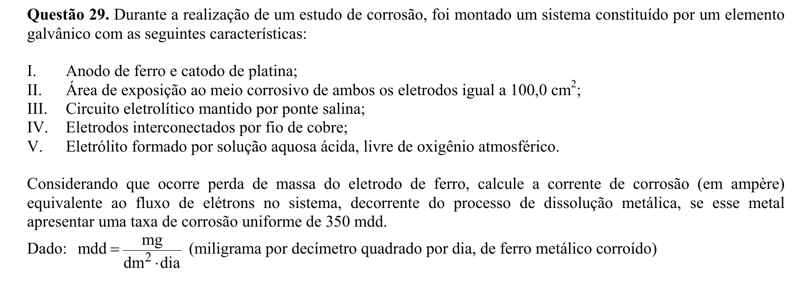

## Q30
**Assunto:** cinética química
**Competências:** perfil energético de reação, energia de ativação, catálise homogênea, mecanismo em etapas, etapa lenta determinante
**Tipo:** discursiva

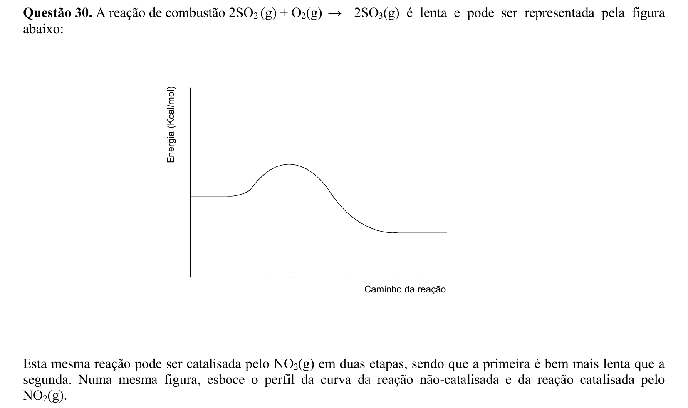
