# Química — ITA 2009

> 30 questões. Q01–Q20 múltipla escolha; Q21–Q30 discursivas.

## Q01
**Assunto:** estequiometria
**Competências:** mistura de carbonato e bicarbonato, titulação ácido-base, cálculo de massa, neutralização com HCl
**Tipo:** múltipla escolha

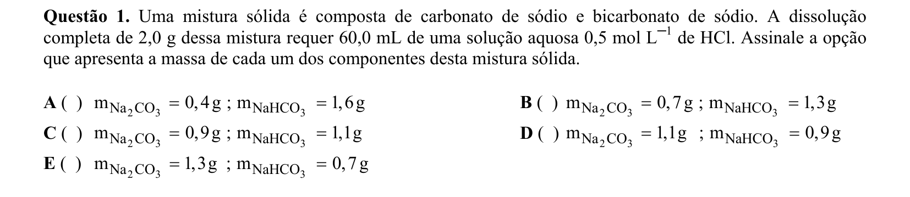

## Q02
**Assunto:** termoquímica
**Competências:** ciclo de Carnot, transformações termodinâmicas, máquinas térmicas, processos adiabáticos e isotérmicos
**Tipo:** múltipla escolha

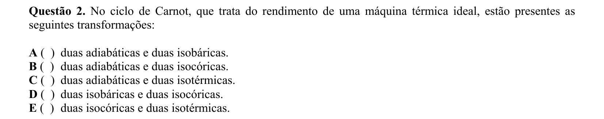

## Q03
**Assunto:** radioatividade
**Competências:** emissão alfa, deslocamento na tabela periódica, decaimentos sucessivos, identificação de família/grupo
**Tipo:** múltipla escolha

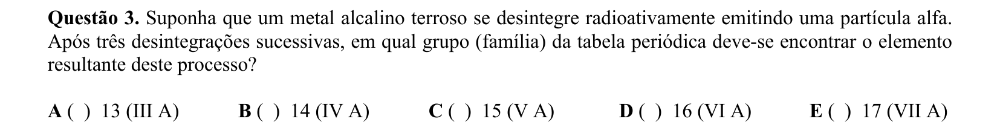

## Q04
**Assunto:** eletroquímica
**Competências:** reatividade de metais, série eletroquímica, reação com água, identificação de metal
**Tipo:** múltipla escolha

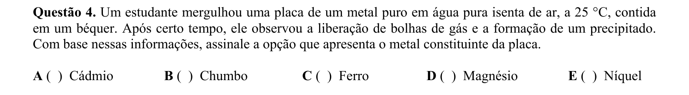

## Q05
**Assunto:** radioatividade
**Competências:** cinética de decaimento radioativo, curva exponencial, interpretação gráfica, meia-vida
**Tipo:** múltipla escolha

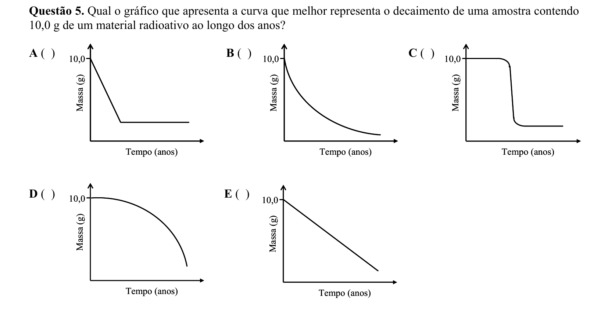

## Q06
**Assunto:** estados da matéria
**Competências:** classificação de substâncias puras e misturas, ponto de fusão constante, mistura eutética, substâncias simples e compostas
**Tipo:** múltipla escolha

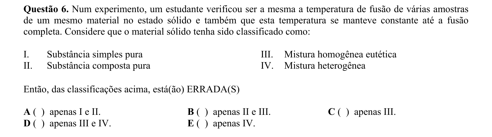

## Q07
**Assunto:** ligações químicas
**Competências:** forças intermoleculares, ligações de hidrogênio, ponto de ebulição, comparação entre álcoois, éteres e aminas
**Tipo:** múltipla escolha

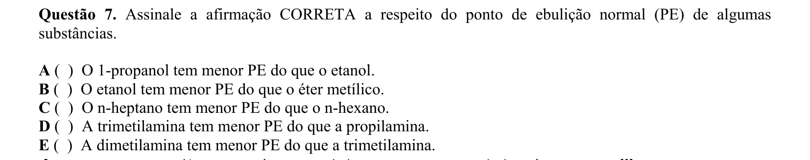

## Q08
**Assunto:** termoquímica
**Competências:** primeira lei da termodinâmica, diagrama T vs V, energia interna, transformações de gás ideal
**Tipo:** múltipla escolha

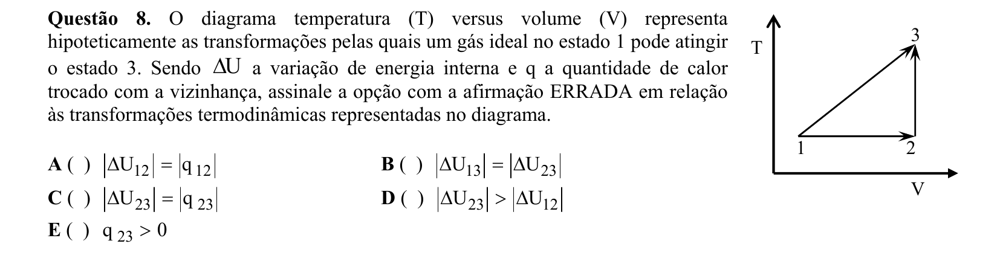

## Q09
**Assunto:** atomística
**Competências:** configuração eletrônica, diagrama de Linus Pauling, afinidade eletrônica, energia de ionização, ânions
**Tipo:** múltipla escolha

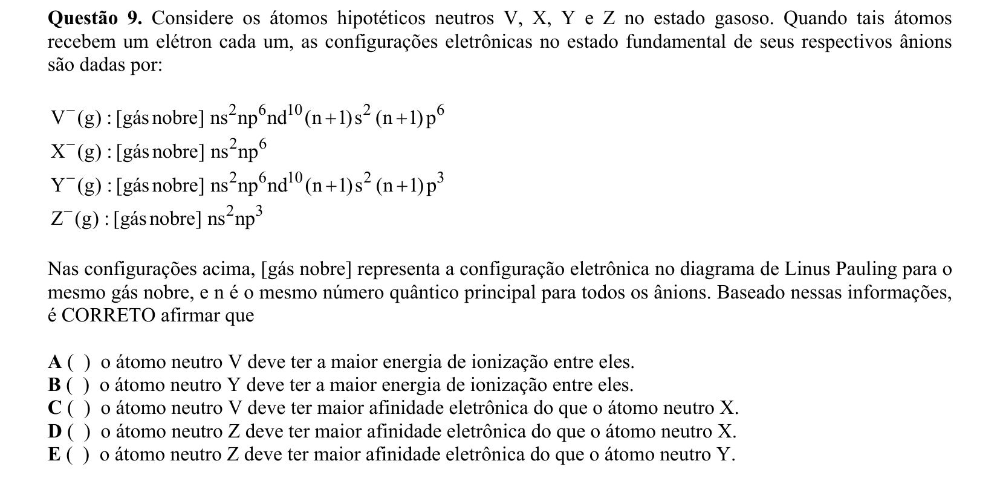

## Q10
**Assunto:** equilíbrio químico
**Competências:** constante Kp, grau de dissociação, equilíbrio gasoso N2O4/NO2, fração de dissociação
**Tipo:** múltipla escolha

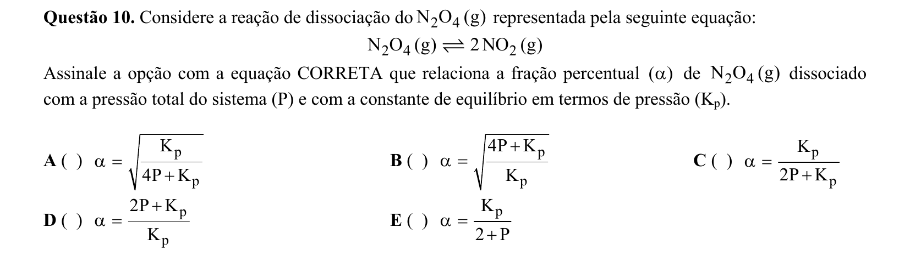

## Q11
**Assunto:** cinética química
**Competências:** velocidade de reação, relação estequiométrica entre velocidades, consumo de reagentes
**Tipo:** múltipla escolha

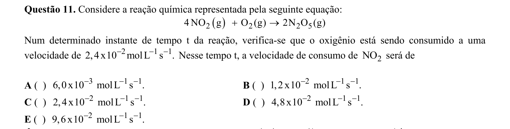

## Q12
**Assunto:** radioatividade
**Competências:** meia-vida, decaimento de iodo-131 e césio-137, cálculo logarítmico, decaimento a 1%
**Tipo:** múltipla escolha

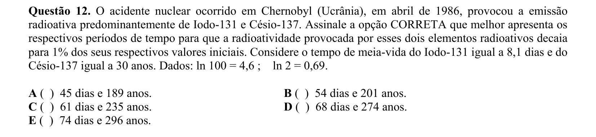

## Q13
**Assunto:** gases
**Competências:** lei de Charles, teoria cinética dos gases, densidade dos gases, velocidade molecular média
**Tipo:** múltipla escolha

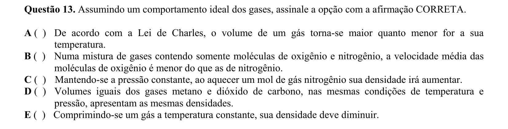

## Q14
**Assunto:** química analítica
**Competências:** teste de chama, identificação de cátions, coloração característica de sódio, análise qualitativa
**Tipo:** múltipla escolha

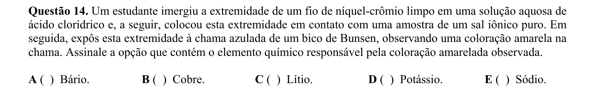

## Q15
**Assunto:** química analítica
**Competências:** desestabilização de coloide, regra de Schulze-Hardy, carga dos íons, suspensão coloidal
**Tipo:** múltipla escolha

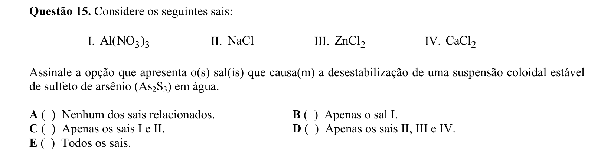

## Q16
**Assunto:** equilíbrio iônico
**Competências:** ácido fraco monoprótico, grau de dissociação, cálculo de pH e pOH, concentração de OH-
**Tipo:** múltipla escolha

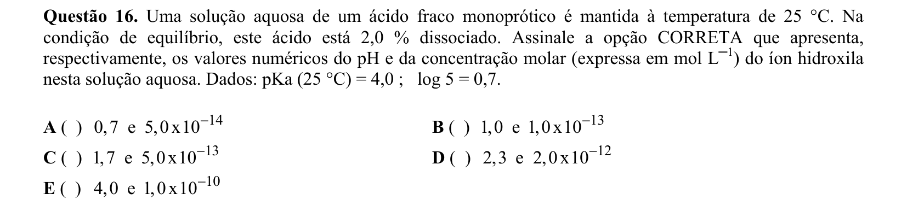

## Q17
**Assunto:** química orgânica
**Competências:** oxidação por KMnO4, identificação de grupo funcional, reação de álcoois, formação de MnO2
**Tipo:** múltipla escolha

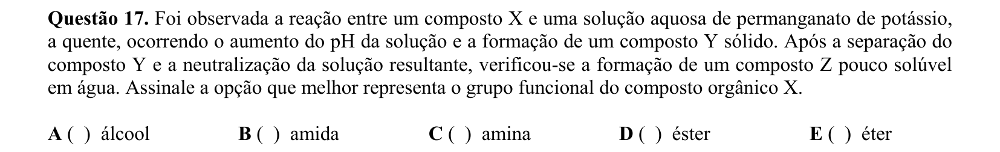

## Q18
**Assunto:** gases
**Competências:** propriedades termodinâmicas de gás ideal, lei de Boyle, capacidade calorífica, interpretação gráfica
**Tipo:** múltipla escolha

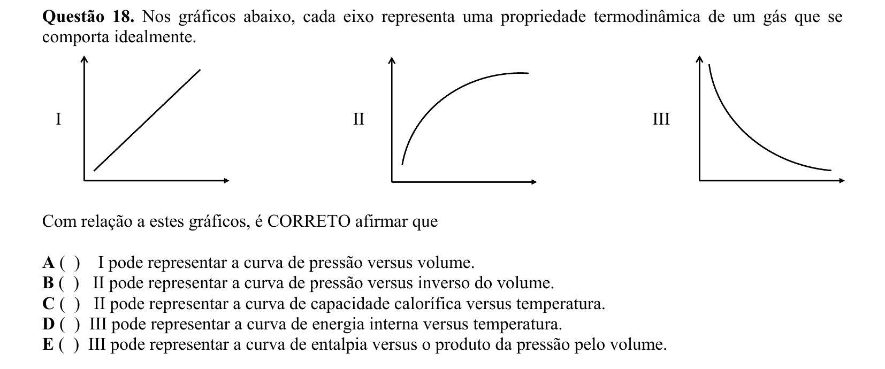

## Q19
**Assunto:** propriedades coligativas
**Competências:** lei de Raoult, pressão de vapor, fração molar, concentração de solução de açúcar
**Tipo:** múltipla escolha

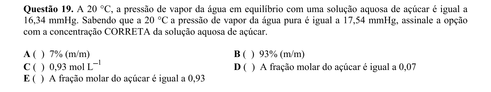

## Q20
**Assunto:** eletroquímica
**Competências:** equação de Nernst, célula galvânica, potencial padrão, pH e potencial do eletrodo de oxigênio
**Tipo:** múltipla escolha

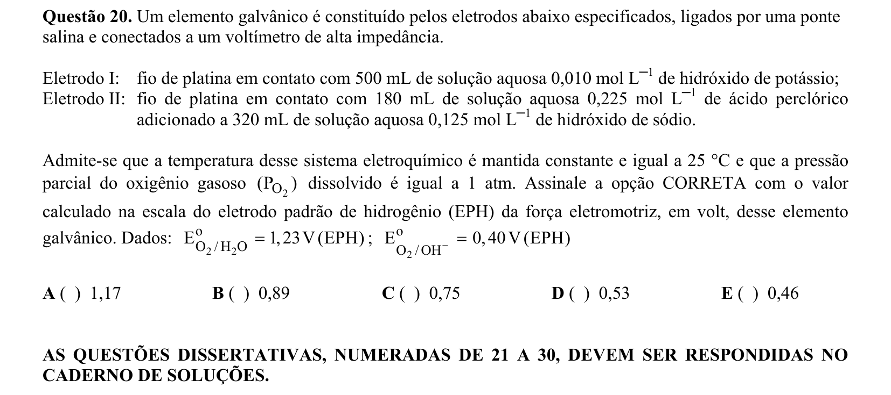

## Q21
**Assunto:** estequiometria
**Competências:** balanceamento de combustão, combustão completa de hidrocarboneto, composição do ar atmosférico, iso-octano
**Tipo:** discursiva

## Q22
**Assunto:** química orgânica
**Competências:** basicidade de aminas, efeitos indutivo e mesomérico, comparação de constantes Kb, solubilidade de aminas
**Tipo:** discursiva

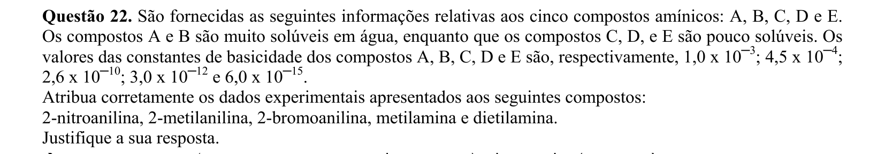

## Q23
**Assunto:** equilíbrio iônico
**Competências:** curva de titulação ácido-base, ácido forte e ácido fraco, ponto de equivalência, instrumentos de laboratório
**Tipo:** discursiva

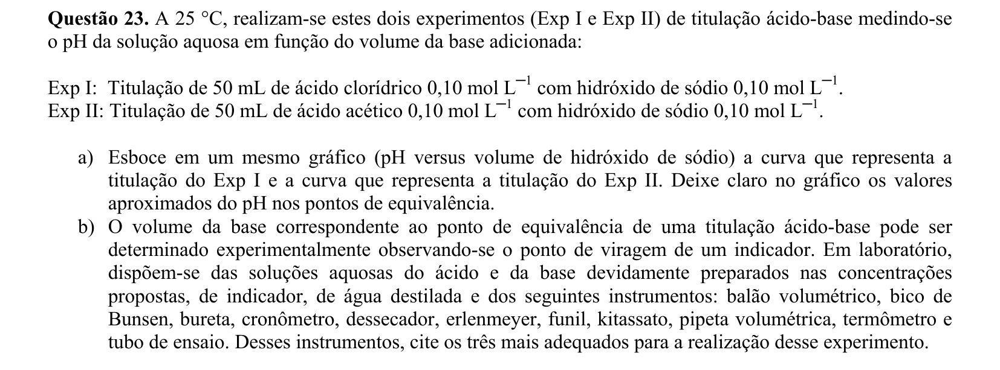

## Q24
**Assunto:** eletroquímica
**Competências:** equação de Nernst, células galvânicas Fe/Sn, formação de complexos, inversão de eletrodos
**Tipo:** discursiva

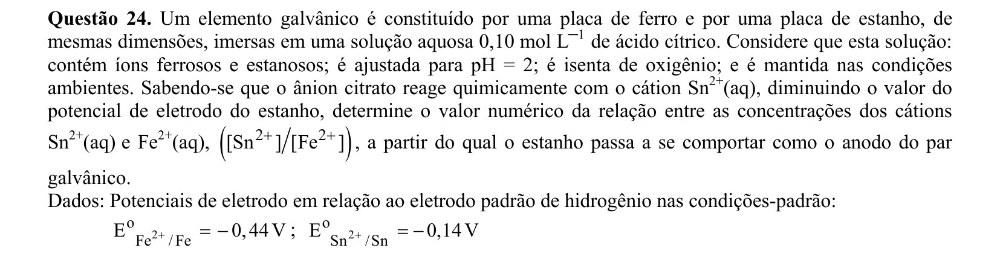

## Q25
**Assunto:** propriedades coligativas
**Competências:** pressão osmótica, crioscopia, fração molar, cálculo de massa e temperatura de congelamento
**Tipo:** discursiva

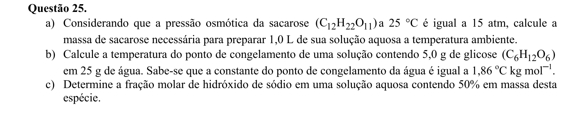

## Q26
**Assunto:** termoquímica
**Competências:** retardantes de chama, decomposição endotérmica, requisitos de combustão, química de polímeros
**Tipo:** discursiva

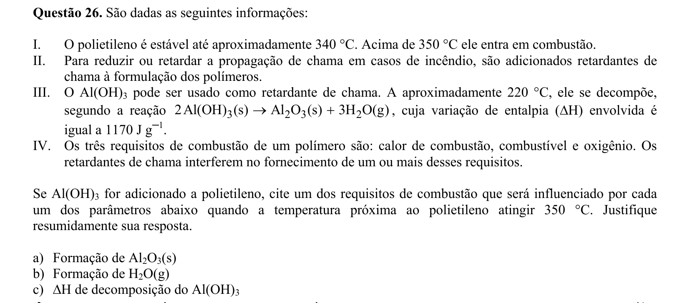

## Q27
**Assunto:** equilíbrio iônico
**Competências:** hidrólise salina, constante de hidrólise, cianeto de amônio, cálculo de pH de sal de ácido fraco e base fraca
**Tipo:** discursiva

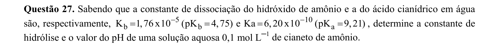

## Q28
**Assunto:** cinética química
**Competências:** reação de primeira e segunda ordem, tempo de meia-vida, lei de velocidade integrada, gráfico de concentração vs tempo
**Tipo:** discursiva

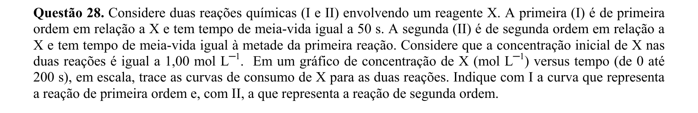

## Q29
**Assunto:** eletroquímica
**Competências:** corrosão eletrolítica, monocamada atômica, lei de Faraday, densidade de corrente, dissolução anódica
**Tipo:** discursiva

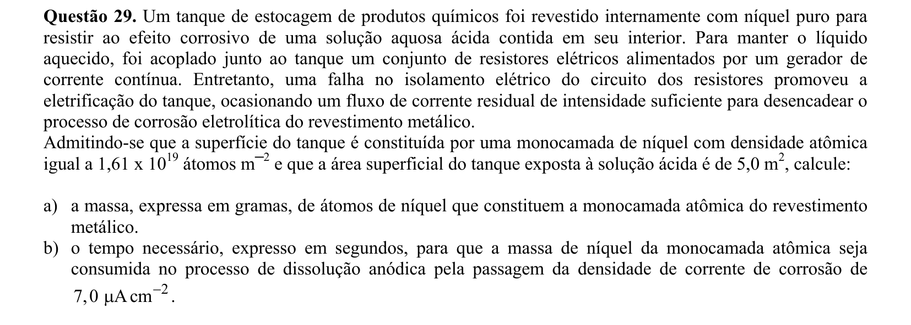

## Q30
**Assunto:** reações inorgânicas
**Competências:** química do cobre, reações de bromo, decomposição térmica, ácido nítrico concentrado, redução por hidrogênio
**Tipo:** discursiva

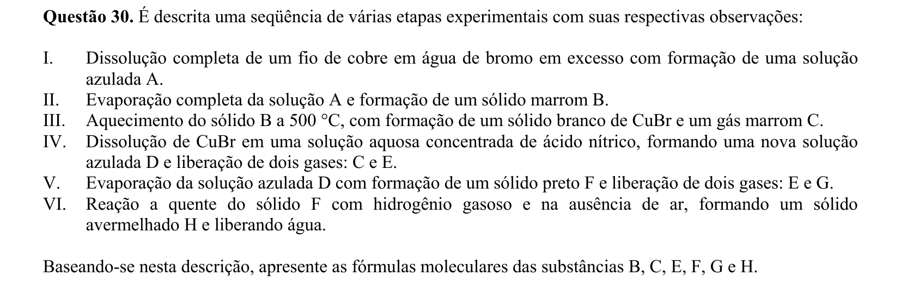
