# Química — ITA 2010

> 30 questões. Q01–Q20 múltipla escolha; Q21–Q30 discursivas.

## Q01
**Assunto:** estados da matéria
**Competências:** curva de aquecimento, mudanças de fase, calor específico, calor latente, energia cinética e potencial molecular
**Tipo:** múltipla escolha

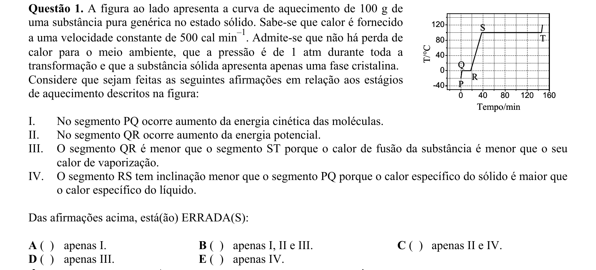

## Q02
**Assunto:** atomística
**Competências:** modelos atômicos, história da química, cronologia de cientistas
**Tipo:** múltipla escolha

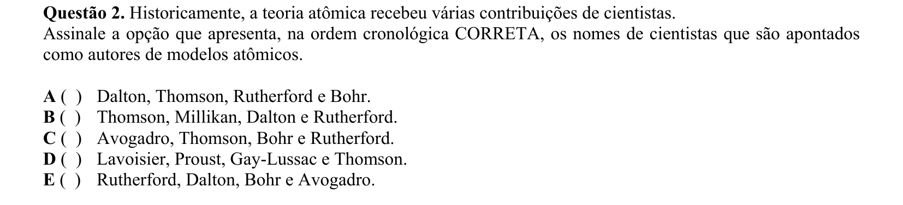

## Q03
**Assunto:** ligações químicas
**Competências:** polaridade de solventes, dissociação iônica, condutividade elétrica, interações soluto-solvente
**Tipo:** múltipla escolha

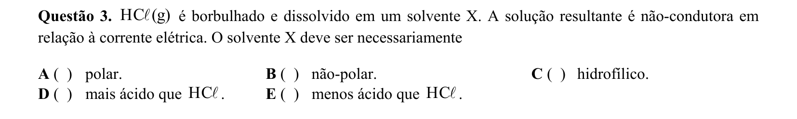

## Q04
**Assunto:** equilíbrio iônico
**Competências:** titulação ácido-base, condutância de soluções, mobilidade iônica, neutralização
**Tipo:** múltipla escolha

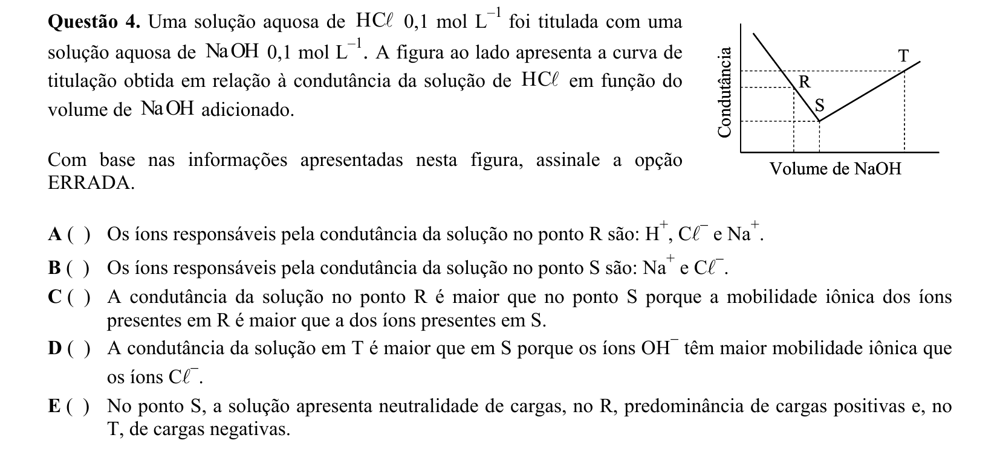

## Q05
**Assunto:** eletroquímica
**Competências:** célula galvânica, equação de Nernst, potenciais padrão, cálculo de pH
**Tipo:** múltipla escolha

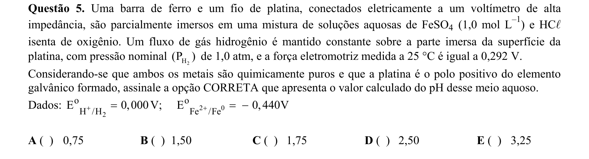

## Q06
**Assunto:** estequiometria
**Competências:** balanceamento redox, meio ácido, soma de coeficientes, oxirredução
**Tipo:** múltipla escolha

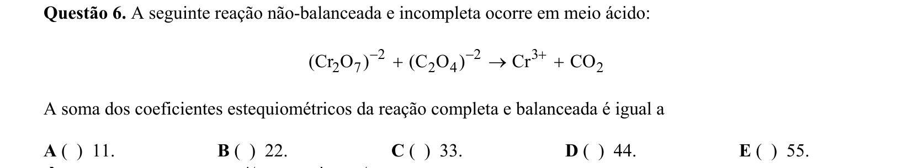

## Q07
**Assunto:** soluções
**Competências:** polaridade molecular, semelhante dissolve semelhante, solventes apolares, forças intermoleculares
**Tipo:** múltipla escolha

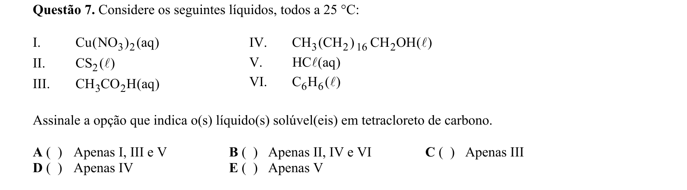

## Q08
**Assunto:** cinética química
**Competências:** mecanismo de reação, etapa lenta, catalisador, intermediário, lei de velocidade, ordem de reação
**Tipo:** múltipla escolha

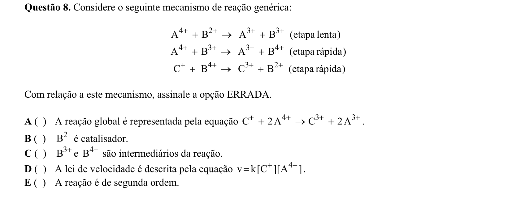

## Q09
**Assunto:** ácidos e bases
**Competências:** indicadores ácido-base, azul de bromotimol, caráter ácido/básico, identificação de substâncias
**Tipo:** múltipla escolha

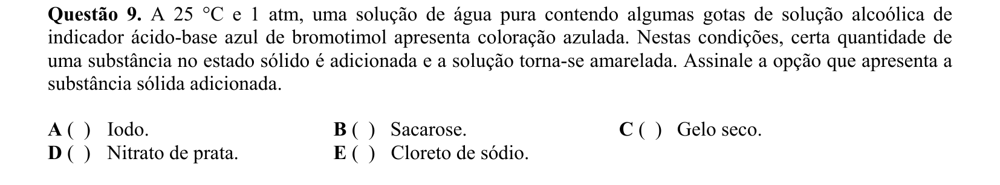

## Q10
**Assunto:** equilíbrio químico
**Competências:** produto de solubilidade, efeito do íon comum, constante de equilíbrio, temperatura
**Tipo:** múltipla escolha

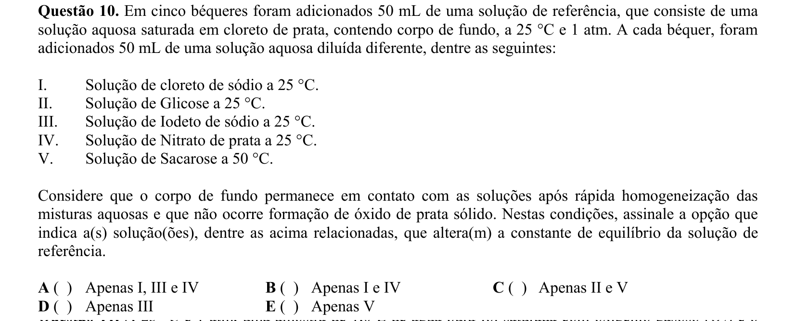

## Q11
**Assunto:** gases
**Competências:** Lei de Henry, solubilidade de gases, gases ideais, equilíbrio gás-líquido
**Tipo:** múltipla escolha

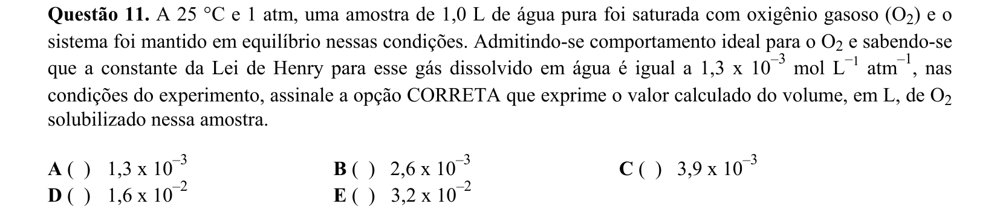

## Q12
**Assunto:** gases
**Competências:** equação dos gases ideais, número de mols, número de Avogadro, massa específica
**Tipo:** múltipla escolha

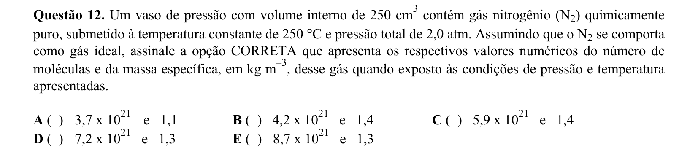

## Q13
**Assunto:** gases
**Competências:** teoria cinética dos gases, energia cinética média, velocidade molecular, gás ideal
**Tipo:** múltipla escolha

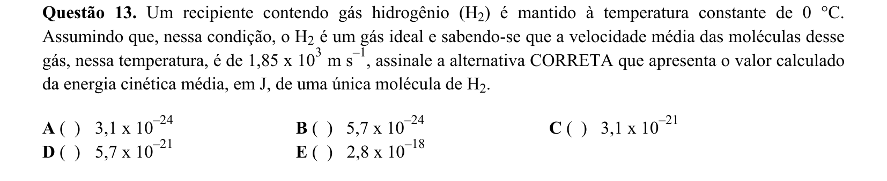

## Q14
**Assunto:** cinética química
**Competências:** reação de ordem zero, lei de velocidade, gráficos de cinética, dependência da concentração
**Tipo:** múltipla escolha

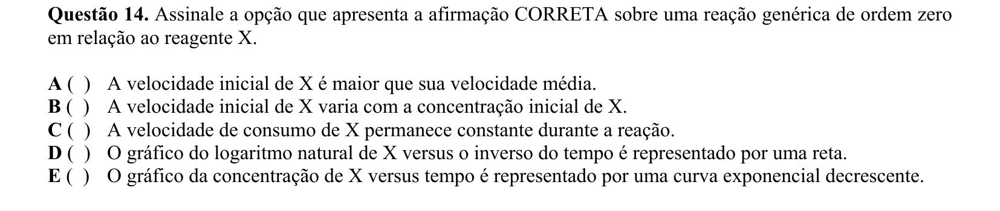

## Q15
**Assunto:** equilíbrio iônico
**Competências:** produto de solubilidade Kps, pKps, sais pouco solúveis, equilíbrio heterogêneo
**Tipo:** múltipla escolha

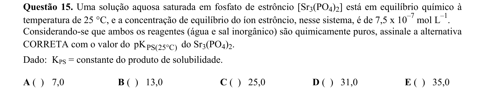

## Q16
**Assunto:** termoquímica
**Competências:** entalpia de combustão, Lei de Hess, entalpia de formação, balanço energético
**Tipo:** múltipla escolha

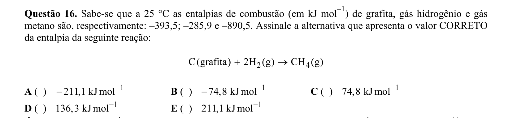

## Q17
**Assunto:** tabela periódica
**Competências:** propriedades dos metais, ponto de fusão, pressão de vapor, condutividade, ductilidade
**Tipo:** múltipla escolha

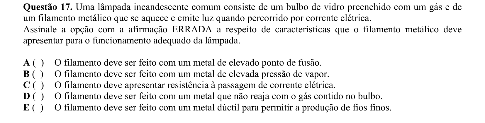

## Q18
**Assunto:** eletroquímica
**Competências:** eletrólise, eletrodeposição, eletrodo ativo, processos catódicos e anódicos, tamponamento
**Tipo:** múltipla escolha

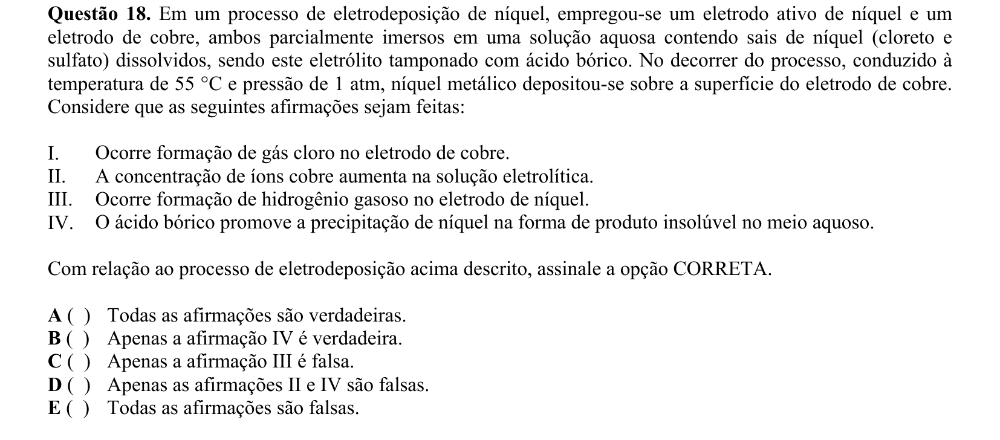

## Q19
**Assunto:** termoquímica
**Competências:** variação de entalpia, variação de energia interna, trabalho de expansão, capacidade calorífica
**Tipo:** múltipla escolha

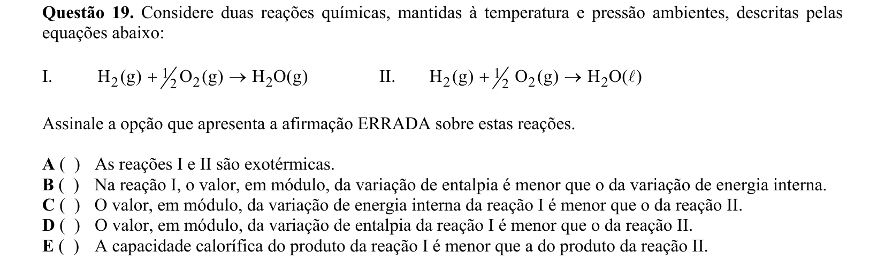

## Q20
**Assunto:** química orgânica
**Competências:** reação de nitração, substituição eletrofílica aromática, efeito orientador, grupos ativadores/desativadores
**Tipo:** múltipla escolha

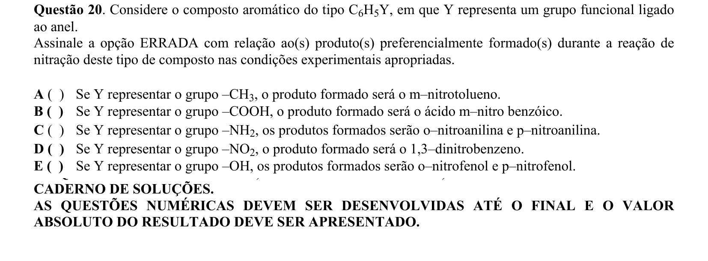

## Q21
**Assunto:** equilíbrio iônico
**Competências:** titulação de ácido fraco, ponto de equivalência, hidrólise salina, constante de acidez, cálculo de pH
**Tipo:** discursiva

## Q22
**Assunto:** reações inorgânicas
**Competências:** reações de neutralização, obtenção de sais, equações químicas balanceadas, condições reacionais
**Tipo:** discursiva

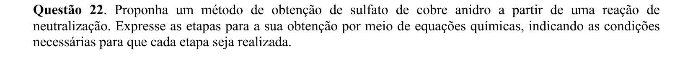

## Q23
**Assunto:** reações inorgânicas
**Competências:** decomposição de explosivos, balanceamento de equações, estabilidade molecular, energia liberada
**Tipo:** discursiva

## Q24
**Assunto:** propriedades coligativas
**Competências:** osmose, pressão osmótica, dissolução de carbonatos, equações de reação ácido-base, membranas semipermeáveis
**Tipo:** discursiva

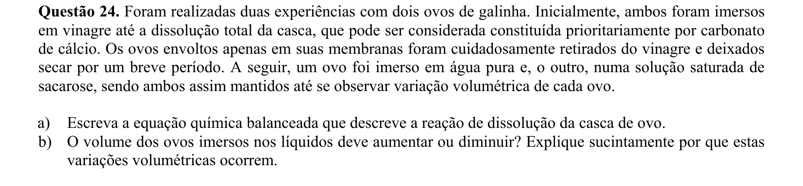

## Q25
**Assunto:** cinética química
**Competências:** diagrama energético, mecanismo de reação, intermediários, etapa lenta, lei de velocidade, constante de velocidade
**Tipo:** discursiva

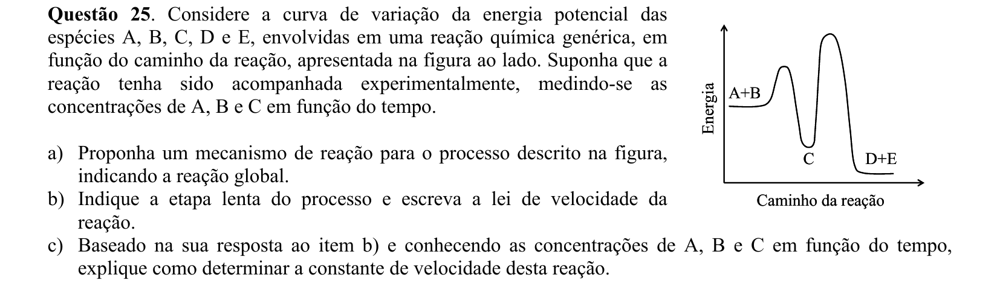

## Q26
**Assunto:** química orgânica
**Competências:** isomeria geométrica cis-trans, fórmulas estruturais, nomenclatura, haletos orgânicos
**Tipo:** discursiva

## Q27
**Assunto:** eletroquímica
**Competências:** potenciais de redução, separação de cátions, deslocamento de metais, equações de oxirredução
**Tipo:** discursiva

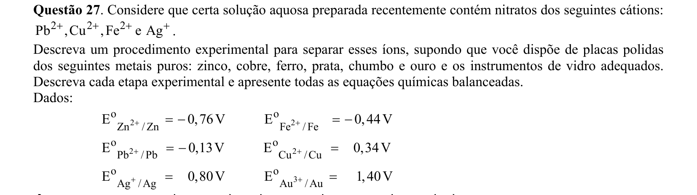

## Q28
**Assunto:** química orgânica
**Competências:** clivagem de éteres, reação de Wurtz, reação com alcinetos, síntese orgânica
**Tipo:** discursiva

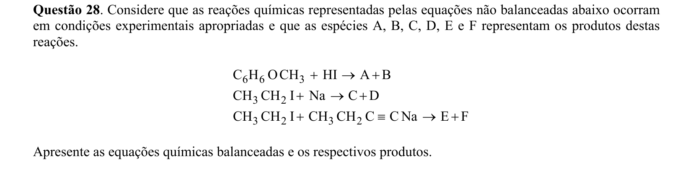

## Q29
**Assunto:** eletroquímica
**Competências:** corrosão de metais, equação de Nernst, potenciais padrão, espontaneidade termodinâmica
**Tipo:** discursiva

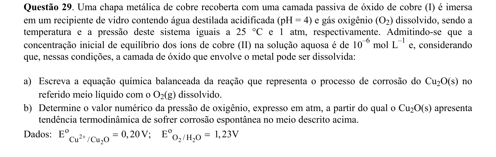

## Q30
**Assunto:** eletroquímica
**Competências:** eletrólise, leis de Faraday, densidade de corrente, formação de óxidos, cálculo de massa e espessura
**Tipo:** discursiva

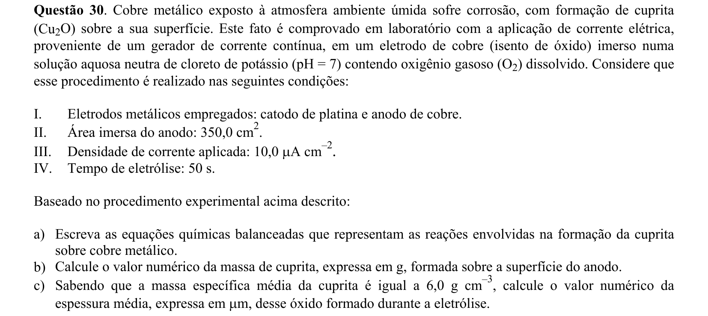
