# Química — ITA 2011

> 30 questões. Q01–Q20 múltipla escolha; Q21–Q30 discursivas.

## Q01
**Assunto:** soluções
**Competências:** concentração em volumes, peróxido de hidrogênio, decomposição H2O2, estequiometria de gases, conversão de unidades
**Tipo:** múltipla escolha

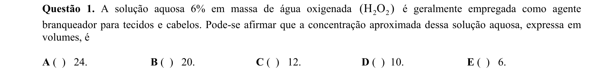

## Q02
**Assunto:** ácidos e bases
**Competências:** força de ácidos carboxílicos, efeito indutivo, eletronegatividade de substituintes, estabilidade da base conjugada
**Tipo:** múltipla escolha

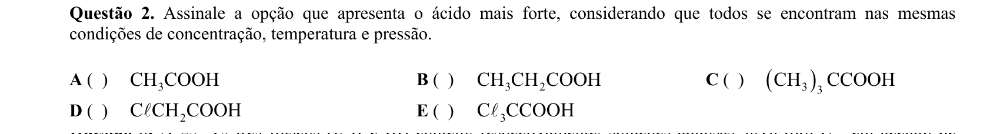

## Q03
**Assunto:** equilíbrio iônico
**Competências:** hidrólise salina, relação Ka–Kb, pH de soluções de sais, ácidos conjugados fortes/fracos
**Tipo:** múltipla escolha

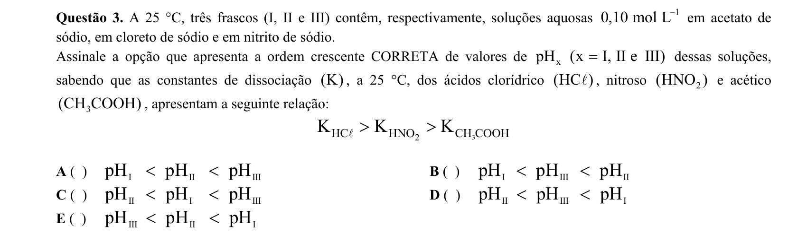

## Q04
**Assunto:** soluções
**Competências:** graus Gay-Lussac, densidade e massa específica, volume de mistura, contração volumétrica
**Tipo:** múltipla escolha

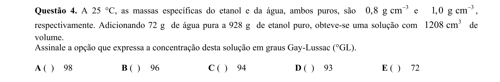

## Q05
**Assunto:** termoquímica
**Competências:** energia de ligação, entalpia de combustão, balanceamento de equações, cálculo por átomo de H
**Tipo:** múltipla escolha

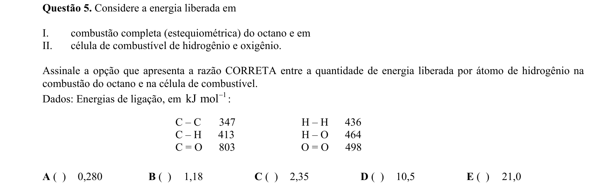

## Q06
**Assunto:** eletroquímica
**Competências:** lei de Faraday, eletrólise, estequiometria eletroquímica, equivalente-grama
**Tipo:** múltipla escolha

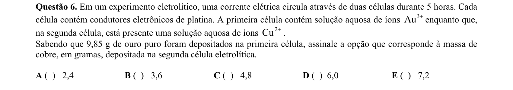

## Q07
**Assunto:** química orgânica
**Competências:** combustão de hidrocarbonetos, razão C/H, aromáticos vs alifáticos, álcoois e oxigenados
**Tipo:** múltipla escolha

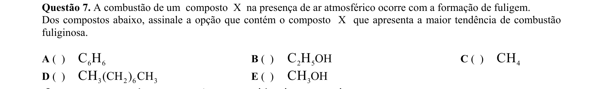

## Q08
**Assunto:** óxidos
**Competências:** classificação de óxidos, óxidos neutros/indiferentes, óxidos ácidos e básicos, óxidos anfóteros
**Tipo:** múltipla escolha

## Q09
**Assunto:** química orgânica
**Competências:** polímeros condutores, conjugação de duplas ligações, poliacetileno, estrutura dos polímeros
**Tipo:** múltipla escolha

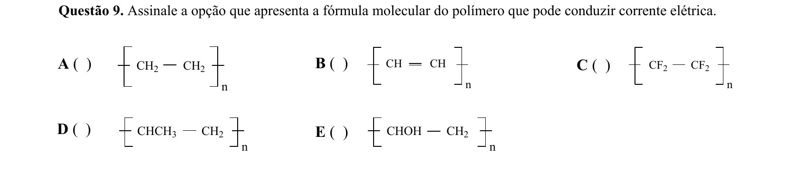

## Q10
**Assunto:** termoquímica
**Competências:** primeira lei da termodinâmica, processo isocórico e isobárico, trabalho de expansão, sublimação
**Tipo:** múltipla escolha

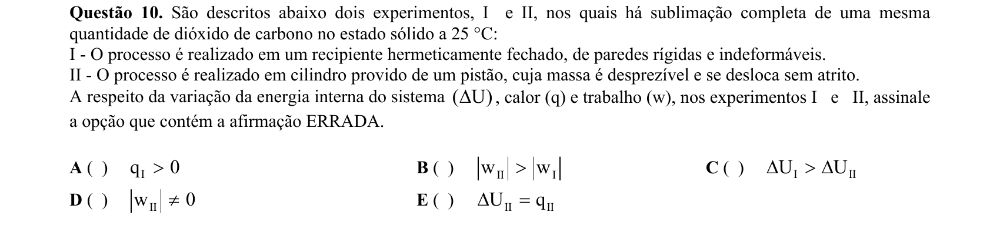

## Q11
**Assunto:** eletroquímica
**Competências:** equação de Nernst, potencial padrão de eletrodo, conversão de escalas de referência, eletrodo de cobre-sulfato
**Tipo:** múltipla escolha

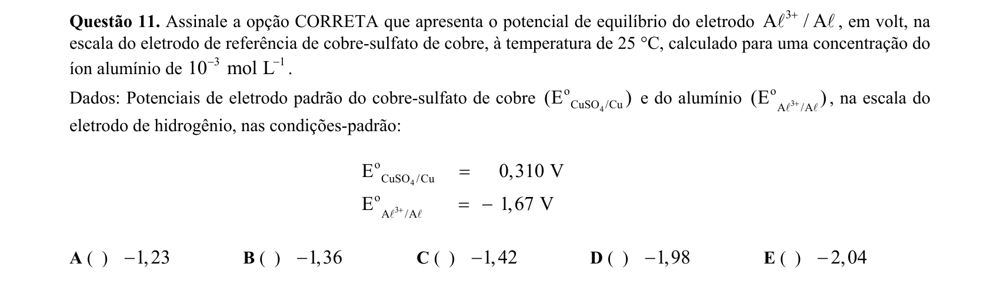

## Q12
**Assunto:** equilíbrio iônico
**Competências:** hidrólise de cátions e ânions, corrosão do ferro, pH e velocidade de corrosão, eletroquímica aplicada
**Tipo:** múltipla escolha

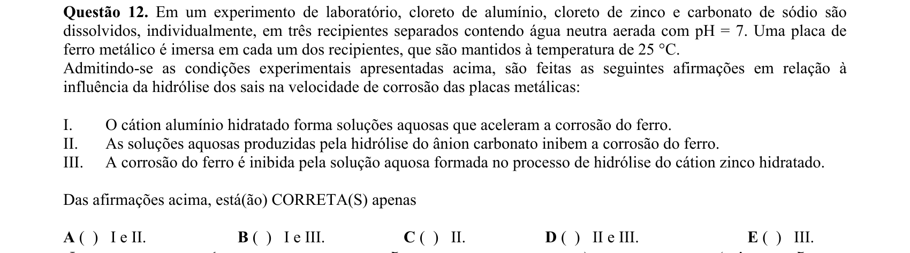

## Q13
**Assunto:** química orgânica
**Competências:** transesterificação, biodiesel, catálise alcalina, reações de saponificação
**Tipo:** múltipla escolha

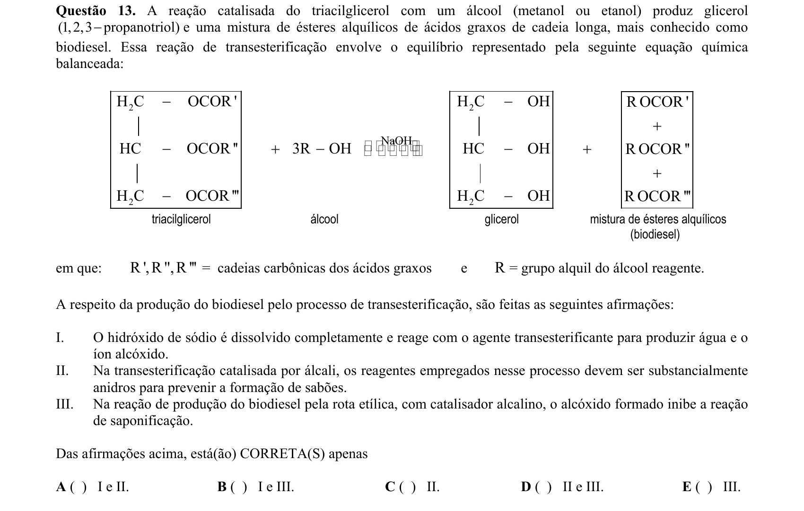

## Q14
**Assunto:** gases
**Competências:** transformações gasosas (isobárica, isocórica, isotérmica), energia interna de gás ideal, leis dos gases, dependência U(T)
**Tipo:** múltipla escolha

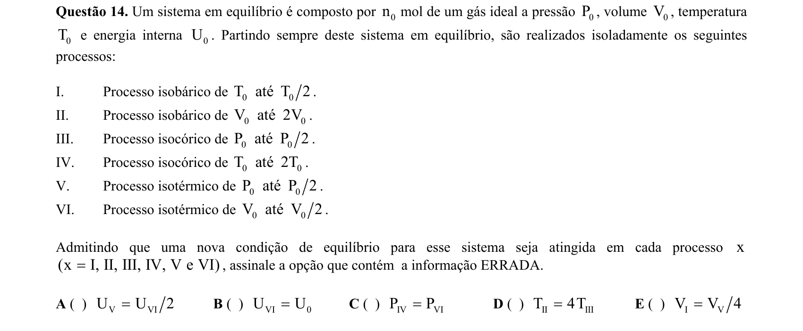

## Q15
**Assunto:** estequiometria
**Competências:** óxidos de fórmula X3O4, massa molar a partir de relação de massas, identificação de elemento, conservação de massa
**Tipo:** múltipla escolha

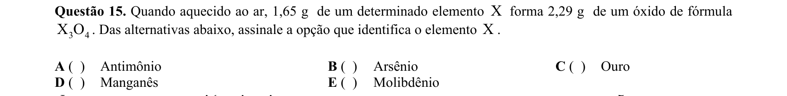

## Q16
**Assunto:** estados da matéria
**Competências:** solubilidade em água, polaridade molecular, ligações de hidrogênio, forças intermoleculares
**Tipo:** múltipla escolha

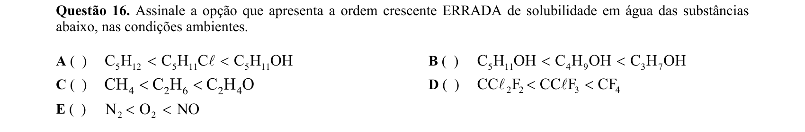

## Q17
**Assunto:** estados da matéria
**Competências:** coloides, cerâmicas, cristal líquido, classificação de materiais
**Tipo:** múltipla escolha

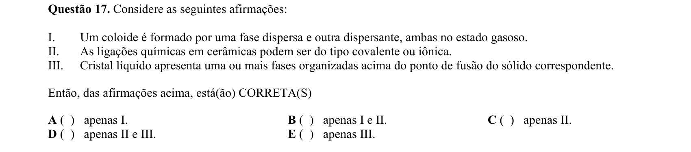

## Q18
**Assunto:** ligações químicas
**Competências:** ordem de ligação, comprimento de ligação, cargas formais, espécies isoeletrônicas
**Tipo:** múltipla escolha

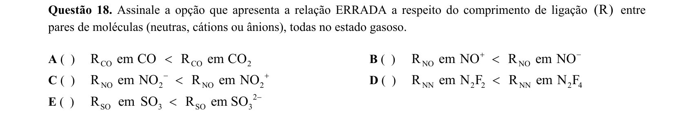

## Q19
**Assunto:** cinética química
**Competências:** diagrama de energia, intermediário vs estado de transição, catálise, mecanismos de reação
**Tipo:** múltipla escolha

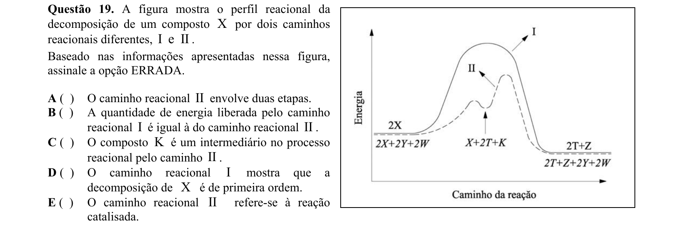

## Q20
**Assunto:** gases
**Competências:** equação de estado de gás ideal, velocidade média e distribuição de Maxwell-Boltzmann, densidade gasosa, número de mols
**Tipo:** múltipla escolha

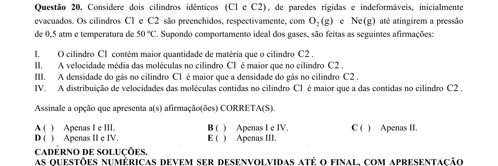

## Q21
**Assunto:** cinética química
**Competências:** lei de velocidade com saturação, manipulação algébrica, condição de velocidade limite, cinética enzimática (Michaelis-Menten)
**Tipo:** discursiva

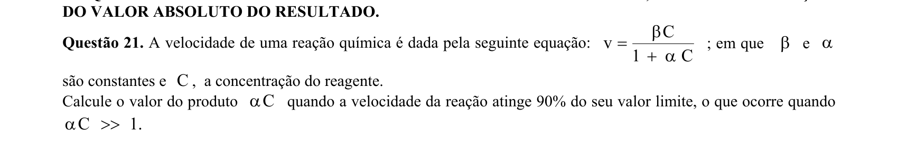

## Q22
**Assunto:** eletroquímica
**Competências:** relação ΔG–E°–K, combinação de semirreações, constante de equilíbrio a partir de potenciais, número de elétrons trocados
**Tipo:** discursiva

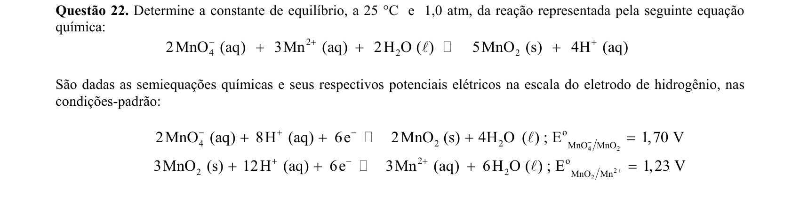

## Q23
**Assunto:** estados da matéria
**Competências:** forças intermoleculares, ligações de hidrogênio, ponto de ebulição e fusão, viscosidade e pressão de vapor
**Tipo:** discursiva

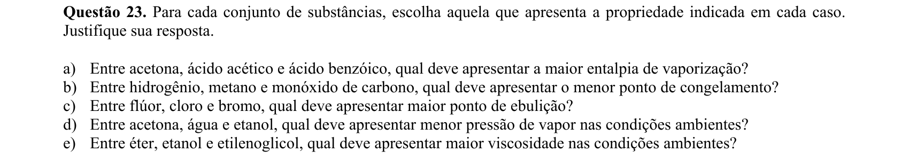

## Q24
**Assunto:** cinética química
**Competências:** etapa lenta determinante, mecanismo de reação, lei de velocidade experimental, ordem de reação
**Tipo:** discursiva

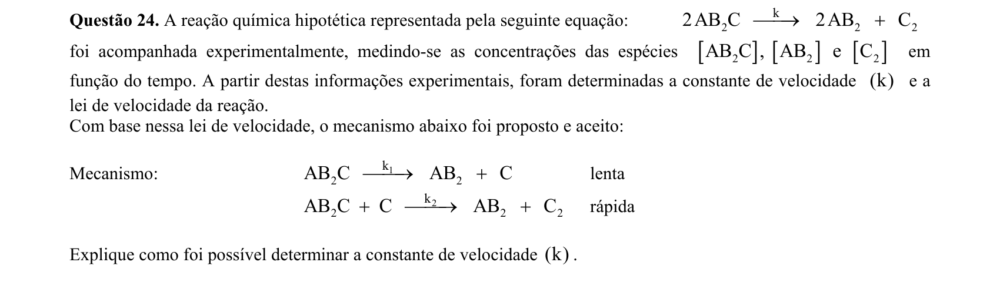

## Q25
**Assunto:** termoquímica
**Competências:** reação endotérmica espontânea, balanceamento de equação, congelamento da água por absorção de calor, entropia
**Tipo:** discursiva

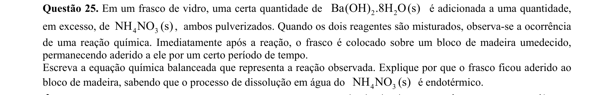

## Q26
**Assunto:** química orgânica
**Competências:** substituição nucleofílica SN2, hidrólise de nitrila, redução com LiAlH4, reação com Grignard
**Tipo:** discursiva

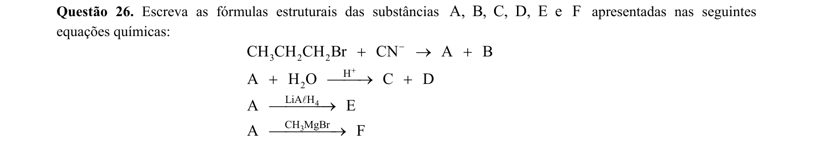

## Q27
**Assunto:** equilíbrio iônico
**Competências:** lei de Henry, equilíbrio CO2/H2CO3, constante de ionização Ka, cálculo de pH e bicarbonato
**Tipo:** discursiva

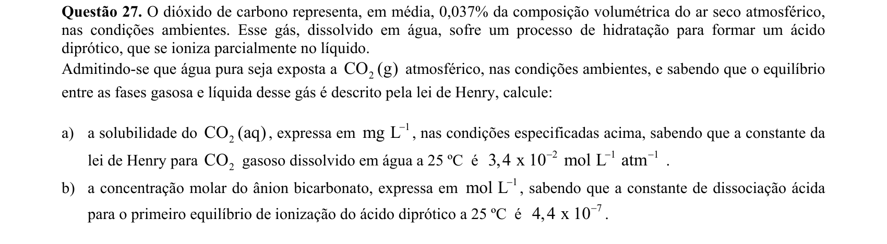

## Q28
**Assunto:** reações inorgânicas
**Competências:** balanceamento de reações redox, hidrometalurgia, lixiviação com Fe2(SO4)3, regeneração com O2 e H2SO4
**Tipo:** discursiva

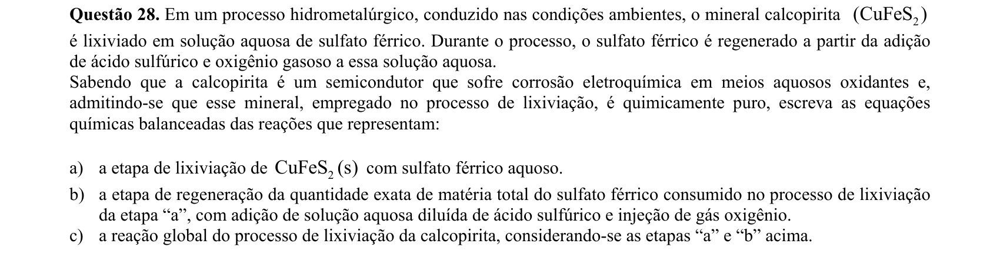

## Q29
**Assunto:** equilíbrio químico
**Competências:** produto de solubilidade Kps, efeito do íon comum, solubilidade molar, equilíbrio heterogêneo
**Tipo:** discursiva

## Q30
**Assunto:** equilíbrio químico
**Competências:** pressão de vapor, equilíbrio líquido-vapor, gás ideal, conversão concentração-pressão, toxicologia do mercúrio
**Tipo:** discursiva

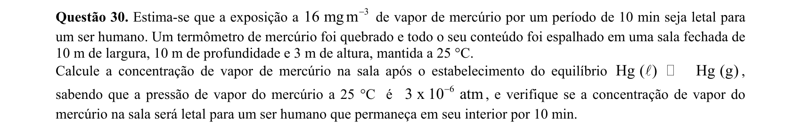
