# Química — ITA 2012

> 30 questões. Q01–Q20 múltipla escolha; Q21–Q30 discursivas.

## Q01
**Assunto:** propriedades coligativas
**Competências:** pressão osmótica, equação de van't Hoff, cálculo de massa molar, identificação de composto orgânico
**Tipo:** múltipla escolha

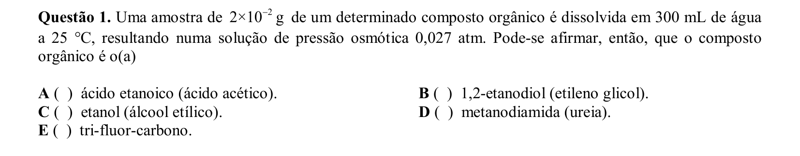

## Q02
**Assunto:** química orgânica
**Competências:** reações de aldeídos, reações de alcanos, reações de aminas, reações de alcenos, funções orgânicas
**Tipo:** múltipla escolha

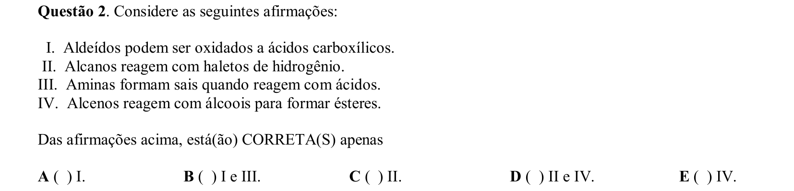

## Q03
**Assunto:** cinética química
**Competências:** substituição eletrofílica aromática, diagrama de coordenada de reação, estabilidade de intermediários, controle cinético vs termodinâmico
**Tipo:** múltipla escolha

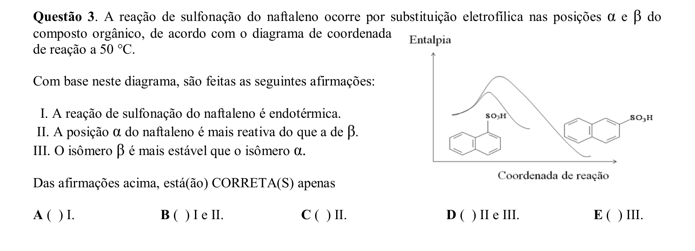

## Q04
**Assunto:** eletroquímica
**Competências:** potenciais de eletrodo padrão, relação entre Eº e Kps, equação de Nernst, produto de solubilidade
**Tipo:** múltipla escolha

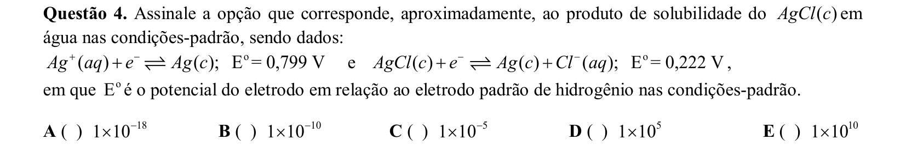

## Q05
**Assunto:** soluções
**Competências:** lei de Raoult, soluções ideais, interações soluto-solvente, pressão de vapor
**Tipo:** múltipla escolha

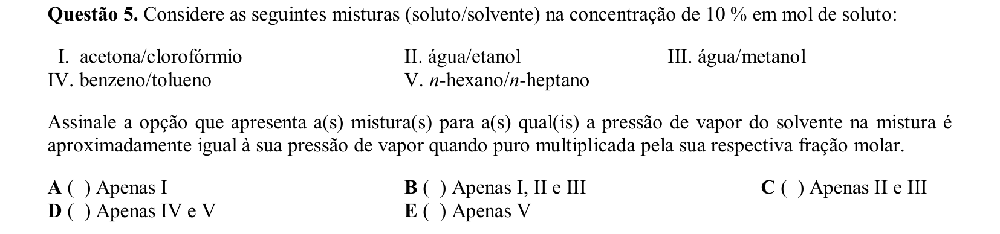

## Q06
**Assunto:** cinética química
**Competências:** lei de velocidade, ordem de reação, tempo de meia-vida, dependência da concentração
**Tipo:** múltipla escolha

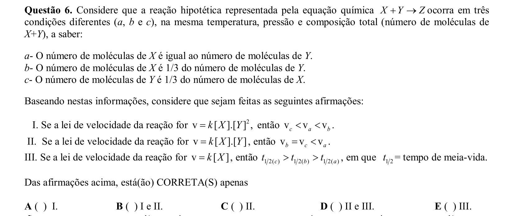

## Q07
**Assunto:** eletroquímica
**Competências:** potenciais de eletrodo, combinação de semi-reações, energia livre de Gibbs, cálculo de Eº
**Tipo:** múltipla escolha

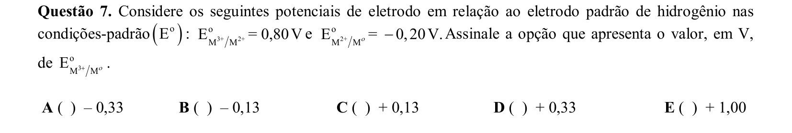

## Q08
**Assunto:** ácidos e bases
**Competências:** haletos de hidrogênio, força ácida, ponto de ebulição, ligações de hidrogênio, solvente não aquoso
**Tipo:** múltipla escolha

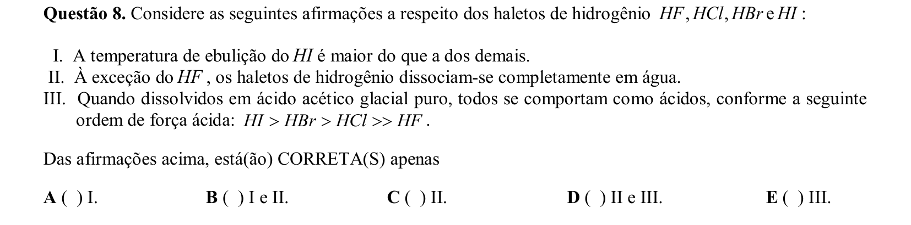

## Q09
**Assunto:** gases
**Competências:** gás ideal, desvios da idealidade, forças intermoleculares, comportamento de gases reais
**Tipo:** múltipla escolha

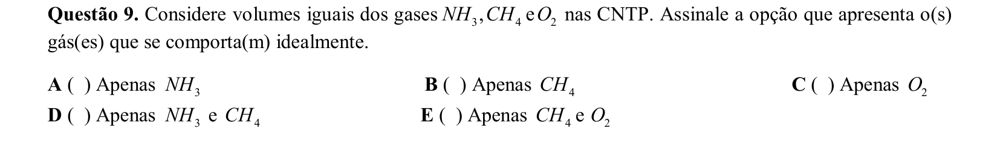

## Q10
**Assunto:** eletroquímica
**Competências:** célula eletroquímica, eletrodo de calomelano, equação de Nernst, cálculo de pH
**Tipo:** múltipla escolha

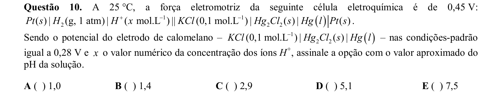

## Q11
**Assunto:** eletroquímica
**Competências:** eletrólise, sais fundidos vs soluções aquosas, produtos catódicos e anódicos, eletrodos inertes
**Tipo:** múltipla escolha

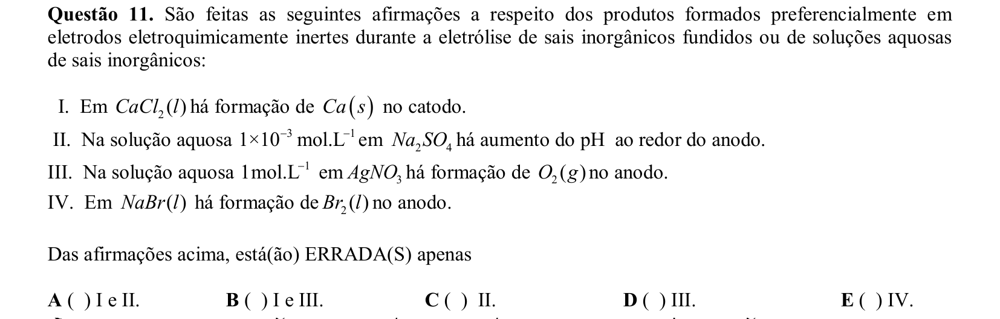

## Q12
**Assunto:** química orgânica
**Competências:** isomeria óptica, isomeria conformacional, isomeria estrutural, isomeria geométrica, fórmula molecular
**Tipo:** múltipla escolha

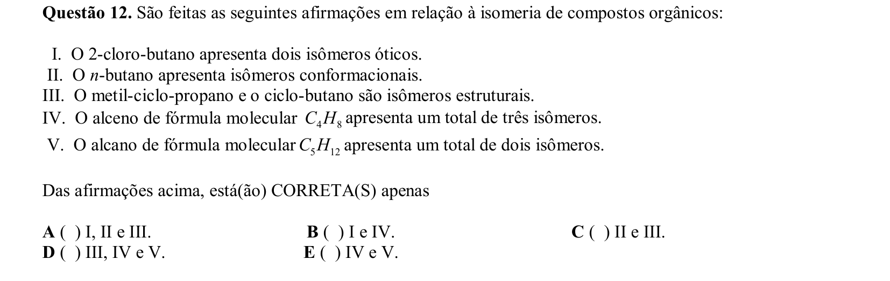

## Q13
**Assunto:** termoquímica
**Competências:** variação de entropia, estados físicos, número de mols gasosos, segunda lei da termodinâmica
**Tipo:** múltipla escolha

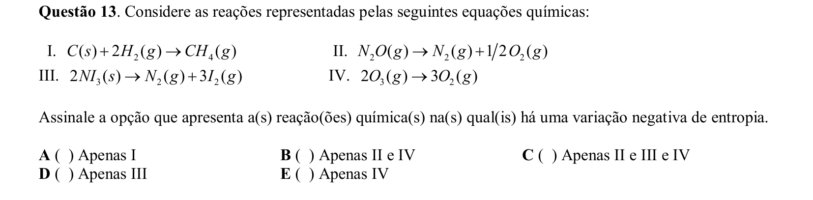

## Q14
**Assunto:** química orgânica
**Competências:** polímeros, borracha natural, monômero isopreno, identificação de polímeros
**Tipo:** múltipla escolha

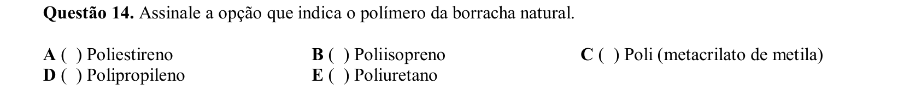

## Q15
**Assunto:** reações inorgânicas
**Competências:** número de oxidação, compostos nitrogenados, atribuição de NOX, ordenação de NOX
**Tipo:** múltipla escolha

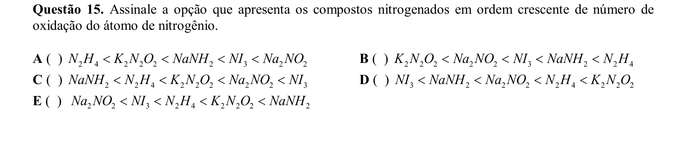

## Q16
**Assunto:** estados da matéria
**Competências:** curva de aquecimento, substância pura vs mistura, mudanças de fase, azeótropos e eutéticos
**Tipo:** múltipla escolha

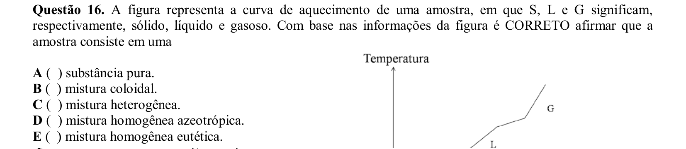

## Q17
**Assunto:** ligações químicas
**Competências:** caráter covalente vs iônico, eletronegatividade, regra de Fajans, polarizabilidade
**Tipo:** múltipla escolha

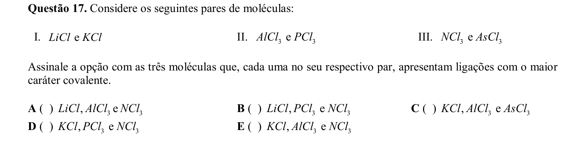

## Q18
**Assunto:** equilíbrio iônico
**Competências:** produto de solubilidade, efeito do íon comum, precipitação por sulfeto, deslocamento de equilíbrio
**Tipo:** múltipla escolha

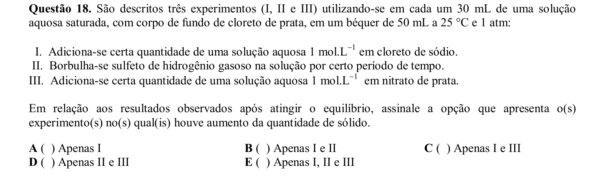

## Q19
**Assunto:** química orgânica
**Competências:** polímeros, propriedades de superfície, coeficiente de atrito, politetrafluoretileno e siloxanos
**Tipo:** múltipla escolha

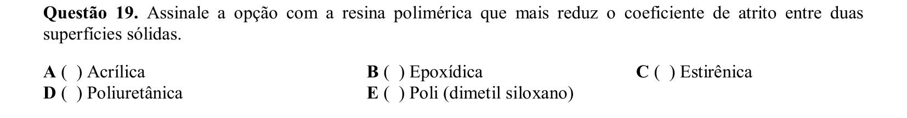

## Q20
**Assunto:** equilíbrio iônico
**Competências:** autoionização da água, dependência de Kw com temperatura, pH neutro vs ácido, equilíbrio do ácido carbônico
**Tipo:** múltipla escolha

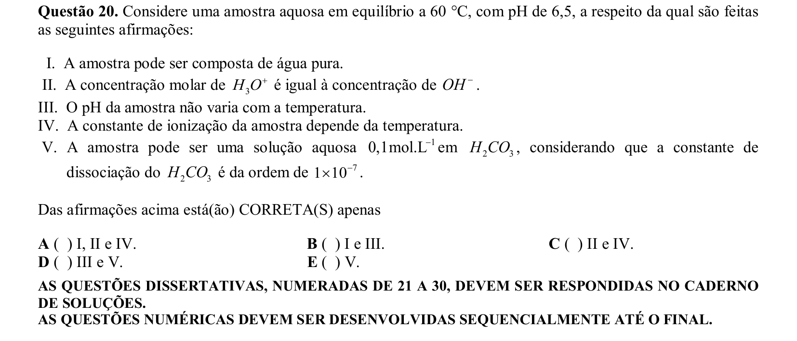

## Q21
**Assunto:** termoquímica
**Competências:** entalpia vs energia interna, relação ΔH e ΔU, trabalho de expansão, variação de mols gasosos
**Tipo:** discursiva

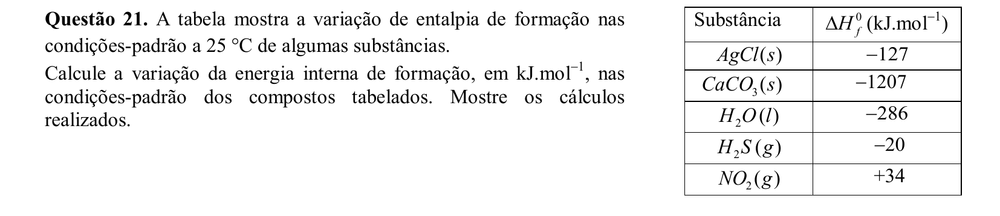

## Q22
**Assunto:** química orgânica
**Competências:** halogenação de cadeia lateral, nitração de fenol, oxidação de tolueno, substituição eletrofílica aromática
**Tipo:** discursiva

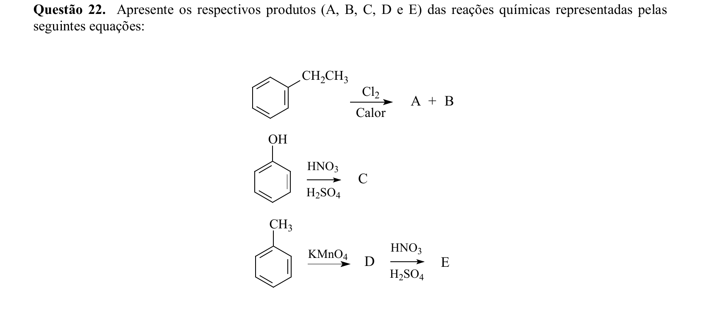

## Q23
**Assunto:** estequiometria
**Competências:** combustão, balanceamento, sistema de equações, mistura gasosa
**Tipo:** discursiva

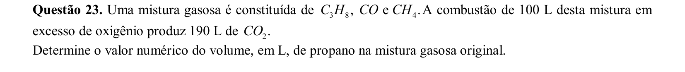

## Q24
**Assunto:** reações inorgânicas
**Competências:** obtenção de metais alcalinos terrosos, calcinação de carbonatos, precipitação de hidróxidos, eletrólise ígnea
**Tipo:** discursiva

## Q25
**Assunto:** cinética química
**Competências:** catálise, energia de ativação, velocidade direta e inversa, gráfico velocidade-tempo
**Tipo:** discursiva

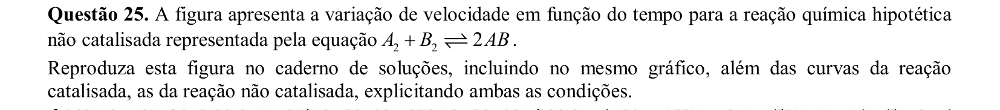

## Q26
**Assunto:** termoquímica
**Competências:** entalpia de combustão, massa molar, reagente limitante, conversão massa-mol-moléculas
**Tipo:** discursiva

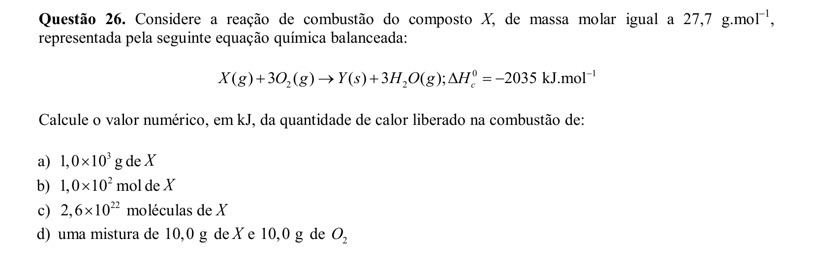

## Q27
**Assunto:** equilíbrio químico
**Competências:** equilíbrio carbonato-bicarbonato, chuva ácida, princípio de Le Chatelier, dissolução de rochas
**Tipo:** discursiva

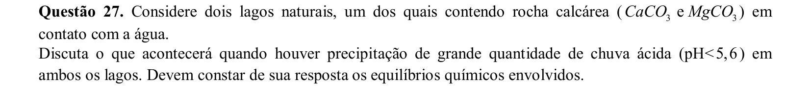

## Q28
**Assunto:** equilíbrio iônico
**Competências:** diagrama de distribuição de espécies, constantes de ionização poliprótica, solução tampão, preparo de tampão
**Tipo:** discursiva

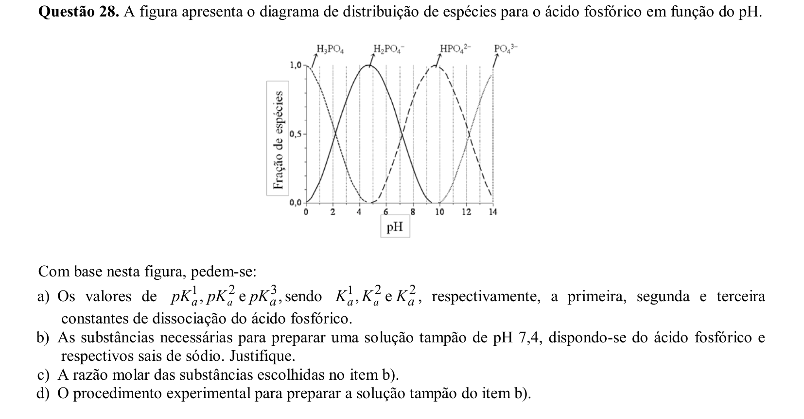

## Q29
**Assunto:** química orgânica
**Competências:** reações de nitração, substâncias explosivas, química industrial, compostos nitrados
**Tipo:** discursiva

## Q30
**Assunto:** química orgânica
**Competências:** aminas primárias e secundárias, reação com ácido nitroso, identificação de funções, equações de reações orgânicas
**Tipo:** discursiva

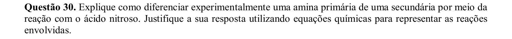
