# Química — ITA 2013

> 30 questões. Q01–Q20 múltipla escolha; Q21–Q30 discursivas.

## Q01
**Assunto:** reações inorgânicas
**Competências:** haletos de prata, solubilidade, complexação com amônia, Kps
**Tipo:** múltipla escolha

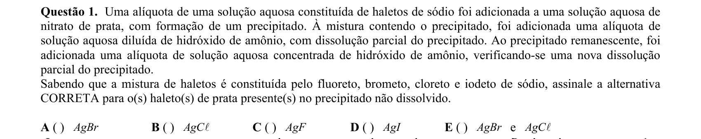

## Q02
**Assunto:** soluções
**Competências:** íons coloridos, metais de transição, propriedades de soluções aquosas
**Tipo:** múltipla escolha

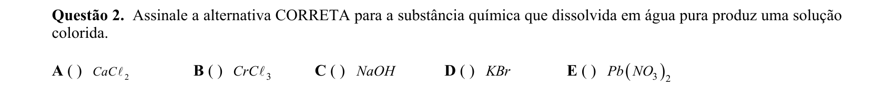

## Q03
**Assunto:** propriedades coligativas
**Competências:** pressão de vapor, forças intermoleculares, ligações de hidrogênio
**Tipo:** múltipla escolha

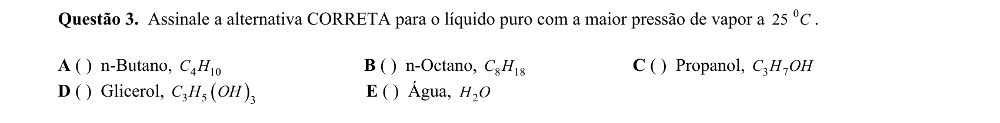

## Q04
**Assunto:** reações inorgânicas
**Competências:** reação ácido-base, identificação de produtos gasosos, sais de amônio
**Tipo:** múltipla escolha

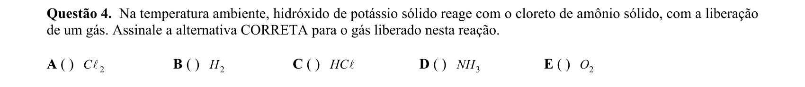

## Q05
**Assunto:** reações inorgânicas
**Competências:** reações de precipitação, cor de precipitados, solubilidade de sais
**Tipo:** múltipla escolha

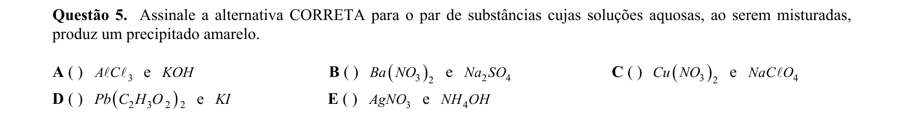

## Q06
**Assunto:** química orgânica
**Competências:** redução de ácido carboxílico, agentes redutores, LiAlH4
**Tipo:** múltipla escolha

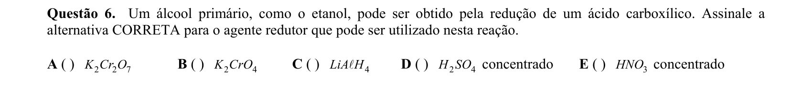

## Q07
**Assunto:** estados da matéria
**Competências:** célula unitária, estrutura cristalina, rede bidimensional
**Tipo:** múltipla escolha

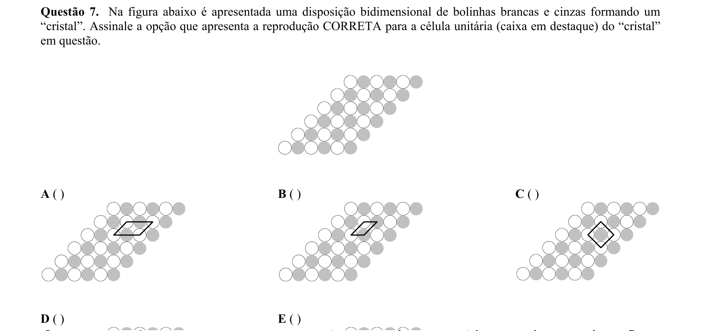

## Q08
**Assunto:** cinética química
**Competências:** velocidade de reação, estequiometria de taxas, lei de velocidade
**Tipo:** múltipla escolha

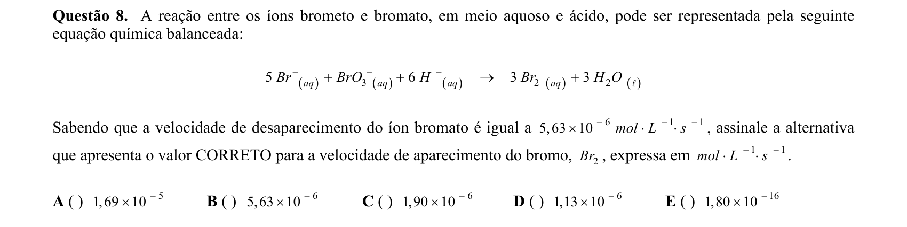

## Q09
**Assunto:** termoquímica
**Competências:** calorimetria, entalpia molar de combustão, q = mcΔT
**Tipo:** múltipla escolha

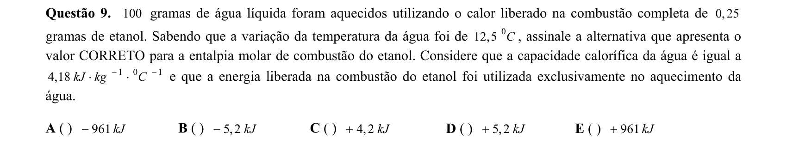

## Q10
**Assunto:** soluções
**Competências:** constante de partição, extração líquido-líquido, equilíbrio de distribuição
**Tipo:** múltipla escolha

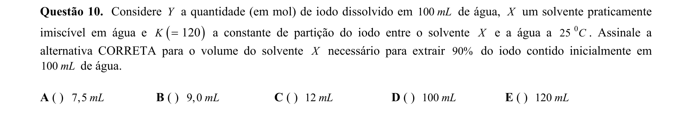

## Q11
**Assunto:** química orgânica
**Competências:** hidrólise de peptídeos, hidrólise de ésteres, hidrólise de sulfamatos, aminoácidos
**Tipo:** múltipla escolha

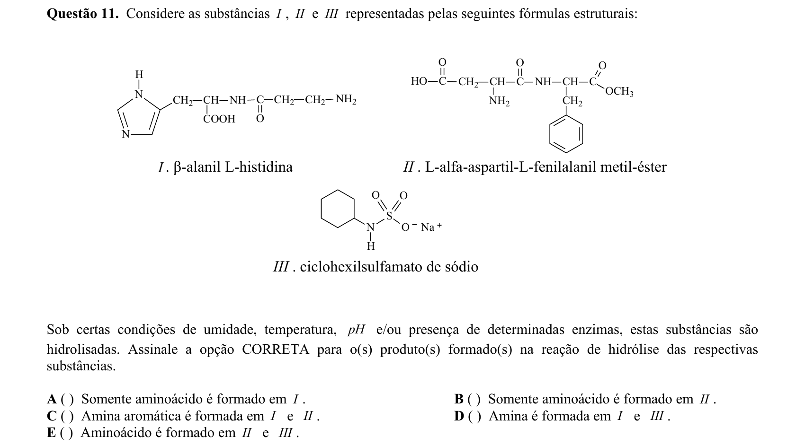

## Q12
**Assunto:** equilíbrio iônico
**Competências:** hidrólise de cátions metálicos, pH, raio iônico, carga iônica
**Tipo:** múltipla escolha

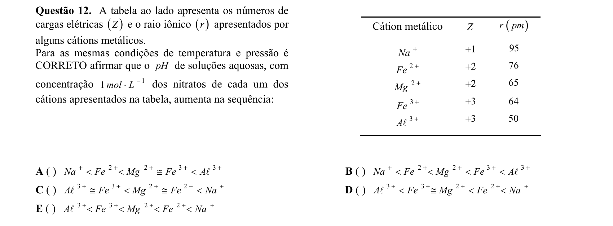

## Q13
**Assunto:** termoquímica
**Competências:** capacidade calorífica, calor específico, propriedades térmicas da água
**Tipo:** múltipla escolha

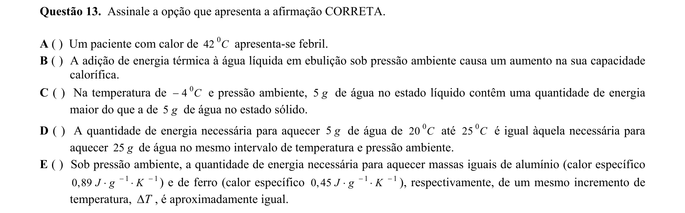

## Q14
**Assunto:** equilíbrio iônico
**Competências:** produto de solubilidade Kps, condutividade elétrica, dissociação iônica
**Tipo:** múltipla escolha

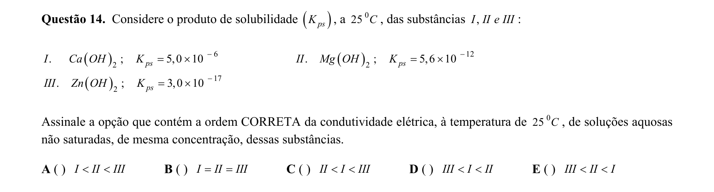

## Q15
**Assunto:** eletroquímica
**Competências:** equação de Nernst, potencial de eletrodo, concentração iônica
**Tipo:** múltipla escolha

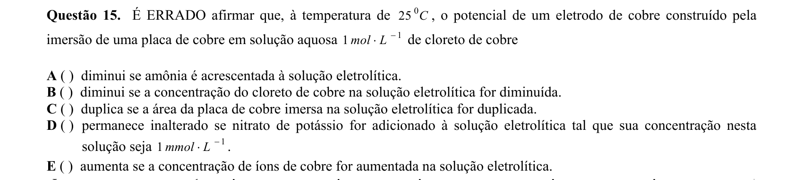

## Q16
**Assunto:** soluções
**Competências:** Lei de Raoult, soluções ideais, pressão de vapor, fração molar
**Tipo:** múltipla escolha

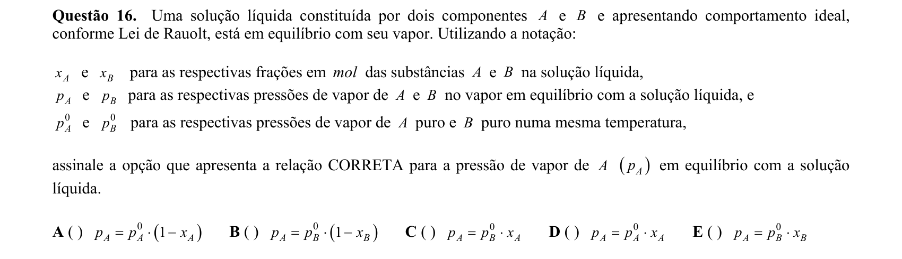

## Q17
**Assunto:** propriedades coligativas
**Competências:** forças intermoleculares, tensão superficial, viscosidade, pressão de vapor
**Tipo:** múltipla escolha

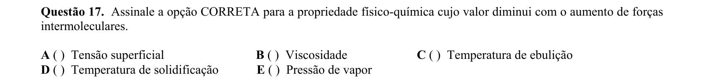

## Q18
**Assunto:** atomística
**Competências:** modelos atômicos, energia de ionização, átomo hidrogenoide, modelo de Bohr
**Tipo:** múltipla escolha

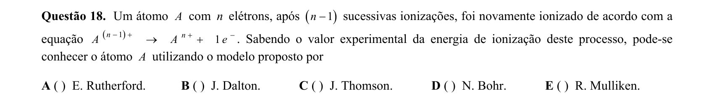

## Q19
**Assunto:** tabela periódica
**Competências:** configuração eletrônica, energia de ionização, energia de ligação, periodicidade
**Tipo:** múltipla escolha

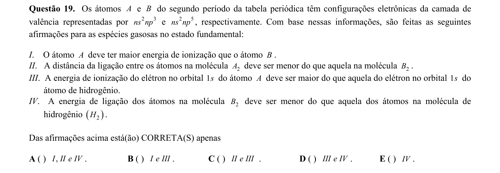

## Q20
**Assunto:** química orgânica
**Competências:** classificação de compostos carbonílicos, cetonas, aldeídos, ácidos carboxílicos
**Tipo:** múltipla escolha

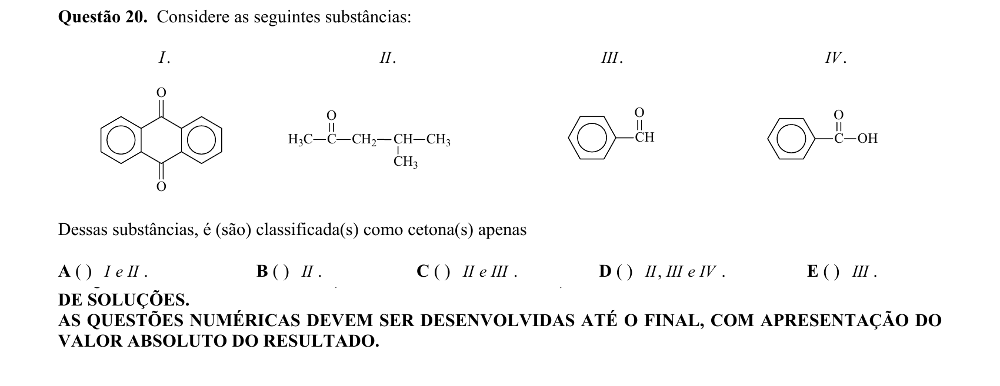

## Q21
**Assunto:** equilíbrio iônico
**Competências:** hidrólise salina, constante de hidrólise Kh, Kw, pH de sais
**Tipo:** discursiva

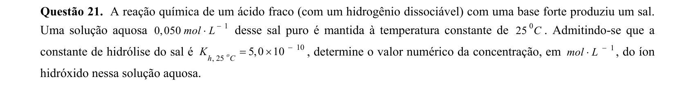

## Q22
**Assunto:** eletroquímica
**Competências:** corrosão eletroquímica, semirreações, passivação, balanceamento por redox
**Tipo:** discursiva

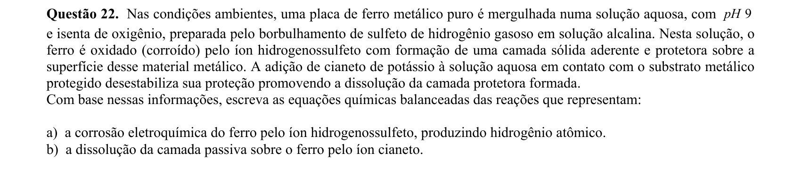

## Q23
**Assunto:** termoquímica
**Competências:** ciclo de Carnot, processos termodinâmicos, transformações adiabáticas e isotérmicas
**Tipo:** discursiva

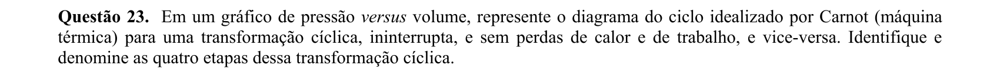

## Q24
**Assunto:** reações inorgânicas
**Competências:** carbonatação, calcinação, produção industrial de cal, balanceamento
**Tipo:** discursiva

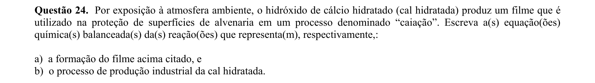

## Q25
**Assunto:** eletroquímica
**Competências:** célula de combustível, semirreações anódica e catódica, oxirredução
**Tipo:** discursiva

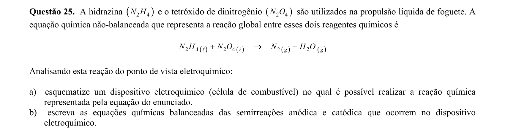

## Q26
**Assunto:** ligações químicas
**Competências:** solubilidade em solvente polar, polarização iônica, regra de Fajans
**Tipo:** discursiva

## Q27
**Assunto:** estequiometria
**Competências:** análise quantitativa, conversão massa/concentração, algarismos significativos
**Tipo:** discursiva

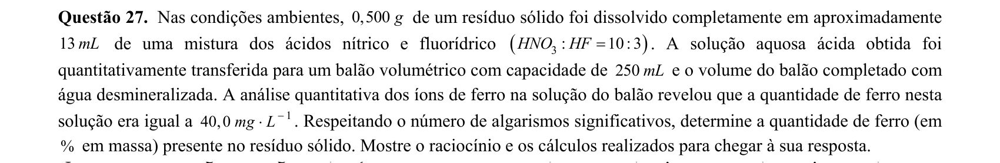

## Q28
**Assunto:** equilíbrio químico
**Competências:** constante de equilíbrio K, energia livre de Gibbs, energia de ativação, cinética vs equilíbrio
**Tipo:** discursiva

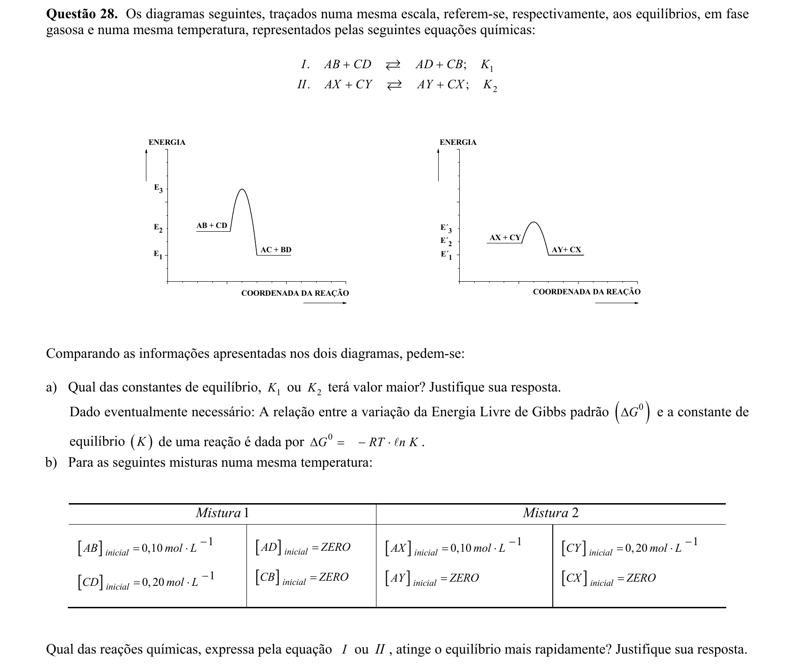

## Q29
**Assunto:** atomística
**Competências:** modelo de Bohr, energia de ionização, átomo hidrogenoide, número atômico
**Tipo:** discursiva

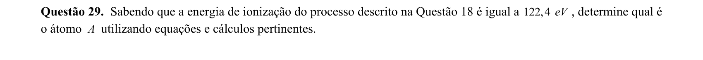

## Q30
**Assunto:** estados da matéria
**Competências:** diagrama de fases, ponto triplo, ponto crítico, equilíbrio de fases
**Tipo:** discursiva

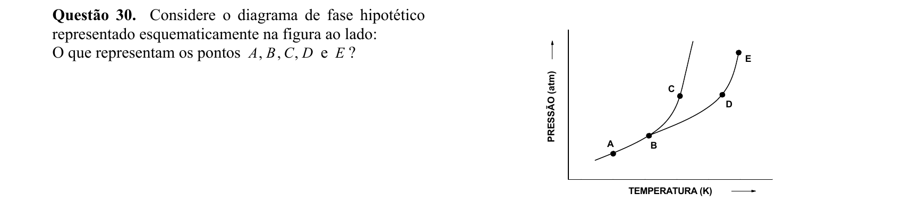
