# Química — ITA 2014

> 30 questões. Q01–Q20 múltipla escolha; Q21–Q30 discursivas.

## Q01
**Assunto:** soluções
**Competências:** mistura metanol/água deuterada, troca isotópica H/D, equilíbrio dinâmico, densidade D2O vs H2O, análise de proposições
**Tipo:** múltipla escolha

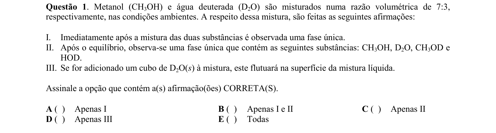

## Q02
**Assunto:** reações inorgânicas
**Competências:** reação de ácido carboxílico com PCl5, formação de cloreto de acila, HCl, POCl3, análise de produtos
**Tipo:** múltipla escolha

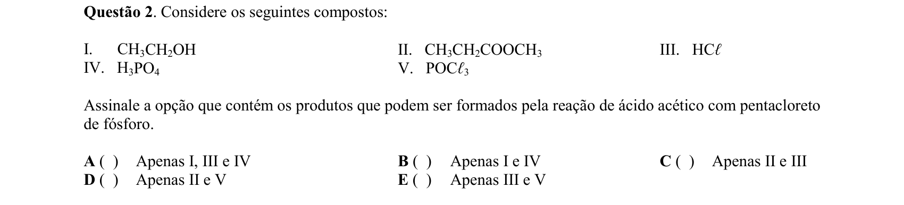

## Q03
**Assunto:** química orgânica
**Competências:** ácido tartárico, propriedades físicas, solubilidade em solventes apolares, ácido diprótico, quelação com íons metálicos
**Tipo:** múltipla escolha

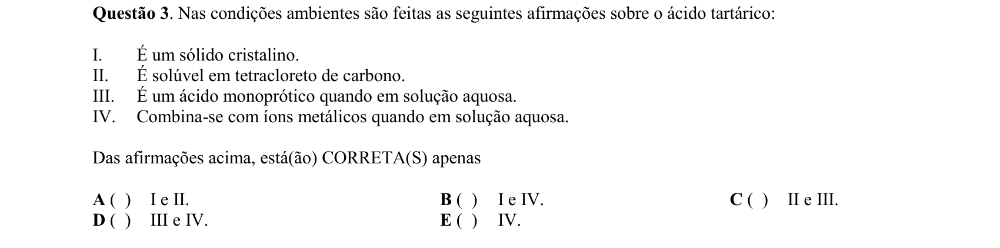

## Q04
**Assunto:** termoquímica
**Competências:** entropia de fusão, relação ΔS=ΔH/T, equilíbrio sólido-líquido, conversão de unidades
**Tipo:** múltipla escolha

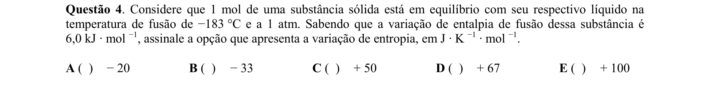

## Q05
**Assunto:** reações inorgânicas
**Competências:** reações de redução-oxidação por aquecimento, sulfetos e óxidos de cobre, formação de Cu metálico e SO2
**Tipo:** múltipla escolha

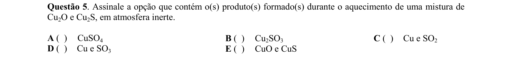

## Q06
**Assunto:** atomística
**Competências:** modelo de Bohr, quantização do momento angular orbital (nh/2π), átomo de hidrogênio
**Tipo:** múltipla escolha

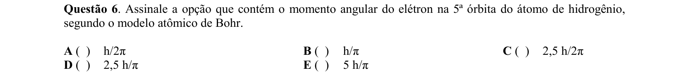

## Q07
**Assunto:** ácidos e bases
**Competências:** teoria de Bronsted-Lowry, pares conjugados ácido-base, autoprotólise da água, hidróxido vs óxido
**Tipo:** múltipla escolha

## Q08
**Assunto:** ligações químicas
**Competências:** número de oxidação em compostos de coordenação, ligantes neutros (NH3) e aniônicos (Cl-), carga do complexo
**Tipo:** múltipla escolha

## Q09
**Assunto:** atomística
**Competências:** número de massa, número atômico, cálculo de nêutrons (A-Z), análise de isótopos
**Tipo:** múltipla escolha

## Q10
**Assunto:** propriedades coligativas
**Competências:** lei de Raoult, pressão de vapor de solução ideal, fração molar do solvente, soluto não-volátil
**Tipo:** múltipla escolha

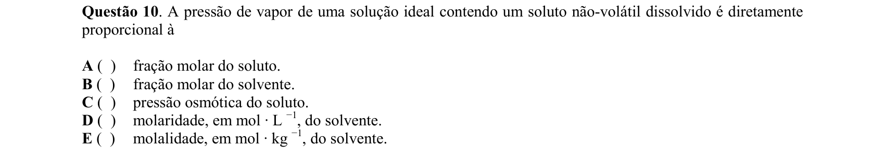

## Q11
**Assunto:** gases
**Competências:** teoria cinética dos gases, velocidade média das moléculas, dependência com T e massa molar, compressão isotérmica
**Tipo:** múltipla escolha

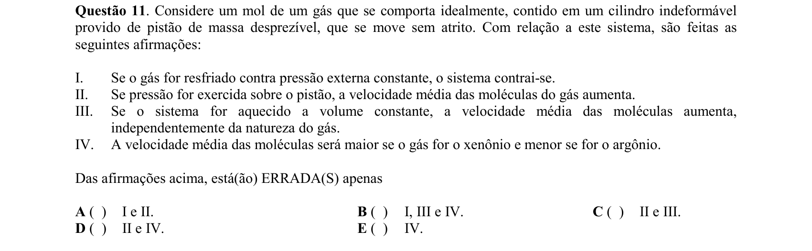

## Q12
**Assunto:** termoquímica
**Competências:** calorimetria, calor específico, massa específica, equilíbrio térmico, comparação entre metais
**Tipo:** múltipla escolha

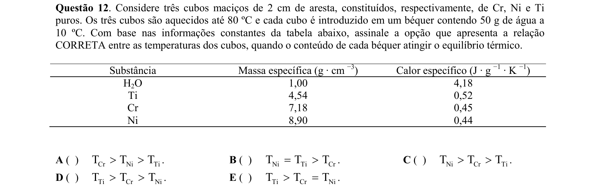

## Q13
**Assunto:** cinética química
**Competências:** identificação da ordem de reação por linearização (ln[A] vs t), cinética de primeira ordem, cálculo da constante k
**Tipo:** múltipla escolha

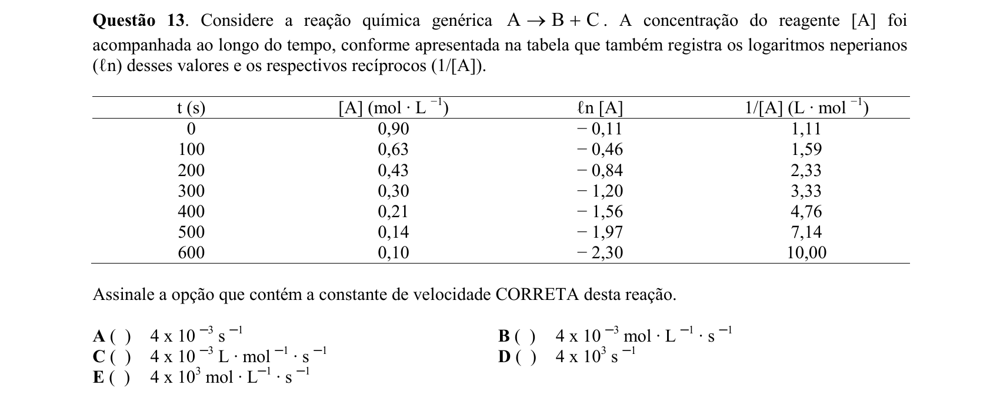

## Q14
**Assunto:** química orgânica
**Competências:** acidez de ácidos carboxílicos, efeito indutivo de halogênios, eletronegatividade (F vs Cl), proximidade do grupo carboxílico
**Tipo:** múltipla escolha

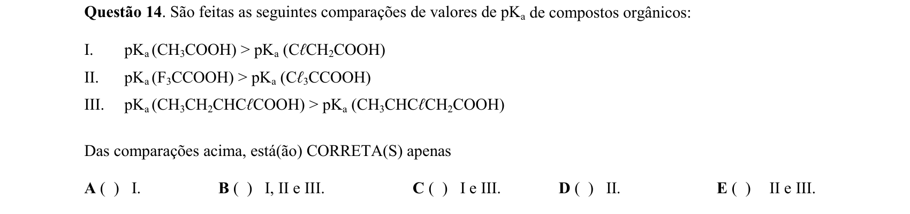

## Q15
**Assunto:** história da química
**Competências:** experimentos de Joule, equivalente mecânico do calor, primeira lei da termodinâmica, análise de proposições
**Tipo:** múltipla escolha

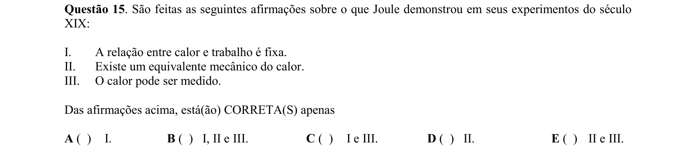

## Q16
**Assunto:** história da química
**Competências:** calor específico (Joseph Black), máquina a vapor de Watt, condensador separado, revolução industrial
**Tipo:** múltipla escolha

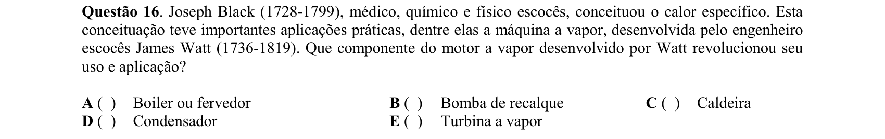

## Q17
**Assunto:** equilíbrio iônico
**Competências:** produto de solubilidade (Kps), efeito do íon comum, solubilidade de sal pouco solúvel em presença de íon X-
**Tipo:** múltipla escolha

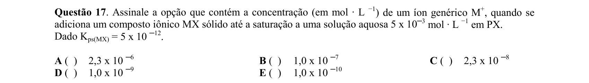

## Q18
**Assunto:** reações orgânicas
**Competências:** combustão incompleta de hidrocarbonetos, produtos parciais de oxidação (álcoois, aldeídos, fuligem), comparação com combustão completa
**Tipo:** múltipla escolha

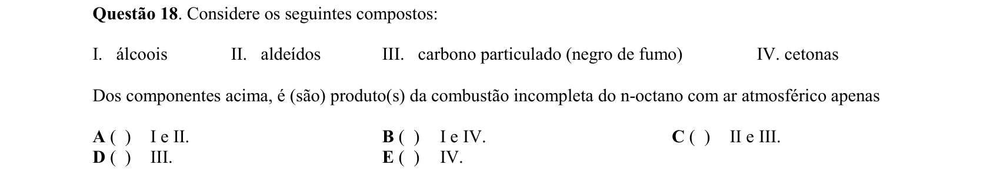

## Q19
**Assunto:** ácidos e bases
**Competências:** ácido bórico B(OH)3, definição de Brønsted-Lowry e Arrhenius, ionização do ácido bórico (formação de [B(OH)4]-)
**Tipo:** múltipla escolha

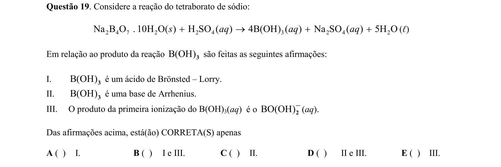

## Q20
**Assunto:** eletroquímica
**Competências:** célula a combustível H2/O2 alcalina, fem vs voltagem efetiva, eletrodos (anodo/catodo), ΔG° = -nFE°
**Tipo:** múltipla escolha

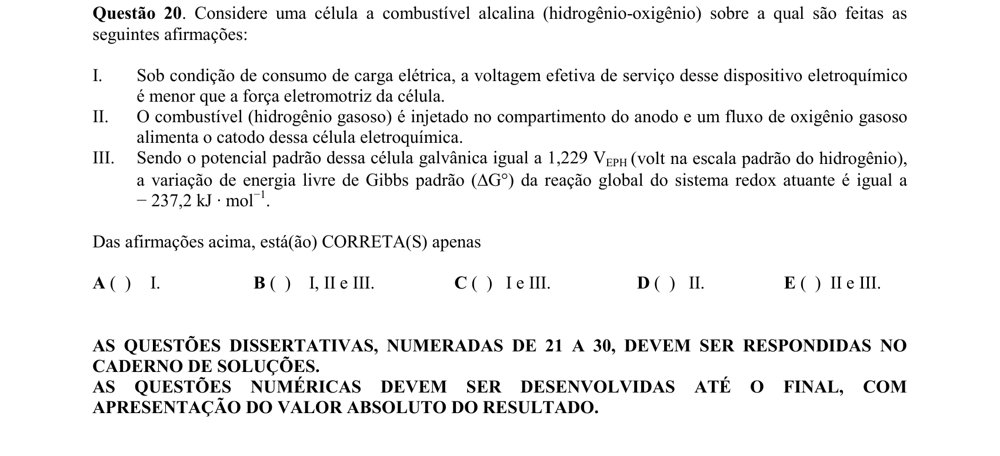

## Q21
**Assunto:** reações inorgânicas
**Competências:** superóxido de potássio (KO2), reações com H2O e CO2, balanceamento de equações, aplicações em sistemas de respiração
**Tipo:** discursiva

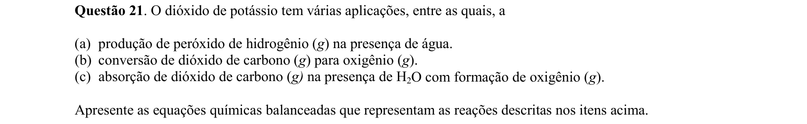

## Q22
**Assunto:** eletroquímica
**Competências:** corrosão da prata por sulfeto (Ag2S), potenciais-padrão, cálculo de fem, reação com alumínio, restauração química
**Tipo:** discursiva

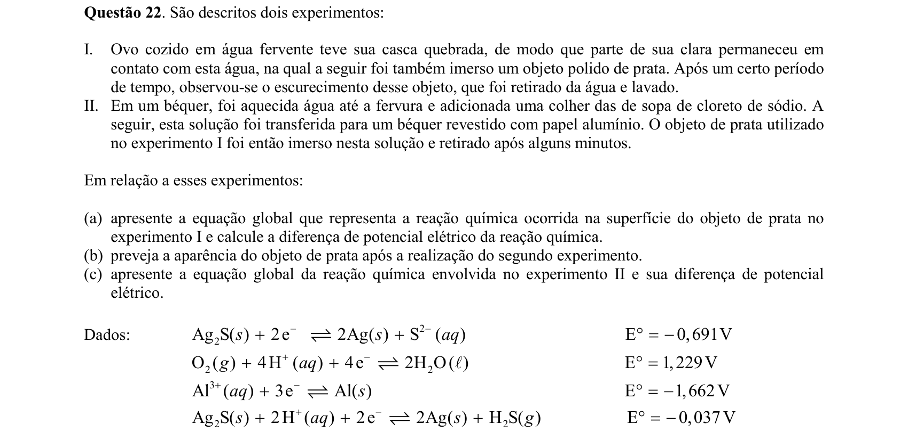

## Q23
**Assunto:** reações orgânicas
**Competências:** nitração do tolueno, substituição eletrofílica aromática, orientadores orto/para, percentual de isômeros, estados físicos
**Tipo:** discursiva

## Q24
**Assunto:** estequiometria
**Competências:** combustão completa de hidrocarboneto genérico CαHβ, balanço com ar atmosférico (N2 inerte), coeficientes em função de α e β
**Tipo:** discursiva

## Q25
**Assunto:** eletroquímica
**Competências:** eletrodeposição, lei de Faraday, cálculo de massa depositada, densidade de corrente, eficiência de corrente 100%
**Tipo:** discursiva

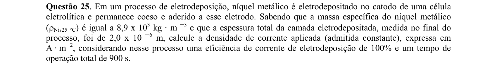

## Q26
**Assunto:** eletroquímica
**Competências:** semirreação de redução de O2 em meio neutro, equação de Nernst, pH=7, potencial de eletrodo, ΔG° = -nFE°
**Tipo:** discursiva

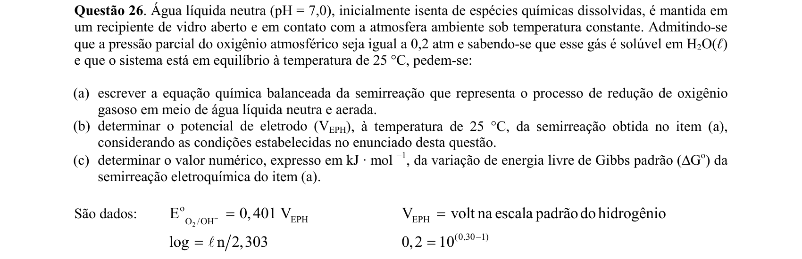

## Q27
**Assunto:** estequiometria
**Competências:** combustão de mistura gasosa (propano/CO/metano), relação volumétrica CO2 produzido, cálculo de percentual
**Tipo:** discursiva

## Q28
**Assunto:** reações inorgânicas
**Competências:** reações de HNO3 com metais (Zn, Sn), produtos em função da concentração (NH4NO3, N2O, NO, NO2), reatividade do metal
**Tipo:** discursiva

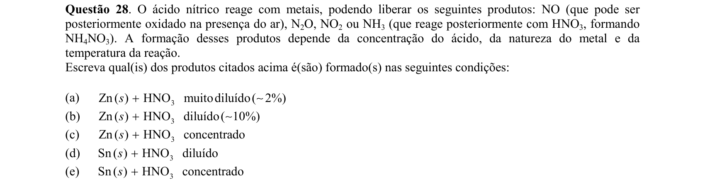

## Q29
**Assunto:** termoquímica
**Competências:** entalpia de vaporização da água, cálculo de energia liberada em precipitação pluviométrica, ligações de hidrogênio, comparação H2O/H2S/H2Se/H2Te
**Tipo:** discursiva

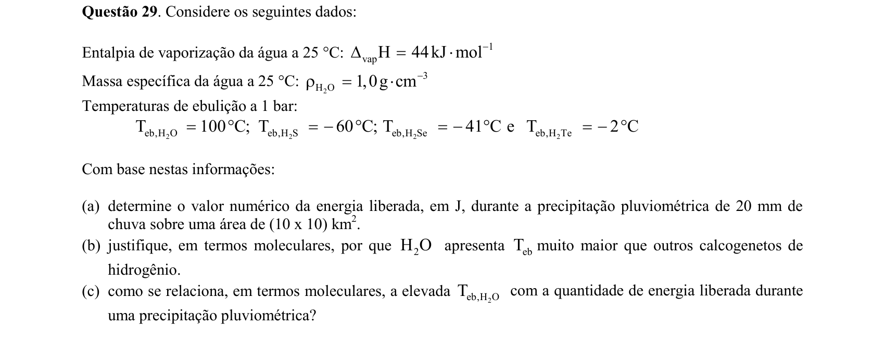

## Q30
**Assunto:** cinética química
**Competências:** análise de dados experimentais de velocidade inicial, equação estequiométrica, ordem de reação, lei de velocidade, função do catalisador (I-)
**Tipo:** discursiva

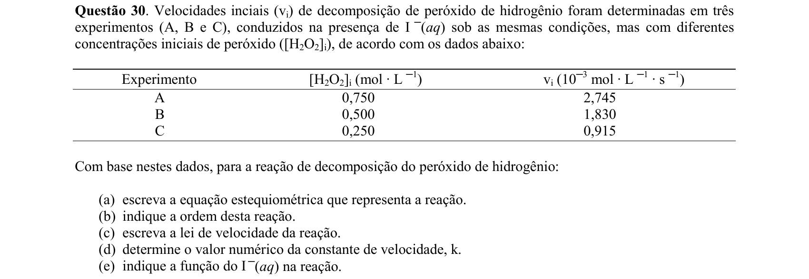
