# Química — ITA 2015

> 30 questões. Q01–Q20 múltipla escolha; Q21–Q30 discursivas.

## Q01
**Assunto:** química analítica
**Competências:** técnicas de laboratório, titulação, vidrarias volumétricas
**Tipo:** múltipla escolha

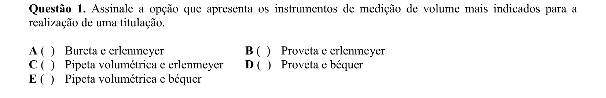

## Q02
**Assunto:** atomística
**Competências:** radiação de corpo negro, relação cor-temperatura, espectro eletromagnético
**Tipo:** múltipla escolha

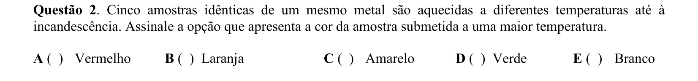

## Q03
**Assunto:** radioatividade
**Competências:** isótopos, meia-vida, tipos de emissão (alfa, beta, gama), aplicações tecnológicas
**Tipo:** múltipla escolha

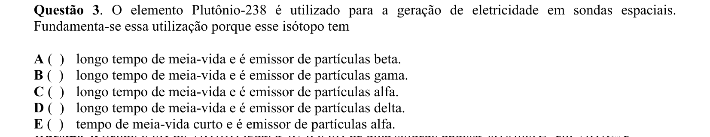

## Q04
**Assunto:** equilíbrio iônico
**Competências:** hidrólise salina, sal de ácido forte e base fraca, pKb, cálculo de pH
**Tipo:** múltipla escolha

## Q05
**Assunto:** cinética química
**Competências:** ordem de reação, leis de velocidade, linearização de gráficos, análise de proposições
**Tipo:** múltipla escolha

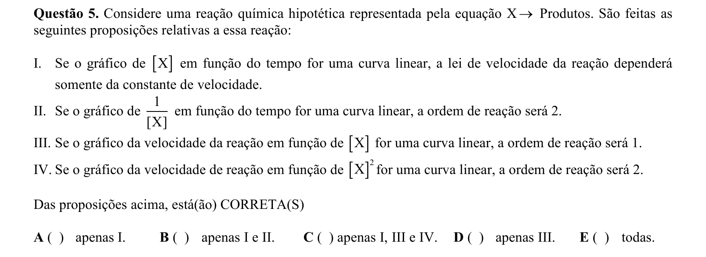

## Q06
**Assunto:** química orgânica
**Competências:** polímeros, unidades repetitivas, temperatura de fusão, interações intermoleculares, simetria de cadeia
**Tipo:** múltipla escolha

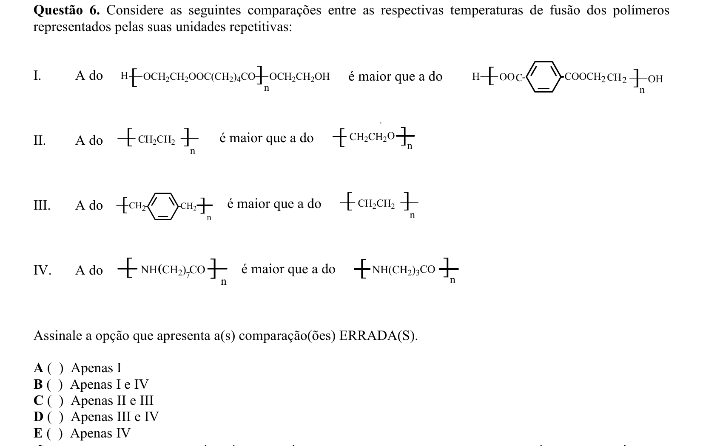

## Q07
**Assunto:** termoquímica
**Competências:** energia livre de Gibbs, evolução de G ao longo do tempo, espontaneidade, equilíbrio químico
**Tipo:** múltipla escolha

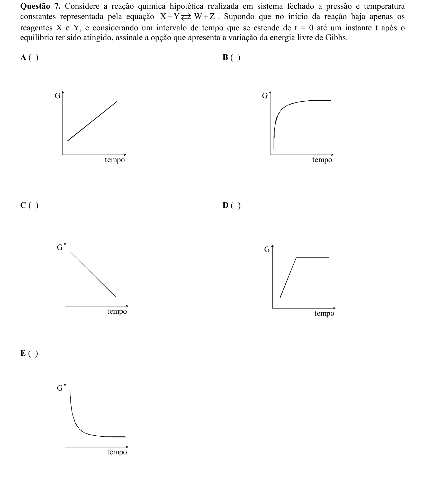

## Q08
**Assunto:** reações inorgânicas
**Competências:** dismutação do cloro, reações com hidróxidos, produtos clorados (Cl-, ClO-, ClO3-)
**Tipo:** múltipla escolha

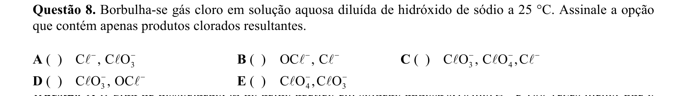

## Q09
**Assunto:** equilíbrio iônico
**Competências:** grau de dissociação, ácidos fracos vs fortes, cálculo de pH, [H+]
**Tipo:** múltipla escolha

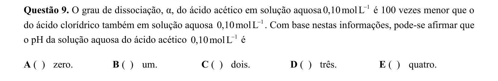

## Q10
**Assunto:** termoquímica
**Competências:** entalpia de vaporização, energia elétrica (P=Vi), conversão de unidades, cálculo molar
**Tipo:** múltipla escolha

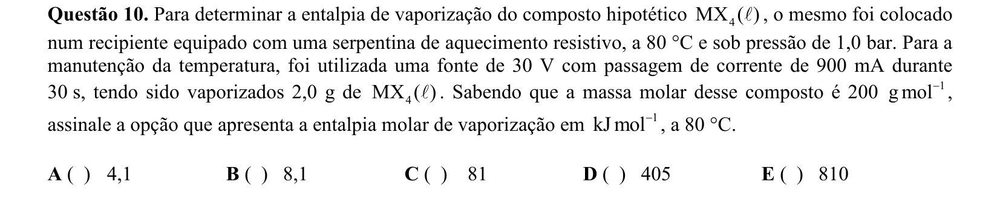

## Q11
**Assunto:** óxidos
**Competências:** caráter ácido-básico-anfótero, número de oxidação, óxidos de metais de transição
**Tipo:** múltipla escolha

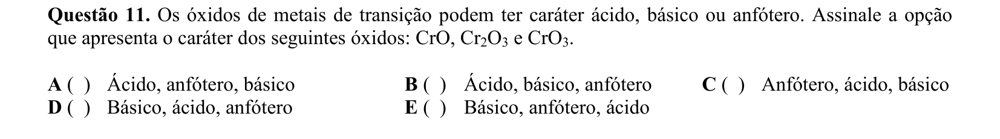

## Q12
**Assunto:** equilíbrio químico
**Competências:** combinação de equilíbrios, manipulação de constantes (inversão, multiplicação por fator), Kc
**Tipo:** múltipla escolha

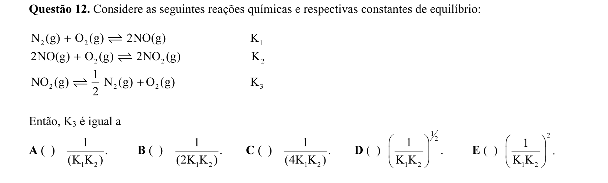

## Q13
**Assunto:** eletroquímica
**Competências:** equação de Nernst, força eletromotriz, pH a partir de fem, cálculo de [H+]
**Tipo:** múltipla escolha

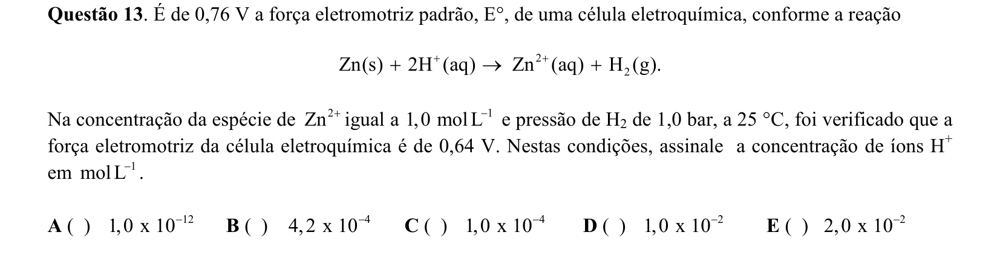

## Q14
**Assunto:** soluções
**Competências:** volume parcial molar, massa específica, soluções não-ideais, mistura álcool-água
**Tipo:** múltipla escolha

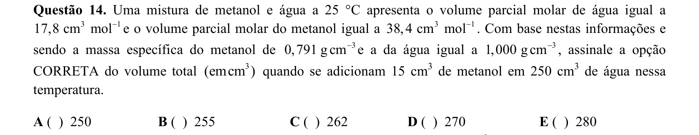

## Q15
**Assunto:** atomística
**Competências:** níveis vibracionais quantizados, energia potencial de moléculas diatômicas, princípio da incerteza de Heisenberg, análise de proposições
**Tipo:** múltipla escolha

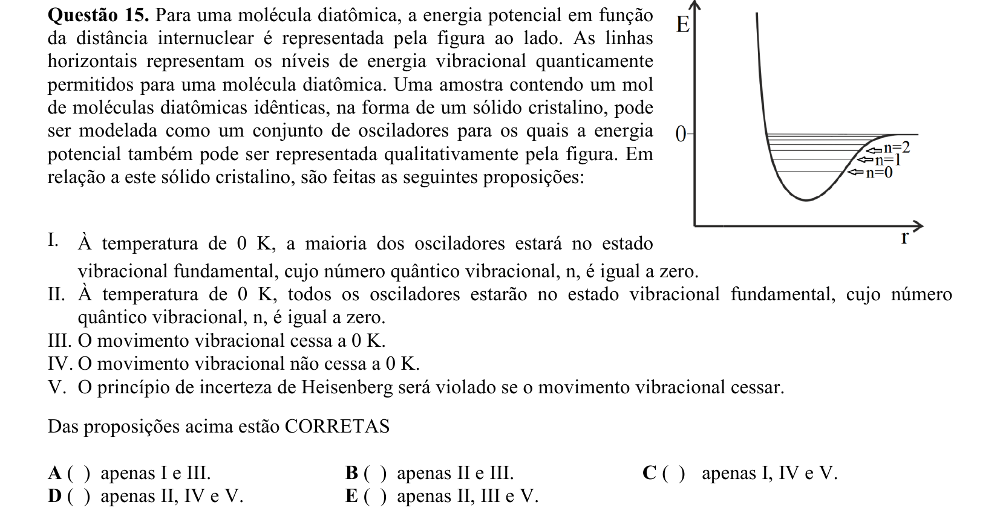

## Q16
**Assunto:** propriedades coligativas
**Competências:** pressão de vapor, equilíbrio termodinâmico entre soluções, transferência de solvente, osmose
**Tipo:** múltipla escolha

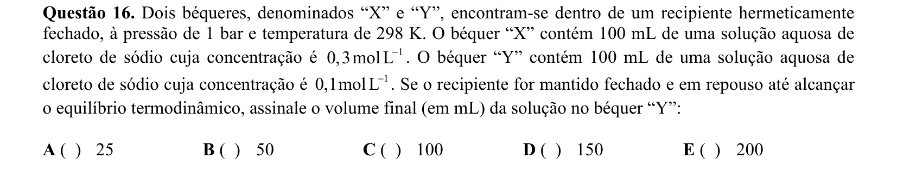

## Q17
**Assunto:** termoquímica
**Competências:** capacidade calorífica molar, comparação entre substâncias, ligações de hidrogênio, análise de proposições
**Tipo:** múltipla escolha

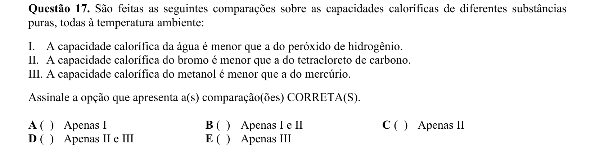

## Q18
**Assunto:** ácidos e bases
**Competências:** teoria de Lewis vs Bronsted, par de elétrons, BF3 como aceptor
**Tipo:** múltipla escolha

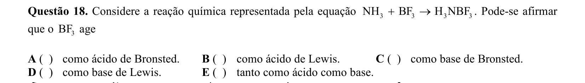

## Q19
**Assunto:** estados da matéria
**Competências:** mudança de fase, massa específica vs temperatura, anomalia da água, fusão
**Tipo:** múltipla escolha

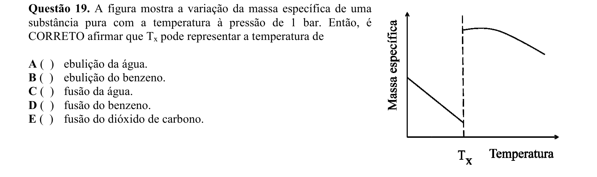

## Q20
**Assunto:** história da química
**Competências:** desenvolvimento do conceito de pressão atmosférica, Torricelli, Galileu
**Tipo:** múltipla escolha

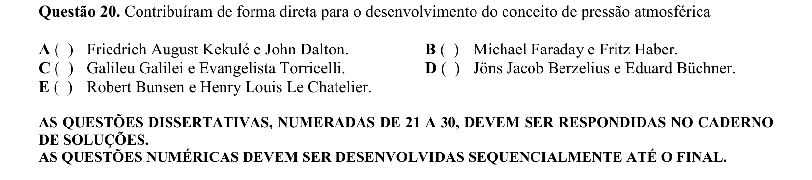

## Q21
**Assunto:** estequiometria
**Competências:** reação de fosfeto de cálcio com água, gás fosfina (PH3), equação de Clapeyron (PV=nRT), conversão de unidades
**Tipo:** discursiva

## Q22
**Assunto:** equilíbrio iônico
**Competências:** produto de solubilidade (Kps), condutividade iônica molar, sal pouco solúvel, cálculo de solubilidade
**Tipo:** discursiva

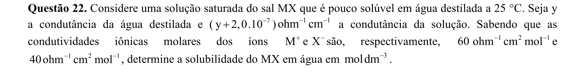

## Q23
**Assunto:** cinética química
**Competências:** energia de ativação direta e inversa, gráfico de coordenada de reação, constante de equilíbrio a partir de constantes de velocidade, endotermia/exotermia
**Tipo:** discursiva

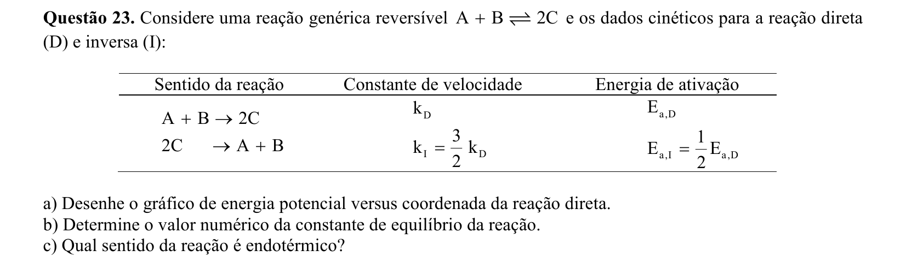

## Q24
**Assunto:** eletroquímica
**Competências:** titulação redox com permanganato, balanceamento iônico, ponto de viragem (indicador), estequiometria de titulação
**Tipo:** discursiva

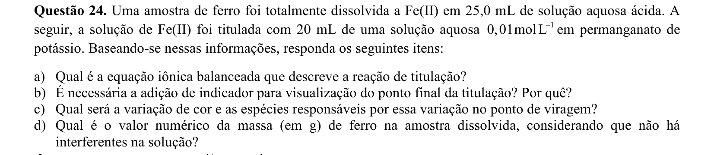

## Q25
**Assunto:** reações orgânicas
**Competências:** ácido benzoico vs ciclohexanol, extração líquido-líquido, reação ácido-base com NaOH, separação de fases
**Tipo:** discursiva

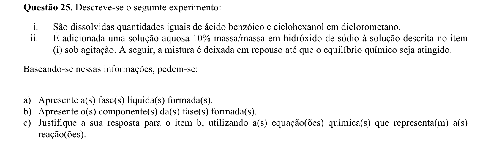

## Q26
**Assunto:** eletroquímica
**Competências:** potenciais-padrão de redução, semirreações, fem da pilha, reação global, espécies em meio ácido
**Tipo:** discursiva

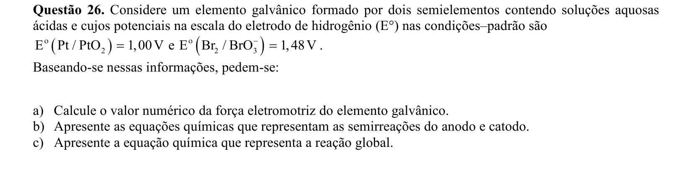

## Q27
**Assunto:** atomística
**Competências:** modelo de Bohr, quantização do momento angular orbital, constante de Planck, comparação com mecânica quântica
**Tipo:** discursiva

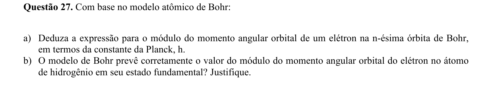

## Q28
**Assunto:** reações orgânicas
**Competências:** halogenação do tolueno, substituição eletrofílica aromática vs substituição radicalar, efeito do catalisador (Fe vs hv), produto orto/para
**Tipo:** discursiva

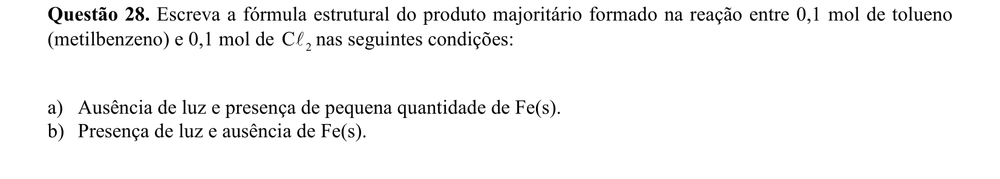

## Q29
**Assunto:** química orgânica
**Competências:** tautomeria ceto-enólica, estabilidade do enol, conjugação com anel aromático, comparação metilfenilcetona x propanona
**Tipo:** discursiva

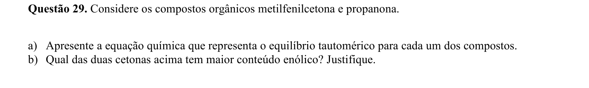

## Q30
**Assunto:** química orgânica
**Competências:** hidrocarbonetos aromáticos policíclicos, fórmula estrutural (IUPAC), naftaleno, fenantreno, antraceno, peróxido de benzoíla
**Tipo:** discursiva

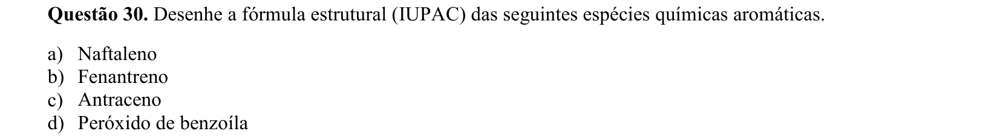
