# Química — ITA 2016

> 30 questões. Q01–Q20 múltipla escolha; Q21–Q30 discursivas.

## Q01
**Assunto:** ácidos e bases
**Competências:** definições de Brønsted-Lowry, Lewis e Arrhenius, hidrólise salina, pH de soluções
**Tipo:** múltipla escolha

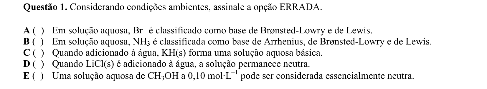

## Q02
**Assunto:** sais
**Competências:** solubilidade de sais em água, regras de solubilidade, haletos e carbonatos
**Tipo:** múltipla escolha

## Q03
**Assunto:** propriedades coligativas
**Competências:** ebulioscopia, constante ebulioscópica, cálculo de molalidade, variação de temperatura de ebulição
**Tipo:** múltipla escolha

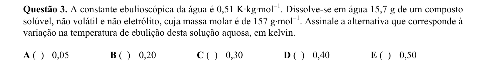

## Q04
**Assunto:** cinética química
**Competências:** equação de Arrhenius, fator pré-exponencial, energia de ativação, gráfico ln k vs 1/T
**Tipo:** múltipla escolha

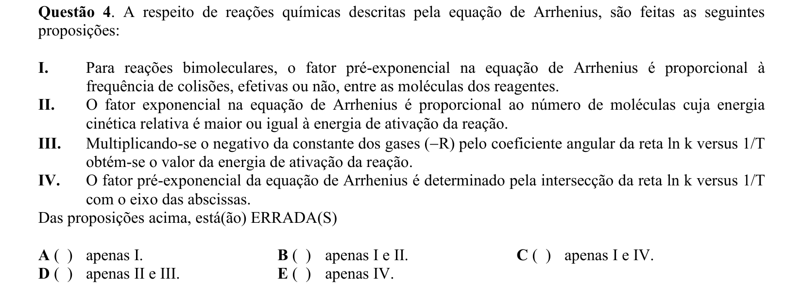

## Q05
**Assunto:** química orgânica
**Competências:** isomeria de cadeia, pressão de vapor, forças intermoleculares, ramificações em alcanos
**Tipo:** múltipla escolha

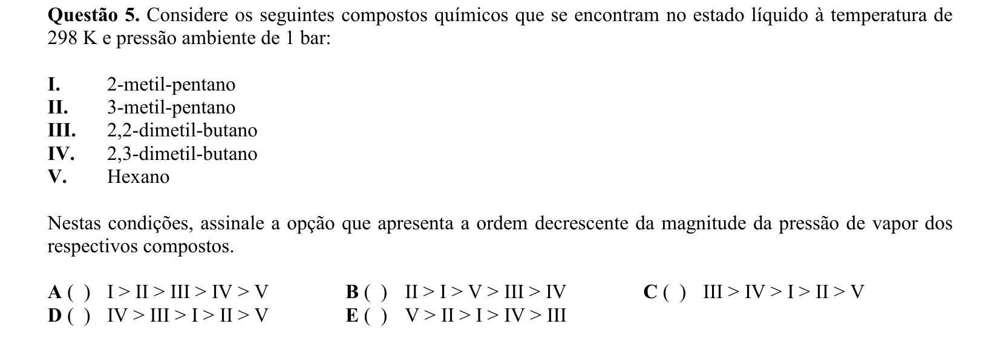

## Q06
**Assunto:** atomística
**Competências:** número de massa, massa atômica, unidade de massa atômica, constante de Avogadro
**Tipo:** múltipla escolha

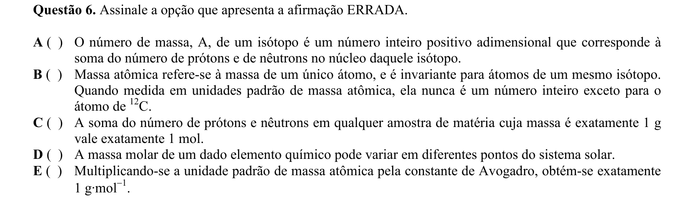

## Q07
**Assunto:** eletroquímica
**Competências:** equação de Nernst, potencial de eletrodo, relação E e pH, semi-reações
**Tipo:** múltipla escolha

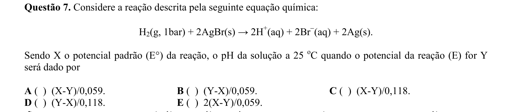

## Q08
**Assunto:** gases
**Competências:** equação de Clapeyron, massa específica, massa molar, lei dos gases ideais
**Tipo:** múltipla escolha

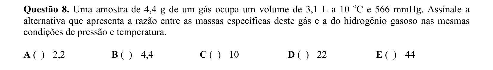

## Q09
**Assunto:** eletroquímica
**Competências:** relação ΔG° e E°, número de elétrons, balanceamento redox, energia livre de Gibbs
**Tipo:** múltipla escolha

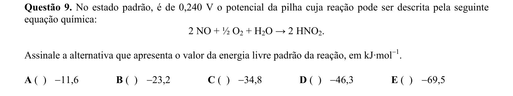

## Q10
**Assunto:** equilíbrio químico
**Competências:** Kp, pressões parciais, estequiometria em equilíbrio, formação de HI
**Tipo:** múltipla escolha

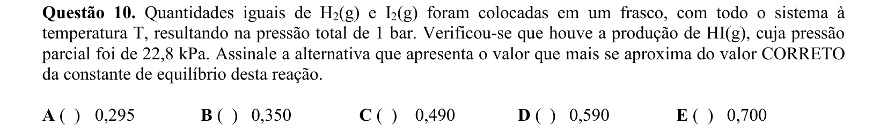

## Q11
**Assunto:** eletroquímica
**Competências:** eletrólise, migração iônica, identificação de ânodo e cátodo, produtos de eletrólise
**Tipo:** múltipla escolha

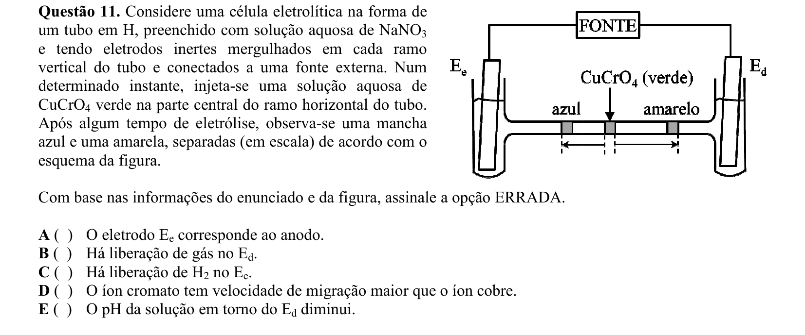

## Q12
**Assunto:** estequiometria
**Competências:** pureza de reagente, rendimento de reação, reação de tiossulfato com ácido, massa molar
**Tipo:** múltipla escolha

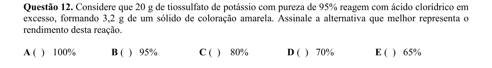

## Q13
**Assunto:** termoquímica
**Competências:** entalpia de formação, lei de Hess, calor latente de vaporização, capacidade calorífica
**Tipo:** múltipla escolha

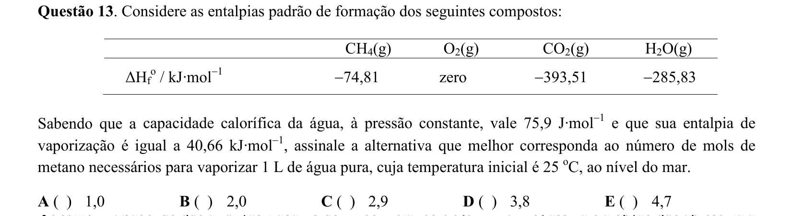

## Q14
**Assunto:** atomística
**Competências:** efeito fotoelétrico, função trabalho, energia do fóton, relação E = hc/λ
**Tipo:** múltipla escolha

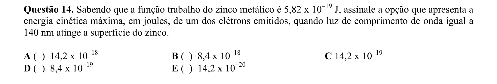

## Q15
**Assunto:** gases
**Competências:** teoria cinética dos gases, energia cinética média, relação Ec e T, gás monoatômico ideal
**Tipo:** múltipla escolha

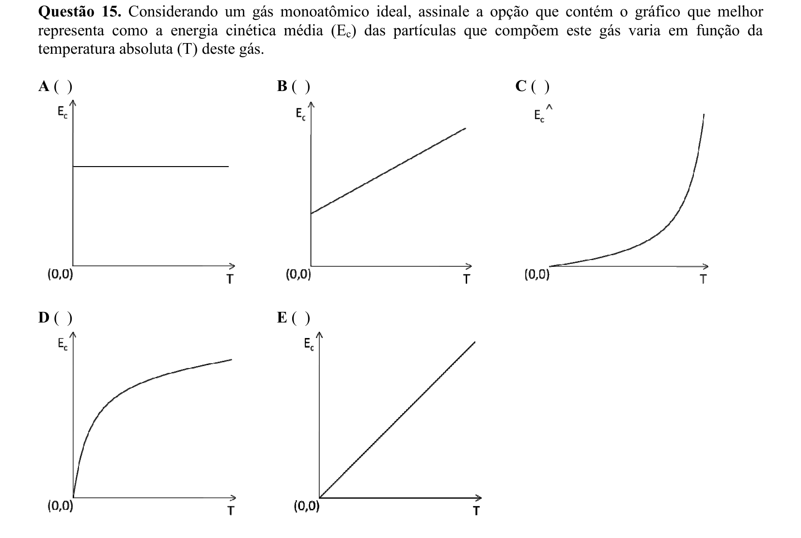

## Q16
**Assunto:** termoquímica
**Competências:** trabalho de expansão isotérmica, processo reversível vs irreversível, primeira lei, energia interna de gás ideal
**Tipo:** múltipla escolha

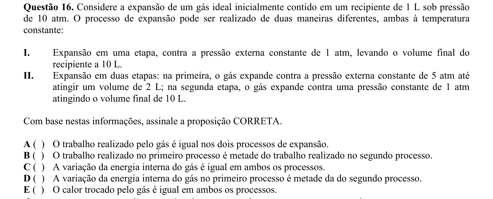

## Q17
**Assunto:** cinética química
**Competências:** mecanismos de reação, etapa lenta determinante, lei de velocidade, intermediários
**Tipo:** múltipla escolha

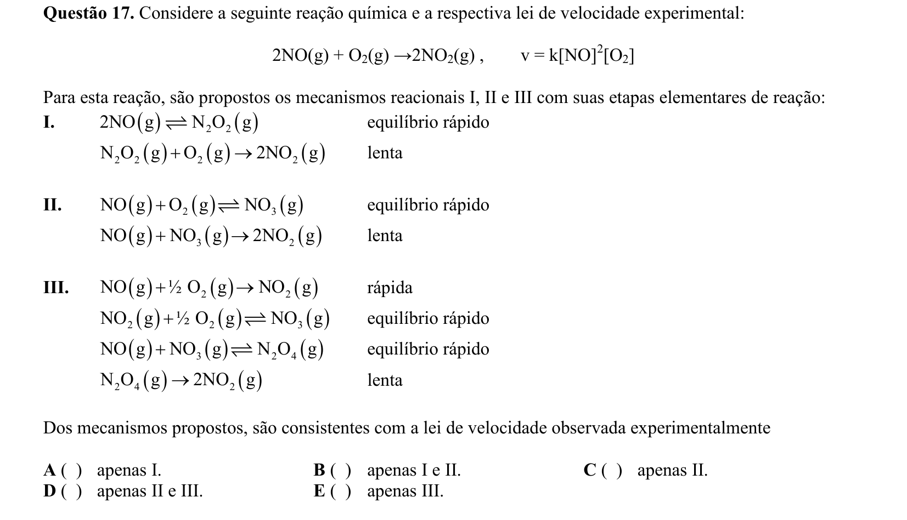

## Q18
**Assunto:** cinética química
**Competências:** reação de ordem zero, constante de velocidade, catálise heterogênea, tempo de reação
**Tipo:** múltipla escolha

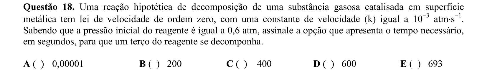

## Q19
**Assunto:** eletroquímica
**Competências:** eletrólise de solução aquosa, eletrodos inertes, produtos de eletrólise, balanço de carga
**Tipo:** múltipla escolha

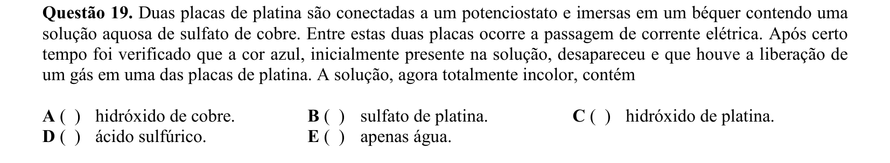

## Q20
**Assunto:** atomística
**Competências:** energia de orbital, ligação química, afinidade eletrônica, isótopos
**Tipo:** múltipla escolha

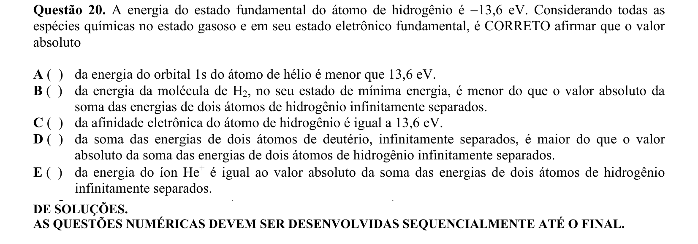

## Q21
**Assunto:** química orgânica
**Competências:** desidratação de álcool, adição eletrofílica a alceno, halogenação, reação com metanol
**Tipo:** discursiva

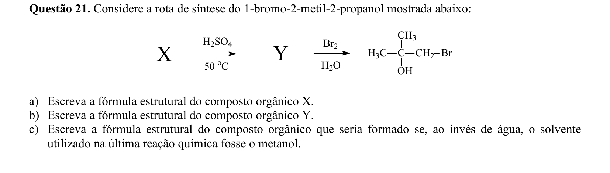

## Q22
**Assunto:** química orgânica
**Competências:** reagentes de Grignard, síntese de ácidos carboxílicos, reação com CO2, sensibilidade à água
**Tipo:** discursiva

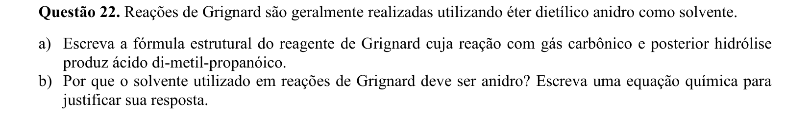

## Q23
**Assunto:** equilíbrio iônico
**Competências:** produto de solubilidade Kps, cálculo de concentrações iônicas, potencial padrão, eletrodo de calomelano
**Tipo:** discursiva

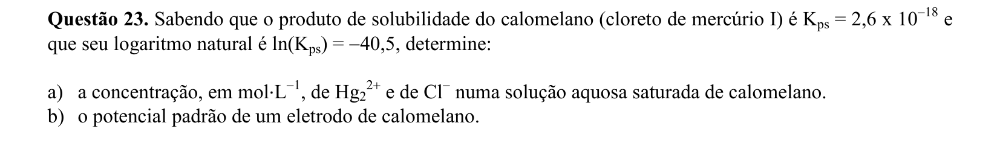

## Q24
**Assunto:** termoquímica
**Competências:** poder calorífico, combustão de combustíveis, massa específica, lei dos gases ideais
**Tipo:** discursiva

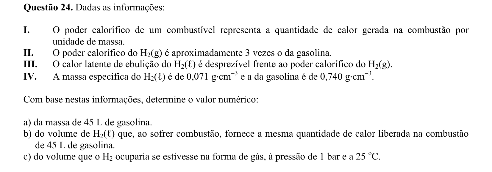

## Q25
**Assunto:** cinética química
**Competências:** mecanismos de reação, equações de velocidade, aproximação do estado estacionário, intermediário reacional
**Tipo:** discursiva

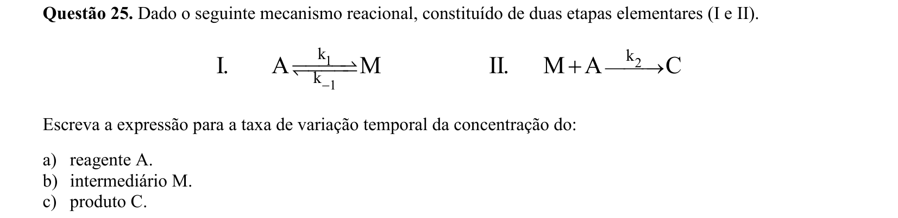

## Q26
**Assunto:** estados da matéria
**Competências:** diagrama de fases, ponto triplo, ponto crítico, efeito de soluto não volátil
**Tipo:** discursiva

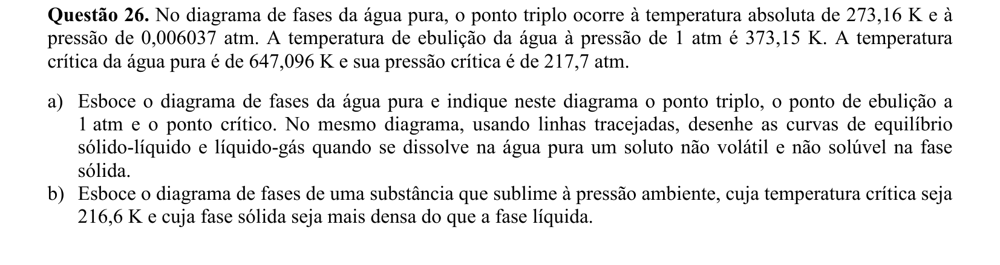

## Q27
**Assunto:** equilíbrio iônico
**Competências:** solução tampão, sistema bicarbonato/fosfato, equilíbrios ácido-base, ação tamponante
**Tipo:** discursiva

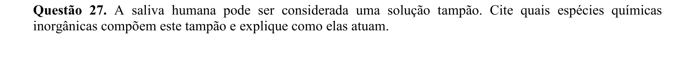

## Q28
**Assunto:** termoquímica
**Competências:** energia interna ΔU, entalpia ΔH, relação ΔH = ΔU + Δn·RT, condições de igualdade
**Tipo:** discursiva

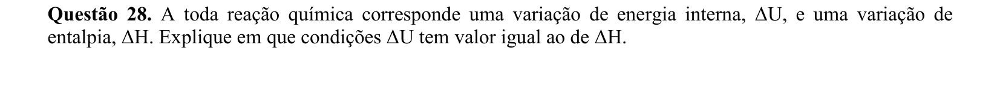

## Q29
**Assunto:** estequiometria
**Competências:** pureza, rendimento, reações redox com KI, balanceamento de equações, hidrólise de PI3
**Tipo:** discursiva

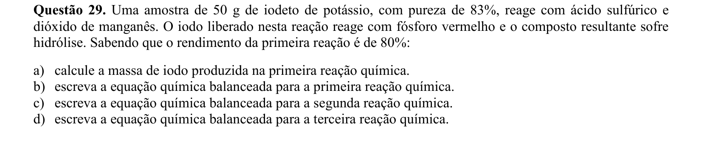

## Q30
**Assunto:** reações inorgânicas
**Competências:** ácido hipocloroso, fotólise, desidratação, decomposição térmica, balanceamento
**Tipo:** discursiva

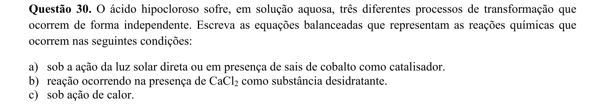
