# Química — ITA 2017

> 30 questões. Q01–Q20 múltipla escolha; Q21–Q30 discursivas.

## Q01
**Assunto:** eletroquímica
**Competências:** proteção catódica, metais de sacrifício, série eletroquímica, corrosão
**Tipo:** múltipla escolha

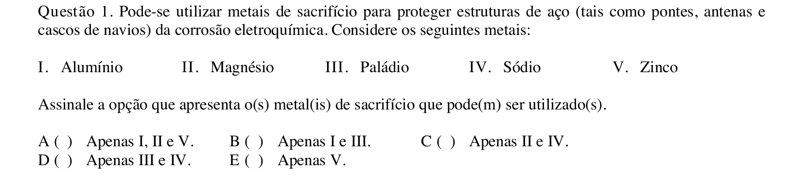

## Q02
**Assunto:** estequiometria
**Competências:** reação metal-ácido, cálculo de massa específica, concentração em massa, volume de solução
**Tipo:** múltipla escolha

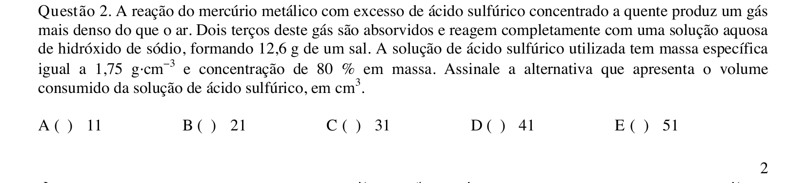

## Q03
**Assunto:** gases
**Competências:** pressão parcial, lei de Dalton, mistura gasosa ideal, fração molar
**Tipo:** múltipla escolha

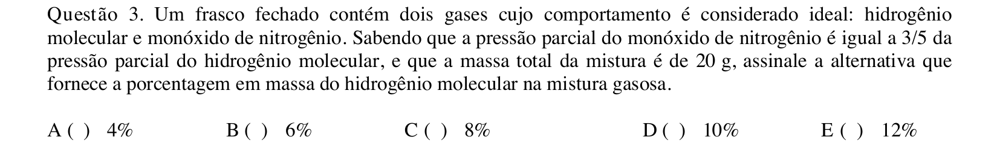

## Q04
**Assunto:** cinética química
**Competências:** reação de primeira ordem, constante de velocidade, energia de ativação, meia-vida
**Tipo:** múltipla escolha

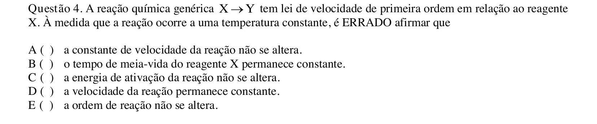

## Q05
**Assunto:** reações inorgânicas
**Competências:** materiais cerâmicos, propriedades térmicas, compostos refratários, aplicações tecnológicas
**Tipo:** múltipla escolha

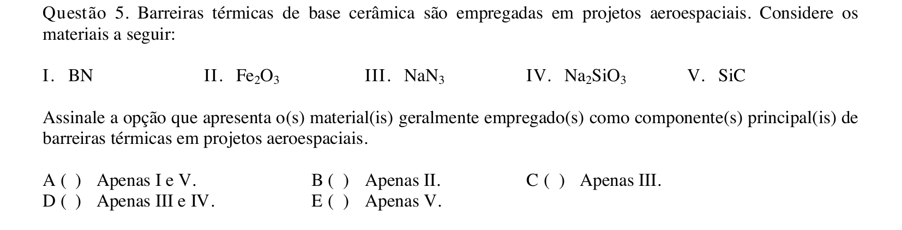

## Q06
**Assunto:** propriedades coligativas
**Competências:** crioscopia, constante crioscópica, fração mássica, soluções não eletrolíticas
**Tipo:** múltipla escolha

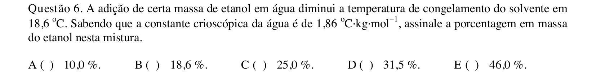

## Q07
**Assunto:** equilíbrio iônico
**Competências:** curva de titulação ácido-base, pKa, região-tampão, ponto de equivalência
**Tipo:** múltipla escolha

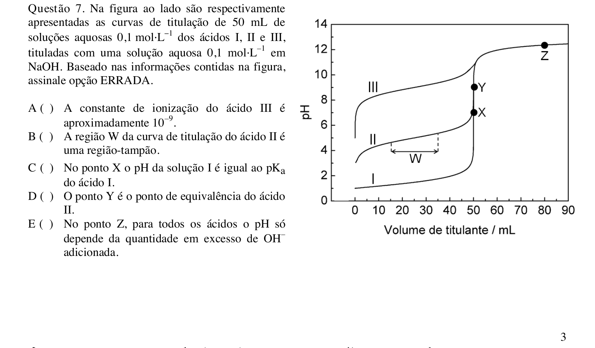

## Q08
**Assunto:** soluções
**Competências:** mistura de soluções, balanço de massa, concentração em massa, razão volumétrica
**Tipo:** múltipla escolha

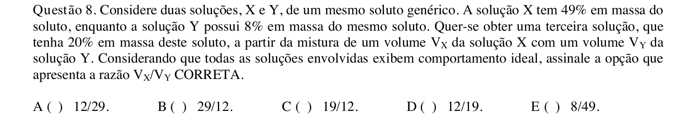

## Q09
**Assunto:** ligações químicas
**Competências:** diagrama de van Arkel-Ketelaar, eletronegatividade, caráter covalente, compostos binários
**Tipo:** múltipla escolha

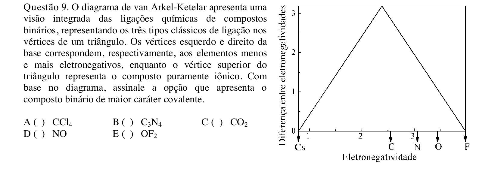

## Q10
**Assunto:** química orgânica
**Competências:** reações de ésteres, ácidos carboxílicos, oxidação de hidrocarbonetos aromáticos, cloretos de acila
**Tipo:** múltipla escolha

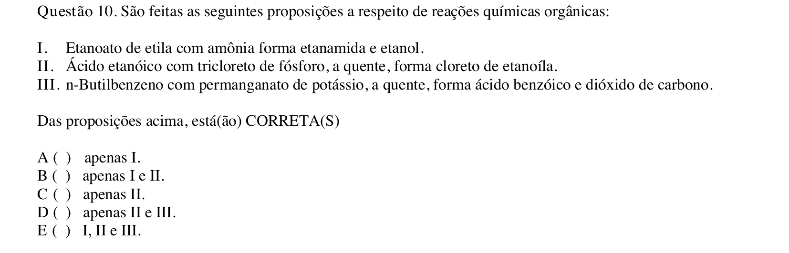

## Q11
**Assunto:** termoquímica
**Competências:** funções de estado, energia interna, entalpia, entropia
**Tipo:** múltipla escolha

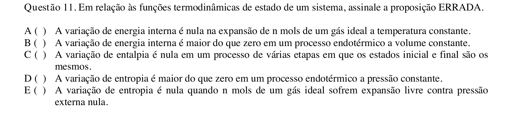

## Q12
**Assunto:** eletroquímica
**Competências:** potencial de pilha, equação de Nernst, eletrodo padrão de hidrogênio, cálculo de pH
**Tipo:** múltipla escolha

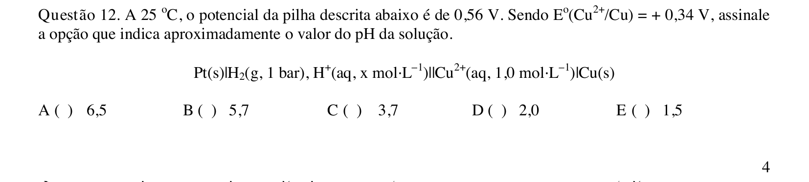

## Q13
**Assunto:** propriedades coligativas
**Competências:** tonoscopia, abaixamento da pressão de vapor, soluções eletrolíticas, fator de van't Hoff
**Tipo:** múltipla escolha

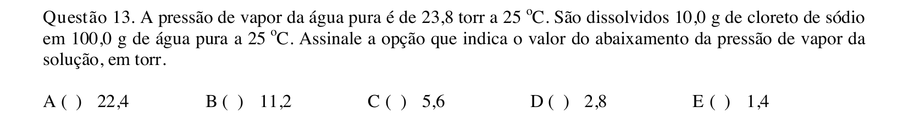

## Q14
**Assunto:** cinética química
**Competências:** lei de velocidade, primeira ordem, constante de velocidade, estequiometria da reação
**Tipo:** múltipla escolha

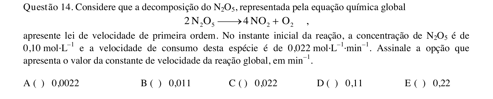

## Q15
**Assunto:** termoquímica
**Competências:** ciclos termodinâmicos, gases ideais, processo isocórico, processo adiabático, processo isobárico
**Tipo:** múltipla escolha

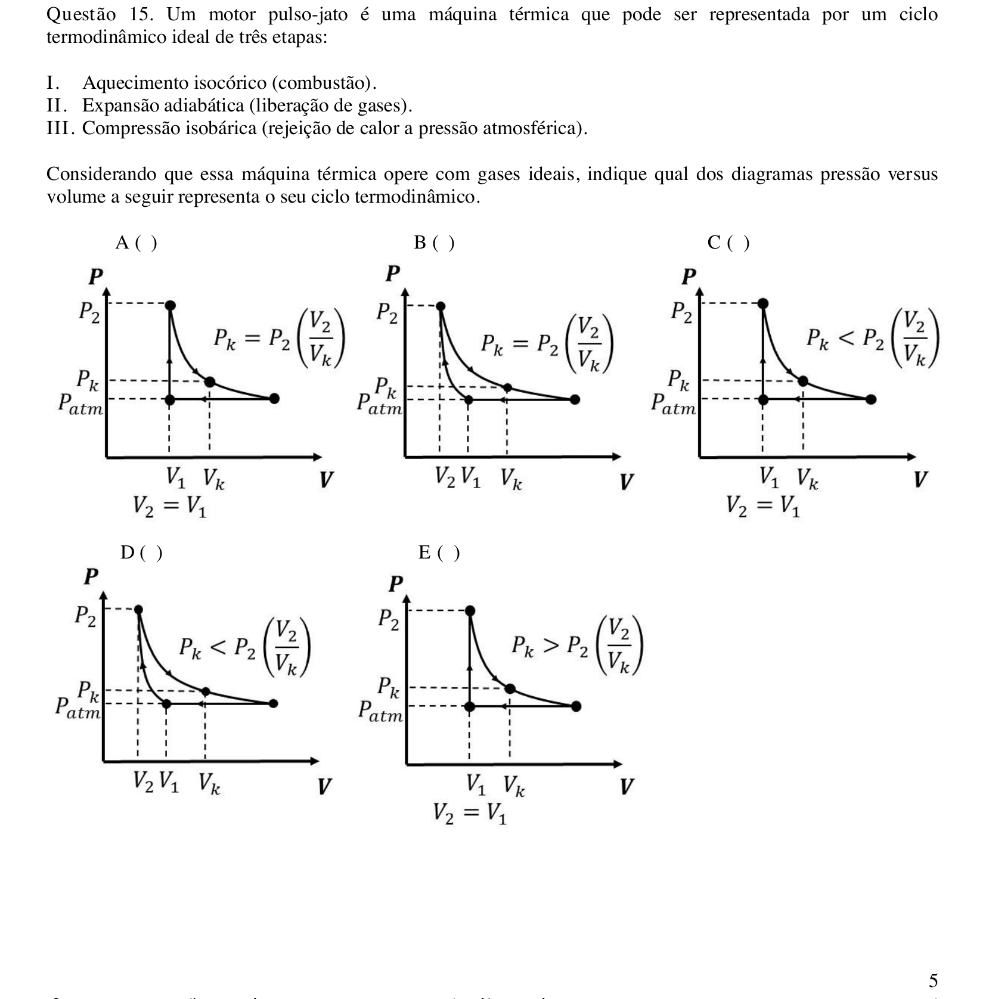

## Q16
**Assunto:** eletroquímica
**Competências:** eletrólise, leis de Faraday, deposição metálica, cálculo de tempo
**Tipo:** múltipla escolha

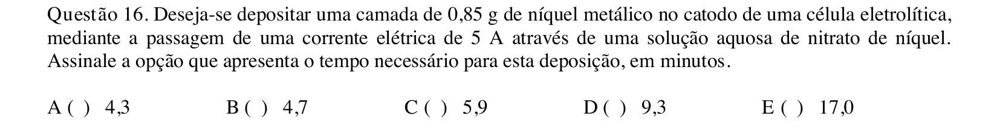

## Q17
**Assunto:** atomística
**Competências:** energia de ionização, geometria molecular, momento dipolar, energia de ligação, orbitais atômicos
**Tipo:** múltipla escolha

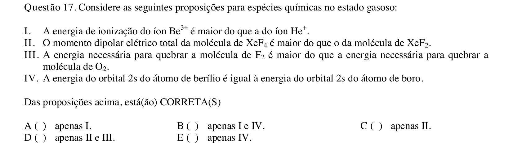

## Q18
**Assunto:** química orgânica
**Competências:** síntese de amidas, esterificação, isomeria estrutural, quiralidade
**Tipo:** múltipla escolha

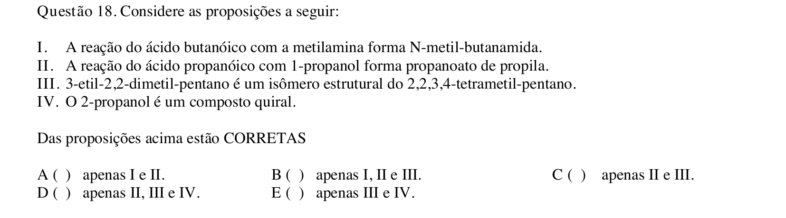

## Q19
**Assunto:** química analítica
**Competências:** técnicas analíticas, oxirredução com dicromato, fotometria, métodos instrumentais
**Tipo:** múltipla escolha

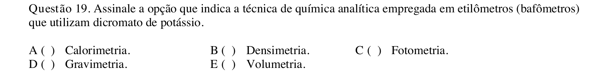

## Q20
**Assunto:** química orgânica
**Competências:** isomeria de hidrocarbonetos, quiralidade, reação com água de bromo, alcenos e cicloalcanos
**Tipo:** múltipla escolha

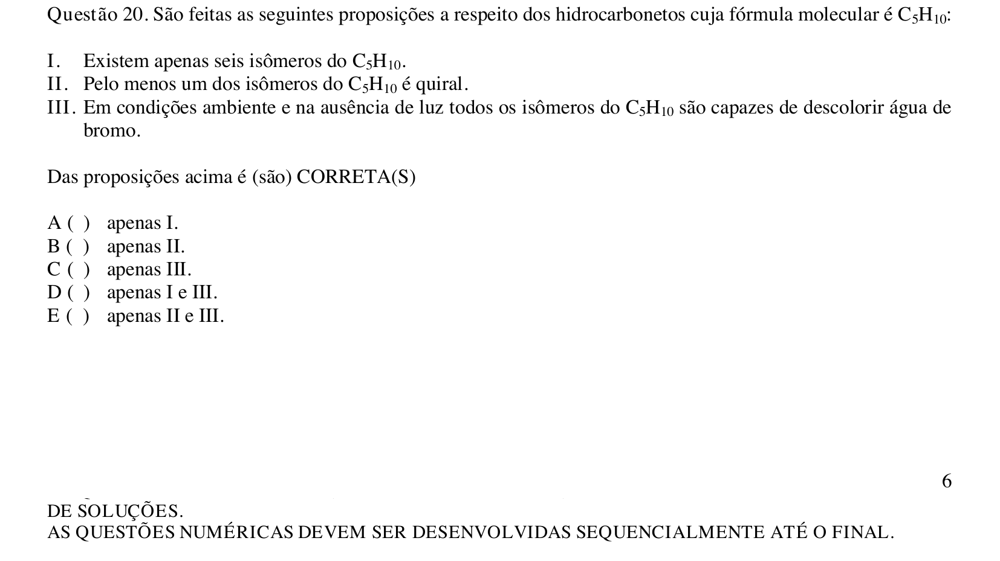

## Q21
**Assunto:** reações inorgânicas
**Competências:** reação de desproporcionamento, halogênios em meio básico, identificação de ânions, precipitação com nitrato de prata
**Tipo:** discursiva

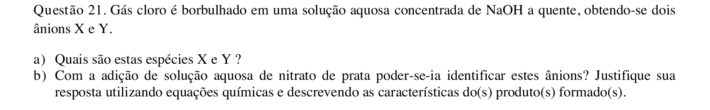

## Q22
**Assunto:** reações inorgânicas
**Competências:** reações de oxirredução, balanceamento em meio ácido, espécies de enxofre, bromato como oxidante
**Tipo:** discursiva

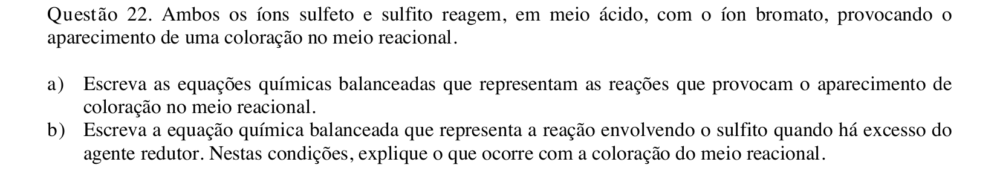

## Q23
**Assunto:** química orgânica
**Competências:** alquilação de Friedel-Crafts, nitração do tolueno, síntese de TNT, fatores intermoleculares e sensibilidade
**Tipo:** discursiva

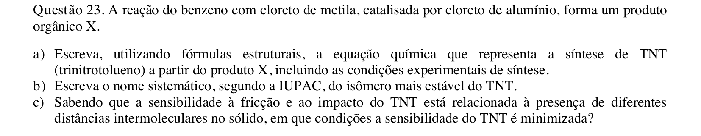

## Q24
**Assunto:** gases
**Competências:** pressão hidrostática, pressão parcial, composição do ar atmosférico, lei de Dalton
**Tipo:** discursiva

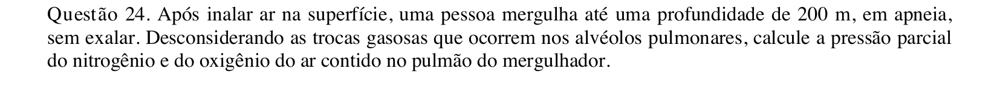

## Q25
**Assunto:** equilíbrio iônico
**Competências:** desmineralização, ácidos fracos, fermentação, tamponamento por uréia
**Tipo:** discursiva

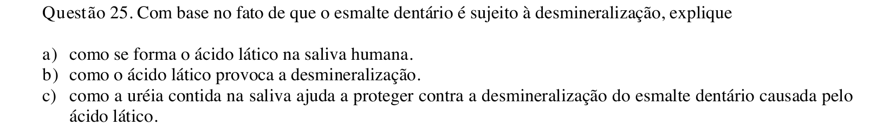

## Q26
**Assunto:** química orgânica
**Competências:** síntese de Wöhler, química inorgânica histórica, reação de cianeto, formação de uréia
**Tipo:** discursiva

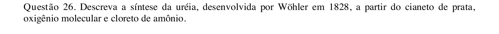

## Q27
**Assunto:** termoquímica
**Competências:** fotossíntese, entalpia padrão de reação, energia do fóton, relação de Planck
**Tipo:** discursiva

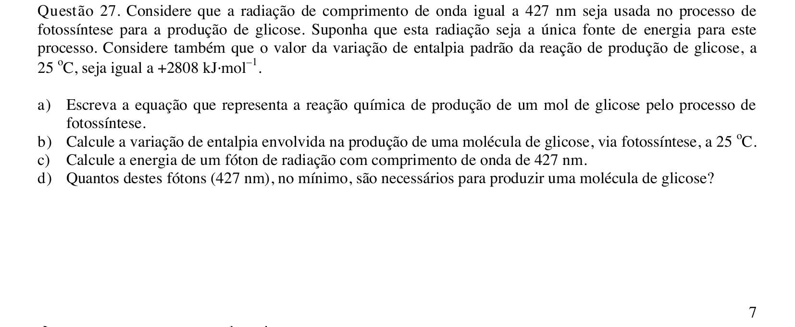

## Q28
**Assunto:** equilíbrio químico
**Competências:** lei de velocidade reversa, princípio do equilíbrio detalhado, combinação de equilíbrios, constante de equilíbrio global
**Tipo:** discursiva

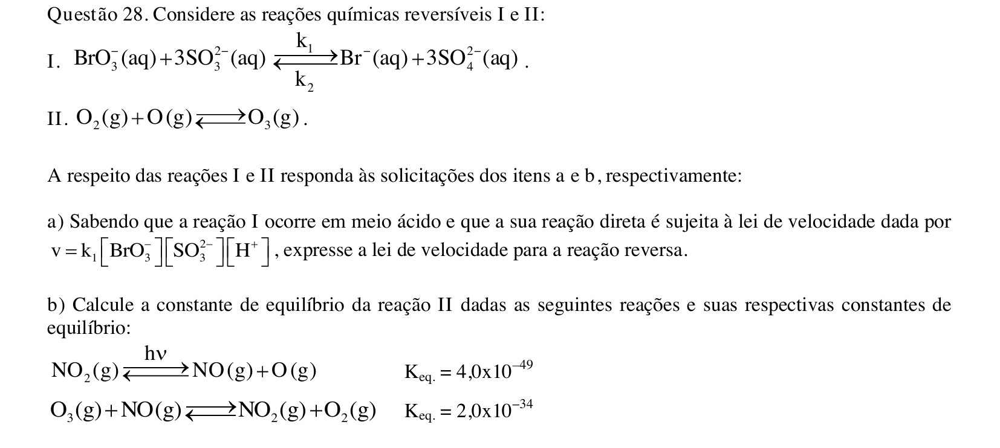

## Q29
**Assunto:** termoquímica
**Competências:** ciclos termodinâmicos, combustão do metano, capacidade calorífica, calor a volume constante
**Tipo:** discursiva

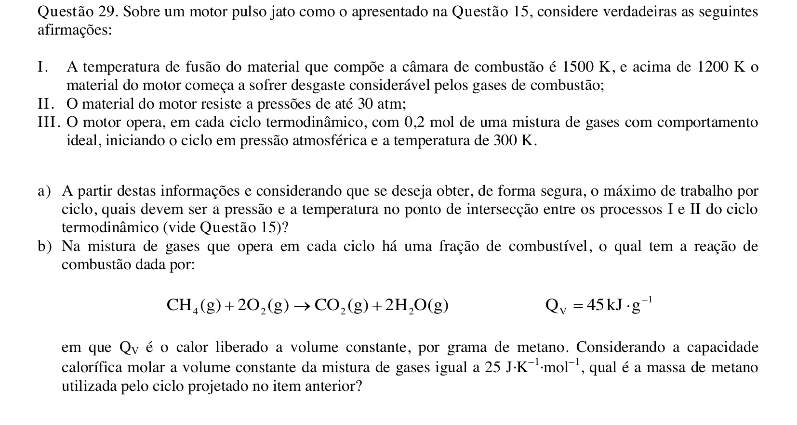

## Q30
**Assunto:** química orgânica
**Competências:** isomeria de posição, derivados do benzeno, nomenclatura IUPAC, forças intermoleculares, ponto de ebulição
**Tipo:** discursiva

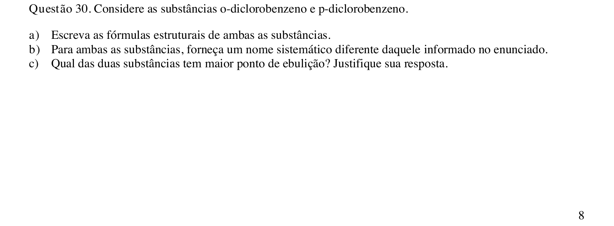
