# Química — ITA 2018

> 30 questões. Q01–Q20 múltipla escolha; Q21–Q30 discursivas.

## Q01
**Assunto:** química orgânica
**Competências:** aminoácidos, grupos funcionais polares, identificação de grupo R, estrutura molecular
**Tipo:** múltipla escolha

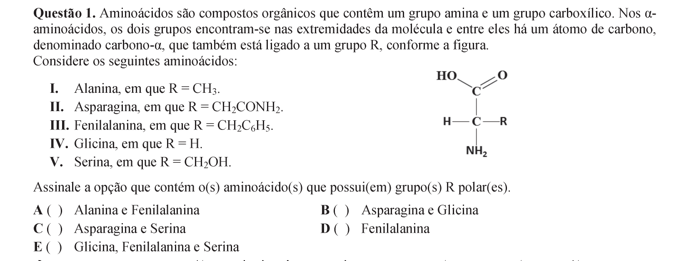

## Q02
**Assunto:** atomística
**Competências:** energia de orbitais atômicos, comparação 2s e 2p, átomo de hidrogênio, íons hidrogenoides
**Tipo:** múltipla escolha

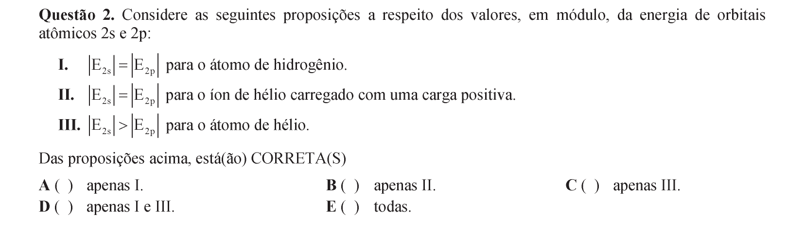

## Q03
**Assunto:** ligações químicas
**Competências:** forças intermoleculares, polaridade molecular, ponto de ebulição, pressão de vapor
**Tipo:** múltipla escolha

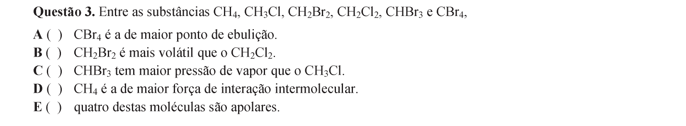

## Q04
**Assunto:** química orgânica
**Competências:** isomeria estrutural, alcenos, éteres, aromáticos
**Tipo:** múltipla escolha

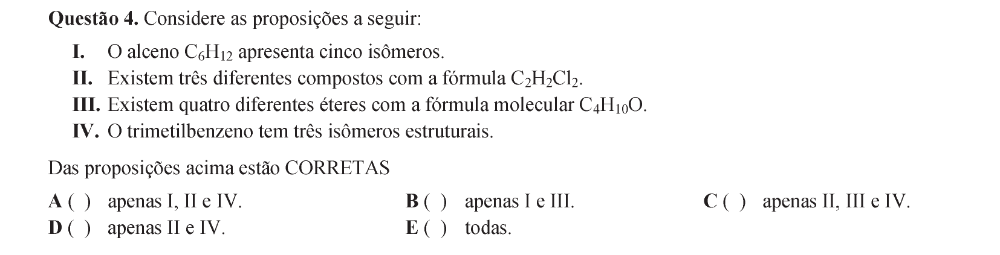

## Q05
**Assunto:** gases
**Competências:** lei das pressões parciais, equação de Clapeyron, mistura gasosa, cálculo de massa
**Tipo:** múltipla escolha

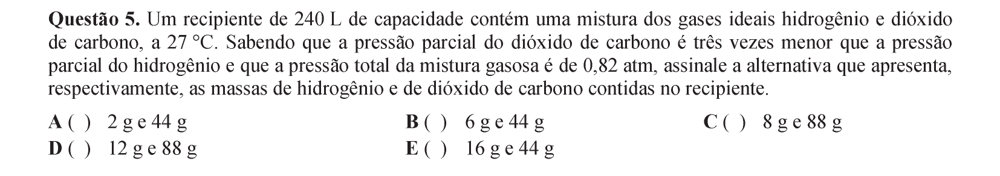

## Q06
**Assunto:** termoquímica
**Competências:** energia do fóton, relação E=hf, calor sensível, conversão energia-radiação
**Tipo:** múltipla escolha

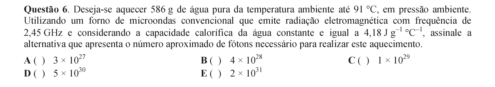

## Q07
**Assunto:** gases
**Competências:** lei combinada dos gases, pressões parciais, conversão de unidades, mistura gasosa
**Tipo:** múltipla escolha

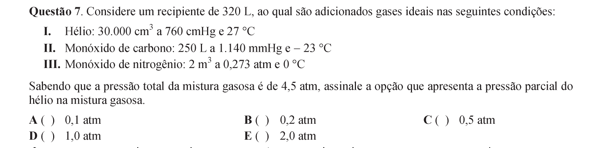

## Q08
**Assunto:** cinética química
**Competências:** etapa elementar, mecanismo de reação, molecularidade, fotoquímica
**Tipo:** múltipla escolha

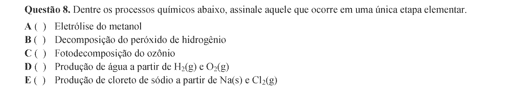

## Q09
**Assunto:** radioatividade
**Competências:** massa crítica, reação em cadeia, fissão nuclear, série de decaimento
**Tipo:** múltipla escolha

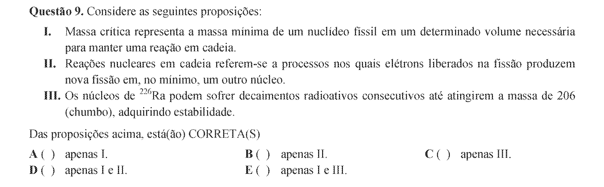

## Q10
**Assunto:** química orgânica
**Competências:** biocombustíveis, biodiesel, fermentação, ácidos graxos
**Tipo:** múltipla escolha

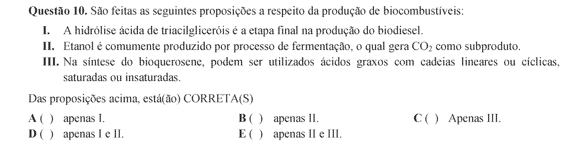

## Q11
**Assunto:** química orgânica
**Competências:** petróleo, destilação fracionada, craqueamento térmico e catalítico, petroquímica
**Tipo:** múltipla escolha

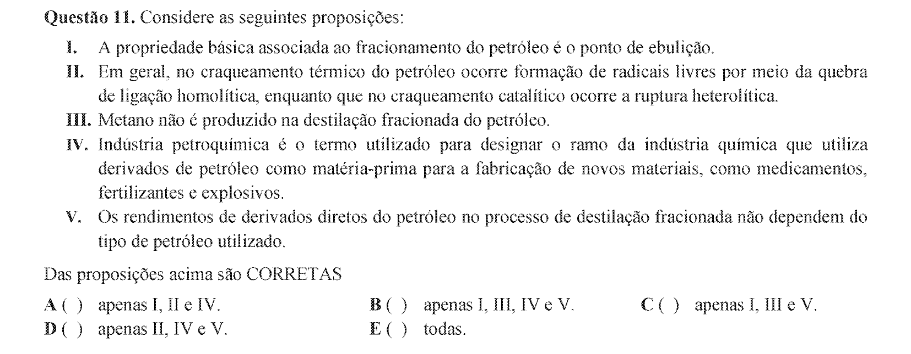

## Q12
**Assunto:** química orgânica
**Competências:** reação de adição em alceno, regra de Markovnikov, rearranjo de carbocátion, oxidação de álcool
**Tipo:** múltipla escolha

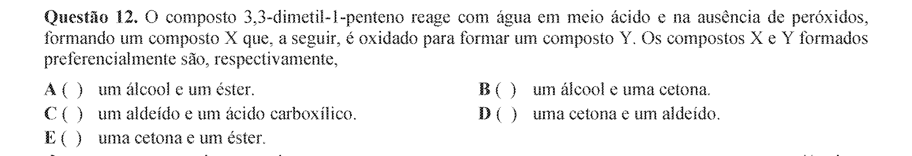

## Q13
**Assunto:** termoquímica
**Competências:** equilíbrio térmico, variação de entalpia, energia interna, variação de entropia
**Tipo:** múltipla escolha

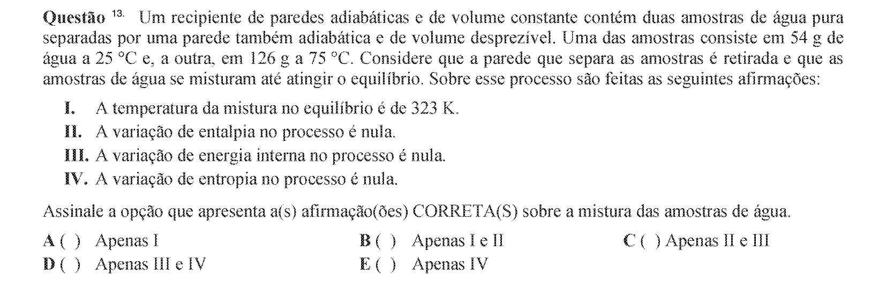

## Q14
**Assunto:** propriedades coligativas
**Competências:** pressão osmótica, criometria, ebuliometria, tonometria
**Tipo:** múltipla escolha

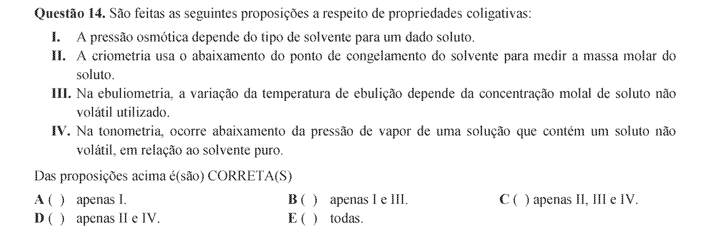

## Q15
**Assunto:** química analítica
**Competências:** separação de cátions, marcha analítica, cloretos insolúveis, precipitação seletiva
**Tipo:** múltipla escolha

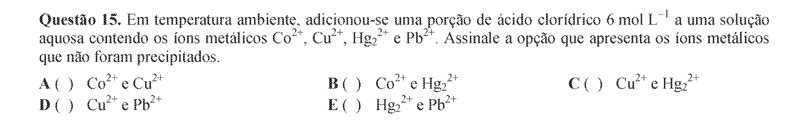

## Q16
**Assunto:** equilíbrio iônico
**Competências:** constantes Ka e Kb, hidrólise, cálculo de pH, ácidos e bases fracos
**Tipo:** múltipla escolha

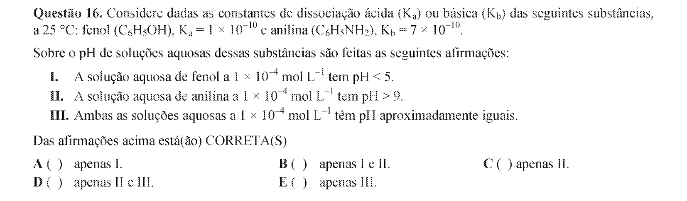

## Q17
**Assunto:** ácidos e bases
**Competências:** indicadores de pH, equilíbrio ácido-base, estrutura de indicadores, tampão
**Tipo:** múltipla escolha

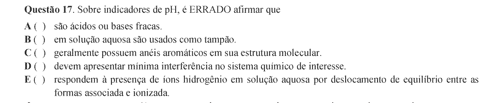

## Q18
**Assunto:** eletroquímica
**Competências:** célula a combustível, potencial padrão, semirreações de oxirredução, trabalho elétrico
**Tipo:** múltipla escolha

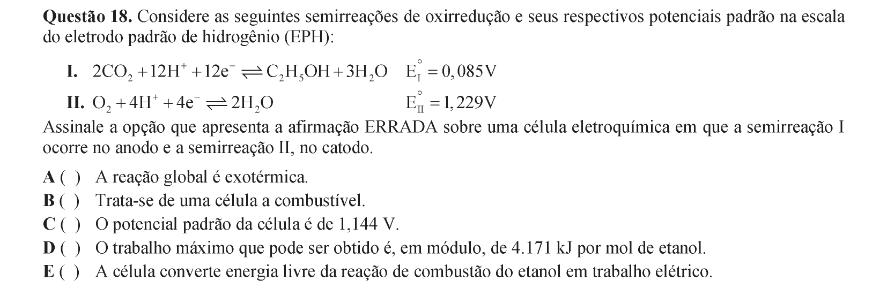

## Q19
**Assunto:** termoquímica
**Competências:** entalpia de combustão, lei de Hess, mistura combustível, equação linear da entalpia
**Tipo:** múltipla escolha

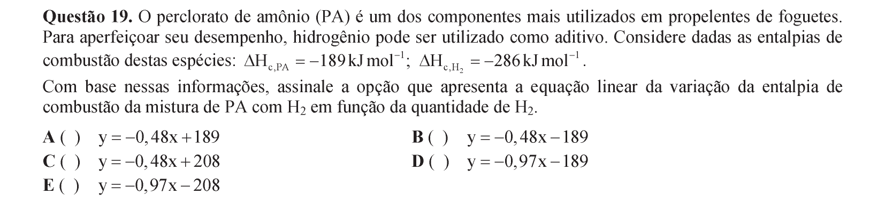

## Q20
**Assunto:** atomística
**Competências:** corpo negro, lei de Wien, radiação térmica, comprimento de onda de máxima emissão
**Tipo:** múltipla escolha

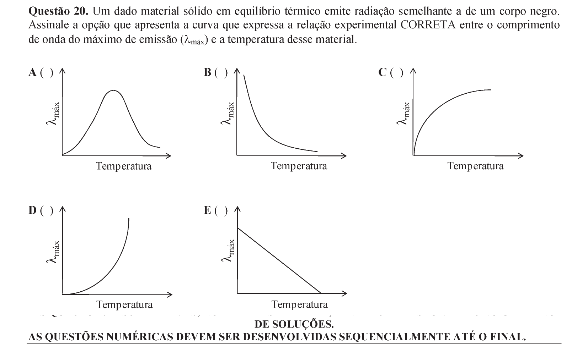

## Q21
**Assunto:** estequiometria
**Competências:** reações de precipitação, balanceamento, dissolução com ácido, cálculo de massa em mistura
**Tipo:** discursiva

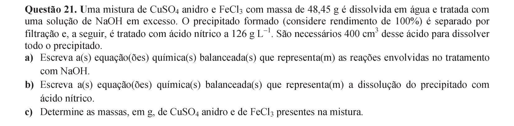

## Q22
**Assunto:** reações inorgânicas
**Competências:** processo Solvay, decomposição térmica, reações ácido-base, identificação de espécies
**Tipo:** discursiva

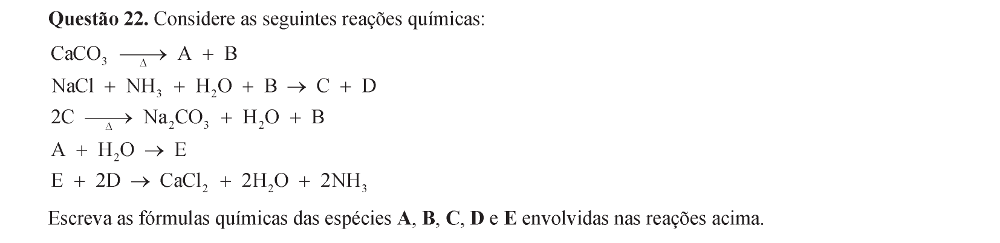

## Q23
**Assunto:** equilíbrio iônico
**Competências:** titulação ácido-base, curva de titulação, equilíbrios sucessivos, equação global
**Tipo:** discursiva

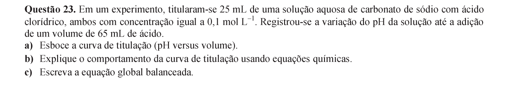

## Q24
**Assunto:** eletroquímica
**Competências:** célula galvânica, eletrólise, potencial padrão, semirreações anódica e catódica
**Tipo:** discursiva

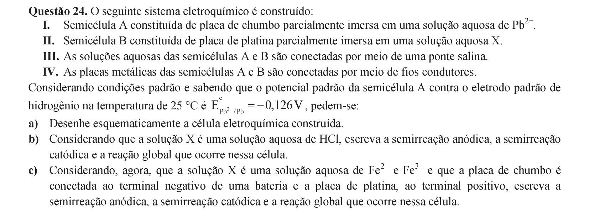

## Q25
**Assunto:** química orgânica
**Competências:** polimerização por adição, copolimerização, fórmulas estruturais, monômeros vinílicos
**Tipo:** discursiva

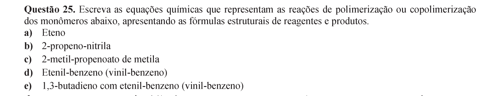

## Q26
**Assunto:** termoquímica
**Competências:** equação de van der Waals, calorimetria a volume constante, capacidade calorífica, lei de Hess
**Tipo:** discursiva

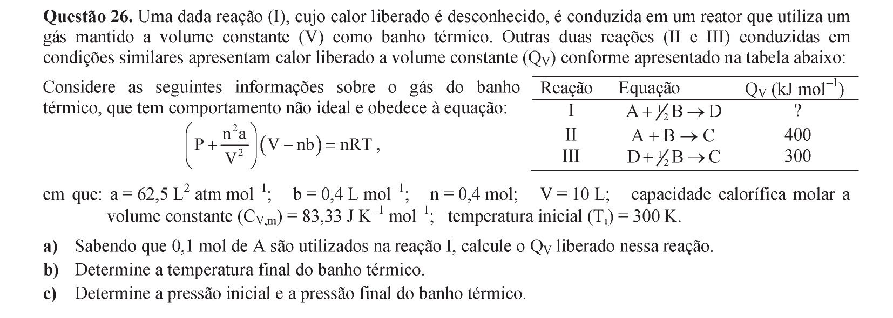

## Q27
**Assunto:** estados da matéria
**Competências:** dispersões coloidais, dispergente e disperso, espuma, aerossol
**Tipo:** discursiva

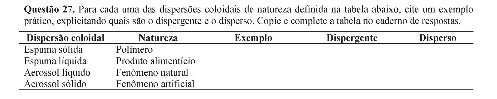

## Q28
**Assunto:** cinética química
**Competências:** equação de Arrhenius, lei de velocidade de 2ª ordem, relação cinética-equilíbrio, fator pré-exponencial
**Tipo:** discursiva

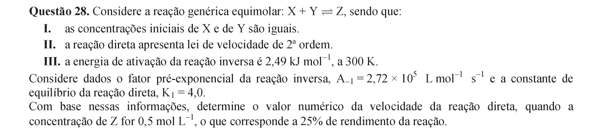

## Q29
**Assunto:** eletroquímica
**Competências:** deslocamento metálico, formação de liga metálica, difusão atômica, latão
**Tipo:** discursiva

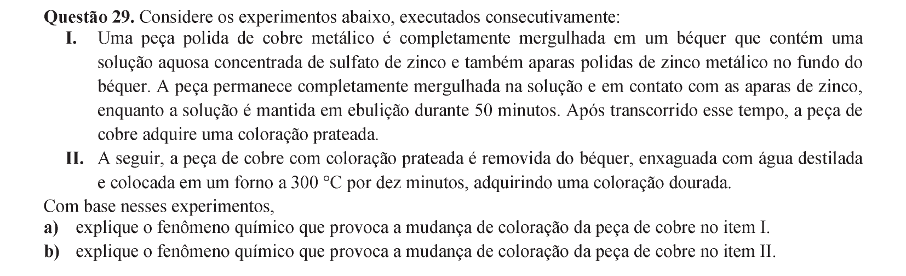

## Q30
**Assunto:** radioatividade
**Competências:** combustão de organometálico, decaimento radioativo, meia-vida, datação radiométrica
**Tipo:** discursiva

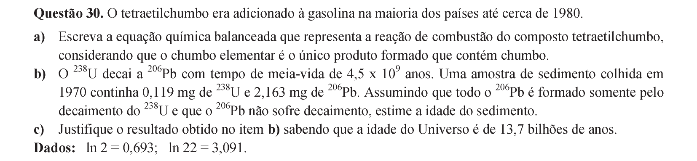
