# Química — ITA 2019 (1ª fase)

> 12 questões múltipla escolha.

## Q49
**Assunto:** química orgânica, propriedades coligativas
**Competências:** ponto de ebulição; interações intermoleculares
**Tipo:** múltipla escolha

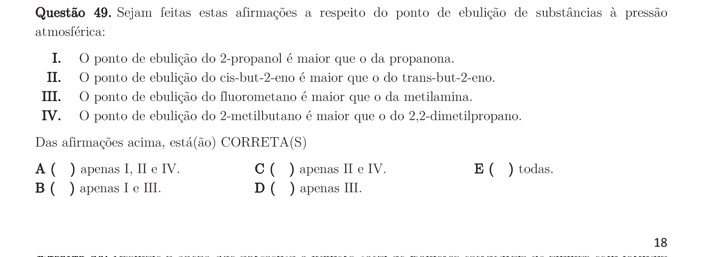

## Q50
**Assunto:** química orgânica
**Competências:** isômeros estruturais de aminas
**Tipo:** múltipla escolha

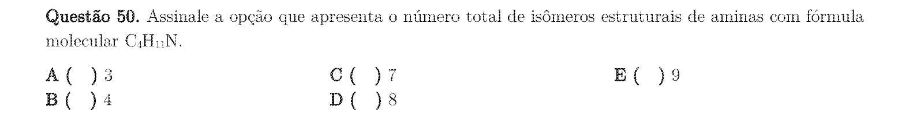

## Q51
**Assunto:** cinética química, reações inorgânicas
**Competências:** retardantes de chama; fenômenos físico-químicos
**Tipo:** múltipla escolha

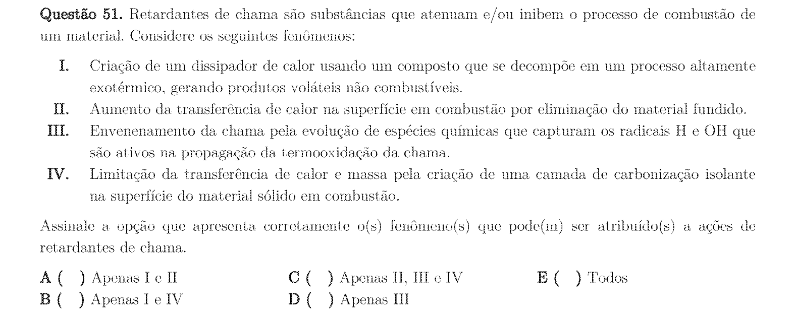

## Q52
**Assunto:** atomística, radioatividade
**Competências:** níveis de energia do hidrogênio atômico; transições eletrônicas
**Tipo:** múltipla escolha

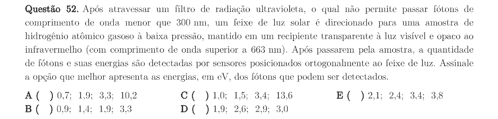

## Q53
**Assunto:** eletroquímica
**Competências:** corrosão; proteção catódica; pilha
**Tipo:** múltipla escolha

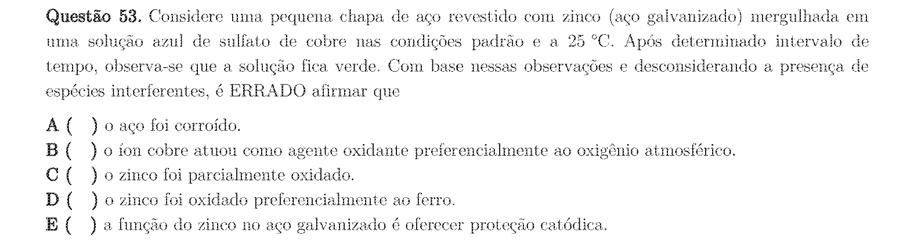

## Q54
**Assunto:** equilíbrio iônico, ácidos e bases
**Competências:** indicador ácido-base; constante de dissociação; variação de pH
**Tipo:** múltipla escolha

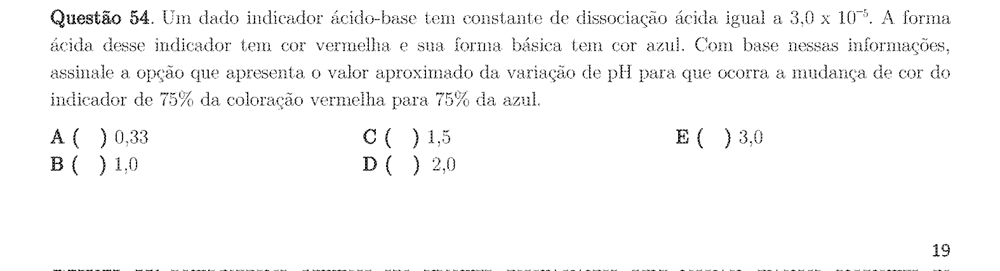

## Q55
**Assunto:** cinética química, química analítica
**Competências:** computadores químicos; conceitos de mecanismos reacionais
**Tipo:** múltipla escolha

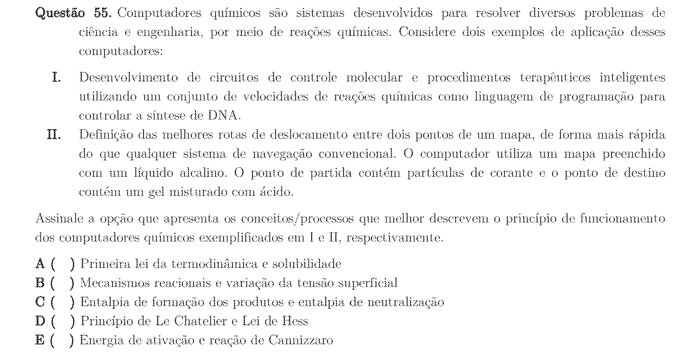

## Q56
**Assunto:** atomística, tabela periódica, ligações químicas, geometria molecular
**Competências:** configuração eletrônica; energia de ligação; geometria
**Tipo:** múltipla escolha

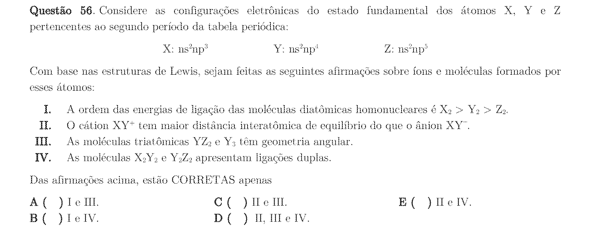

## Q57
**Assunto:** radioatividade
**Competências:** decaimento radioativo; reações nucleares; cobalto
**Tipo:** múltipla escolha

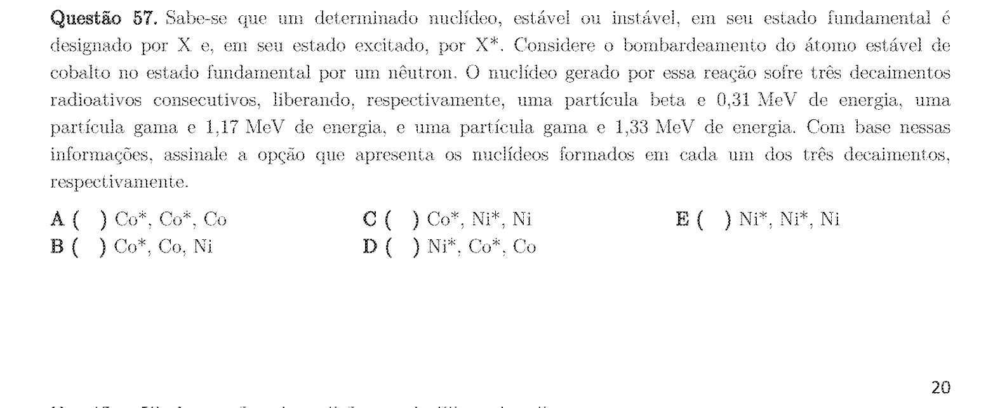

## Q58
**Assunto:** química orgânica, cinética química, termoquímica
**Competências:** adição a dienos conjugados; controle cinético vs. termodinâmico
**Tipo:** múltipla escolha

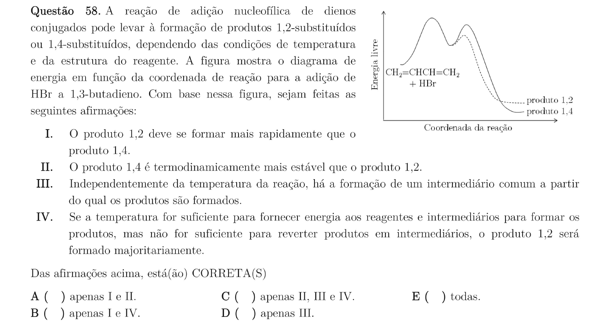

## Q59
**Assunto:** atomística, química analítica
**Competências:** espectroscopia de massa; isótopos do bromo; abundâncias
**Tipo:** múltipla escolha

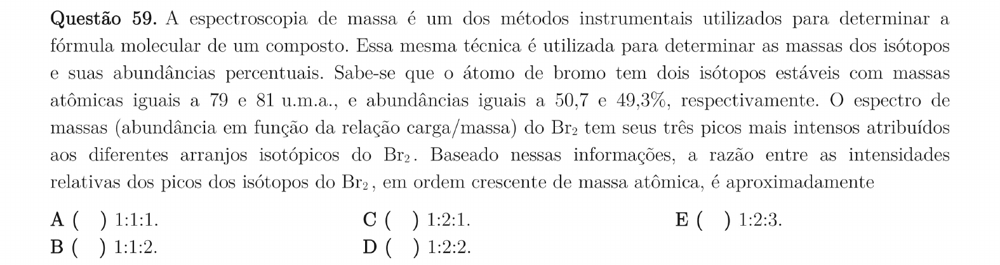

## Q60
**Assunto:** estequiometria, gases, química orgânica
**Competências:** mistura gasosa; conversão de carbonos em butadieno; massa
**Tipo:** múltipla escolha

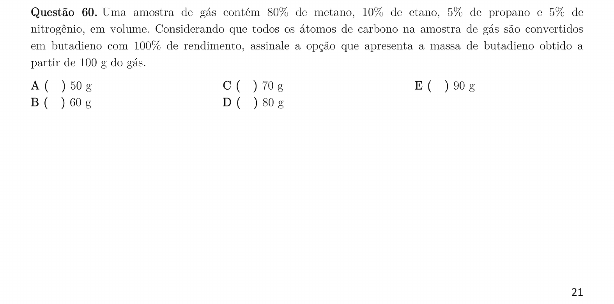
