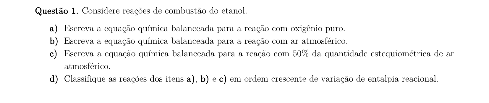
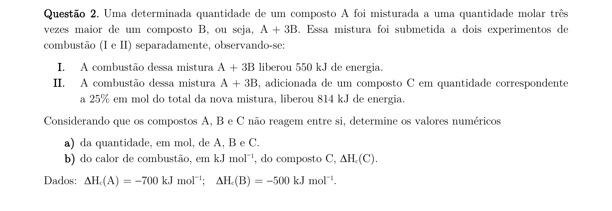
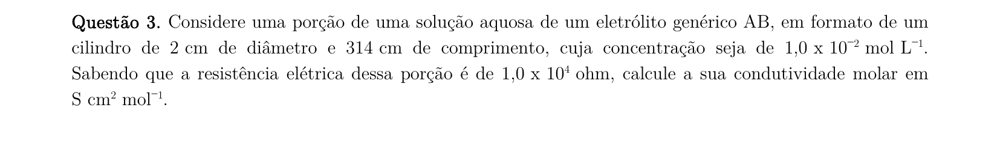
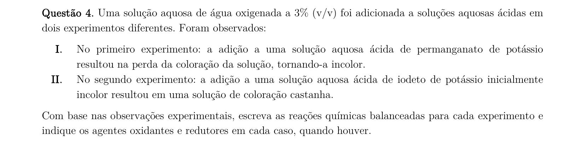
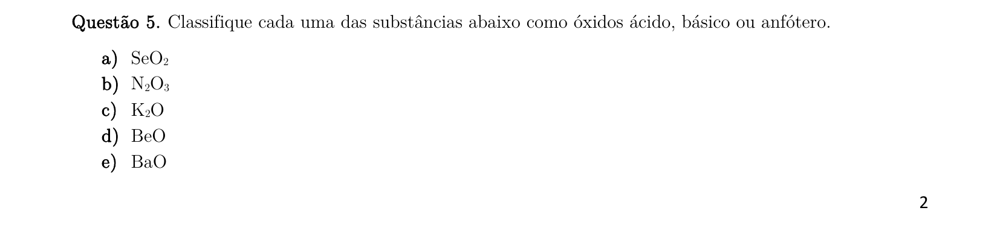
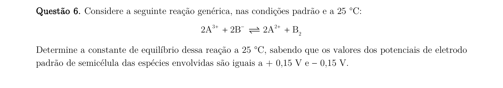
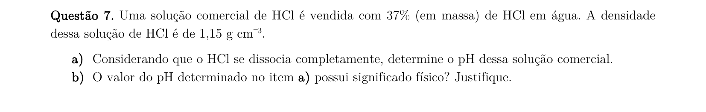
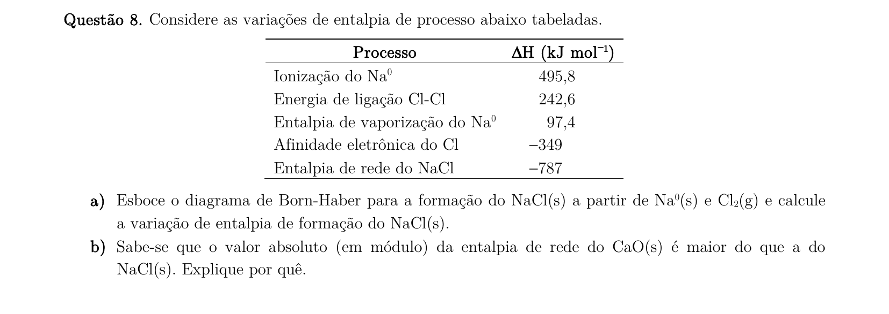
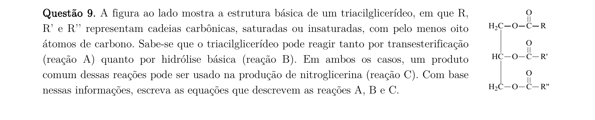
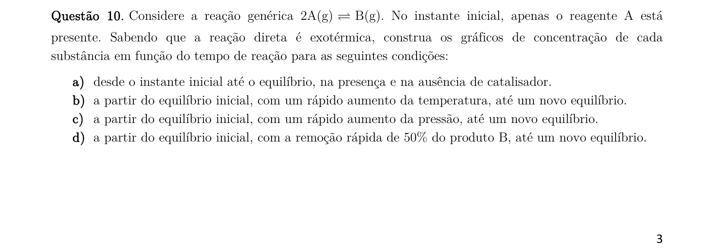

# Química — ITA 2019 (2ª fase)

> 10 questões discursivas.

## Q01
**Assunto:** termoquímica
**Competências:** combustão, balanceamento de equações, combustão completa/incompleta, variação de entalpia, ordenação de processos exotérmicos
**Tipo:** discursiva

## Q02
**Assunto:** termoquímica
**Competências:** calor de combustão, sistemas de equações, estequiometria de mistura, conservação de energia, ΔH de reação
**Tipo:** discursiva

## Q03
**Assunto:** eletroquímica
**Competências:** condutividade elétrica, resistência e resistividade, geometria de condutor cilíndrico, condutividade molar, conversão de unidades
**Tipo:** discursiva

## Q04
**Assunto:** reações inorgânicas
**Competências:** reações de oxirredução, balanceamento redox, identificação de agentes oxidantes/redutores, química do peróxido de hidrogênio, semirreações
**Tipo:** discursiva

## Q05
**Assunto:** óxidos
**Competências:** classificação de óxidos, óxidos ácidos, óxidos básicos, óxidos anfóteros, caráter periódico
**Tipo:** discursiva

## Q06
**Assunto:** eletroquímica
**Competências:** potenciais padrão de eletrodo, equação de Nernst, relação ΔG e K, ddp de pilha, constante de equilíbrio
**Tipo:** discursiva

## Q07
**Assunto:** equilíbrio iônico
**Competências:** cálculo de concentração molar a partir de densidade e %, pH de ácido forte, dissociação completa, limitações do conceito de pH em soluções concentradas, atividade iônica
**Tipo:** discursiva

## Q08
**Assunto:** ligações químicas
**Competências:** ciclo de Born-Haber, energia de rede, entalpia de formação, lei de Hess, comparação de energia reticular (carga e raio iônico)
**Tipo:** discursiva

## Q09
**Assunto:** química orgânica
**Competências:** triacilglicerídeos, transesterificação, hidrólise básica (saponificação), reação de esterificação com ácido nítrico, equações orgânicas balanceadas
**Tipo:** discursiva

## Q10
**Assunto:** equilíbrio químico
**Competências:** princípio de Le Chatelier, efeito do catalisador, efeito da temperatura em reação exotérmica, efeito da pressão, gráficos concentração vs. tempo
**Tipo:** discursiva

