# Química — ITA 2020 (1ª fase)

> 15 questões múltipla escolha.

## Q56
**Assunto:** química orgânica, acidez
**Competências:** força ácida de ácidos carboxílicos, fenóis; tautomeria de alcinos
**Tipo:** múltipla escolha

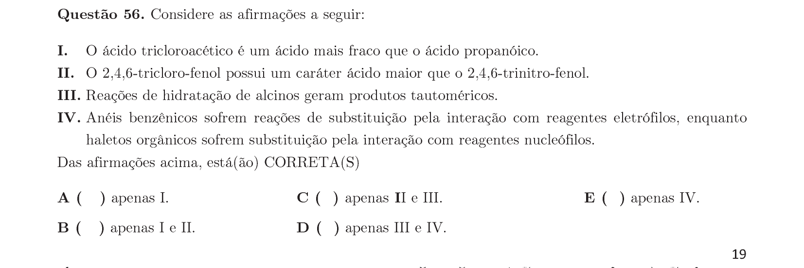

## Q57
**Assunto:** eletroquímica
**Competências:** bateria de fluxo H2/Br2; potenciais-padrão; estabilidade do solvente
**Tipo:** múltipla escolha

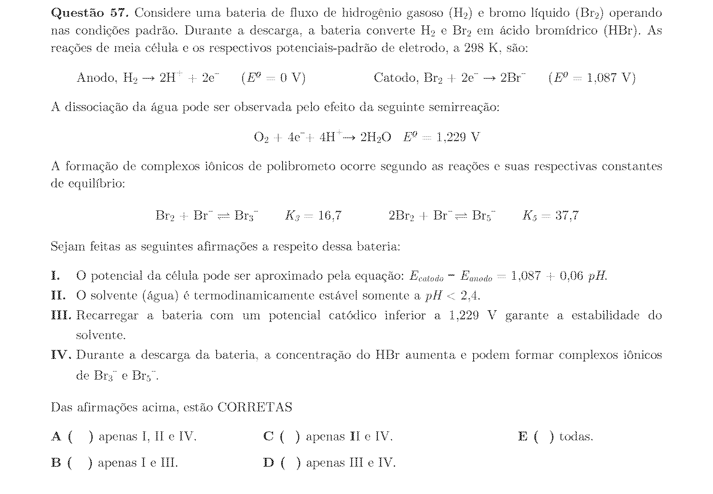

## Q58
**Assunto:** equilíbrio químico, cinética
**Competências:** processo Haber-Bosch; efeito de pressão, catalisador e temperatura
**Tipo:** múltipla escolha

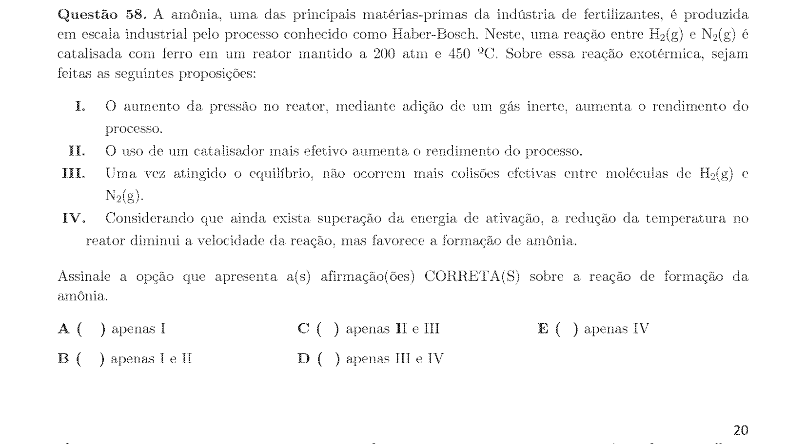

## Q59
**Assunto:** combustão, química orgânica
**Competências:** combustão de parafina; difusão de O2; estrutura da chama
**Tipo:** múltipla escolha

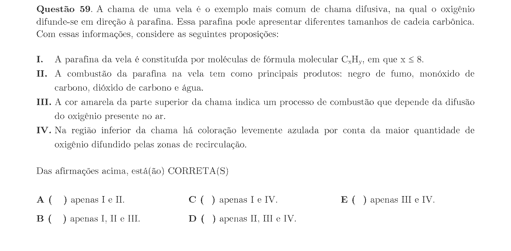

## Q60
**Assunto:** estequiometria, oxirredução
**Competências:** balanceamento de reação redox; soma dos coeficientes
**Tipo:** múltipla escolha

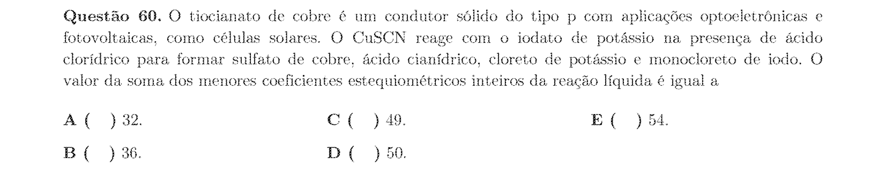

## Q61
**Assunto:** equilíbrio iônico, soluções
**Competências:** mistura de ácido forte e base forte; cálculo de [H3O+]
**Tipo:** múltipla escolha

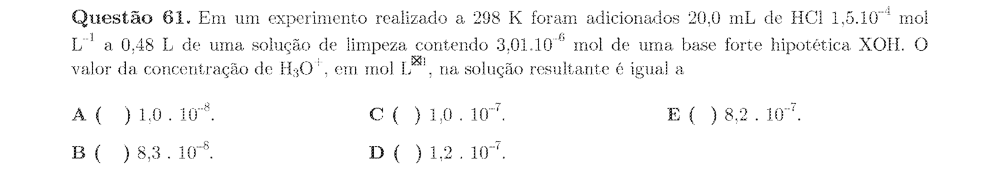

## Q62
**Assunto:** estequiometria, gases ideais
**Competências:** reação em fase gasosa; pressões parciais; massas iniciais
**Tipo:** múltipla escolha

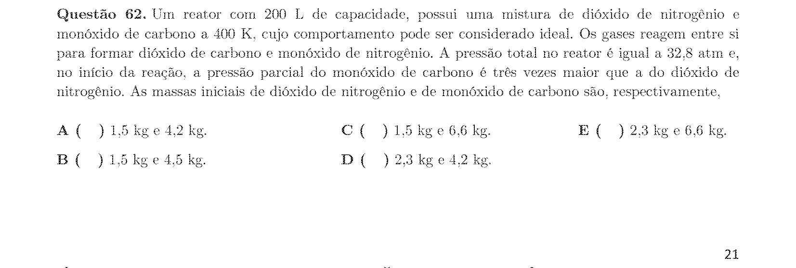

## Q63
**Assunto:** química orgânica, polímeros
**Competências:** polímeros naturais e sintéticos; condensação; estrutura de proteínas
**Tipo:** múltipla escolha

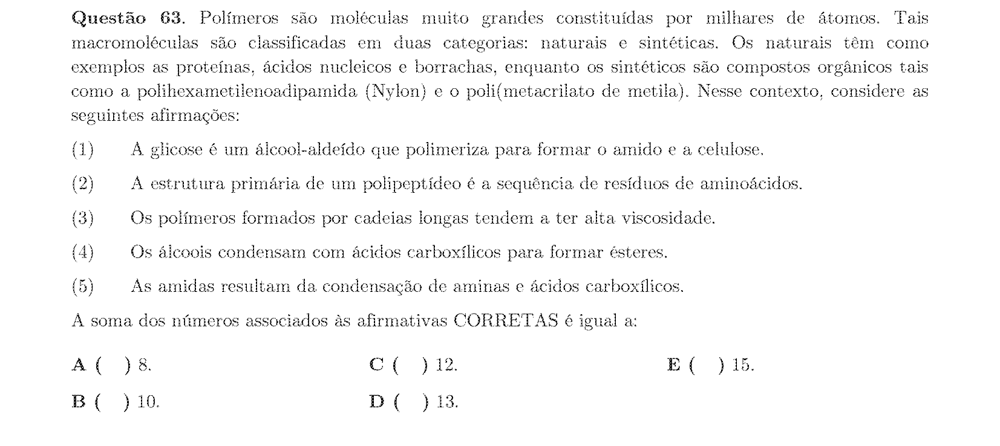

## Q64
**Assunto:** equilíbrio iônico, hidrólise
**Competências:** hidrólise salina; caráter ácido/básico de soluções
**Tipo:** múltipla escolha

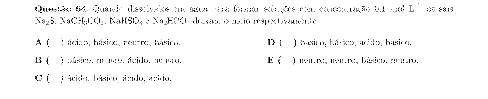

## Q65
**Assunto:** estequiometria, combustão
**Competências:** razão mássica combustível/O2 em combustão completa
**Tipo:** múltipla escolha

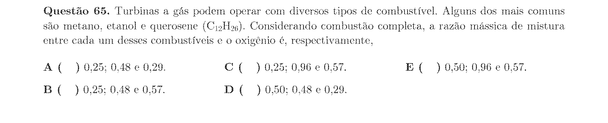

## Q66
**Assunto:** propriedades físicas, ligações
**Competências:** líquidos iônicos; ponto de fusão; pressão de vapor
**Tipo:** múltipla escolha

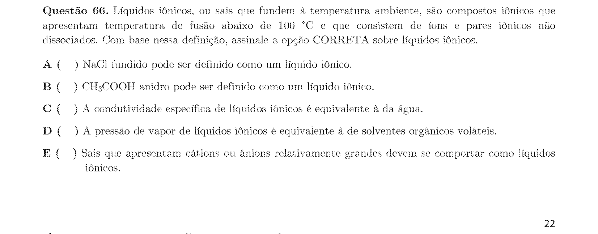

## Q67
**Assunto:** química orgânica, oxirredução
**Competências:** classificação de reações orgânicas como oxidação/redução
**Tipo:** múltipla escolha

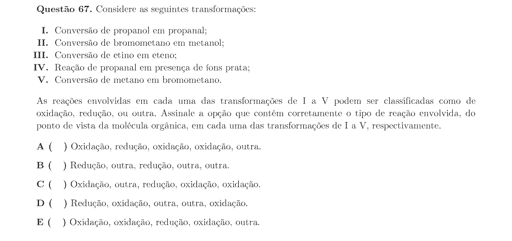

## Q68
**Assunto:** estequiometria, combustão
**Competências:** combustão completa de alcano; razão ar/combustível
**Tipo:** múltipla escolha

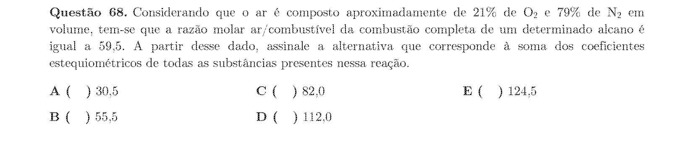

## Q69
**Assunto:** equilíbrio químico, soluções
**Competências:** lei de Henry; dissolução de CO2 na água; pH atmosférico
**Tipo:** múltipla escolha

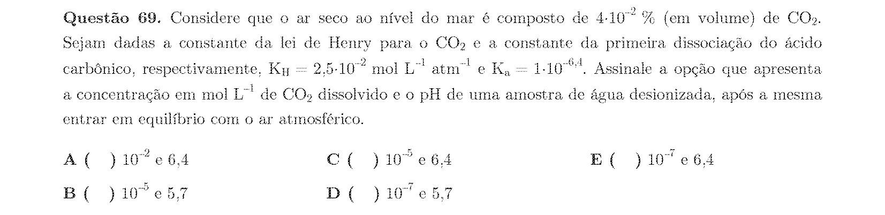

## Q70
**Assunto:** química inorgânica, reações de precipitação
**Competências:** reações de prata; identificação de sólidos formados
**Tipo:** múltipla escolha

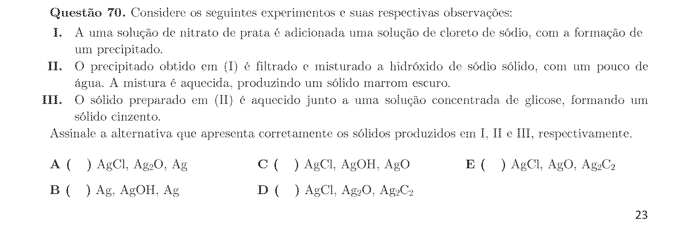
