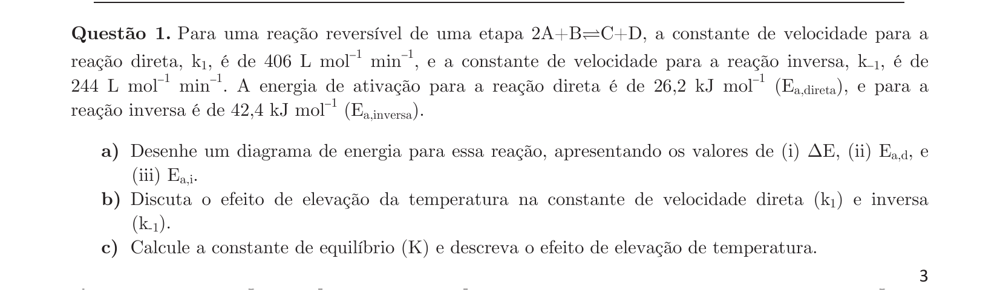
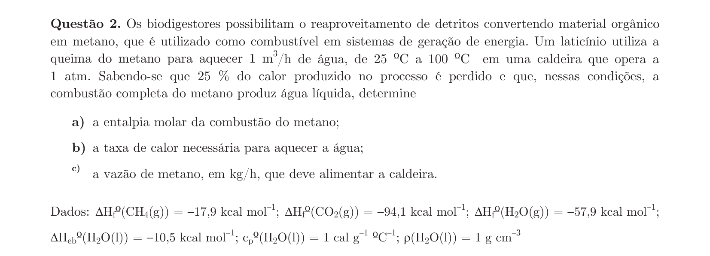
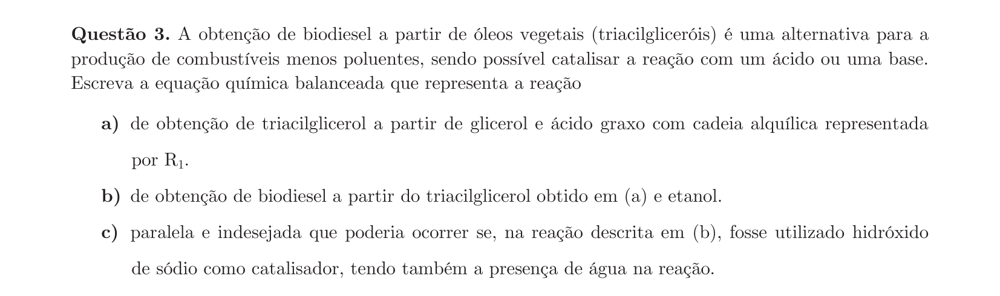
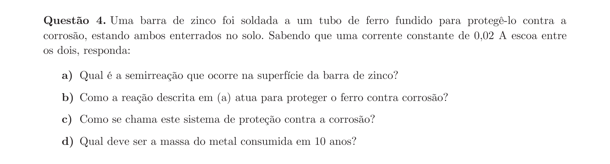
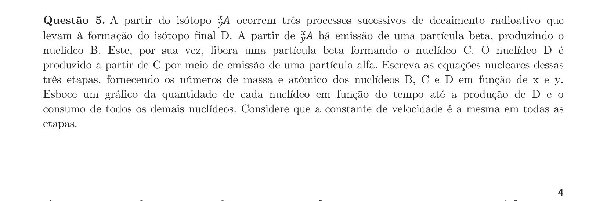
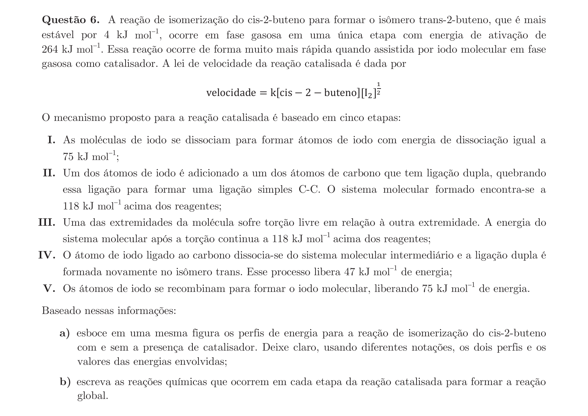
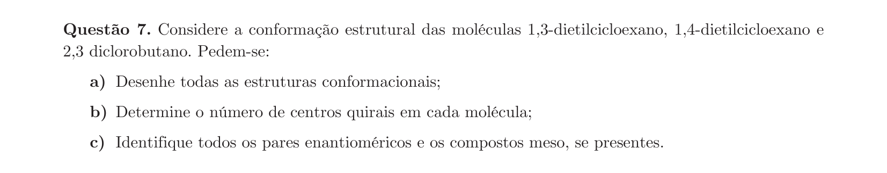
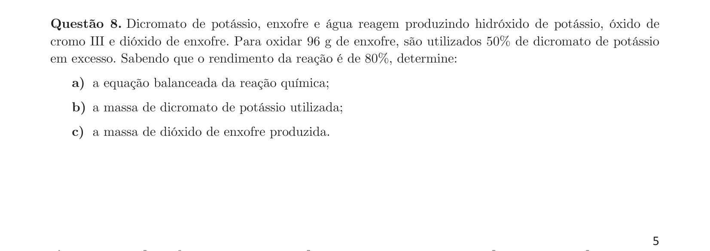
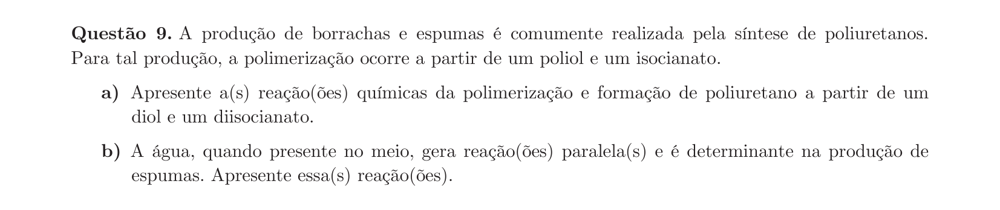
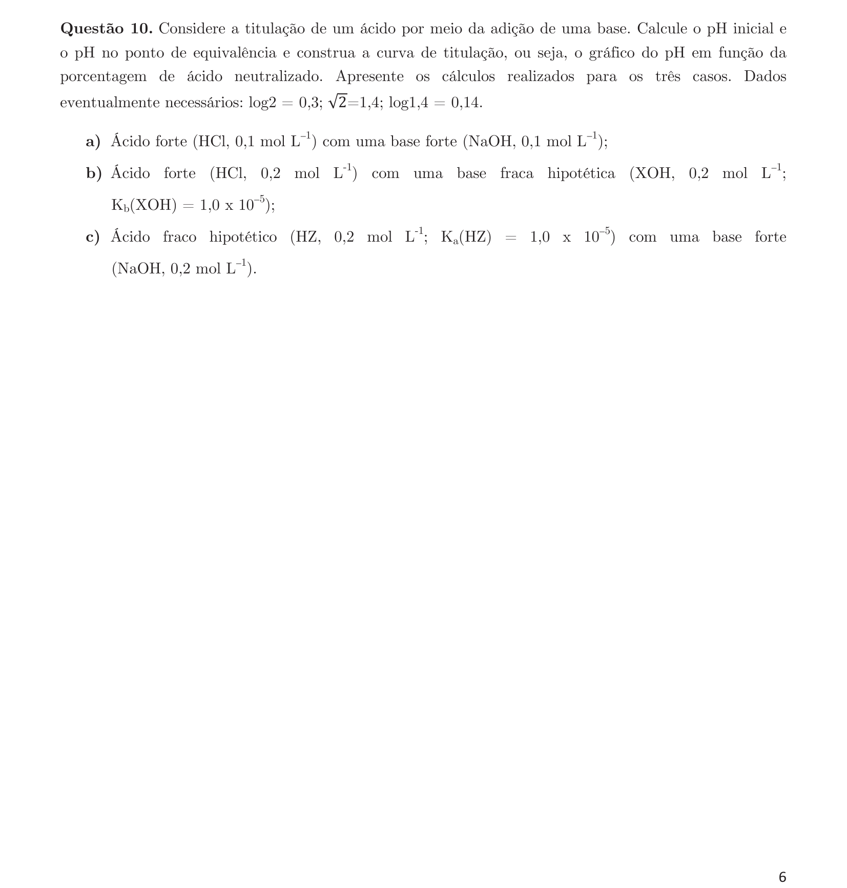

# Química — ITA 2020 (2ª fase)

> 10 questões discursivas.

## Q01
**Assunto:** cinética química, equilíbrio químico
**Competências:** diagrama de energia, energia de ativação, efeito da temperatura nas constantes de velocidade, cálculo de Keq
**Tipo:** discursiva

## Q02
**Assunto:** termoquímica, estequiometria
**Competências:** entalpia de combustão, lei de Hess, calor sensível, vazão mássica
**Tipo:** discursiva

## Q03
**Assunto:** química orgânica
**Competências:** esterificação, transesterificação, saponificação, biodiesel
**Tipo:** discursiva

## Q04
**Assunto:** eletroquímica
**Competências:** proteção catódica, semirreações, leis de Faraday, eletrólise
**Tipo:** discursiva

## Q05
**Assunto:** radioatividade, cinética química
**Competências:** decaimento alfa e beta, equações nucleares, cinética de séries radioativas
**Tipo:** discursiva

## Q06
**Assunto:** cinética química, química orgânica
**Competências:** mecanismo de reação, catálise, perfil de energia, isomerização cis-trans
**Tipo:** discursiva

## Q07
**Assunto:** química orgânica
**Competências:** estereoquímica, conformações, centros quirais, enantiômeros, compostos meso
**Tipo:** discursiva

## Q08
**Assunto:** estequiometria, reações inorgânicas
**Competências:** balanceamento redox, reagente em excesso, rendimento
**Tipo:** discursiva

## Q09
**Assunto:** química orgânica
**Competências:** polimerização por adição, poliuretanos, reações de isocianatos
**Tipo:** discursiva

## Q10
**Assunto:** equilíbrio iônico, ácidos e bases
**Competências:** curva de titulação, pH de ácido/base forte e fraco, hidrólise salina
**Tipo:** discursiva

