# Química — ITA 2021 (1ª fase)

> 15 questões múltipla escolha.

## Q56
**Assunto:** interações intermoleculares
**Competências:** tensão superficial, viscosidade, capilaridade, isomeria cis-trans
**Tipo:** múltipla escolha

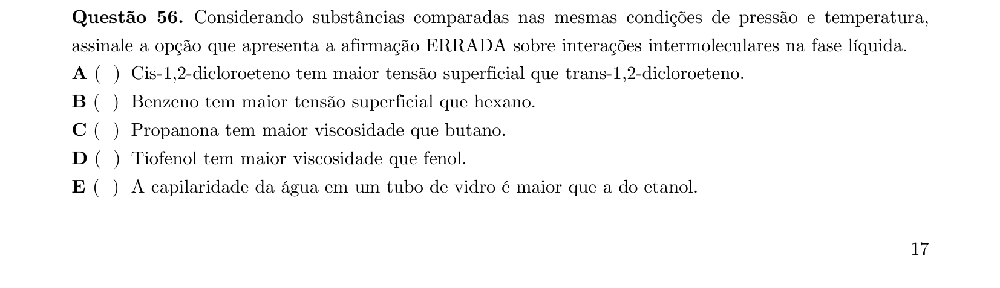

## Q57
**Assunto:** eletroquímica
**Competências:** bateria chumbo-ácido, potenciais de eletrodo, eletrólise da água, equilíbrio termodinâmico
**Tipo:** múltipla escolha

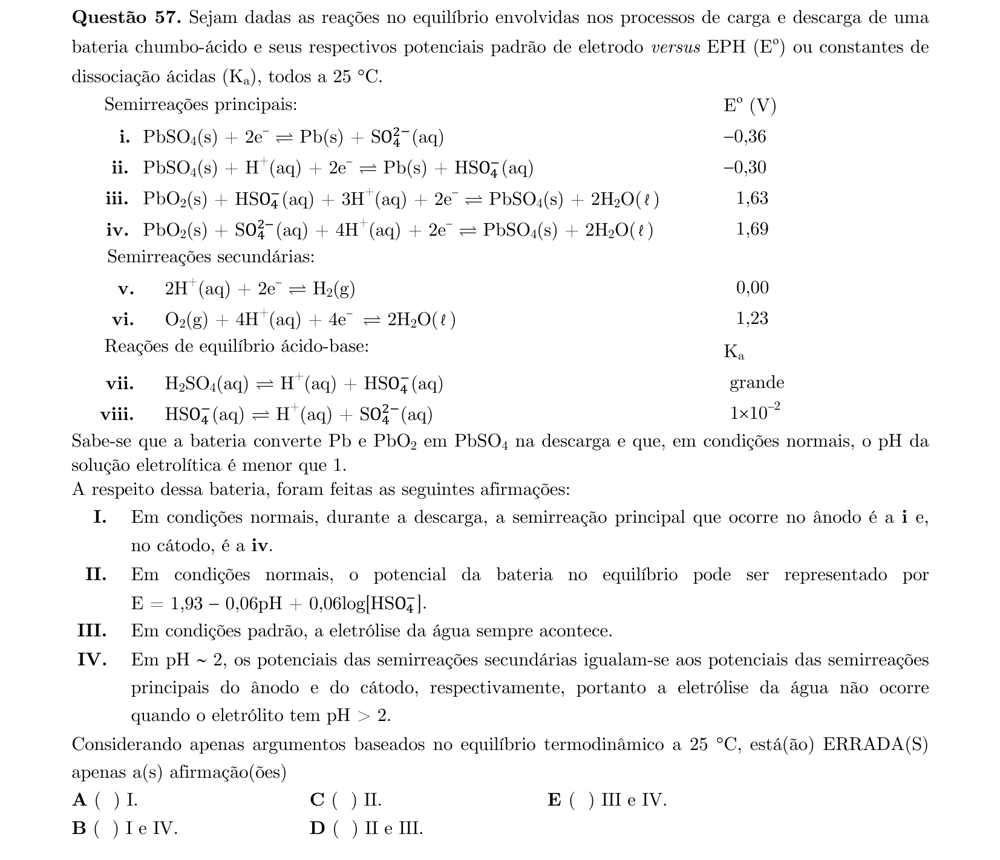

## Q58
**Assunto:** química orgânica
**Competências:** isomeria estrutural, polimerização, atividade óptica, reações de substituição/adição
**Tipo:** múltipla escolha

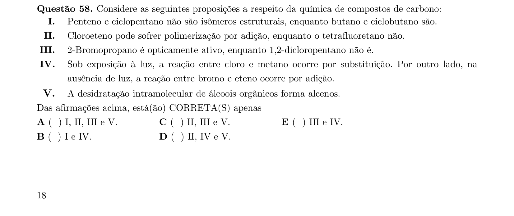

## Q59
**Assunto:** cinética química
**Competências:** lei de velocidade, determinação de ordem de reação e constante k
**Tipo:** múltipla escolha

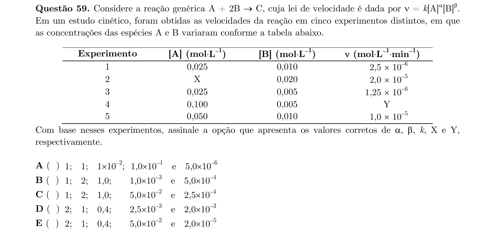

## Q60
**Assunto:** ligações químicas
**Competências:** comprimento e energia de ligação, cargas formais, polarização, ressonância
**Tipo:** múltipla escolha

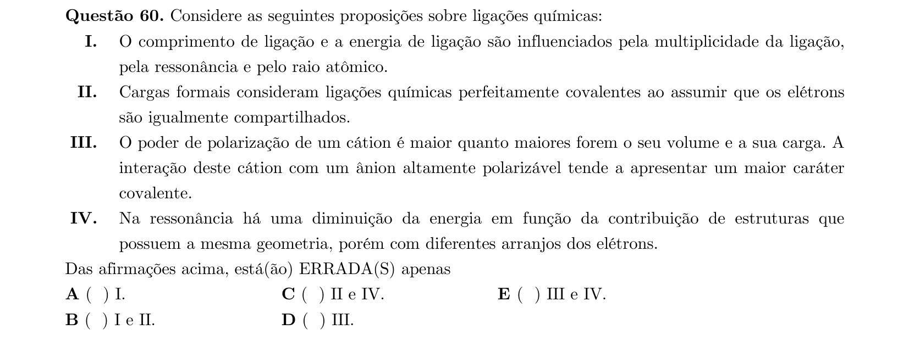

## Q61
**Assunto:** soluções, condutividade
**Competências:** condutividade molar, soluções iônicas, relação massa molar/concentração
**Tipo:** múltipla escolha

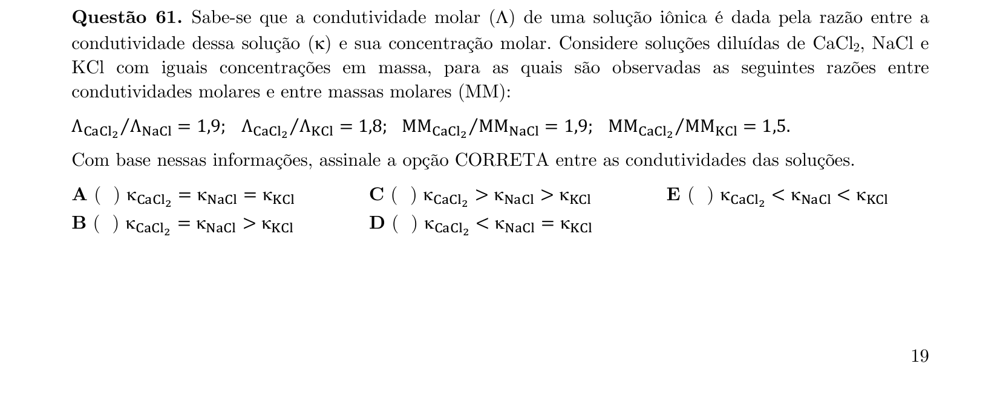

## Q62
**Assunto:** análise térmica, estequiometria
**Competências:** TGA do oxalato de cálcio mono-hidratado, etapas de decomposição
**Tipo:** múltipla escolha

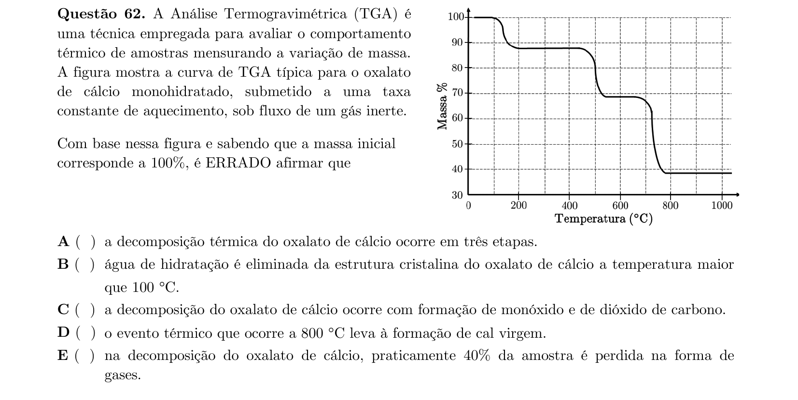

## Q63
**Assunto:** termodinâmica
**Competências:** entropia, ciclo de Carnot, processos reversíveis, energia interna
**Tipo:** múltipla escolha

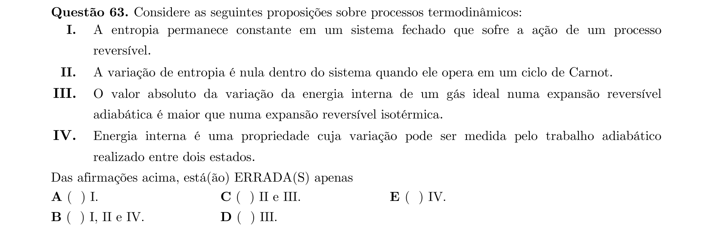

## Q64
**Assunto:** forças intermoleculares, fases condensadas
**Competências:** pontos de fusão, pressão de vapor, energia de interação íon-dipolo
**Tipo:** múltipla escolha

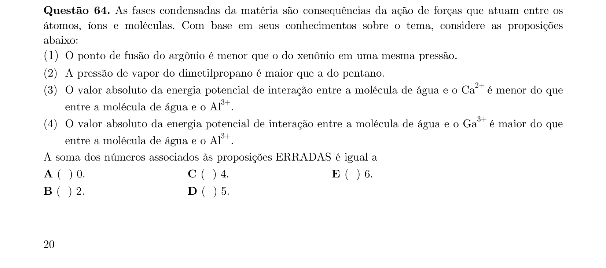

## Q65
**Assunto:** estrutura atômica
**Competências:** radiação eletromagnética, números quânticos, configuração eletrônica, relação diagonal
**Tipo:** múltipla escolha

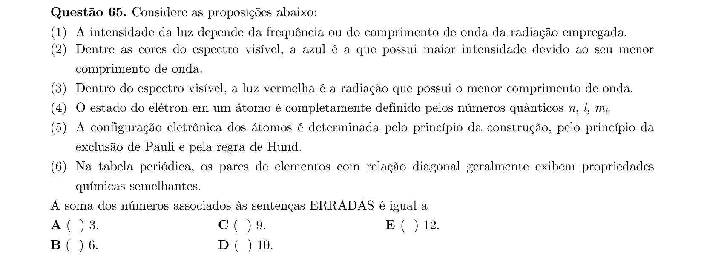

## Q66
**Assunto:** estequiometria, oxirredução
**Competências:** titulação Fe(II)/permanganato, balanceamento redox, mols de elétrons
**Tipo:** múltipla escolha

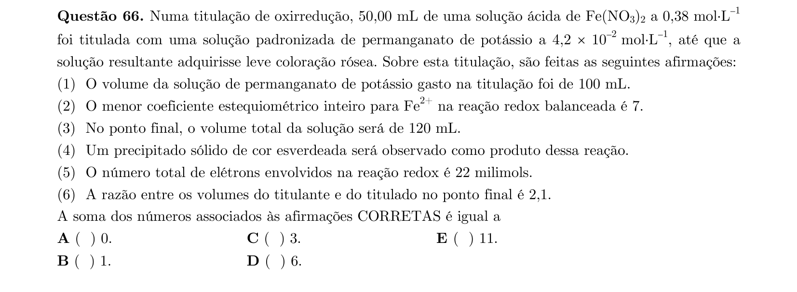

## Q67
**Assunto:** eletroquímica, corrosão
**Competências:** processos de oxidação-redução, proteção catódica, ânodo de sacrifício
**Tipo:** múltipla escolha

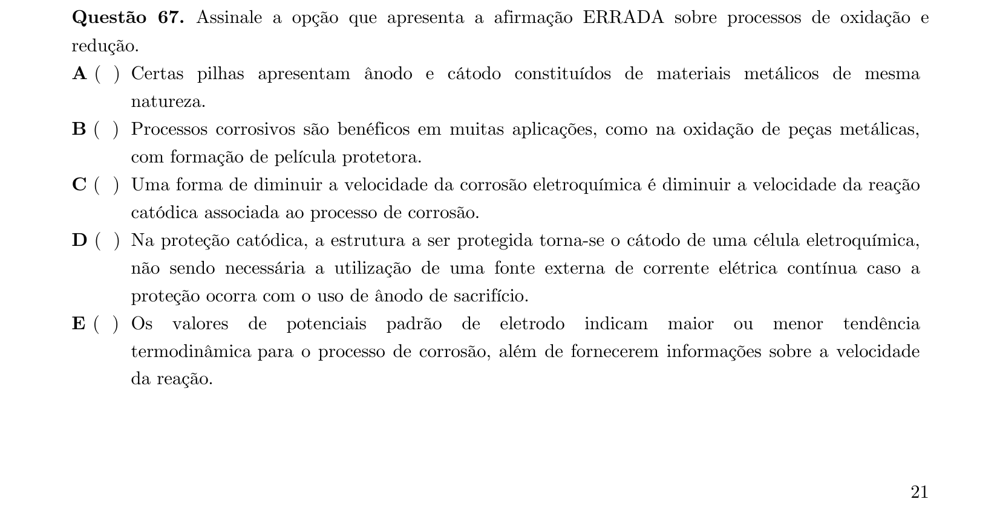

## Q68
**Assunto:** química orgânica, ácidos e bases
**Competências:** basicidade de ânions e aminas, efeitos eletrônicos
**Tipo:** múltipla escolha

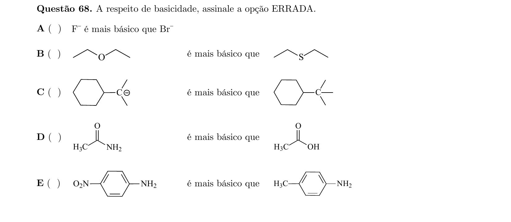

## Q69
**Assunto:** geometria molecular
**Competências:** VSEPR, ângulos F-Y-F em SF4, ClF3, XeF (XeF2/XeF4)
**Tipo:** múltipla escolha

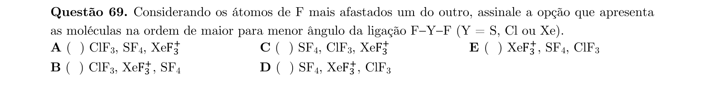

## Q70
**Assunto:** soluções, solubilidade
**Competências:** análise de curvas de solubilidade, saturação, precipitação
**Tipo:** múltipla escolha

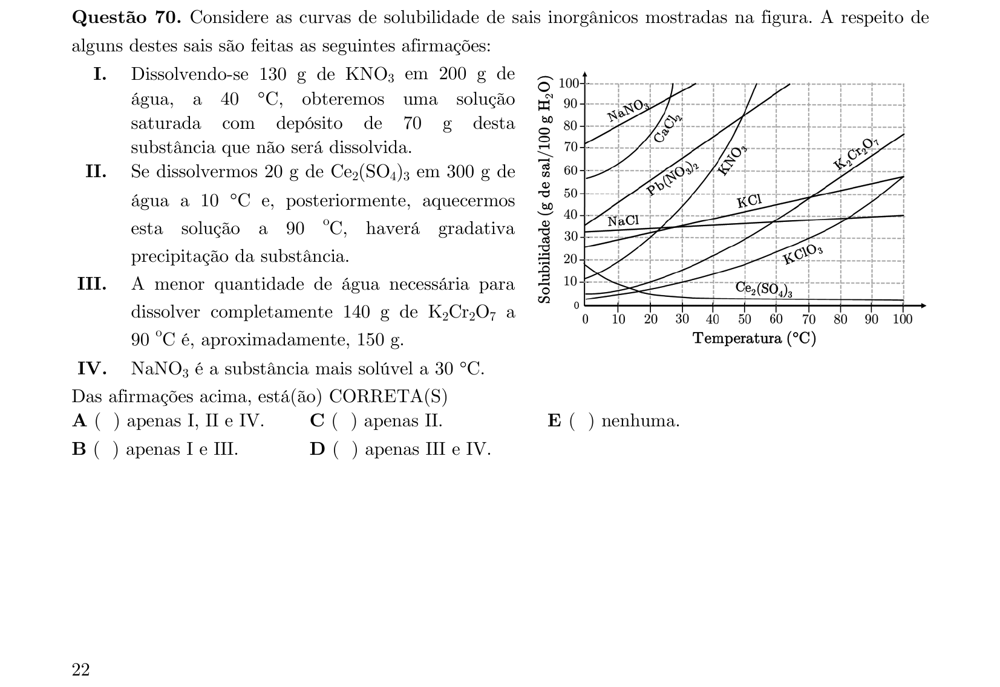
